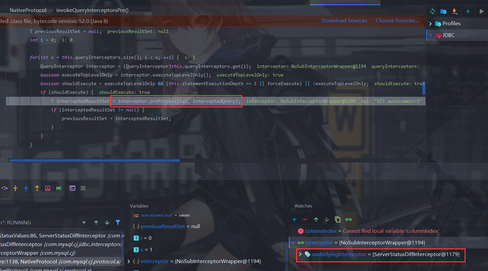
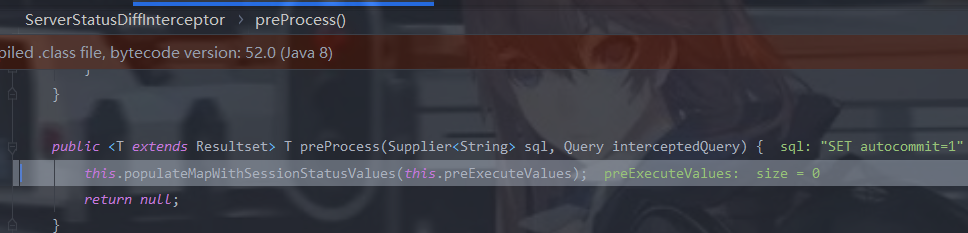
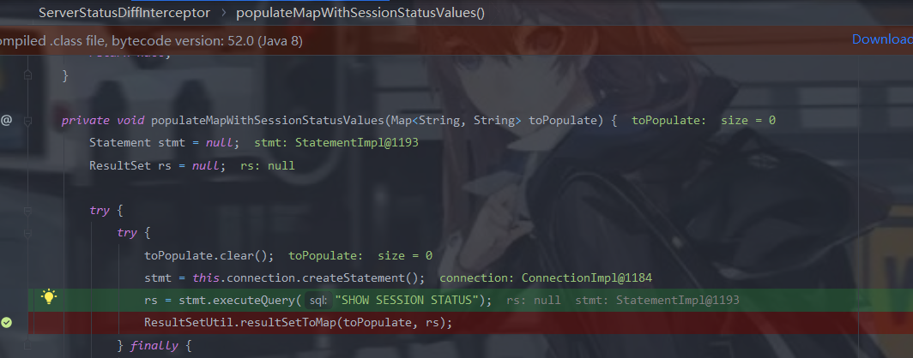
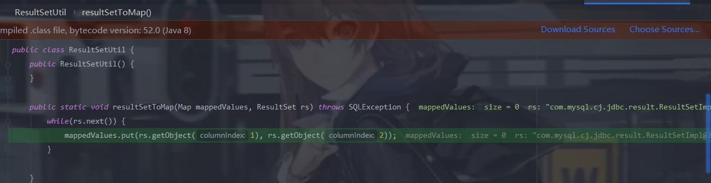
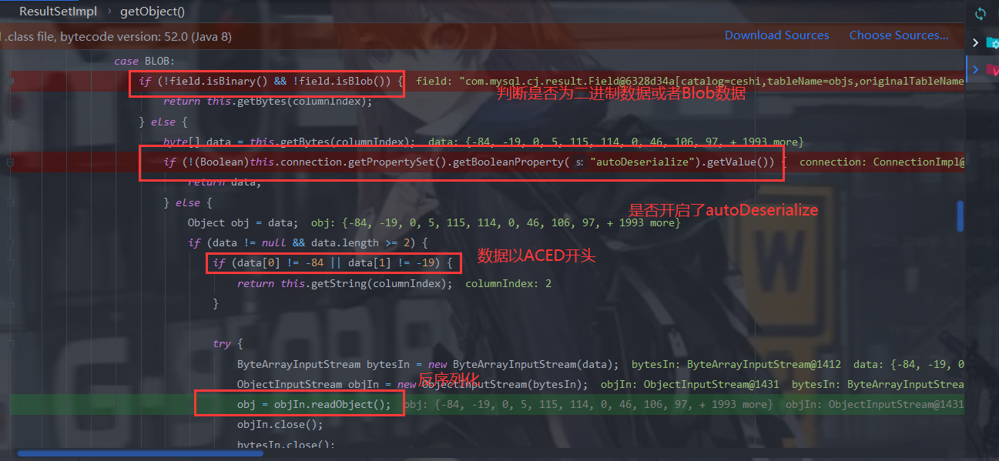

[通过内存dump出jdbc密码](https://mp.weixin.qq.com/s/QCfqO2BJuhSOr58rldZzxA)

```java
 String url = "jdbc:mysql://192.168.182.137:3306/mysql?characterEncoding=utf8&useSSL=false&queryInterceptors=com.mysql.cj.jdbc.interceptors.ServerStatusDiffInterceptor&autoDeserialize=true";

        Connection conn = DriverManager.getConnection(url, user, password);
```

url中设置了过滤器为:`com.mysql.cj.jdbc.interceptors.ServerStatusDiffInterceptor`,并且设置运行反序列化(autoDeserialize=true)

调用我们设置的过滤器的preProcess方法






在JDBC连接数据库的过程中，会调用`SHOW SESSION STATUS`去查询，然后对结果进行处理的时候会调用`resultSetToMap`



这里会掉用ResultSetImpl.getObject()方法



判断MySQL的类型为BLOB后，就从MySQL服务端中获取对应的字节码数据,然后将返回的数据进行反序列化



MySQL JDBC客户端在开始连接MySQL服务端时，会执行一些如`set autocommit=1`等SQL Query，其中会触发我们所配置的queryInterceptors中的preProcess()函数，在该函数逻辑中、当MySQL字段类型为BLOB时，会对数据进行反序列化操作，因此只要保证第1或第2字段为BLOB类型且存储了恶意序列化数据即可触发反序列化漏洞。

