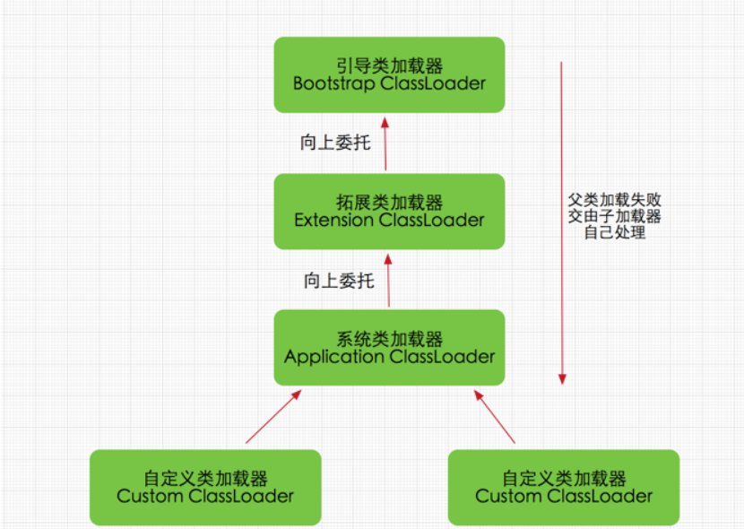

启动类加载器，由C++实现，没有父类。

拓展类加载器(ExtClassLoader)，由Java语言实现，父类加载器为null

系统类加载器(AppClassLoader)，由Java语言实现，父类加载器为ExtClassLoader

自定义类加载器，父类加载器肯定为AppClassLoader。


`Class.forname("")`获取一个类

使用方法

```	java
public class forName {

    public static void main(String[] args) throws  Exception{
        Class i = Class.forName("java.lang.Integer");
        Class n = i.getSuperclass();
        System.out.println(i);
        System.out.println(n);
        Class o = n.getSuperclass();
        System.out.println(o);
        System.out.println(o.getSuperclass());
        /*
        Class i = Integer.class;
        Class n = i.getSuperclass();
        System.out.println(n);
        Class o = n.getSuperclass();
        System.out.println(o);
        System.out.println(o.getSuperclass());       
         */
    }
}
输出都为:
class java.lang.Integer
class java.lang.Number
class java.lang.Object
null
```

```java
public class forName {
    public static void main(String[] args) throws  Exception{
        Class i = Class.forName("static1");
    }
}
class static1 {
    static {
        System.out.println("static");

    }
    {
        System.out.println("{}");
    }
    public static1(){
        System.out.println("public");
    }
}
output:static
```

这里跟forName的参数有关,forName默认情况下第二个参数会为true,会完成类中的静态变量初始化

## getClass

```java
public class getClass {
    public static void main(String[] args) throws  Exception{
        String s = "";
        Class cls = s.getClass(); // s是String，因此获取到String的Class
        System.out.print(cls);
    }
}
Output:class java.lang.String
```

## getMethod

```java
public class getMethod {
        public static void main(String[] args) throws Exception {
            Class stdClass = Student.class;
            // 获取public方法getScore，参数为String:
            System.out.println(stdClass.getMethod("getScore", String.class));
            // 获取继承的public方法getName，无参数:
            System.out.println(stdClass.getMethod("getName"));
            // 获取private方法getGrade，参数为int:
            System.out.println(stdClass.getDeclaredMethod("getGrade", int.class));
        }
    }

    class Student extends Person {
        public int getScore(String type) {
            return 99;
        }
        private int getGrade(int year) {
            return 1;
        }
    }

    class Person {
        public String getName() {
            return "Person";
        }
    }
output:
public int Student.getScore(java.lang.String)
public java.lang.String Person.getName()
private int Student.getGrade(int)
```

## newInstance

```java
import java.lang.reflect.Constructor;

public class newInstance {

        public static void main(String[] args) throws Exception {
            Constructor cons = stati.class.getConstructor();
            System.out.println(cons);
            // 获取构造方法Integer(int):
            Constructor cons1 = Integer.class.getConstructor(int.class);
            System.out.println(cons1);
            // 调用构造方法:
            Integer n1 = (Integer) cons1.newInstance(123);
            System.out.println(n1);

            // 获取构造方法Integer(String)
            Constructor cons2 = Integer.class.getConstructor(String.class);
            Integer n2 = (Integer) cons2.newInstance("456");
            System.out.println(n2);
        }
}
output:
public stati()
public java.lang.Integer(int)
123
456
```

## invoke

```java
public class Main {
    public static void main(String[] args) throws Exception {
        Person p = new Person();
        Method m = p.getClass().getDeclaredMethod("setName", String.class);
        m.setAccessible(true);
        m.invoke(p, "Bob");
        System.out.println(p.name);
    }
}

class Person {
    String name;
    private void setName(String name) {
        this.name = name;
    }
}
output:Bob
```

## getDeclared

- getMethod 系列方法获取的是当前类中所有公共方法，包括从父类继承的方法
- getDeclaredMethod 系列方法获取的是当前类中“声明”的方法，是实在写在这个类里的，包括私有的方法，但从父类里继承来的就不包含了

这方法可以解决有些构造函数为私有类的情况