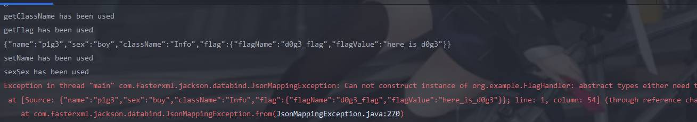
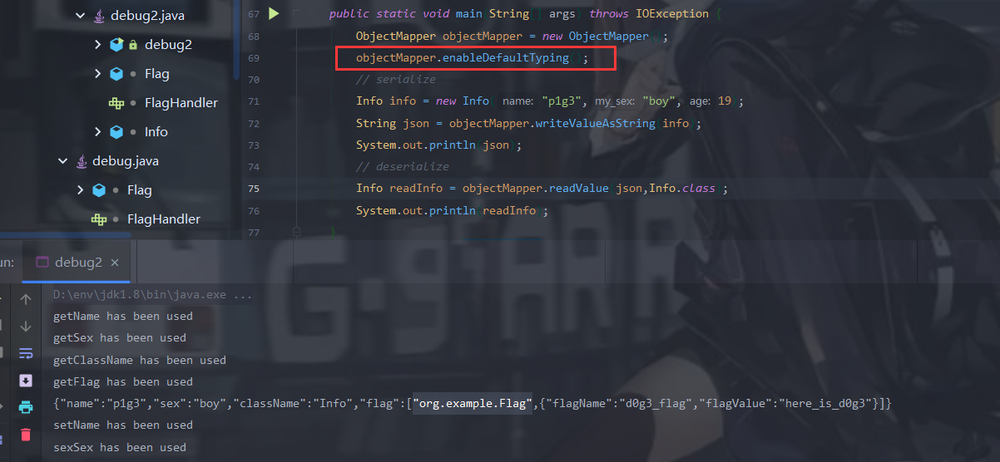

JackSon工作流程

Jackson通过ObjectMapper将对象转换为JSON或XML类型的数据，同时也通过ObjectMapper将这些数据还原为对

象。

# 序列化

关键方法:`ObjectMapper#writeValueAsString` 该方法将对象转换为Json字符串

这里放一段蔡师傅的代码

```java
import com.fasterxml.jackson.databind.ObjectMapper;
import com.fasterxml.jackson.databind.SerializationFeature;
import java.io.IOException;
class Info {
 protected String name;
 private String sex;
 static int age;
 final String className = "Info";
 public String flag = "flag{this_is_flag}";
 public Info(String name,String my_sex,int age){
 this.name = name;
 this.sex = my_sex;
 this.age = age;
 }
 public String getName(){
 System.out.println("getName has been used");
 return name;
 }
 public void setName(String name) {
 System.out.println("setName has been used");
 this.name = name;
 }
 public String getSex() {
 System.out.println("getSex has been used");
 return sex;
 }
 public void setSex(String sex) {
 System.out.println("sexSex has been used");
 this.sex = sex;
 }
 public static int getAge() {
 System.out.println("getAge has been used");
 return age;
 }
 public static void setAge(int age) {
 System.out.println("setAge has been used");
 Info.age = age;
 }
 public String getClassName() {
 System.out.println("getClassName has been used");
 return className;
 }
 public String getFlag() {
 System.out.println("getFlag has been used");
 return flag;
 }
 public void setFlag(String flag) {
 System.out.println("setFlag has been used");
 this.flag = flag;
 }
}
public class Debug{
 public static void main(String[] args) throws IOException {
 ObjectMapper objectMapper = new ObjectMapper();
 Info info = new Info("p1g3","boy",19);
 String json = objectMapper.writeValueAsString(info);
 System.out.println(json);
 }
}
```

输出

```java
输出：
getName has been used
getSex has been used
getClassName has been used
getFlag has been used
{"name":"p1g3","sex":"boy","className":"Info","flag":"flag{this_is_flag}"}
```

其实这里感觉跟fastjson差不多,如果有get方法的话直接调用对应的get方法,如果没有get方法,public类型则可以通过反射调用,而其他类型则无法取值。还有一点就是JackSon不会序列化静态方法。

# 反序列化

关键方法:`ObjectMapper#readValue`我们只需要传递

⼀个Json字符串以及该字符串反序列化所需要的对应类即可

还是蔡师傅的代码:

```java
import com.fasterxml.jackson.databind.ObjectMapper;
import com.fasterxml.jackson.databind.SerializationFeature;
import java.io.IOException;
class Info {
 protected String name;
 private String sex;
 static int age;
 final String className = "Info";
 public String flag = "flag{this_is_flag}";
 public Info(){
 }
 public Info(String name,String my_sex,int age){
 this.name = name;
 this.sex = my_sex;
 this.age = age;
 }
 public String getName(){
 System.out.println("getName has been used");
 return name;
 }
 public void setName(String name) {
 System.out.println("setName has been used");
 this.name = name;
 }
 public String getSex() {
 System.out.println("getSex has been used");
 return sex;
 }
 public void setSex(String sex) {
 System.out.println("sexSex has been used");
 this.sex = sex;
 }
 public static int getAge() {
 System.out.println("getAge has been used");
 return age;
 }
 public static void setAge(int age) {
 System.out.println("setAge has been used");
 Info.age = age;
 }
 public String getClassName() {
 System.out.println("getClassName has been used");
 return className;
 }
 public String getFlag() {
 System.out.println("getFlag has been used");
 return flag;
 }
 public void setFlag(String flag) {
 System.out.println("setFlag has been used");
 this.flag = flag;
 }
}
public class Debug{
 public static void main(String[] args) throws IOException {
 ObjectMapper objectMapper = new ObjectMapper();
 // serialize
 Info info = new Info("p1g3","boy",19);
 String json = objectMapper.writeValueAsString(info);
 System.out.println(json);
 // deserialize
 Info readInfo = objectMapper.readValue(json,Info.class);
 System.out.println(readInfo);
 }
}
```

输出:

```java
getName has been used
getSex has been used
getClassName has been used
getFlag has been used
{"name":"p1g3","sex":"boy","className":"Info","flag":"flag{this_is_flag}"}
setName has been used
sexSex has been used
setFlag has been used
Info@34b7bfc0
```

> 这里反序列化优先调用set方法,这里我们的ClassName并没有为它设置set方法


如果将`String flag`改为`FlagHandler flag = new Flag();`,再添加如下代码

```java
class Flag implements FlagHandler{
 public String flagName;
 public String flagValue;
 public Flag(){
 this.flagName = "d0g3_flag";
 this.flagValue = "here_is_d0g3";
 }
}
interface FlagHandler{ }
```

此时会报错,因为我们的flag成员是FlagName类型,但是FlagName只是一个接口,里面并没有我们的flagName和flagValue。所以会报错。



为了应对这种情况,引入了enableDefaultTyping机制,

```
objectMapper.enableDefaultTyping();
```



> 如果开启了Default Typing，则如果序列化的对象属性中有对象，则该属性值是⼀个数组，索引为0表明该对象
>
> 所表示的类，索引1表示该对象的属性以及属性值。这里和fastjson差不多的,fastjson也是因为开启了自省而产生漏洞。但是相比
>
> 之下,Jackson应该会更难利用一些,因为在readValue(json,Object.class)中的第二个参数会指定数据的类


> 如果readValue第二个参数为Object.class
>
> - 可以调用任意类的set方法
>
> 如果readValue第二个参数为其他类
>
> - 寻找该类中是否有set方法可以直接执行命令
> - 找该类中Object类型的成员,此时我们就可以控制该Object类型成员为任意类,然后执行该任意类的危险set方法

