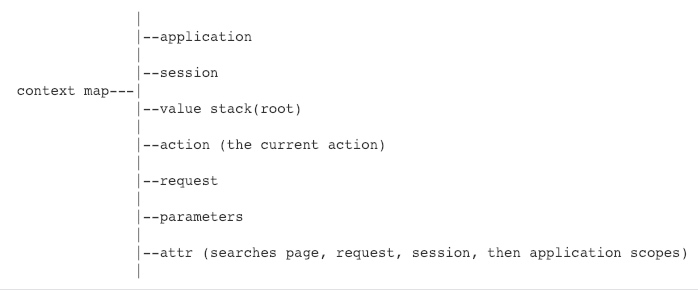
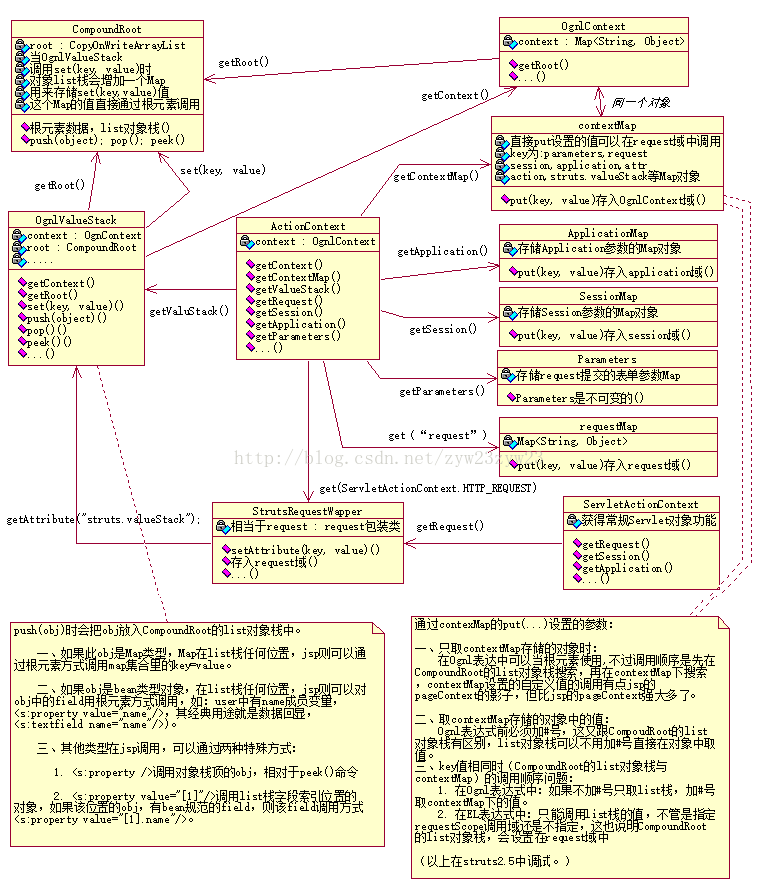
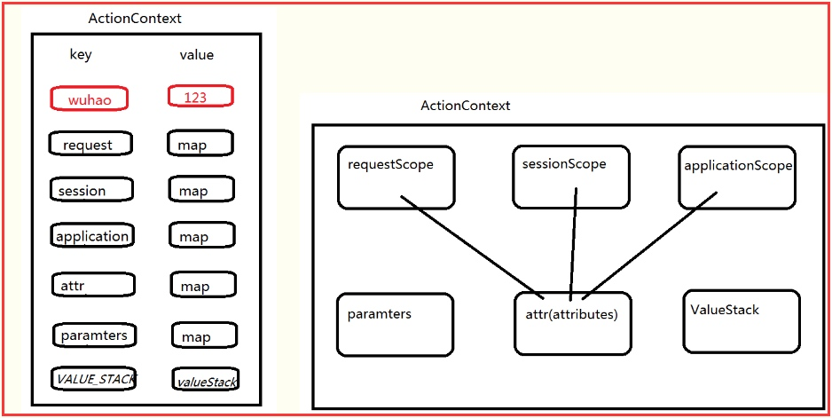
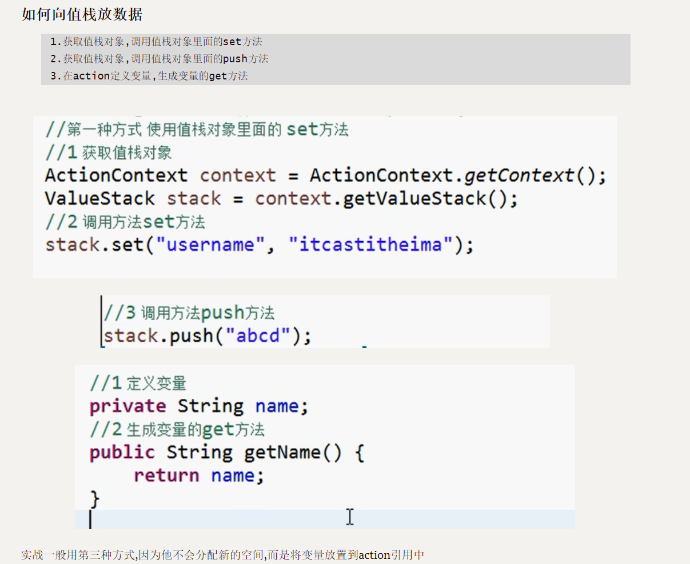

### OGNL简介

OGNL全称Object-Graph Navigation Language即对象导航图语言，它是一种功能强大的表达式语言，通过它简单一致的表达式语法，可以存取对象的任意属性，调用对象的方法，遍历整个对象的结构图，实现字段类型转化等功能。它使用相同的表达式去存取对象的属性。这样可以更好的取得数据。

OGNL使用**Java反射**和**内省**来解决运行时应用程序的对象图。这允许程序根据对象图的状态改变行为，而不是依赖于编译时设置。它还允许更改对象图。

简单了解下Java内省机制：

> Java语言内省（Introspector）是Java语言对Bean类属性、事件的一种缺省处理方法。例如类A中有属性name,那我们可以通过getName,setName来得到其值或者设置新的值。通过getName/setName来访问name属性，这就是默认的规则。Java中提供了一套API用来访问某个属性的getter/setter方法，通过这些API可以使你不需要了解这个规则（但你最好还是要搞清楚），这些API存放于包java.beans中。
>
> 一般的做法是通过类Introspector来获取某个对象的BeanInfo信息，然后通过BeanInfo来获取属性的描述器（PropertyDescriptor），通过这个属性描述器就可以获取某个属性对应的getter/setter方法，然后我们就可以通过反射机制来调用这些方法。

# OGNL特殊符号

- `$`：在配置文件、国际化资源文件中引用OGNL表达式
- `#`：访问非root对象，相当于`ActionContext.getContext()`
- `@`：访问静态属性、静态方法
- `%`：强制内容为OGNL表达式

# OGNL三要素

OGNL具有三要素：表达式（expression）、根对象（root）和上下文对象（context）

- 表达式（expression）：表达式是整个OGNL的核心，通过表达式来告诉OGNL需要执行什么操作；
- 根对象（root）：root可以理解为OGNL的操作对象，OGNL可以对root进行取值或写值等操作，表达式规定了“做什么”，而根对象则规定了“对谁操作”。实际上根对象所在的环境就是 OGNL 的上下文对象环境；
- 上下文对象（context）：context可以理解为对象运行的上下文环境，context以MAP的结构、利用键值对关系来描述对象中的属性以及值；

Struts2中的ActionContext即为OGNL的context（又称context map），其中包含的ValueStack即为OGNL的root。该ActionContext包含的对象如图：





## ActionContext

ActionContext是上下文对象，对应OGNL的context，是一个以MAP为结构、利用键值对关系来描述对象中的属性以及值的对象，简单来说可以理解为一个action的小型数据库，整个action生命周期（线程）中所使用的数据都在这个ActionContext中。



除了三个常见的作用域`request`、`session`、`application`外，还有以下三个作用域：

- attr：保存着上面三个作用域的所有属性，如果有重复的则以request域中的属性为基准；
- paramters：保存的是表单提交的参数；
- VALUE_STACK：值栈，保存着valueStack对象，也就是说可以通过ActionContext访问到valueStack中的值；

## ValueStack

值栈（ValueStack）就是OGNL表达式存取数据的地方。在一个值栈中，封装了一次请求所需要的所有数据。

在使用Struts2的项目中，Struts2会为每个请求创建一个新的值栈，也就是说，值栈和请求是一一对应的关系，这种一一对应的关系使值栈能够线程安全地为每个请求提供公共的数据存取服务。

### 值栈的作用


值栈可以作为一个数据中转站在前台与后台之间传递数据，最常见的就是将Struts2的标签与OGNL表达式结合使用。值栈实际上是一个接口，在Struts2中利用OGNL时，实际上使用的就是实现了该接口的OgnlValueStack类，这个类是OGNL的基础。

值栈本身是一个ArrayList，充当OGNL的`root`

要获取值栈中存储的数据，首先应该获取值栈。值栈的获取有两种方式，具体如下。

### 值栈的获取

#### **request中获取值栈**

ValueStack对象在request范围内的存储方式为request.setAttribute("struts.valueStack",valuestack)，可以通过如下方式从request中取出值栈的信息。

```java
//获取 ValueStack 对象，通过 request 对象获取
ValueStack valueStack = (ValueStack)ServletActionContext.getRequest()      .getAttribute(ServletActionContext.STRUTS_VALUESTACK_KEY);
```

#### **ActionContext中获取值栈**

在使用Struts2框架时，可以使用OGNL操作Context对象从ValueStack中存取数据，也就是说，可以从Context对象中获取ValueStack对象。实际上，Struts2框架中的Context对象就是ActionContext。

ActionContext获取ValueStack对象的方式如下所示：

```java
ValueStack valueStack = ActionContext.getContext().getValueStack();
```

ActionContext对象是在StrutsPrepareAndExcuteFilter的doFilter()方法中被创建的，在源码中用于创建ActionContext对象的createActionContext()方法内可以找到获取的ValueStack对象的信息。

方法中还有这样一段代码：

```java
ctx = new ActionContext(stack.getContext());
```

从上述代码中可以看出，ValueStack对象中的Context对象被作为参数传递给了ActionContext对象，这也就说明ActionContext对象中持有了ValueStack对象的引用，因此可以通过ActionContext对象获取ValueStack对象。



# OGNL的执行

## 初始化ValueStack


```java
//本接口只有一个方法，具体实现在DefaultClassResolver类
public interface ClassResolver {
    Class classForName(String var1, Map var2) throws ClassNotFoundException;
}
//具体默认实现
public class DefaultClassResolver implements ClassResolver {
private Map classes = new HashMap(101);
public Class classForName(String className, Map context) throws ClassNotFoundException {
        Class result = null;
        if ((result = (Class)this.classes.get(className)) == null) {
            try {
                result = Class.forName(className);
            } catch (ClassNotFoundException var5) {
                if (className.indexOf(46) == -1) {
                    result = Class.forName("java.lang." + className);
                    this.classes.put("java.lang." + className, result);
                }
            }

            this.classes.put(className, result);
        }

        return result;
    }
}
//加载特殊名称的类
public Class classForName(String className, Map context) throws ClassNotFoundException {
        Object root = Ognl.getRoot(context);

        try {
            if (root instanceof CompoundRoot) {
                if (className.startsWith("vs")) {
                    CompoundRoot compoundRoot = (CompoundRoot) root;

                    if ("vs".equals(className)) {
                        return compoundRoot.peek().getClass();
                    }

                    int index = Integer.parseInt(className.substring(2));

                    return compoundRoot.get(index - 1).getClass();
                }
            }
        } catch (Exception e) {
            LOG.debug("Got exception when tried to get class for name [{}]", className, e);
        }

        return Thread.currentThread().getContextClassLoader().loadClass(className);
    }

```

# 参考

https://paper.seebug.org/794/#11-rootcontext

https://www.mi1k7ea.com/2020/03/16/OGNL%E8%A1%A8%E8%BE%BE%E5%BC%8F%E6%B3%A8%E5%85%A5%E6%BC%8F%E6%B4%9E%E6%80%BB%E7%BB%93/

https://xz.aliyun.com/t/111

%{(new java.lang.ProcessBuilder(new java.lang.String[]{"calc"})).start()}

%{@java.lang.Runtime@getRuntime().exec("calc")}