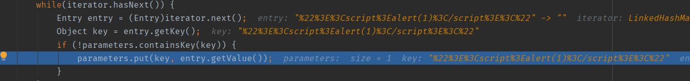

# 漏洞介绍

`Struts2-002`是一个 `XSS` 漏洞，该漏洞发生在 `s:url` 和 `s:a` 标签中，当标签的属性 `includeParams=all` 时，即可触发该漏洞。

漏洞影响版本： `Struts 2.0.0 - Struts 2.1.8.1` 。

# 环境搭建

在S2-001的环境基础上稍微修改一下就可以。

修改`index.jsp` ,去掉001中的form标签内容，添加如下内容：

```jsp
<s:url action="login" includeParams="all"></s:url>
<s:a href="%{url}">click</s:a>
```

struts.xml

```xml
<struts>
    <package name="S2-002" extends="struts-default">
        <action name="login"
                class="com.lanvnal.s2002.action.LoginAction"
                method="execute">
            <result name="success">index.jsp</result>
        </action>
    </package>
</struts>
```

Action加上url变量,删除001的相关代码，添加如下：

```java
private String url = null;

    public String execute() throws Exception {
        return "success";
    }

    public String getUrl() {
        return url;
    }

    public void setUrl(String url) {
        this.url = url;
    }
```

# 漏洞复现

xss payload:
`s:a`标签:

```url
http://localhost:8009/S2_002_vul_war/login.action?"><script>alert(1)</script><"
```

`s:url` 标签

```url
http://localhost:8009/S2_002_vul_war/login.action?<script>alert(1);</script>=1
```


# 漏洞分析

根据官方通告，问题是出在 `s:url` 和 `s:a` 标签里，在渲染模板的时候没有做好转义编码导致了XSS

先看看s:url标签

处理标签时会先来到doStartTag方法


由于我们这里处理的是 **s:url** 标签，所以这里用来处理标签的组件 **this.component** 为**org.apache.struts2.components.URL** 类对象。我们跟进 **URL:start()** 方法。

在 **URL:start()** 方法中，我们看到当 **includeParams=all** 时，会调用 **mergeRequestParameters** 方法。


该方法会将我们的paylaod存入parameters中


然后进入includeGetParameters()

该方法呢是将 **HttpRequest.getQueryString()** 的数据存入 **this.parameters**





接着来到 **URLHelper**类

## URLHelper


在该方法中会将URL和我们的payload拼接在一起,并在后面返回给用户,造成xss


至于为什么**includeParams=get**的时候不能触发


可以看到,当为all的时候是比为get的时候多向parmeters添加一个getParameterMap,而这个的值就是我们的paylaod,也是我们触发xss的关键。

```
getParameterMap:<script>alert(1)</script>test
getQueryString:%3Cscript%3Ealert(1)%3C/script%3E
```

getParmaeterMap添加的值是我们的payload,而getQueryString传入的值是经过我们url编码过的,在我们之前的测试中


这里就是先拼接的parameters\[0\](getParmaeterMap)然后再拼接的parameters[1\](getQueryString),到我们的网页中查看下源代码


这里也正是getParmaeterMap传入的值触发的xss,所以说为什么all可以而get不行

# 漏洞修复

根据公告，我们需要升级到Struts 2.0.11.1版本。（但是没有真正解决修复漏洞）

经过对2.0.11.1的代码阅读，在UrlHelper类buildUrl方法里，第136行增加了如下修复代码:

```
 // link是最终的生成的url
        for(result = link.toString(); result.indexOf("<script>") > 0; result = result.replaceAll("<script>", "script")) {

        }
```

可以明显看到修复代码仅仅是将\<script\>替换成 **script** 了。然而这种修复方式明显可以绕过，例如: <script 1>alert(1) 

\</script\>

# 参考

https://xz.aliyun.com/t/7916

https://aluvion.gitee.io/2020/07/15/struts2%E7%B3%BB%E5%88%97%E6%BC%8F%E6%B4%9E-S2-002/

https://lanvnal.com/2021/01/05/s2-002-lou-dong-fen-xi/