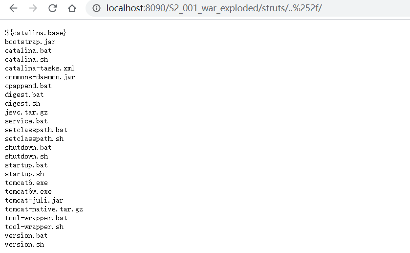
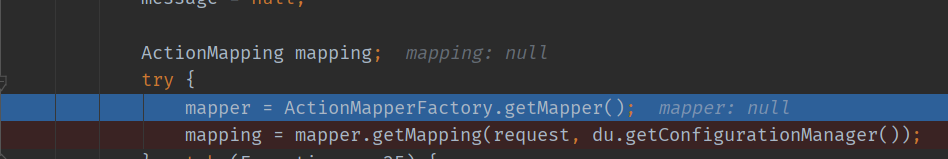
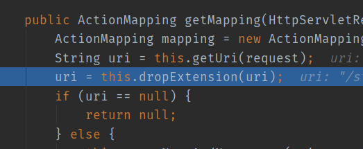
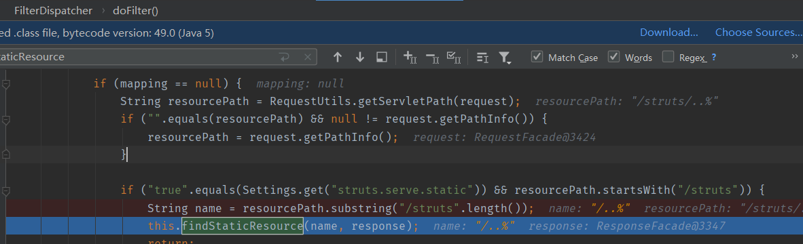
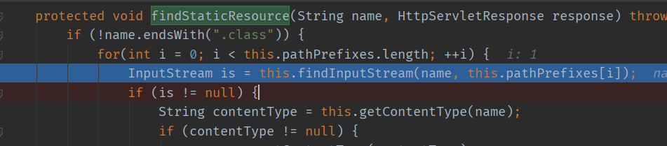
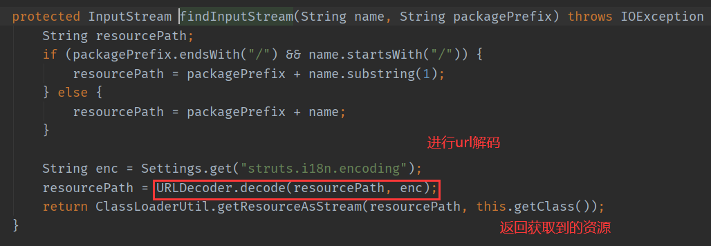
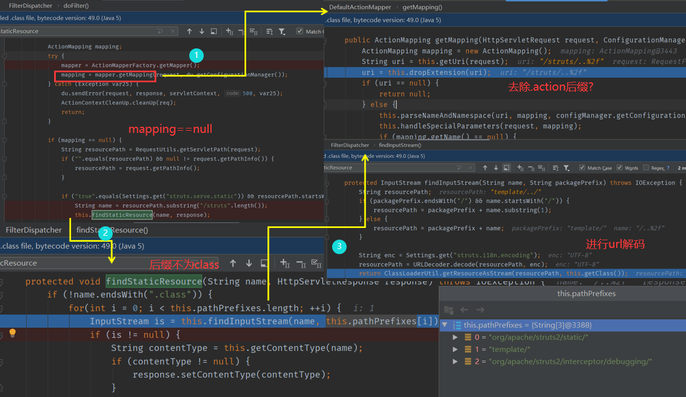
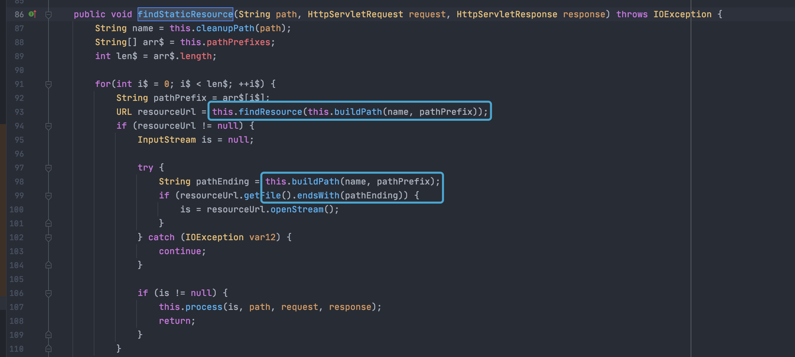

# 漏洞概述

Struts2-004是一个目录遍历漏洞。可以通过../转到上级目录 将/二次编码为%252f

影响版本： **Struts 2.0.0 - 2.0.11.2、Struts 2.1.0 - 2.1.2** 

# 漏洞环境

Apache Tomcat/6.0.10+struts-2.0.8 （在高版本中的tomcat中并没有测试成功）

# 漏洞分析

漏洞点发生在过滤器FilterDispatcher::doFilter中。分析mapping返回的执行逻辑

跟进getMapping

这里有一个dropExtension方法,如果uri返回为null,我们的就能让我们的mapping为null,但是我这里没有分析出来该方法的逻辑,找了一下网上的资料,说的是`对于不是以特地扩展名结尾的请求会返回一个null的uri,默认为.action`,但是我这里无论怎么传都会给我返回null,这里不是很明白,也没发现其他师傅分析这里

if语句满足`mapping==null`就能够进文件读取，我们需要满足路由以`/struts`开头，进入`FilterDispatcher::findStaticResource`读取静态文件。

跟进 **findStaticResource** 方法，我们发现如果文件后缀不为 **.class** ，则调用 **findInputStream** 来读取文件内容

findInputStream为读取路径内容,该处文件读取会对路径进行一次URL解码.最后调用`ClassLoaderUtil.getResourceAsStream`读取文件内容.

# 流程图

最后POC构造需要对`/`进行二次URL编码，第一次tomcat解码获得`/ => %2f`,利用`%2f`能够绕过一些逻辑对`/`匹配，也能够绕过对结尾`.class`匹配,最后在文件读取之前被再一次解码，成功读取目录或文件内容，

比如我这里想要下载LogainAction.class,但是如果我直接输入LogainAction.class就会报错,所以这里将clss进行了两次url编码,成功下载class文件

由于getResource限制了tomcat容器目录，只能读取当前容器目录下的文件，如class文件读取

具体可见：https://www.bbsmax.com/A/KE5Q6PRLdL/

# 漏洞修复

这里先用resourceUrl读取文件,然后再通过**URL.getFile()** 获取文件的真实路径,再用endsWith判断后缀名,成功解决了目录穿越问题

# 参考

https://zhzhdoai.github.io/2020/12/25/Struts2%E6%BC%8F%E6%B4%9E%E7%AC%94%E8%AE%B0%E4%B9%8BS2-004/

https://xz.aliyun.com/t/7967#toc-4