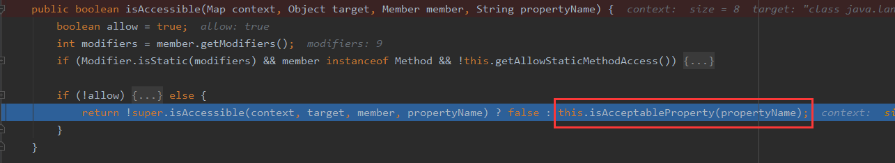

# 漏洞概要

Struts2-003是一个远程代码执行漏洞，Struts2-005为Struts2-003补丁绕过。

影响版本：`Struts 2.0.0 - Struts 2.1.8.1`

# 测试环境

Struts2-005：Apache Tomcat/6.0.10+struts-2.1.12

# S2-003漏洞修复

S2-005是基于S2-003漏洞修复的绕过,先看看它是如何进行修复的。首先比对XWork`2.0.6`和`2.0.5`版本的源码(左图为2.0.6,右图为2.0.5),在类`OgnlValueStack`中使用了`SecurityMemberAccess`去替代`StaticMemberAccess`。


并且还新增了两个方法来操作`securityMemberAccess`


并且在ParametersInterceptor#setParameters中被调用

那么,这个`SecurityMemberAccess`到底是何方神圣,是如何来起到防护作用的呢

接下来我们先看到S2-003执行命令的关键方法OgnlRuntime#callAppropriateMethod中,它这里有一个isMethodAccessible方法,我们需要让`isMethodAccessible=true`,才能进入到我们后面的invokeMethod中。在S2-003中,这个`isMethodAccessible`很简单的就过了,但是如果在`struts-2.1.12`中还使用之前的payload,就会因为无法让`isMethodAccessible=true`而无法执行命令


跟进`isMethodAccessible`,它调用了`SecurityMemberAccess#isAcceptableProperty()`方法进行判断


这里主要是getAllowStaticMethodAccess方法,跟进去


这里经过判断后进入关键的`isAcceptableProperty`方法



这里有两个方法,我们需要让`isAccepted()`返回true,`isExcluded`返回false,这里name的值为null


而`isAccepted()`和`isExcluded()`的返回值取决于`SecurityMemberAccess`的两个属性：`acceptProperties`和`excludeProperties`。而这两个值在之前说的`ParametersInterceptor#setParameters`中被设置,其中一个值为空集合,另一个为`Pattern`类型。


isAccepted返回true


这里正则匹配`dojo\..*`,这个应该是匹配`dojo.`开头的字符串。但其实已经发现有点不对劲了,这里的paramName跟我们的payload没有关系,这里也根本没有管我们的payload。但是我们执行到这一步的时候还是会因为抛出异常而终止


既然paramName不可控制,而且我们又需要让`isExxcluded`返回`false`。所以我们可以想办法将`SecurityMemberAccess`的`excludeProperties`这个集合置空。

# 漏洞分析

首先在OgnlValueStack的初始化中,调用了`securityMemberAccess`


并在后面调用了Ognl#addDefaultContext()


接着赋值给了OgnlContext的memberAccess变量


然后在ParametersInterceptor中设置了对应的值


接着就回到了我们熟悉的地方


那么我们能不能向S2-003一样修改context呢,答案是可以的,只不过这一次不能通过context['memberAccess']获取`MemberAccess`成员,因为这里并没有将`memberAccess`put到`OgnlContext`中,而只是作为它的一个成员


而且context的部分成员是可以通过#来获取的,并且在OgnlContext#get方法中也确实发现了`memberAccess`


并且在`RESERVED_KEYS`中包含了`_memberAccess`,所以这里使用#context['\_memberAccess']或者#\_memberAccess就可以获得memberAccess,然后再修改它的成员就可以


payload:

```java
(a)(%5cu0023_memberAccess.excludeProperties%5cu003d@java.util.Collections@EMPTY_SET)&(b)(%5cu0023context['xwork.MethodAccessor.denyMethodExecution']%5cu003dfalse)&(c)(%5cu0023ret%5cu003d@java.lang.Runtime@getRuntime().exec('calc'))
```

# 漏洞修复

加强了正则匹配


# 参考

https://mp.weixin.qq.com/s/dmH5lyMg16mjndfbv10n0A
