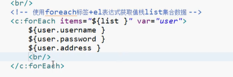
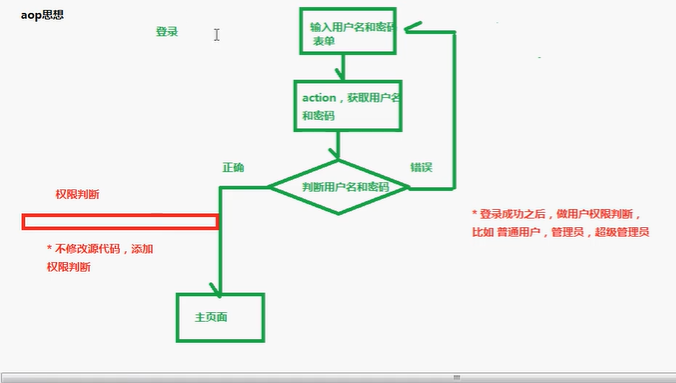

Struct2框架

### 第一步:

导入jar包,jar包在lib目录下,但是不能都导入,因为有些环境没有,比如spring

到apps目录里面,找到示例程序,从示例程序赋值jar包

### 第二步

创建action


### 第三步

配置访问路径

创建struts2核心配置文件

核心配置文件名称和位置是固定的

位置必须在src下面,名称为struts.xml

action配置


### 第四步

 配置过滤器,在web.xml中

# 执行流程


# 过滤器


常量设置:

利用constant标签


struts.I18n.encoding=UTF-8

分块开发:

利用include标签


# Action的编写方式

```
分三种方式
1.创建普通类
2.实现接口Action接口
3.继承ActionSupport 
```

# Action方法访问

```
三种方式
1.使用action标签中的method属性
2.使用通配符方式访问
3.动态访问实现
```

通配符


动态访问


action方法里面返回值必须是string类型

action方法里面可以没有返回值没有返回值的时候在result标签中不需要配置,也可以让返回值为"none"

# OGNL


我们每次访问action的时候,都会创建action对象

在每个action对象里面都会有一个 值栈对象


## 如何获取栈对象

```java
1.
    //使用ActionContext类里卖弄的方法得到值栈对象
ActionContext context=ActionContext.getContext();
ValueStack stack1 = context.getValueStack();
ValueStack stack2 = context.getValueStack();
//一个action的值栈里只有一个值,所以这里stack1=stack2
```

值栈内部结构

```java
1.值栈分两部分
    第一部分root ,结构是list集合
    (1)一般操作都是root
    第二部分 context,结构是map集合
```


2 struts2里面 标签 s:debug 使用这个标签可以查看值栈结构和存储值

1.访问action,执行action的方法又返回值,配置返回值到jsp界面中,在jsp界面中使用这个标签

在值栈中会存放action对象的引用

## 如何向值栈放数据

```
1.获取值栈对象,调用值栈对象里面的set方法
2.获取值栈对象,调用值栈对象里面的push方法
3.在action定义变量,生成变量的get方法
```


实战一般用第三种方式,因为他不会分配新的空间,而是将变量放置到action引用中

## 如何向值栈放list集合

```
第一步 定义list集合变量
第二步 生成变量的get方法
第三步 在执行的方法里面向list集合设置值
```

## 如何向值栈获取数据

```
1.使用struts2标签+ognl表达式获取值栈数据
（1）<s:property value="ognl表达式"/>
2.在 
```


获取list

第二种方式:

```
<s:iterator value="list">   //类似于foreach,进行遍历
	<s:property value="ognl表达式"/>
	<s:property value="ognl表达式"/>
	<s:property value="ognl表达式"/>
</s:iterator>
```

第三种方式:


el标签



```
1.EL表达式获取域对象值
2.向域对象里面放值使用setAttribute方法,取值使用getAttribute方法
3.底层增强request对象里面的方法getAttribute方法
（1）首先从request域获取值,如果获取到,直接返回
（2）如果request域获取不到值,到值栈把值取出来,放到域对象里面
```


在wrapRequest方法中会调用StrutsRequestWrapper方法,该方法继承于HttpSeervletRequestWrapper方法,增强了getAttribute方法,


  

使用先从域对象中取值，如果渠道直接返回,如果取到直接返回,如果没有取到,通过findValue从值栈中取值并存入域对象 

## OGNL中#,%的使用

#用来获取context中的数据,可以以用来获取其他数据,比如request #request

如果直接在struts2表单标签里面使用ognl表达式不识别,只有%之后才会识别


# 拦截器

默认包struts-default


拦截器是在action对象创建之后和action方法执行之前运行

# 底层原理

1.aop思想

（1）文字描述

Aop是面向切面编程,有基本功能,拓展功能,不通过修改源代码的方式拓展功能



2.责任链模式

(1)在java中有很多设计模式,责任链模式就是其中一种

(2)责任链模式和过滤连很相似

过滤链:一个请求可以有多个过滤器进行过滤,只有通过了前一个过滤器才能进入下一个过滤器

责任链:要执行多个操作,有添加、修改、删除三个操作


