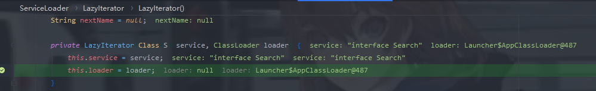

# SPI介绍

SPI（Service Provider Interface），是JDK内置的一种 服务提供发现机制，可以用来启用框架扩展和替换组件，主要是被框架的开发人员使用，比如java.sql.Driver接口，其他不同厂商可以针对同一接口做出不同的实现，MySQL和PostgreSQL都有不同的实现提供给用户，而Java的SPI机制可以为某个接口寻找服务实现。

当服务的提供者提供了一种接口的实现之后，需要在classpath下的`META-INF/services/`目录里创建一个以服务接口命名的文件，这个文件里的内容就是这个接口的具体的实现类。当其他的程序需要这个服务的时候，就可以通过查找这个jar包（一般都是以jar包做依赖）的`META-INF/services/`中的配置文件，配置文件中有接口的具体实现类名，可以根据这个类名进行加载实例化，就可以使用该服务了。JDK中查找服务的实现的工具类是：`java.util.ServiceLoader`。

# SPI实例演示

创建四个java文件

```java
//Search接口
import java.util.List;

public interface Search {
    public List<String> searchDoc(String keyword);
}
//接口实现类1
import java.util.List;

public class DatabaseSearch implements Search{
    @Override
    public List<String> searchDoc(String keyword) {
        System.out.println("数据搜索 "+keyword);
        return null;
    }
}

import java.util.List;
//接口实现类2
public class FileSearch implements Search{
    @Override
    public List<String> searchDoc(String keyword) {
        System.out.println("文件搜索 "+keyword);
        return null;
    }
}
//利用ServiceLoader方法加载接口实现类
import java.util.Iterator;
import java.util.ServiceLoader;

public class TestCase {
    public static void main(String[] args) {
        ServiceLoader<Search> s = ServiceLoader.load(Search.class);
        Iterator<Search> iterator = s.iterator();
        while (iterator.hasNext()) {
           Search search =  iterator.next();
           search.searchDoc("hello world");
        }
    }
}
```

然后创建我们的META-INF/services文件夹,接着创一个文件,文件的名称为我们的接口路径,

内容为接口实现类的路径

此时的文件结构:

```
│  DatabaseSearch.class
│  FileSearch.class
│  Search.class
│  TestCase.class
│
└─META-INF
    └─services
            Search
```

Search内容:

```
FileSearch
DatabaseSearch
```

运行TestCase:


## 调试分析


在调用ServiceLoader.load方法时会触发reload()方法,它会new一个LazyIterator,并传入我们的实现接口以及classloader



当开始遍历对象时

这里有一个关键的方法


在hashNextService方法中会解析`config`文件，获取要解析的接口实现类

然后通过forName进行类的实例化

