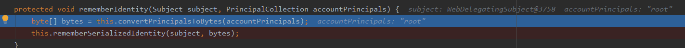

# 漏洞简介

Shiro 550 反序列化漏洞存在版本：shiro <1.2.4，产生原因是因为shiro接受了Cookie里面`rememberMe`的值，然后去进行Base64解密后，再使用aes密钥解密后的数据，进行反序列化。

反过来思考一下，如果我们构造该值为一个cc链序列化后的值进行该密钥aes加密后进行base64加密，那么这时候就会去进行反序列化我们的payload内容，这时候就可以达到一个命令执行的效果。

```
获取rememberMe值 -> Base64解密 -> AES解密 -> 调用readobject反序列化操作
```

漏洞环境：https://codeload.github.com/apache/shiro/zip/shiro-root-1.2.4

# 漏洞分析


首先我们勾选Remember Me,然后抓包,发送


这里返回了rememberMe字段,存入了我们的cookie(这里截的不是同一次发送数据的图,所以rememberMe不一样),在利用时,我们需要做的就是修改本地的rememberMe,改成我们恶意的payload然后再进行编码

Shiro≤1.2.4版本默认使用`CookieRememberMeManager`来处理我们的rememberMe


该类继承于`AbstractRememberMeManager`,该方法中有一个`onSuccessfulLogin`方法,听名字就知道,当登录成功后就会进入该方法。

首先会判断是否勾选`isRememberMe`,然后进入`rememberIdentity`方法


这里的PrincipalCollection是一个身份集,具体不是太懂,这里会保存一些登录信息,接着进入下一个方法

调用了convertPrincipalsToBytes方法,返回byte类型



这里调用了serialize方法,看来是要对其进行序列化


这里调用了serializer成员的serialize方法


然后进行序列化操作


接着将bytes传入encrypt方法


首先通过`this.getCipherService()`方法,返回默认的加密类型(AES) ,然后这里有一个`getEncryptionCipherKey`方法,返回的是我们的密钥(encryptionCipherKey在构造方法中被赋值)


接着进入`encrypt`加密方法:

这里并没有将我们的数据直接加密,而是在该方法中计算出了一个ivBytes,然后调用了重载的encrypt方法进行加密。这里的ivBytes的生成应该涉及了一些加密算法的知识点。


回到


这里对byte进行base64加密,然后设置到cookie


