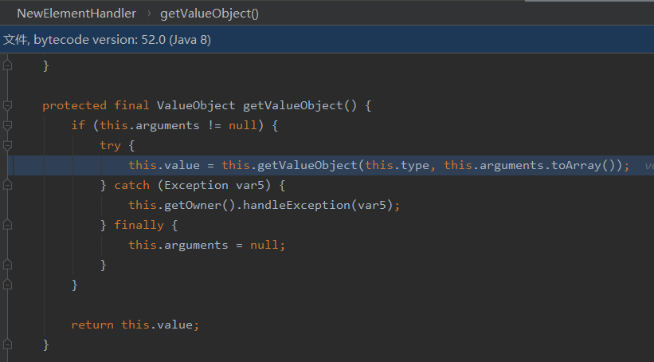

# XMLDecder简介

XMLDecoder是Philip Mine 在 JDK 1.4 中开发的一个用于将JavaBean或POJO对象序列化和反序列化的一套API，开发人员可以通过利用XMLDecoder的`readObject()`方法将任意的XML反序列化，从而使得整个程序更加灵活。

# SAX

Java API for XML Processing（JAXP）用于使用Java编程语言编写的应用程序处理XML数据。JAXP利用**Simple API for XML Parsing（SAX）**和**Document Object Model（DOM）**解析标准解析XML

DOM和SAX都是XML解析规范。由于XMLDecoder使用的是SAX解析规范,所以这里仅讨论SAX

首先先让大家接触一下相关代码:

test.java:

```java
import org.xml.sax.Attributes;
import org.xml.sax.SAXException;
import org.xml.sax.helpers.DefaultHandler;

import javax.xml.parsers.SAXParser;
import javax.xml.parsers.SAXParserFactory;
import java.io.File;

public class test {
    public static void main(String[] args) throws Exception {

        /*
        1.获得解析器的工厂,SAXParserFactory
        2.获得解析器,使用工厂获得解析器,new SAXParser 获得一个SAXParser解析器
        3.直接解析文档,利用parse方法
         */
        SAXParserFactory f=SAXParserFactory.newInstance();
        SAXParser saxParser=f.newSAXParser();
        saxParser.parse(new File("src/text.xml"),new MyDefaultHandler());
    }
}
class MyDefaultHandler extends DefaultHandler {
    @Override
    public void startElement(String uri, String localName, String qName, Attributes attributes) throws SAXException {
        System.out.print("<"+qName+">");
        //super.startElement(uri, localName, qName, attributes);
    }

    @Override
    public void characters(char[] ch, int start, int length) throws SAXException {
        //super.characters(ch, start, length);
        System.out.print(new String(ch,start,length));
    }

    @Override
    public void endElement(String uri, String localName, String qName) throws SAXException {
        //super.endElement(uri, localName, qName);
        System.out.print("</"+qName+">");
    }
}
```

text.xml

```XML
<persons>
	<person>
		<name>Yasax1</name>
		<age>19</age>
	</person>
	<person>
		<name>Yasax2</name>
		<age>20</age>
	</person>
	<person>
		<name>Yasax3</name>
		<age>21</age>
	</person>
</persons>
```

当我们运行test.java,控制台输出:


## API

在`javax.xml.parsers`包中,有两个SAX解析的类


SAXParser是我们的解析器,另外一个是一个工厂。先看看解析器


这是一个抽象类,我们不能直接获得。但注释中也说明了通过工厂来获得解析器


这也就是这两行代码的由来

```java
SAXParserFactory f=SAXParserFactory.newInstance();
SAXParser saxParser=f.newSAXParser();
```

接下来我们看一下解释器中有哪些方法


绝大部分都是parse方法,这也是解析xml的关键方法。

parse方法第一个参数需要让我们传入需要解析的数据，第二个参数需要让我们传入一个处理器,这里我们创建了一个`MYDefaultHandler`类继承于`DefaultHandler`。这里涉及了另外一个知识点:

> SAX是简单XML访问接口，是一套XML解析规范，使用事件驱动的设计模式，这里通过JAXP的工厂方法生成SAX对象，SAX对象使用`SAXParser.parer()`作为事件源，`ContentHandler`、`ErrorHandler`、`DTDHandler`、`EntityResolver`作为事件处理器，通过注册方法将二者连接起来。


因为这里我们使用了DefaultHandler,所以操作起来就简单许多。当然也可以自己创建这些处理器


其中我们最常使用的就是ContentHandler处理器中的`startElement`、`characters`、`endElement`方法


# XMLdecode

这是一个java中的类，类的位置为`java.beans.XMLDecoder`。weblogic中就是因为使用了XMLdecoder而产生的漏洞

测试代码:

Main.java

```java
import java.beans.XMLDecoder;
import java.io.BufferedInputStream;
import java.io.File;
import java.io.FileInputStream;

public class Main {

    public static void main(String[] args) {
        String path = "src/poc.xml";
        try {
            XMLDecode_Deserialize(path);
        } catch (Exception e) {
            e.printStackTrace();
        }
    }

    private static void XMLDecode_Deserialize(String path) throws Exception {
        File file = new File(path);
        FileInputStream fis = new FileInputStream(file);
        BufferedInputStream bis = new BufferedInputStream(fis);
        XMLDecoder xd = new XMLDecoder(bis);
        xd.readObject();
        xd.close();
    }
}
```

poc.xml:

```java
<java>
    <object class="java.lang.ProcessBuilder">
        <array class="java.lang.String" length="1" >
            <void index="0">
                <string>calc</string>
            </void>
        </array>
        <void method="start"/>
    </object>
</java>
```

这里poc.xml也可以通过XMLEncoder类来生成。我觉得这里也跟常规的序列化反序列化差不多,只是对于序列化后的数据使用了xml形式。

运行Main.java,成功弹出计算器。

## 流程分析

首先在实例化XMLDecoder时,会初始化`DocumentHandler`类,该类的构造方法如下:

这里设置了各种标签以及对应的处理类,并存入handlers中


jdk1.6


这是其他师傅整理的各处理类的继承关系图:


然后来到了readObject方法,进行反序列化:

经过如下调用,来到了xerces解析器(XMLDocumentFragmentScannerImpl#scanDocument方法)


Apache Xerces解析器负责解析XML中有哪些标签，观察XML语法是否合法等因素，最终Apache Xerces解析器将解析出来的结果丢给DocumentHandler完成后续操作。

### java标签

在DocumentHandler#startElement方法中


这里实例化并获取了java标签对应的handler。这后面还有两个方法,setOwner和setParent方法,

> parent:
>
> 最外层标签的ElementHandler的parent为null，而后依次为上一级标签对应的ElementHandler。
>
> owner:
>
> **ElementHandler:** 固定owner为所属DocumentHandler对象。
>
> **DocumentHandler:** owner固定为所属XMLDecoder对象。

接着调用经过一个for循环设置属性(因为这里的标签没有属性,所以没有进入for循环),然后调用handler#startElement


### object标签

接着处理<object>标签


这里获取了属性名和value,调用addAttribute方法设置属性

进入super.addAttribute


找到class赋值给this.type

这里通过forName方法返回class


此时的调用链:


### array标签


还是利用forName先设置了type=String类,然后设置了length=1

### void标签

`void` 标签表示函数调用、赋值等操作，`index` 属性表示根据指定数组索引赋值。

### String标签

startElement方法还是一样,然后进入Document#characters方法获取内容,


通过一个while成功将内容赋值给this.handler.sb成员


然后来到endElement

这里通过getValueObject方法获得之前创建的对象以及属性,然后通过isArgument判断是否为上级的参数


然后进入addArgument,将参数添加到上级的arguments中


接下来看看我们的方法是如何调用的

```
 <void method="start"/>
```

当该标签解析结束时,在endElement方法中调用getValueObject方法



然后调用了getContextBean,此处的getContextBean会调用上一级也就是Object标签的getValueObject来获取操作对象


然后来到Expression,这里会把`java.lang.ProcessBuilder`对象和start传进入


然后在var5.getValue中执行方法


流程如下所示


# Expression和Statement

这里用一下y4er师傅的例子

两者都是Java对反射的封装，举个例子

```java
package com.xml.java.beans;

public class User {
    private int id;
    private String name;

    @Override
    public String toString() {
        return "User{" +
                "id=" + id +
                ", name='" + name + '\'' +
                '}';
    }

    public int getId() {
        return id;
    }

    public void setId(int id) {
        this.id = id;
    }

    public String getName() {
        return name;
    }

    public void setName(String name) {
        this.name = name;
    }

    public String sayHello(String name) {
        return String.format("你好 %s!", name);
    }
}
package com.xml.java;

import com.xml.java.beans.User;

import java.beans.Expression;
import java.beans.Statement;

public class TestMain {
    public static void main(String[] args) {
        testStatement();
        testExpression();
    }

    public static void testStatement() {
        try {
            User user = new User();
            Statement statement = new Statement(user, "setName", new Object[]{"张三"});
            statement.execute();
            System.out.println(user.getName());
        } catch (Exception e) {
            e.printStackTrace();
        }
    }

    public static void testExpression() {
        try {
            User user = new User();
            Expression expression = new Expression(user, "sayHello", new Object[]{"小明"});
            expression.execute();
            System.out.println(expression.getValue());
        } catch (Exception e) {
            e.printStackTrace();
        }
    }
}
```

运行结果

```
张三
你好 小明!
```

Expression是可以获得返回值的，方法是getValue()。Statement不能获得返回值。

# 参考:

https://xz.aliyun.com/t/5069#toc-20

https://mp.weixin.qq.com/s?__biz=MzU5NDgxODU1MQ==&mid=2247485058&idx=1&sn=d22b310acf703a32d938a7087c8e8704

https://zhuanlan.zhihu.com/p/350309128

https://qiita.com/Y4er/items/38e1b7b3bb84f6cfbb5e#expression%E5%92%8Cstatement