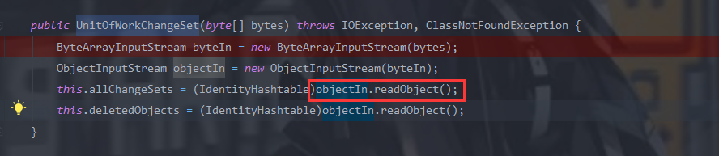

# 漏洞介绍

该漏洞是由wls9-async组件导致，在反序列化处理输入信息时存在缺陷，攻击者可以在/_async/AsyncResponseService路径下传入恶意的XML格式的数据，传入的数据在服务器端反序列化时，执行其中的恶意代码，实现远程命令执行，进而攻击者可以获得整台服务器的权限。

**漏洞验证:**

方法如下：访问http://youip:7001/_async/（返回403说明存在，返回404说明不存在）

访问http://youip:7001/_async/AsyncResponseService，（返回200说明存在，返回404说明不存在）

# 影响版本

- WebLogic 10.X
- WebLogic 12.1.3

# 实验环境

这里还是用weblogic10.3的环境,由于我手上也没有补丁,这里就先看看 **CVE-2017-10271**补丁

```java
private void validate(InputStream is) {
      WebLogicSAXParserFactory factory = new WebLogicSAXParserFactory();
      try {
         SAXParser parser = factory.newSAXParser();
         parser.parse(is, new DefaultHandler() {
            private int overallarraylength = 0;
            public void startElement(String uri, String localName, String qName, Attributes attributes) throws SAXException {
               if(qName.equalsIgnoreCase("object")) {
                  throw new IllegalStateException("Invalid element qName:object");
               } else if(qName.equalsIgnoreCase("new")) {
                  throw new IllegalStateException("Invalid element qName:new");
               } else if(qName.equalsIgnoreCase("method")) {
                  throw new IllegalStateException("Invalid element qName:method");
               } else {
                  if(qName.equalsIgnoreCase("void")) {
                     for(int attClass = 0; attClass < attributes.getLength(); ++attClass) {
                        if(!"index".equalsIgnoreCase(attributes.getQName(attClass))) {
                           throw new IllegalStateException("Invalid attribute for element void:" + attributes.getQName(attClass));
                        }
                     }
                  }
                  if(qName.equalsIgnoreCase("array")) {
                     String var9 = attributes.getValue("class");
                     if(var9 != null && !var9.equalsIgnoreCase("byte")) {
                        throw new IllegalStateException("The value of class attribute is not valid for array element.");
                     }
```

解释一下这补丁:

1. 禁用 object、new、method 标签
2. 如果使用 void 标签，只能有 index 属性

3. 如果使用 array 标签，且标签使用的是 class 属性，则它的值只能是 byte

前两点虽然很大程度上限制了我们不能随意生成对象，调用方法，但好在还有一个 class 标签可以使用，最关键的还在于第三点，它限制了我们的参数不能再是 String 类型，而只能是 byte 类型，从这一点出发,我们要寻找的是这样一个类：

> 1、 他的成员变量是 byte 类型
>
> 2、 在该类进行实例化的时候就能造成命令执行。

于是便有了 `oracle.toplink.internal.sessions.UnitOfWorkChangeSet` 来满足我们的需求。

看一下构造函数，该类会对传给它的 byte 值进行反序列化，可以看到这是一个标准的二次反序列化，于是满足二次反序列的 payload 应该都可以用，如 AbstractPlatformTransactionManager、7u21 等等。



