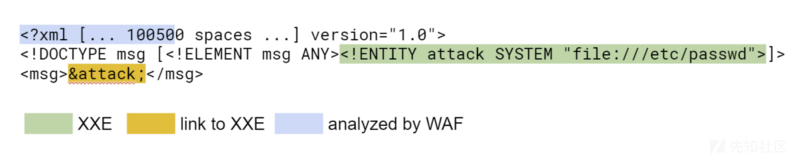
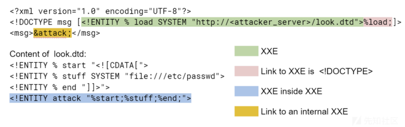
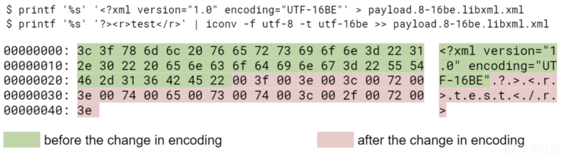
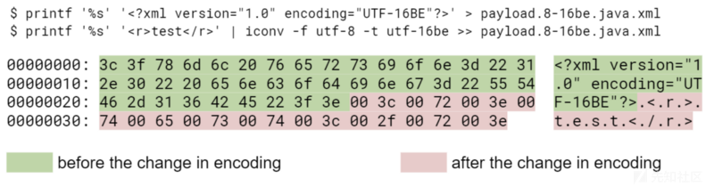
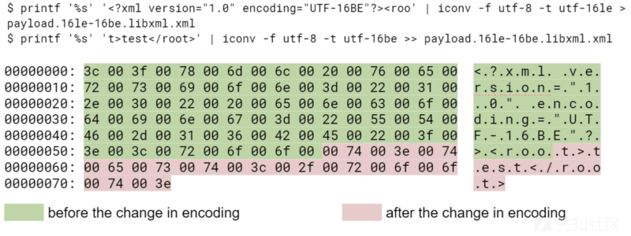
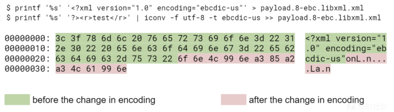

利用jar协议实现文件上传

https://blog.csdn.net/u012206617/article/details/109038388

XXE读文件的限制（如果含有换行符,特殊符号）可以用ftp协议外带含有换行符的数据(java 8u131被修复)

https://www.freebuf.com/articles/web/284225.html


## 绕过

### 空格绕过

由于XXE通常在XML文档的开头，所以比较省事儿的WAF可以避免处理整个文档，而只解析它的开头。但是，XML格式允许在格式化标记属性时使用任意数量的空格，因此攻击者可以在`<?xml?>`或`<!DOCTYPE>`中插入额外的空格，从而绕过此类WAF。

[](https://xzfile.aliyuncs.com/media/upload/picture/20190206172823-8c9330fe-29f1-1.png)

### 格式无效

为了绕过WAF，攻击者可能会发送特殊格式的XML文档，以便WAF认为它们无效。



```
链接到未知实体
比较成熟的WAF设置通常不会读取链接文件的内容。这种策略通常是有意义的，否则，WAF本身也可能成为攻击的目标。问题是，外部资源的链接不仅可以存在于文档的第三部分（正文），还可以存在于声明<! DOCTYPE>中 。
这意味着未读取文件内容的WAF将不会读取文档中实体的声明。而指向未知实体的链接又会阻止XML解析器导致错误。


幸运的是，防止这样的绕过非常简单——命令WAF中的XML解析器在遇到未知实体后不要关闭。
```

### 编码绕过

```
除了前面提到的xml文档的三个部分之外，还有位于它们之上的第四个部分，它们控制文档的编码（例如<?xml?>）——文档的第一个字节带有可选的BOM(字节顺序标记)。
更多信息：https://www.w3.org/TR/xml/#sec-guessing
一个xml文档不仅可以用UTF-8编码，也可以用UTF-16(两个变体 - BE和LE)、UTF-32(四个变体 - BE、LE、2143、3412)和EBCDIC编码。
在这种编码的帮助下，使用正则表达式可以很容易地绕过WAF，因为在这种类型的WAF中，正则表达式通常仅配置为单字符集。
外来编码也可用于绕过成熟的WAF，因为它们并不总是能够处理上面列出的所有编码。例如，libxml2解析器只支持一种类型的utf-32 - utf-32BE，特别是不支持BOM。
```

### 在一个文档中使用两种类型的编码（没怎么看懂）

在上一节中，我们演示了文档的编码通常由其第一个字节指定。但是当包含编码属性的<?xml?>标记引用文档开头的不同字符集时会发生什么？在这种情况下，一些解析器更改编码，使文件的开头有一组字符，其余的是另一组编码。。也就是说，不同的解析器可能在不同的时间转换编码。Java解析器(javax.xml.parsers)在<?xml?>结束后严格地更改字符集，而libxml2解析器可以在执行“编码”属性的值之后或在处理<?xml?>之前或之后切换编码。
只有在根本不处理这些文件时，比较成熟的WAF才能可靠地防止这些文件中的攻击。我们还必须记住，有许多同义词编码，例如UTF-32BE和UCS-4BE。此外，有些编码可能不同，但从编码文档初始部分 `<?xml?>`的角度来看，它们是兼容的。例如，看似UTF-8的文档可能包含字符串`<?xml version=”1.0” encoding=”windows-1251”?>`。
这里有一些例子。为了简明扼要，我们不把XXE放在文档里。
libxml2解析器将文档视为有效，但是，javax.xml.parsers set中的Java引擎认为它无效：

[](https://xzfile.aliyuncs.com/media/upload/picture/20190206174503-e0787ab0-29f3-1.png)
反之亦然，文档对于javax.xml.parser是有效的，但对于libxml2解析器是无效的：

[](https://xzfile.aliyuncs.com/media/upload/picture/20190206174524-ed4c01b2-29f3-1.png)
libxml2的文档，在标记中间将编码从utf-16le更改为utf-16be：

[](https://xzfile.aliyuncs.com/media/upload/picture/20190206174544-f90ad62c-29f3-1.png)
libxml2的文档，编码从utf-8改为ebcdic-us：

[](https://xzfile.aliyuncs.com/media/upload/picture/20190206174603-0480608a-29f4-1.png)

正如你所看到的，有许多绕过方法。防止XXE的最好方法是配置应用程序本身，以安全的方式初始化XML解析器。为此，应该禁用两个选项：

外部实体
外部DTD架构
