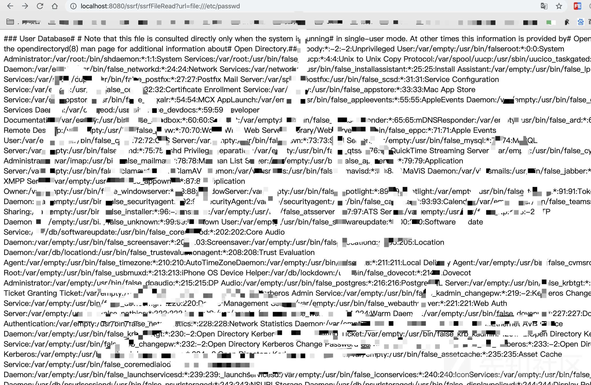
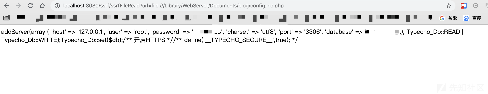

## 端口探测

```java
String url = request.getParameter("url");
            String htmlContent;
            try {
                URL u = new URL(url);
                URLConnection urlConnection = u.openConnection();
                HttpURLConnection httpUrl = (HttpURLConnection) urlConnection;//这一行
                BufferedReader base = new BufferedReader(new InputStreamReader(httpUrl.getInputStream(), "UTF-8"));
                StringBuffer html = new StringBuffer();
                while ((htmlContent = base.readLine()) != null) {
                    html.append(htmlContent);
                }
                base.close();
                print.println("<b>端口探测</b></br>");
                print.println("<b>url:" + url + "</b></br>");
                print.println(html.toString());
                print.flush();
            } catch (Exception e) {
                e.printStackTrace();
                print.println("ERROR!");
                print.flush();
            }
```

以上代码大致意义如下：

- URL对象用`openconnection()`打开连接，获得URLConnection类对象。
- 用`InputStream()`获取字节流
- 然后`InputStreamReader()`将字节流转化成字符流
- `BufferedReader()`将字符流以缓存形式输出的方式来快速获取网络数据流
- 最终一行一行的输入到 html 变量中，输出到浏览器

代码的主要功能即是模拟一个 http 请求，如果没有对请求地址进行限制和过滤，即可以利用来进行 SSRF 攻击。

## 任意文件读取/下载

我们将上述代码删除一行，如下：

```
String url = request.getParameter("url");
        String htmlContent;

        try {
            URL u = new URL(url);
            URLConnection urlConnection = u.openConnection();
            BufferedReader base = new BufferedReader(new InputStreamReader(urlConnection.getInputStream()));
            StringBuffer html = new StringBuffer();
            while ((htmlContent = base.readLine()) != null) {
                html.append(htmlContent);
            }
            base.close();
            print.println(html.toString());
            print.flush();

        } catch (Exception e) {
            e.printStackTrace();
            print.println("ERROR!");
            print.flush();
        }
```

`HttpURLconnection()`是基于http协议的，而我们要用的是 `file` 协议，删除后即可利用`file`协议去读取任意文件 ，如下图所示：

[](https://xzfile.aliyuncs.com/media/upload/picture/20200206141441-f67555b2-48a7-1.png)

如果我们知道了网站的路径，可以直接读取其数据库连接的相关信息：

[](https://xzfile.aliyuncs.com/media/upload/picture/20200206141500-016cba00-48a8-1.png)

任意文件下载同理，只不过是将数据流写入到了文件中，如下代码：

```
String downLoadImgFileName = "SsrfFileDownTest.txt";
        InputStream inputStream = null;
        OutputStream outputStream = null;
        String url = req.getParameter("url");
        try {
            resp.setHeader("content-disposition", "attachment;fileName=" + downLoadImgFileName);
            URL file = new URL(url);
            byte[] bytes = new byte[1024];
            inputStream = file.openStream();
            outputStream = resp.getOutputStream();
            while ((length = inputStream.read(bytes)) > 0) {
                outputStream.write(bytes, 0, length);
            }
        }
```

将获取的内容写入到`SsrfFileDownTest.txt`文件中，测试如下：

##  修复方案

实际场景中可能出现 SSRF 的功能点有很多,比如获取远程 URL 图片、webmail收取其他邮箱邮件、从远程服务器请求资源等等，针对这些问题，可以进行过滤判断，设置白名单等，相关策略如下：

- 统一错误信息，避免用户可以根据错误信息来判断远端服务器的端口状态。
- 限制请求的端口为http常用的端口，比如，80,443,8080,8090等。
- 禁用不需要的协议，仅仅允许http和https请求。
- 根据业务需求，判定所需的域名是否是常用的几个，若是，将这几个特定的域名加入到白名单，拒绝白名单域名之外的请求。
- 根据请求来源，判定请求地址是否是固定请求来源，若是，将这几个特定的域名/IP加入到白名单，拒绝白名单域名/IP之外的请求。
- 若业务需求和请求来源并非固定，那么可以自己写一个 ssrfCheck 函数，如：https://github.com/JoyChou93/java-sec-code/blob/master/src/main/java/org/joychou/security/SSRFChecker.java

## 挖掘思路

注意以下http请求的方法

> - HttpClient.execute
> - HttpClient.executeMethod
> - HttpURLConnection.connect
> - HttpURLConnection.getInputStream
> - URL.openStream
> - HttpServletRequest
> - getParameter
> - URL
> - HttpClient
> - Request
> - HttpURLConnection
> - URLConnection
> - okhttp
> - BasicHttpEntityEnclosingRequest
> - DefaultBHttpClientConnection
> - BasicHttpRequest
> - URI

