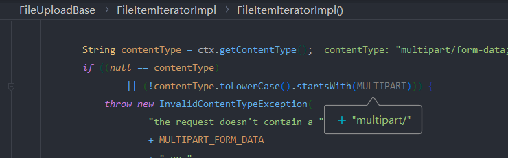
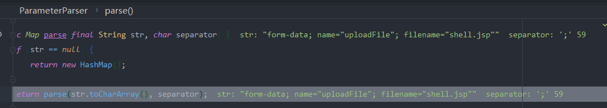
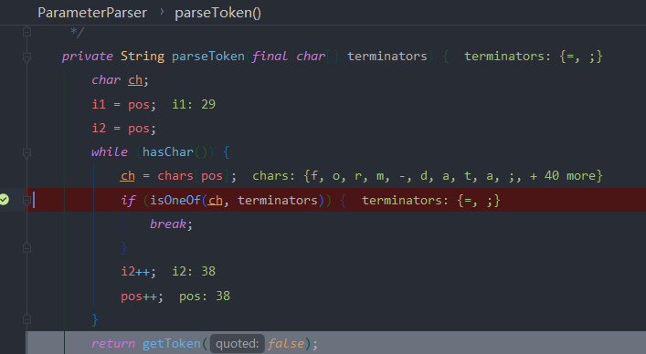
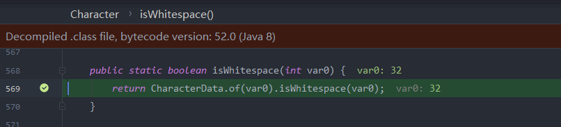
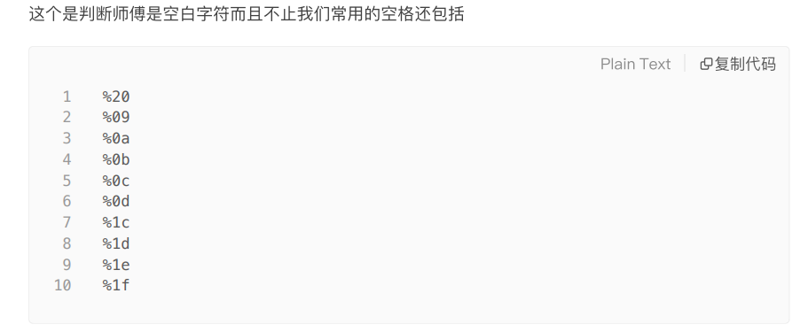
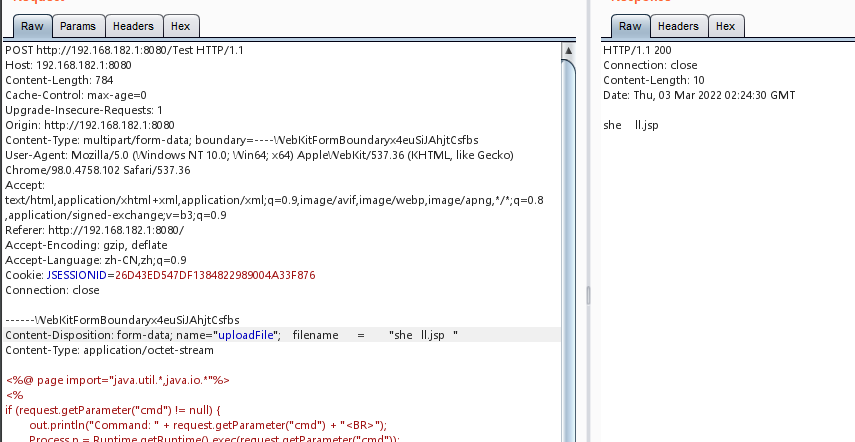
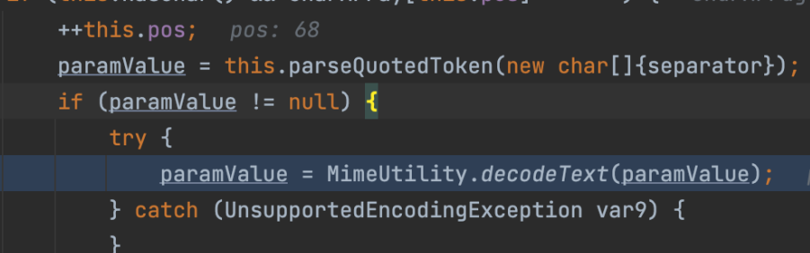
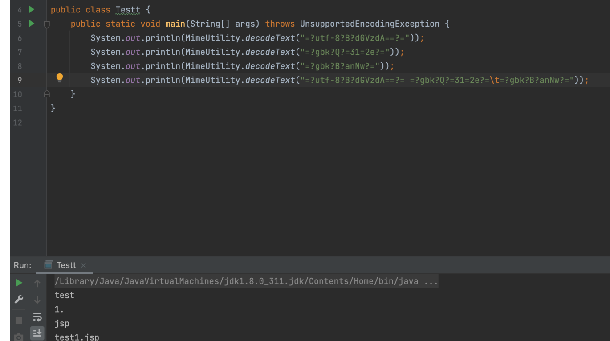

 Content-Type 要开头为 multipart/

这里先将信息放到`str`中,然后利用;进行分割,放入map中

每当判断 =和;时,它就会经过`getToken`处理

然后就会去除两边的空格

该方法可以把很多判断为空格,比如文章中提到的

还有

[然后还有y4师傅的](./file/Java文件上传大杀器-绕waf(针对commons-fileupload组件).pdf) 

利用解析时会对`MIME`编码进行解码操作进行混淆

