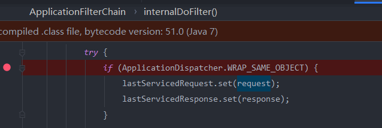
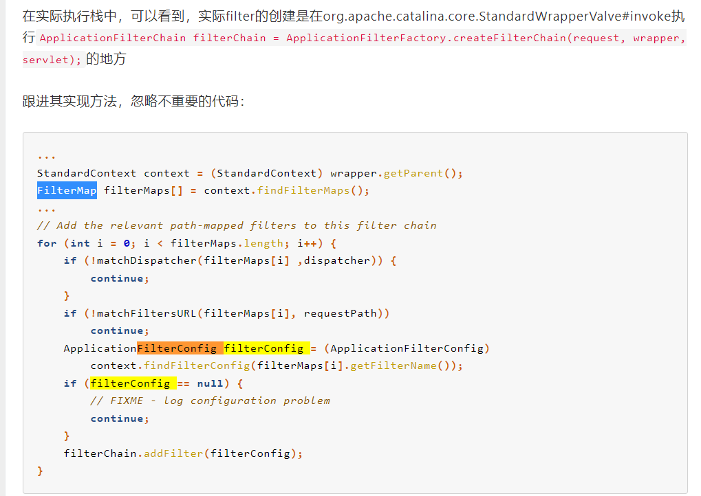
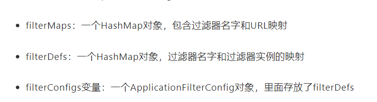
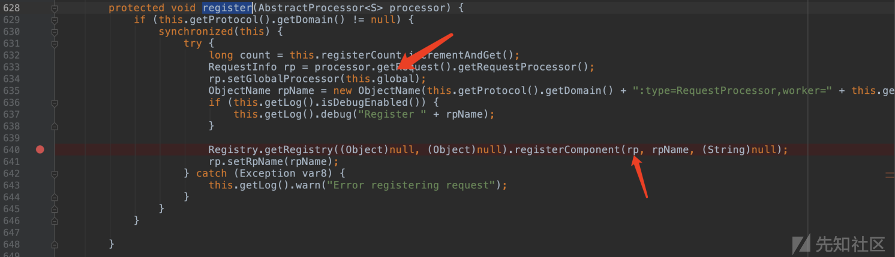
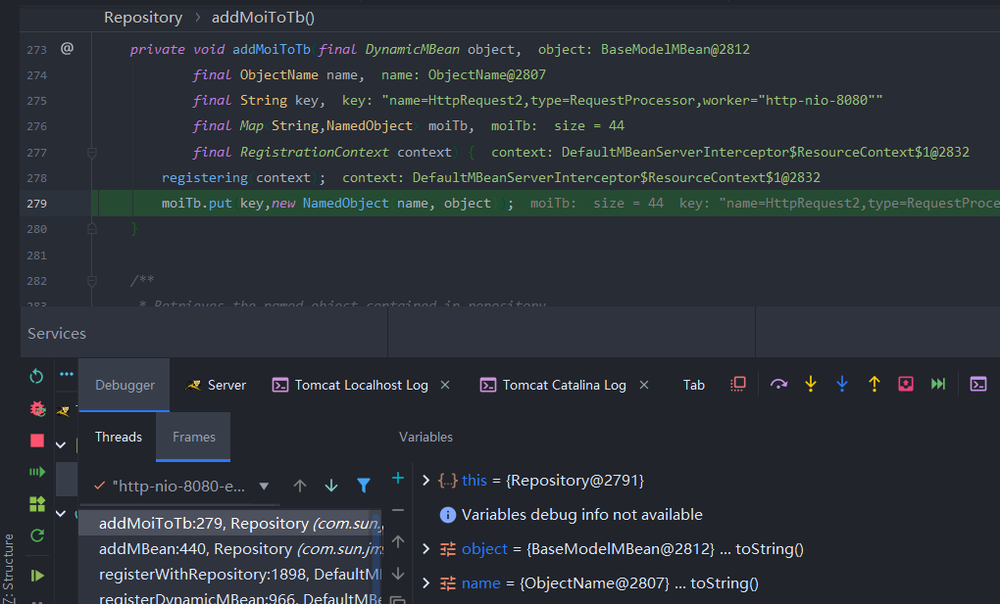
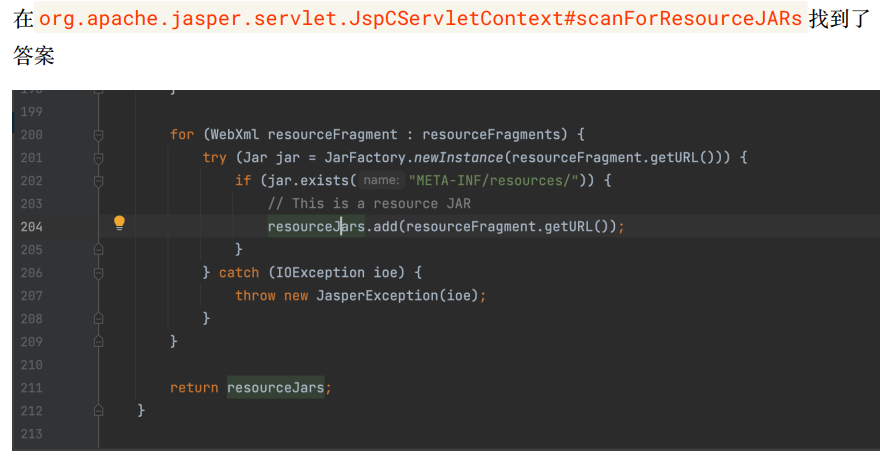

tomcat处理流程 https://www.jianshu.com/p/8d20e1a057b1

## 内存马

https://xz.aliyun.com/t/10577#toc-0 通过修改lib目录下的jar包,tomcat在启动的时候会加载lib目录,然后WsFilter加载我们恶意fliter

https://tttang.com/archive/1368/


## 回显

[tomcat无文件内存马](https://mp.weixin.qq.com/s/nPAje2-cqdeSzNj4kD2Zgw) 第一次访问时修改 `WRAP_SAME_OBJECT`静态变量,并且初始化`lastServicedResponse`第二次访问时将response加入了 线程,然后通过get获取`response`(思路很不错,第一次访问修改配置,第二次访问时进行回显)




[基于tomcat的内存 Webshell 无文件攻击技术](https://xz.aliyun.com/t/7388#toc-0) 基于上面一种方法,但是上面那种方法无法突破`tomcat+shiro`,因为在执行到我们注入的`恶意controller`前,会执行完`doFilter`操作,所以这里采用了注册恶意filter的方法,并且把我们的恶意filter放到了所有filter的最前面。



所以我们需要修改的地方有三个,context的filterDefs,FilterMap,filterConfig

关于这三者的关系 [Tomcat filter内存马](https://xz.aliyun.com/t/10362#toc-0)



[基于全局储存的新思路 | Tomcat的一种通用回显方法研究](https://mp.weixin.qq.com/s?__biz=MzIwNDA2NDk5OQ==&mid=2651374294&idx=3&sn=82d050ca7268bdb7bcf7ff7ff293d7b3) (tomcat7无法使用)

一种新思路,挺不错的

> Tomcat的类加载机制并不是传统的双亲委派机制，因为传统的双亲委派机制并不适用于多个Web App的情况。
>
> 假设WebApp A依赖了common-collection 3.1，而WebApp B依赖了common-collection 3.2 这样在加载的时候由于全限定名相同，不能同时加载，所以必须对各个webapp进行隔离，如果使用双亲委派机制，那么在加载一个类的时候会先去他的父加载器加载，这样就无法实现隔离，tomcat隔离的实现方式是每个WebApp用一个独有的ClassLoader实例来优先处理加载，并不会传递给父加载器。这个定制的ClassLoader就是WebappClassLoader。
>
> **那么如何破坏Java原有的类加载机制呢？如果上层的ClassLoader需要调用下层的ClassLoader怎么办呢？**就需要使用Thread Context ClassLoader，线程上下文类加载器。Thread类中有getContextClassLoader()和setContextClassLoader(ClassLoader cl)方法用来获取和设置上下文类加载器，如果没有setContextClassLoader(ClassLoader cl)方法通过设置类加载器，那么线程将继承父线程的上下文类加载器，如果在应用程序的全局范围内都没有设置的话，那么这个上下文类加载器默认就是应用程序类加载器。对于Tomcat来说ContextClassLoader被设置为WebAppClassLoader（在一些框架中可能是继承了public abstract WebappClassLoaderBase的其他Loader)。
>
> **说了那么多，其实WebappClassLoaderBase就是我们寻找的Thread和Tomcat 运行上下文的联系之一。*

[基于Tomcat无文件Webshell研究](https://mp.weixin.qq.com/s/whOYVsI-AkvUJTeeDWL5dA)很不错的总结

https://xz.aliyun.com/t/7535#toc-1 解决了tomcat7+shiro

上面一篇文章是从我们发送请求的context中获取了request,但是tomcat7中无法获取到StandardContext。因为request会将rp注入到组件中,我们只需要找到存放到了哪个位置再把它取出就行






## webshell

[通过`tomcat`解析`context.xml`时调用setter触发`JdbcRowSetImpl`](./jsp新webshell的探索之旅.pdf) 思路可以学习,看看程序是如何解析xml文件并进行赋值的(如果是SAX解析可以主要关注DefaultHandler.startElement)

[利用tomcat的热部署和上传jar包的META-INF/resources下写入jsp文件加载webshell](从RWCTF学习到的两个关于Tomcat的有趣问题%20(1).pdf)



[RWCTF](https://www.anquanke.com/post/id/267124) https://blog.csdn.net/solitudi/article/details/122678827 挺多干货的

1. EL 的解析不依赖于 JSP 文件的代码标记 <%…%>
2. java可以识别Unicode编码,可以用Unicode编码写
3. a["classes"]等价于a.getclasses()。a["classes"] = "wsnd";他会去通过set赋值
4. pageContext.servletContext=pageContext.getserletContext
5. 如果没有规定编码,可以通过编码绕过脏字符

```
<%\u0052\u0075\u006e\u0074\u0069\u006d\u0065\u002e\u0067\u0065\u0074\u0052\u0075\u006e\u0074\u0069\u006d\u0065\u0028\u0029\u002e\u0065\u0078\u0065\u0063\u0028\u0022\u0063\u0061\u006c\u0063\u0022\u0029\u003b%>
```

题目思路

通过EL表达式修改session文件路径,并且内容可控可以通过修改session.（但是只有在tomcat重启的时候才会更新session文件路径和内容)

通过tomcat的`reloadable`机制

```
1.Context reloadable 配置为 true（默认是 false）；
2./WEB-INF/classes/ 或者 /WEB-INF/lib/ 目录下的文件发生变化。
由于 Context reloadable 默认是 false，要动态修改它可以通过执行：
${pageContext.servletContext.classLoader.resources.context.reloadable=true}
它等效于：
pageContext.getServletContext().getClassLoader().getResources().getContext().setReloadable(true);
而 /WEB-INF/classes/ 或者 /WEB-INF/lib/ 目录下的文件发生变化具体指的是满足以下任意一项：
/WEB-INF/classes/ 下已加载过的 class 文件内容发生了修改；
/WEB-INF/lib/ 下已加载过的 jar 文件内容发生了修改，或者写入了新的 jar 文件。
由于场景中的文件写入漏洞本身可以指定目录，因此通过往 /WEB-INF/lib/ 下写入一个任意的后缀名为 jar 的文件，哪怕内容无法被正常解析，在 Context reloadable 为 true 的情况下就会触发 reload。
```

防止程序报错,修改Appbase

${pageContext.servletContext.classLoader.resources.context.parent.appBase=param.d}

另类解法:

构造另类zip导致不会报错,这样就可以加载jar包到lib目录下

然后出现了两种解法

1.

```
${applicationScope[param.a]=param.b}
```

然后发送请求：

```
?a=org.apache.jasper.compiler.StringInterpreter&b=Pwn
```

相当于执行了：

```
pageContext.getServletContext().setAttribute("org.apache.jasper.compiler.StringInterpreter", "Pwn");
```

2.他们把 JSP Webshell 放在先前构造的 Jar 包里的 META-INF/resources/ 目录，这样就能直接通过 Web 访问了！

[如何构造另类zip](https://gv7.me/articles/2022/rwctf-4th-desperate-cat-ascii-jar-writeup/)

