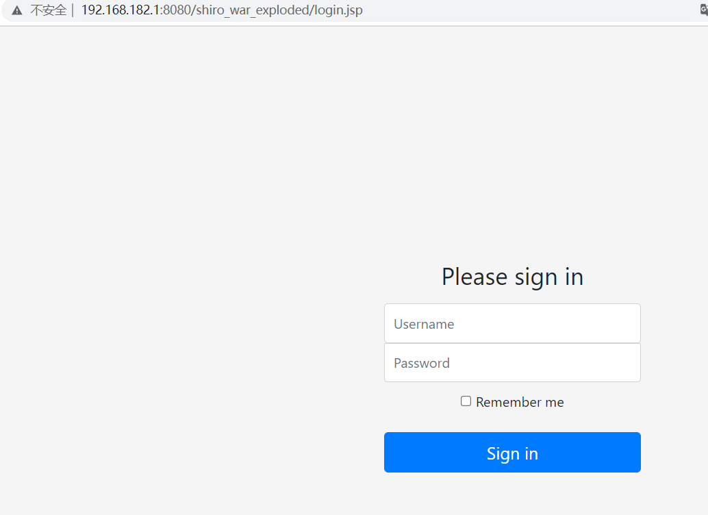
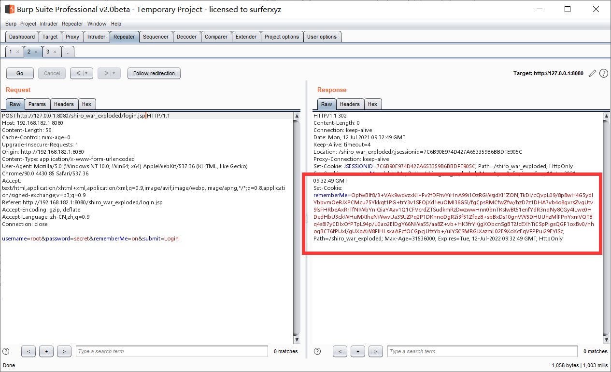
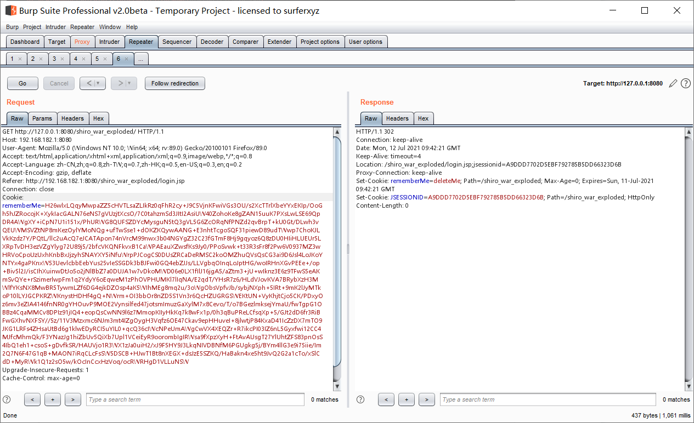
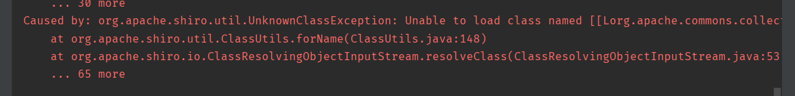
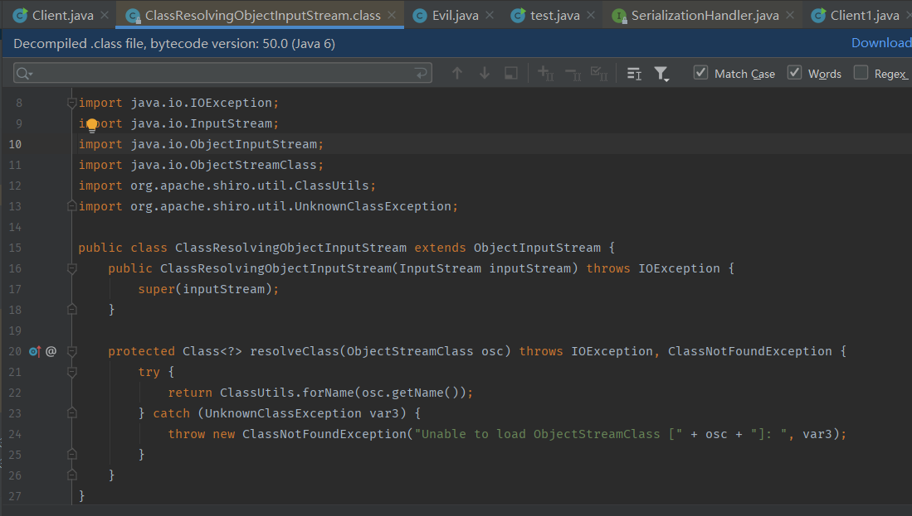
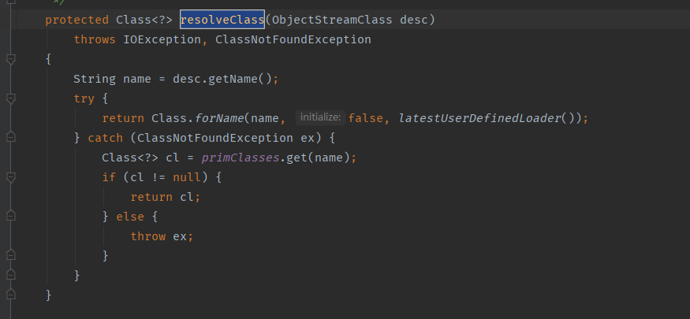
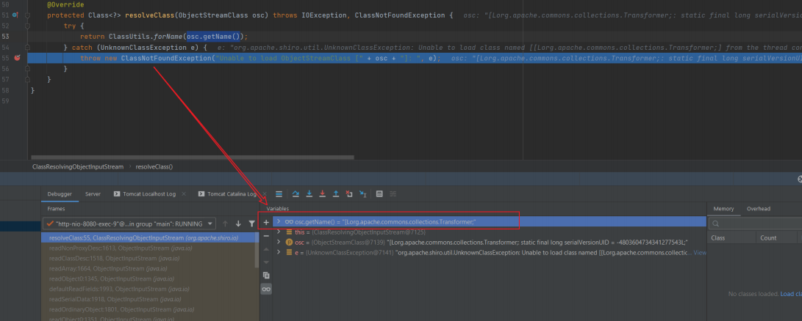
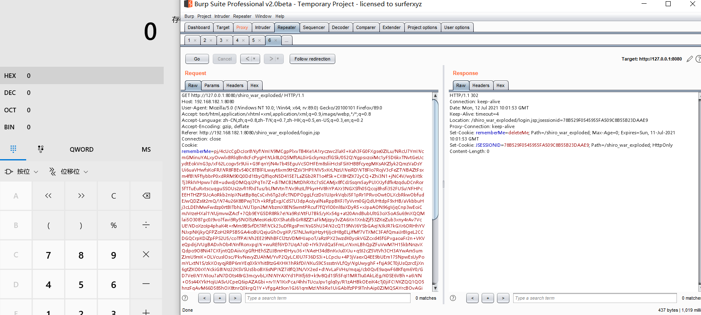

g这里是跟着p师傅搞的,用到的p师傅的项目https://github.com/phith0n/JavaThings

这里首先下载了源码,然后配置环境,其实这里迷迷糊糊的

先是shirodemo,在shirodemo文件夹中使用命令mvn package打包,然后新建一个tomcat工程,放在Tomcat的webapps目录下,接着运行就可以

然后到shiroattack目录下,使用命令mvn compiler,然后导入到idea中,再用mvn idea:idea,(好叭我根本不会用mvn命令,凭着感觉瞎搞的,反正最后运行起了,阿巴阿巴阿巴)

勾选rememberMe,登陆后会返回一个rememberMe

对此，我们攻击过程如下：

> 1. 使用以前学过的CommonsCollections利用链生成一个序列化Payload
>
> 2. 使用Shiro默认Key进行加密
>
> 3. 将密文作为rememberMe的Cookie发送给服务端

我们将我们的rememberMe替换成我们的exp,然后再用shiro的默认key进行编码

发送过去,发现并没有弹出计算器,tomcat报错

而问题呢则是出现在ClassResolvingObjectInputStream类中

这是一个ObjectInputStream的子类,重写了resolveClass方法

resolveClass 是反序列化中用来查找类的方法，简单来说，读取序列化流的时候，读到一个字符串形式的类名，需要通过这个方法来找到对应的 java.lang.Class 对象。对比一下它的父类，也就是正常的 ObjectInputStream 类中的 resolveClass 方法：

区别就在于forname()方法上面,前者用的是 org.apache.shiro.util.ClassUtils#forName （实际上内部用到了

org.apache.catalina.loader.ParallelWebappClassLoader#loadClass ），而后者用的是Java原

生的 Class.forName 。

这里先给出结论:如果反序列化流中包含非Java自身的数组，则会出现无法加载类的错误。这就

解释了为什么CommonsCollections6无法利用了，因为其中用到了Transformer数组。

这里呢用了一种不包含Transformer数组的payload,成功弹出来计算器,因为不含Transformer数组的payload挺多的,我会将写payload写在其他位置

